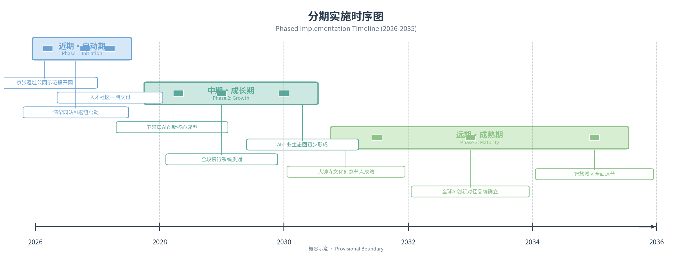

# Diameter-Type AI Innovation Belt
## — Urban Design Proposal for the Centennial Jing-Zhang AI Innovation Belt

> **Guiding Ideology**: General Secretary Xi Jinping's important concept of "people's city built by the people, people's city for the people"
> **Theoretical Foundation**: Central Urban Work Conference Six-Dimension Modern People's City Framework × Yang Kaizhong's New Spatial Economics
> **Policy Basis**: National / Beijing / Haidian three-tier "15th Five-Year Plan"
> **Design Scope**: Centennial Jing-Zhang AI Innovation Belt (Coordinated Research 43.6km² / Overall Design 11.4km² / Key Areas 368.4ha)
> **Spatial Paradigm**: Diameter-type "One Diameter · Three Cores · Two Rings · Multiple Courts"
> **Design Concept**: One Vein · Three Qualities · Six Dimensions · Seven Degrees · Tracing Origins to Inspire Innovation

---

## Chapter 1 Design Basis and Data Inventory

### 1.1 Statutory Planning and Policy Basis

#### National Level
1. **"Outline of the 15th Five-Year Plan for National Economic and Social Development of the People's Republic of China"** [source:NPC]
   - "AI+" action deployment
   - Overall layout of Digital China construction
   - Building a globally influential sci-tech innovation center

2. **"New Generation Artificial Intelligence Development Plan"** (Guo Fa [2017] No. 35) [source:STATE-COUNCIL]
   - By 2030, AI theory, technology, and applications will overall reach world-leading levels
   - Building AI innovation highlands and talent highlands

3. **"Outline of the 15th Five-Year Plan for National Economic and Social Development of Beijing"** [source:BEIJING-GOV]
   - 5 trillion-level industrial cluster cultivation plans (including AI)
   - International sci-tech innovation center construction
   - Urban renewal action implementation plan

4. **"Beijing's 15th Five-Year Plan Period AI Industry Development Plan"** [source:BEIJING-MIIT]
   - AI core industry scale targets
   - AI innovation ecosystem construction
   - Scenario opening and application promotion

#### Central Urban Work Spirit
5. **General Secretary Xi Jinping's Important Expositions on Urban Work** [source:XI-URBAN]
   - The important concept of "people's city built by the people, people's city for the people"
   - People-centered urban development thought
   - Coordinating the three major links of urban planning, construction, and governance

6. **Spirit of the Central Urban Work Conference** [source:CENTRAL-URBAN-CONF]
   - Six-dimension goal of building a modern city that is "innovative, livable, beautiful, resilient, civilized, and smart"
   - Transforming urban development methods, improving urban governance systems, and enhancing urban governance capacity
   - Taking the path of urban development with Chinese characteristics

#### District Level
7. **"Outline of the 15th Five-Year Plan for National Economic and Social Development of Haidian District"** [source:HAIDIAN-GOV]
   - "Two Zones, Three Belts, Multiple Points" spatial pattern
   - AI industry highland construction
   - Urban renewal and quality improvement

8. **"Haidian District Plan (Territorial Spatial Plan) (2017–2035)"** [source:HAIDIAN-PLAN]
   - Functional positioning of sci-tech innovation core area
   - Territorial spatial development and protection pattern

9. **"Centennial Jing-Zhang Railway Heritage Park Plan"** [source:BEIJING-PLAN]
   - Overall layout of the 9-kilometer heritage park
   - Industrial heritage protection and activation

### 1.2 Theoretical Basis and Academic Literature

This proposal takes the New Spatial Economics founded by Professor Yang Kaizhong as the core theoretical foundation, and the important concept of the People's City as the value guidance, constructing a three-in-one design methodology of "theory - value - space". The core proposition of New Spatial Economics — "spatial quality drives talent agglomeration, knowledge exchange drives innovation growth" — provides solid theoretical support for the spatial design of the Jing-Zhang AI Innovation Belt.

#### 1.2.1 Core Theory: New Spatial Economics

1. **Spatial Quality-Driven Innovation Growth Theory** [source:PKU-YANG]
   - Core proposition: High-quality space promotes knowledge spillover and innovation activities by attracting and agglomerating high-human-capital populations, ultimately driving urban economic growth
   - Theoretical mechanism: The circular cumulative causation chain of spatial quality → talent agglomeration → knowledge exchange → innovation output → economic growth
   - Guiding significance for this proposal: Jing-Zhang Railway Heritage Park, as a linear high-quality public space, is the core spatial carrier for attracting AI talents and stimulating innovation vitality

2. **Green-Intelligent Productivity Paradigm** [source:PKU-YANG]
   - A new form of productivity featuring deep integration of green development and intelligent development
   - Eco-Intelligent Agent City theory: The city, as a living organism, possesses intelligent characteristics of self-perception, self-learning, self-optimization, and self-evolution
   - Guiding significance for this proposal: The AI Innovation Belt is not only an industrial agglomeration area, but also an experimental field for green-intelligent integrated Eco-Intelligent Agent City

3. **Three-Dimensional Framework of Spatial Quality** [source:PKU-YANG]
   - Livable spatial quality: Ecological environment, residential comfort, public service accessibility
   - Learning spatial quality: Educational resources, cultural atmosphere, knowledge exchange venues
   - Innovative spatial quality: Entrepreneurship environment, industry-university-research collaboration, innovation community network
   - Guiding significance for this proposal: From north to south, the diameter innovation axis successively strengthens the quality gradient of learning type (university scientific research), innovation type (entrepreneurship incubation), and industrial type (achievement transformation)

4. **Linear Innovation District Spatial Model** [source:FRANKLIN-2025]
   - Linear public space serves as the quality spine and interaction bond, maximizing the spatial efficiency of knowledge exchange
   - "Point-Line-Plane" progressive spatial structure organization: core nodes (points) — linear corridors (lines) — radiation districts (planes)
   - Knowledge exchange mobility cost minimization principle: reducing interaction costs among innovation subjects through compact and mixed spatial layout
   - Guiding significance for this proposal: Jing-Zhang Railway Heritage Park, as a linear innovation spine, connects three core nodes and multiple courtyard spaces, constructing an efficient innovation network

#### 1.2.2 Value Guidance: Important Concept of the People's City

5. **Important Concept of the People's City** [source:XI-URBAN]
    - The important concept of "people's city built by the people, people's city for the people" proposed by General Secretary Xi Jinping
    - People-centered urban development thought, emphasizing that the fundamental purpose of urban development is to serve the people
    - Coordinating the three major links of planning, construction, and governance to promote high-quality urban development

6. **Modern City Six-Dimension Framework** [source:CENTRAL-URBAN-CONF]
    - The six-dimension goal of "innovative, livable, beautiful, resilient, civilized, and smart" proposed by the Central Urban Work Conference
    - Innovation is the primary driving force, livability is the fundamental goal, beauty is the ecological background
    - Resilience is the security guarantee, civilization is the spiritual core, and wisdom is the characteristic of the times

#### 1.2.3 Supporting Theories and Methods

7. **Urban Renewal Theory**
   - Progressive renewal and organic renewal methodology
   - Stock space quality improvement and functional mixing strategy
   - Historical heritage protection and activation utilization

8. **Industrial Cluster and Innovation Ecosystem Theory**
   - Porter Diamond Model and industrial competitiveness analysis
   - Triple Helix theory (government-industry-university collaborative innovation)
   - Entrepreneurship ecosystem theory

9. **TOD and Station-City Integration Theory**
   - Transit-Oriented Development (TOD) model
   - Rail micro-center and station-city integration design
   - Slow-traffic priority and job-housing balance strategy

10. **Resilient City Theory**
    - Urban disaster prevention and mitigation and emergency response system
    - Sponge city and stormwater management
    - Elastic supply of energy and water resources

### 1.3 Data Sources and Technical Materials

14. **Geospatial Data** [metric:haidian-gis]
    - Haidian District land use status data (2024)
    - Jing-Zhang Railway heritage site and surrounding building survey data
    - Road network and rail transit status data

15. **Industrial Economic Data** [metric:haidian-stats]
    - Haidian District AI industry statistical yearbook (2024)
    - Key AI enterprise directory and spatial distribution
    - Distribution of universities and research institutes and achievement transformation data

16. **Population and Talent Data** [metric:haidian-pop]
    - Haidian District population distribution and structure data
    - AI practitioner scale and profile
    - Talent housing demand estimation data

17. **Transportation Data** [metric:beijing-transport]
    - Rail transit passenger flow data (Line 13, Line 10, Line 15, etc.)
    - Road congestion index and travel OD analysis
    - Slow traffic system status assessment

### 1.4 Field Research Materials

18. **Site Survey Records** (March–June 2025)
    - Full-line survey records and imagery of Jing-Zhang Railway heritage site
    - Building status survey of three key districts
    - Interview records of surrounding communities and parks

19. **Stakeholder Interviews**
    - Meeting minutes of relevant Haidian District government departments
    - Interview records of universities and research institutions (Tsinghua, Peking University, Beihang, etc.)
    - Demand research of key AI enterprises
    - Survey of surrounding community residents' willingness

---

## Chapter 2 Three-Tier Scope Work Framework

### 2.1 Three-Tier Scope Definition

This proposal adopts a **"Coordinated Research — Overall Design — Key Areas"** three-tier progressive work framework, achieving complete transmission from macro strategy to micro implementation.

#### 2.1.1 Tier 1: Coordinated Research Scope (43.6km²)

**Scope Definition**:
- North to North 5th Ring Road
- South to Xizhimen - North 2nd Ring Road
- West to Zhongguancun Street - Suzhou Street corridor
- East to Xueyuan Road - Xiaoyue River corridor
- **Total area approximately 43.6 square kilometers** [metric:total-research-area]

**Work Content**:
- AI industry development strategy and ecosystem construction research
- Regional coordination and spatial pattern optimization research
- Transportation and infrastructure system coordination research
- Talent community and public service system research
- Cultural inheritance and brand strategy research

**Core Task**: Clarify the strategic positioning, industrial direction, spatial pattern, and support system of the innovation belt from the regional level, providing strategic guidance for overall design.

#### 2.1.2 Tier 2: Overall Design Scope (11.4km²)

**Scope Definition**:
- Approximately 500–800 meters depth on each side of Jing-Zhang Railway Heritage Park
- North from Qinghua East Road, south to Xizhimen North Street
- Covering three core districts and surrounding linkage areas
- **Total area approximately 11.4 square kilometers** [metric:total-design-area]

**Work Content**:
- Urban renewal overall framework and strategies
- Functional layout and land use structure optimization
- Building scale and capacity control
- Road and transportation system optimization
- Public space and blue-green system design
- Urban character and building height control
- Key project layout and inventory

**Depth Requirement**: Reach urban design depth at the regulatory detailed planning level, clarifying various control indicators and guidance requirements.

#### 2.1.3 Tier 3: Key Areas Detailed Design (368.4ha)

**Scope Definition**: Three Core Districts
- **A1 Collective Intelligence Park District**: 192.1 hectares (North Core)
- **A2 AI Origin Community**: 104.3 hectares (Main Core · Wudaokou + Zhichun Road)
- **A3 Dazhongsi District**: 72.0 hectares (South Core)
- **Total: 368.4 hectares** [metric:key-area-total]

**Work Content**:
- District positioning and functional refinement
- Spatial structure and layout deepening
- Building renewal and renovation plans
- Traffic organization and slow traffic system
- Public space landscape design
- AI scenario implantation and smart design
- Risk assessment and response strategies

**Depth Requirement**: Reach urban design depth at the constructive detailed planning level, which can directly guide subsequent architectural design and engineering implementation.

### 2.2 Spatial Relationship of Three-Tier Scope


**Tier Transmission Relationship**:

| Tier | Area | Core Issues | Output Deliverables |
|------|------|-------------|-------------------|
| Coordinated Research Tier | 43.6km² | Strategic positioning, industrial ecosystem, regional coordination | Strategic research report, industrial plan |
| Overall Design Tier | 11.4km² | Renewal framework, functional layout, character control | Overall urban design, regulatory plan adjustment suggestions |
| Key Areas Tier | 368.4ha | Detailed design, scenario implementation, implementation path | Detailed urban design, project implementation plan |

### 2.3 Work Methodology and Technical Route

#### Theory-Led
With General Secretary Xi Jinping's People's City important concept as the fundamental guideline, the Central Urban Work Conference's six-dimension modern city framework (innovative, livable, beautiful, resilient, civilized, smart) as the goal orientation, and Yang Kaizhong's New Spatial Economics as the core methodology, build a theoretical integration system of "People's City Six-Dimension Goal × Spatial Quality Three-Dimension Framework × Diameter-type Spatial Paradigm", establishing a complete theory-policy-space closed loop.

**Theoretical Integration Logic**:
- **Value Anchor**: The People's City concept establishes the fundamental value orientation of "people-centered", answering the fundamental question of "design for whom"
- **Goal Framework**: The six-dimension modern city goals (innovative, livable, beautiful, resilient, civilized, smart) provide the national-level urban development standard coordinate system
- **Implementation Path**: New Spatial Economics' "spatial quality drives innovation growth" reveals the spatial economic mechanism for the implementation of six-dimension goals
- **Spatial Paradigm**: The Diameter-type "One Diameter · Three Cores · Two Rings · Multiple Courts" transforms theory into operable spatial structure

**Correspondence Between Six-Dimension Goals and Three Dimensions of Spatial Quality**:
| People's City Six Dimensions | New Spatial Economics Quality Dimension | Diameter Spatial Bearing |
|-----------------------------|----------------------------------------|-------------------------|
| Innovation | Innovative Spatial Quality | Three Core Innovation Nodes + Two-Ring Innovation Ecosystem |
| Livable | Livable Spatial Quality | Multiple Courtyards + 15-minute Living Circle |
| Beautiful | Livable (Ecological Sub-dimension) | Blue-Green Skeleton + Heritage Park Vitality Belt |
| Resilient | Livable (Safety Sub-dimension) | Disaster Prevention Space System + Sponge City |
| Civilized | Learning (Cultural Sub-dimension) | Jing-Zhang Cultural Heritage Axis + Public Art |
| Smart | Innovative (Smart Governance Sub-dimension) | AI Urban Brain + Full Smart Scenario Coverage |

#### Three-Tier Connection
Precisely align with the national-Beijing-Haidian three-tier "15th Five-Year Plan", forming a planning system with layered strategy transmission and progressive spatial implementation.

#### Multi-Dimensional Integration
Integrate multiple professional fields including industrial planning, urban design, transportation planning, landscape design, and smart city to form an integrated solution.

#### Iterative Optimization
Establish a quantifiable, monitorable, and iterable spatial quality assessment system to ensure the dynamic adaptability and continuous optimization capability of the proposal.


---

## Chapter 3 Industry and Future City Research for Coordinated Research Scope

### 3.1 Development Concept: New Spatial Economics Practice Under the Guidance of People's City Concept

#### 3.1.1 Fundamental Guideline of the People's City Concept

General Secretary Xi Jinping has stated that "the people's city is built by the people and for the people." This important concept profoundly answers the fundamental question of who urban construction and development relies on and who it serves, and is the general guideline for urban work in the new era. The planning and design of the Centennial Jing-Zhang AI Innovation Belt always adheres to the people-centered development ideology, taking the people's aspiration for a better life as the starting point and goal of design.

**Core Connotations**:
- **People's Principal Position**: The fundamental purpose of urban development is to serve the people, and the ultimate judges of spatial quality are the people
- **Co-construction, Co-governance, and Sharing**: Stimulate the enthusiasm, initiative, and creativity of all types of subjects to jointly build a better home
- **Systems Thinking Approach**: Coordinate the three major links of planning, construction, and governance to promote systematic transformation of urban development methods

#### 3.1.2 Six-Dimension Modern People's City Goals

The Central Urban Work Conference explicitly proposes building a modern city that is "innovative, livable, beautiful, resilient, civilized, and smart." The six dimensions complement each other and are organically unified, constituting a complete goal system for the people's city:

| Dimension | Core Connotation | Reflection in This Proposal |
|-----------|------------------|------------------------------|
| **Innovation** | Innovation is the primary driving force for development, building an innovative city | AI full-chain innovation ecosystem, three-core innovation nodes, university-local collaborative innovation |
| **Livable** | Livability is the fundamental goal of urban work, making people's lives better | Multiple living courtyards, 15-minute living circle, talent housing security |
| **Beautiful** | Beauty is the ecological foundation of the city, building a city where humans and nature coexist harmoniously | Blue-green space system, heritage park vitality belt, sponge city |
| **Resilient** | Resilience is the bottom line of urban safety, enhancing the city's ability to resist risks | Disaster prevention space system, urban security defense line, emergency support |
| **Civilized** | Civilization is the spiritual core of the city, inheriting historical context | Jing-Zhang Railway heritage activation, century-old innovation spirit inheritance, public culture |
| **Smart** | Wisdom is the characteristic of the times, empowering urban governance with technology | AI urban brain, full smart scenario coverage, digital twin foundation |

#### 3.1.3 Theoretical Support of New Spatial Economics

The New Spatial Economics founded by Professor Yang Kaizhong provides the core theoretical method and analytical framework for the spatial design of the Centennial Jing-Zhang AI Innovation Belt. This theory breaks through the analytical paradigm of "transportation cost minimization" in traditional urban economics, shifting to a brand-new theoretical perspective of "spatial quality drives innovation growth", which is highly consistent with the inherent laws of urban development in the AI era.

**Core Proposition 1: Spatial Quality is the Core Competitiveness of Innovative Cities**

New Spatial Economics points out that in the innovation-driven development stage, the core of urban competition has shifted from traditional production factors such as land, labor, and capital to the attractiveness of spatial quality to high-human-capital populations. As a typical representative of knowledge-intensive industries, the core production factor of the AI industry is talent; and the location choice of talents is increasingly influenced by urban spatial quality — including ecological environment, cultural atmosphere, life convenience, social richness and other multi-dimensional quality factors.

The Centennial Jing-Zhang AI Innovation Belt takes Jing-Zhang Railway Heritage Park as its quality spine, precisely based on this theoretical judgment: transforming the 6.2-kilometer linear cultural heritage into high-quality public space, thereby building sustained attractiveness to AI talents, forming a positive cycle of "quality attracts talents — talents promote innovation — innovation prospers industry — industry improves quality".

**Core Proposition 2: Knowledge Exchange Efficiency Determines Innovation Output**

New Spatial Economics emphasizes that the exchange and collision of knowledge, especially tacit knowledge, is the core mechanism of innovation output; and the efficiency of knowledge exchange largely depends on the spatial organization mode. Compact spatial layout, mixed functional composition, and rich exchange venues can significantly reduce the cost of knowledge exchange and improve the frequency and quality of innovation occurrence.

The design of the diameter-type spatial structure is precisely a spatial response to this proposition: high-density agglomeration of diversified innovation subjects along the linear corridor, configuration of rich formal and informal exchange spaces, construction of a 5-minute innovation exchange circle — walking from office space to exchange venues takes no more than 5 minutes, maximizing the convenience and serendipity of knowledge flow.

**Core Proposition 3: Green-Intelligent Integration is a New Form of Productivity for Future Cities**

The concept of "Green-Intelligent Productivity" proposed by New Spatial Economics points out that the deep integration of green ecology and intelligent technology is giving birth to a new form of productivity — it reflects both the ecological value of harmonious coexistence between humans and nature, and the efficiency value empowered by intelligent technology. The two are not simply superimposed, but an organic unity that empowers each other and evolves together.

The design of the Jing-Zhang AI Innovation Belt fully implements the green-intelligent integration concept: taking Jing-Zhang Railway Heritage Park, the largest green infrastructure, as the spatial carrier, and AI technology as the intelligent core, realizing intelligent operation of green space and green application of intelligent technology, and exploring the Haidian model of Eco-Intelligent Agent City.

This proposal deeply integrates the six-dimension goals with the three-quality framework, expanding into a **"six dimensions, seven degrees" indicator system** (People's City Six Dimensions + Spatial Quality Seven Degrees), providing a comprehensive measurement standard for the planning, construction, and governance of the AI Innovation Belt.

### 3.2 Three Strategic Positionings

Based on New Spatial Economics theory and the requirements of the three-tier "15th Five-Year Plan", three strategic positionings for the Centennial Jing-Zhang AI Innovation Belt are established:

#### Positioning 1: Haidian Pivot of the National AI Strategy

**Connotation Interpretation**:
- Core spatial carrier for the national "AI+" action
- Important source of national AI basic research and original innovation
- Testing ground for AI governance system and institutional innovation
- Haidian's practice of the national sci-tech self-reliance and self-strengthening strategy

**Core Support**:
- Leveraging Haidian District's AI industry foundation (AI core industry scale exceeded 350 billion yuan in 2024) [metric:haidian-ai-scale]
- Talent and research support from top universities such as Tsinghua, Peking University, and Beihang
- Agglomeration of leading AI enterprises such as Baidu, ByteDance, and SenseTime
- Policy advantages of Zhongguancun National Independent Innovation Demonstration Zone

#### Positioning 2: Core Engine of Beijing-Tianjin-Hebei AI Innovation Coordination

**Connotation Interpretation**:
- Core growth pole for coordinated development of Beijing-Tianjin-Hebei AI industry
- Radiation source for technology output and achievement transformation
- Hub node for talent flow and knowledge exchange
- Organization center for industrial chain and supply chain coordination

**Core Support**:
- Beijing's position as the core area of the international sci-tech innovation center
- Haidian District's positioning as "the departure place of sci-tech innovation, the source of original innovation, and the main front of independent innovation"
- Innovation linkage with Xiong'an New Area, Tianjin Binhai New Area, etc.
- Construction of Beijing-Tianjin-Hebei collaborative innovation community

#### Positioning 3: Main Bearing Area of Beijing's AI Trillion-Level Industrial Cluster

**Connotation Interpretation**:
- Core bearing space for the AI cluster among Beijing's 5 trillion-level industrial clusters in the "15th Five-Year Plan"
- Core area for AI full-industry-chain agglomeration
- Testing ground for AI technology application and scenario innovation
- Highland for AI talent and innovation factor agglomeration

**Core Support**:
- Beijing's AI industry foundation (enterprise count, talent scale, and financing volume all rank first in the country)
- Haidian District's AI industry concentration (accounting for over 60% of the city) [metric:haidian-ai-share]
- Renewal potential of existing spatial resources along the Jing-Zhang line

### 3.3 Five Core Functions

Based on the full-chain development law of AI innovation ecosystem, five core functions are established:

| Function Category | Function Connotation | Spatial Bearing |
|-------------------|---------------------|-----------------|
| **AI Technology Source** | Basic research, frontier exploration, original innovation | Universities and institutes, key laboratories, joint R&D centers |
| **AI Industry Highland** | Full-chain industrial ecosystem, corporate headquarters, unicorn cultivation | Industrial parks, headquarters bases, incubators, accelerators |
| **AI Application Testing Ground** | City-level scenario opening, technology verification, first trial and first use | Scenario demonstration zones, test fields, experience centers |
| **AI Talent Destination** | High-quality innovative life, talent communities, public services | Talent apartments, lifestyle services, cultural and sports facilities |
| **AI Culture Showcase Window** | Centennial independent innovation spirit inheritance, AI culture dissemination | Memorial halls, science museums, public art, festival activities |

### 3.4 "Three Zones, Two Wings" Spatial Pattern

For the overall AI innovation spatial layout within the coordinated research scope, following the spatial organization logic of "core agglomeration, axial connection, and collaborative empowerment", an overall spatial pattern of "Three Zones and Two Wings" is formed. The Three Zones are three core functional bearing areas, respectively undertaking the core functions of AI independent innovation, AI technology sourcing, and AI industry agglomeration; the Two Wings are east-west collaborative empowerment belts, respectively undertaking industry-university-research collaboration and scenario application demonstration functions.

#### 3.4.1 Three Zones: Three Core Functional Zones

**(1) Northern Innovation Zone — AI Independent Innovation Leading Zone**

Its scope covers Tsinghua Science Park, Peking University Science Park, Zhongguancun West District and surrounding areas, with an area of approximately 15.2 square kilometers. Relying on the basic research advantages of top universities such as Tsinghua University and Peking University, it focuses on frontier directions such as artificial intelligence basic theory, large model algorithms, and artificial general intelligence, building a national-level AI basic research and independent innovation source.

Core functions include: basic research and original innovation, high-end talent cultivation and agglomeration, startup incubation and acceleration, international academic exchange and cooperation. Spatially, it takes university campuses as the inner core and surrounding science parks and incubators as the extension, forming a chain spatial organization of "university-research-incubation".

**(2) Central Core Zone — AI Technology Source and Talent Core Zone**

Its scope covers Wudaokou, Zhichun Road, and areas along Zhongguancun Street, with an area of approximately 13.8 square kilometers. As the core section of the Jing-Zhang Railway Heritage Park, this area gathers the densest AI enterprises, the most active entrepreneurial ecosystem, and the richest talent resources, serving as the technology source polar core and talent magnetic field center of the innovation belt.

Core functions include: AI technology R&D and transformation, innovation and entrepreneurship ecosystem cultivation, talent housing and living services, and AI scenario testing and verification. Spatially, it takes the Jing-Zhang Railway Heritage Park as the main axis, connecting AI industrial buildings and talent communities on both sides, forming a spatial form of "one diameter stringing two cores, two wings gathering talents".

**(3) Southern Industrial Zone — AI Industry Agglomeration and Application Demonstration Zone**

Its scope covers Dazhongsi, Xueyuan South Road, and Xizhimen surrounding areas, with an area of approximately 14.6 square kilometers. Relying on the existing industrial building foundation and mature business support, it focuses on developing application industries such as AI+ finance, AI+ healthcare, and AI+ education, building a demonstration zone for large-scale AI industry agglomeration and scenario-based application.

Core functions include: AI industry headquarters agglomeration, industry application solution R&D, scientific and technological achievement transformation and industrialization, and accelerated growth of innovative enterprises. Spatially, it forms industrial agglomeration belts along subway lines and main roads, and builds an industrial ecological circle with large-scale commercial complexes as carriers.

#### 3.4.2 Two Wings: East-West Collaborative Empowerment

**(1) West Wing — Industry-University-Research Collaborative Empowerment Belt**

Along the Zhongguancun Street-Suzhou Street line, it connects scientific research resources such as universities and research institutes, national key laboratories, and engineering technology centers, constructing a complete innovation chain of "basic research - applied research - technology transformation". The West Wing is the knowledge source and technology supply side of the innovation belt, continuously delivering scientific research results and innovative talents to the three core functional zones.

**(2) East Wing — Scenario Application Demonstration Belt**

Along the Xueyuan Road-Huayuan Road line, various AI application scenarios and testing and verification bases are arranged, including city-level application scenarios such as smart transportation, smart communities, smart healthcare, and smart education. The East Wing is the demand traction end and application test field of the innovation belt, providing a real-world iterative optimization environment for AI technology.

The internal logic of the "Three Zones, Two Wings" spatial pattern is: taking the Three Zones as the core bearing bodies, respectively anchoring the upper, middle, and lower reaches of the innovation chain; taking the Two Wings as collaborative empowerment belts, respectively strengthening knowledge supply and scenario traction. Through the spatial organization model of "core agglomeration + axial connection + two-wing empowerment", a highly efficient, dynamically balanced regional AI innovation ecosystem is constructed.

### 3.5 Benchmarking Study of Global AI Innovation Ecosystem Cases

Eight representative AI innovation district cases worldwide are selected for in-depth benchmarking, extracting lessons and insights that can be drawn upon:

#### Case 1: Silicon Valley, USA
**Key Learnings**:
- Innovation ecosystem with deep interaction between universities-enterprises-capital
- Open, flat innovation culture
- Venture capital-driven startup incubation system [source:SILICON-VALLEY-REPORT]

**Insight**: Haidian District has similar university resources and industrial foundation, and needs to further strengthen capital factors and entrepreneurial culture.

#### Case 2: Kendall Square, Boston
**Key Learnings**:
- Industry-university-research deep integration model with MIT as the core
- Shortest path design from "lab to market"
- High-density innovation interaction space network [source:KENDALL-2030]

**Insight**: The Collective Intelligence Park district can learn from Kendall Square's "campus-park-street" integration model.

#### Case 3: Silicon Alley, New York
**Key Learnings**:
- Path of renovating old office buildings into AI-ready spaces
- Coordinated advancement of urban renewal and industrial upgrading
- Mixed-function, 24-hour vitality innovation district form [source:NYC-AI-READY]

**Insight**: The renovation of existing buildings along Jing-Zhang can reference New York's AI-ready renovation manual.

#### Case 4: Toronto-Waterloo AI Corridor
**Key Learnings**:
- Model of linear space connecting multiple innovation nodes
- Government-led AI strategy and industrial layout
- Leading role of core institutions such as the Vector Institute [source:VECTOR-INSTITUTE]

**Insight**: The linear innovation belt model has successful precedents, and the key lies in the functional organization and transportation connections of core nodes.

#### Case 5: King's Cross, London
**Key Learnings**:
- Successful practice of railway heritage renewal and tech industry implantation
- Driving effect of flagship projects such as Google UK headquarters
- Integrated design of industrial heritage and modern offices [source:KINGS-CROSS-REGEN]

**Insight**: Jing-Zhang Railway heritage renewal can learn from King's Cross's heritage activation strategy.

#### Case 6: Shenzhen Qianhai Shenzhen-Hong Kong Modern Service Industry Cooperation Zone
**Key Learnings**:
- Development model driven by institutional innovation
- Open cooperation mechanism for Shenzhen-Hong Kong collaboration
- High-standard urban planning and construction [source:QIANHAI-PLAN]

**Insight**: Institutional innovation is one of the core competitiveness of AI innovation zones.

#### Case 7: Shanghai Zhangjiang Science City
**Key Learnings**:
- Innovation model driven by large-scale scientific facility clusters
- Science city planning concept of industry-city integration
- Development and construction path guided by major projects [source:ZHANGJIANG-PLAN]

**Insight**: The layout of major sci-tech infrastructure is crucial for the innovation ecosystem.

#### Case 8: Hangzhou Future Sci-Tech City (Dream Town)
**Key Learnings**:
- Startup ecosystem cultivation through characteristic town model
- Integrated development of Internet + mass entrepreneurship and innovation
- Operation mechanism of government guidance + market operation [source:DREAM-TOWN]

**Insight**: Startup incubation system and talent services are the foundational capabilities of innovation zones.

### 3.6 Naming and Visual Identity System

#### 3.6.1 Naming Scheme

**Main Name: Centennial Jing-Zhang AI Innovation Belt**
- Connotation: "Centennial Jing-Zhang" carries historical heritage, "AI Innovation Belt" indicates the development direction
- Brand association: Jing-Zhang Railway is the starting point of China's independent innovation, and the AI Innovation Belt is the continuation of independent innovation in the new era

**English Name: Centennial Jingzhang AI Innovation Belt**
- Abbreviation: CJAIB

**Short Name: Jing-Zhang AI Innovation Belt / Innovation Belt**

#### 3.6.2 Brand Slogans

**Main Slogan: Centennial Self-Reliance · Intelligence Creates the Future**
- "Centennial Self-Reliance" echoes the independent innovation spirit of Jing-Zhang Railway
- "Intelligence Creates the Future" points to the future development direction of artificial intelligence

**Sub-slogan: An Innovation Epic of a Railway, An AI Era of a City**

#### 3.6.3 Logo Design Concept

**Design Concept**: Three Lines + Infinity Symbol
- Three lines represent three cultural veins: Jing-Zhang Railway (history), Zhongguancun (present), and AI (future)
- The infinity symbol symbolizes endless innovation and boundaryless development
- The overall form extends linearly, echoing the spatial characteristics of the 9-kilometer innovation belt

**Color System**:
- Primary color: Tech Blue (#0066FF) — represents AI and innovation
- Secondary color: Railway Red (#CC3333) — represents Jing-Zhang Railway historical inheritance
- Accent color: Eco Green (#33CC99) — represents green sustainable development
- Three-color gradient fusion, symbolizing the interweaving and symbiosis of three veins

**Graphic Language**:
- Track line elements: symbolizing inheritance and connection
- Circuit board texture: symbolizing technology and intelligence
- Neural network morphology: symbolizing AI and innovation
- Three patterns organically integrated to form a unique visual identity system

### 3.7 Future City Vision

#### Vision Description
By 2030, the Centennial Jing-Zhang AI Innovation Belt will be built into:
- **World-class AI innovation ecosystem highland**: Gathering the world's top AI talents and enterprises, forming a globally influential AI industrial cluster
- **Modern people-oriented city demonstration belt**: Practicing the concept of "people's city built by the people, people's city for the people", creating high-quality living spaces
- **Model of urban renewal and innovation integration**: Benchmark for industrial heritage activation and utilization, model for existing spatial value reshaping
- **Green-intelligence integrated future city model**: Eco-Intelligent Agent City with deep integration of green low-carbon and smart technology

#### Core Development Indicators

| Dimension | 2030 Target | Current Baseline (2024) | Growth Rate |
|-----------|-------------|------------------------|-------------|
| AI Core Industry Scale | ≥300 billion yuan | ~200 billion yuan | +50% |
| Number of Unicorn Enterprises | ≥40 | ~25 | +60% |
| AI High-End Talent | ≥150,000 | ~80,000 | +87.5% |
| Per Capita Park Green Space Area | ≥18㎡ | ~12㎡ | +50% |
| Green Travel Ratio | ≥85% | ~70% | +15pp |
| 15-Minute Living Circle Coverage | 100% | ~80% | +20pp |
| Daily Knowledge Exchange Activities | ≥100 | ~30 | +233% |
| Annual Visitors/Sightseers | ≥5 million | ~1 million | +400% |

[metric:target-indicators-2030]

---

### 3.8 Central Axis - Diameter Innovation Paradigm: Theoretical Refinement and Model Value

The "Central Axis - Diameter" innovation spatial paradigm proposed in this proposal is not only applicable to the specific scenario of the Centennial Jing-Zhang AI Innovation Belt, but also has universal theoretical value and promotion significance. As an urban innovation spatial organization model based on New Spatial Economics, it responds to the core proposition of urban innovation spatial organization in the AI era — how to achieve maximum innovation agglomeration effect with minimal spatial cost under the constraint of stock space.

#### 3.8.1 Paradigm Definition and Core Characteristics

The "Central Axis - Diameter" innovation paradigm refers to an innovation spatial organization model that takes a high-quality linear public space as the urban innovation central axis, connecting innovation nodes, industrial blocks, and living districts along the axis, forming a symmetrically balanced, bidirectionally empowered, and gradiently growing innovation spatial pattern.

**Core characteristics include:**

- **Axial Symmetry**: Taking the linear public space as the diameter axis, the functions on both sides are symmetrically complementary and the landscape is evenly distributed, forming a spatial image with a strong sense of order and direction. Different from traditional urban central axes that center on ritual system and symbolism, the diameter innovation axis centers on efficiency and vitality, maximizing spatial utilization efficiency and innovation exchange density through symmetrical layout.
- **Linear Quality Supply**: Continuously supplying high-quality public spaces along the axis — including green spaces, plazas, cultural facilities, exchange venues, etc. — forming an innovation atmosphere of "changing scenery with each step, innovation everywhere". Linear space has a longer contact interface and higher quality penetration rate than point-like space.
- **Gradient Functional Organization**: Forming a functional gradient of "source — incubation — acceleration — industry" along the axis, corresponding to each link of the innovation chain. The functional gradient corresponds one-to-one with spatial positions, giving knowledge flow clear directionality and continuity, reducing cross-link communication friction.
- **Dual-Ring Ecological Support**: Forming an industry-university-research collaboration ring and a scenario application ring on both sides of the main diameter, empowering the innovation axis from the knowledge supply side and the demand traction side respectively, constructing a complete innovation ecosystem of "one diameter leading, dual rings supporting".

#### 3.8.2 Comparison with the Traditional Central Axis Model

The diameter innovation paradigm inherits the spatial wisdom of China's traditional urban central axis, but achieves contemporary translation in value orientation, functional logic, and operating mechanism:

| Dimension | Traditional Ritual Central Axis | Diameter Innovation Central Axis |
|-----------|--------------------------------|--------------------------------|
| Value Core | Ritual order, symbol of power | Innovation efficiency, talent vitality |
| Spatial Logic | Symmetrical balance, sense of ritual | Symmetrical empowerment, exchange density |
| Functional Organization | Administration-ritual-residential sequence | Research-incubation-industry gradient |
| Driving Mechanism | Top-down power construction | Bottom-up innovation emergence |
| Cultural Connotation | Unity of heaven and humanity, ritual civilization | Tracing origins to inspire innovation, wisdom creates the future |
| Service Objects | National governance and citizen life | Innovation population and industrial ecosystem |

The paradigm evolution from the traditional central axis to the diameter innovation axis is essentially a reflection of the transformation of urban development driving force from "administrative-driven" to "innovation-driven" in spatial form. Beijing, as a "dual central axis" city with both a traditional central axis and an innovation diameter, will form a unique urban spatial pattern of "one ancient and one modern, one cultural and one technological, symmetrically symbiotic".

#### 3.8.3 Applicability Conditions and Promotion Value

**Applicability Conditions**:
- The city has linear infrastructure heritage that can be renovated and utilized (railways, river channels, elevated roads, etc.)
- Along the route and surrounding areas already have a certain foundation of university scientific research or industry
- The city is in the innovation-driven transformation stage and needs high-quality space to attract and agglomerate innovative talents
- Under the constraint of stock space, it is difficult to add large-scale construction land

**Promotion Value**:
- **Stock renewal path**: Provides an endogenous path for old city renewal that drives industrial upgrading through the improvement of public space quality, avoiding large-scale demolition and construction
- **Regional collaboration model**: Linear corridors naturally have connectivity and can span multiple administrative districts to achieve cross-district collaborative innovation
- **Cultural inheritance and innovation**: Transforming industrial heritage or historical corridors into innovation spines, realizing a time-space dialogue between historical memory and future development
- **Replicable and promotable**: The paradigm has clear spatial organization logic and quantifiable quality evaluation system, facilitating other cities to carry out adaptive applications according to their own conditions

#### 3.8.4 Strategic Significance of Beijing's Dual Central Axis Pattern

Beijing's traditional central axis (Yongdingmen — Bell and Drum Towers) represents the ritual order and cultural accumulation of five thousand years of Chinese civilization; while the Jing-Zhang AI Innovation Diameter Axis represents China's innovation confidence and future exploration as it moves toward the AI era. The two axes face each other east-west, echoing ancient and modern, together constituting Beijing's dual-wheel-driven spatial pattern of "cultural ancient capital + innovative famous city".

From a larger spatial-temporal scale, the traditional central axis carries the civilization inheritance of "past-present", and the diameter innovation axis carries the innovation growth of "present-future". The parallel coexistence of the two axes means that while guarding the roots of Chinese civilization, Beijing faces the future with cutting-edge innovation, showcasing to the world the image of an eastern power capital with both profound heritage and vigorous vitality.

---

## Chapter 4 Urban Renewal and Regulatory-Level Urban Design for Overall Design Scope


### 4.1 Industry Development Goals

#### 4.1.1 Industry Scale Targets
By the end of the "15th Five-Year Plan" (2030), within the innovation belt scope:
- AI core industry operating revenue exceeds 300 billion yuan
- Cultivate more than 40 AI unicorn enterprises
- Introduce more than 20 regional headquarters/R&D headquarters of leading AI enterprises
- AI-related practitioners reach 250,000, including 150,000 high-end talents
[metric:industry-scale-target]

#### 4.1.2 Industrial Structure Targets
Build an industrial system of "one main, two wings, multiple supports":

**One Main: AI Core Industry**
- Foundation layer: Computing power infrastructure, AI chips, basic software
- Technology layer: Computer vision, natural language processing, machine learning, multimodal large models
- Application layer: AI+ industry solutions

**Two Wings: Sci-Tech Services + Future Industries**
- West Wing Sci-Tech Services: Sci-tech finance, intellectual property, legal services, consulting and evaluation
- East Wing Future Industries: Embodied intelligence, metaverse, quantum information, life science AI

**Multiple Supports: Supporting Industries**
- Digital creativity, smart education, smart healthcare, intelligent transportation, etc.

#### 4.1.3 Industrial Spatial Layout

| Industry Type | Main Bearing District | Proportion | Featured Directions |
|--------------|----------------------|------------|---------------------|
| AI Basic Research & Frontier Technology | Collective Intelligence Park District | 25% | Large models, general AI, AI for Science |
| AI Technology Incubation & Entrepreneurship | AI Origin Community | 35% | Applied AI, vertical AI, AIGC |
| AI Industry Headquarters & Industry Applications | Dazhongsi District | 25% | AI+Finance, AI+Healthcare, AI+Education |
| Sci-Tech Services | Along the West Wing | 10% | Sci-tech finance, intellectual property, professional services |
| AI Scenario Application & Experience | Along the East Wing | 5% | Future community, smart city experience |

### 4.2 Functional Layout Structure

#### 4.2.1 Overall Layout: One Diameter · Three Cores · Two Rings · Multiple Courts

With the Jing-Zhang Innovation Diameter as the spine, three core districts as nodes, east-west dual rings as support, and multiple innovation courtyards as infill, forming a spatial structure with appropriate density and clear hierarchy.


**Spatial Structure Interpretation**:

| Structural Element | Spatial Form | Functional Connotation | Design Key Points |
|-------------------|--------------|------------------------|-------------------|
| **One Diameter** | 9km north-south linear space | Innovation hub, social bond, ecological corridor | Seven cross-sections, 500m node density, full tree-lined coverage |
| **Three Cores** | Three district-level cores | Three functional polar cores, gradient progression | Differentiated positioning, coordinated development, distinctive features |
| **Two Rings** | Two symmetric east-west circles | Industry-University-Research Vitality Ring + Scenario Life Ring | Complementary functions, east-west echo, symmetric layout |
| **Multiple Courts** | Micro-spaces scattered along the line | Innovation interaction, rest and stay, event hosting | 300-500m spacing, varied themes, changing scenery with each step |

**Design Concept Note**:
The overall spatial structure implies a spatial logic of "from north to south, born from the source" in its node layout and sequential organization — the north relies on the basic research source of universities and research institutes, and the innovation chain of knowledge nurturing, industrial incubation, ideological exchange, computing power support, and scenario verification unfolds southward along the linear space, ultimately facing the urban future with the southern gateway. This linear innovation sequence from source to future is just like the astronomical order of the North Star's orientation and the rotation of the Big Dipper. Taking "northward orientation, wisdom starts a new journey" as the implicit design concept, it embodies the sense of direction of sci-tech innovation and the constancy of spatial order within the structure.

#### 4.2.2 Functional Mixing Strategy

Based on the New Spatial Economics concept of "industry-city-people integration", high-intensity functional mixing is implemented:

**Vertical Mixing** (Building Level):
- Basement: Parking, municipal utilities, commerce
- Podium (1-3F): Commerce, services, shared spaces, exhibition
- Mid-rise (4-15F): Offices, R&D
- High-rise (16F+): Residential, apartments, hotels

**Horizontal Mixing** (Block Level):
- Mixed layout of office, residential, commercial, and public services within each block unit
- Basic needs for work, life, learning, and socializing are met within a 5-minute walk
- Avoid tidal flow and nighttime empty cities caused by single-function districts

**Mixing Ratio Control**:

| District | Industrial Office | Residential | Commercial Services | Public Space |
|----------|-------------------|-------------|---------------------|--------------|
| Collective Intelligence Park | 55% | 25% | 10% | 10% |
| AI Origin Community | 45% | 30% | 15% | 10% |
| Dazhongsi District | 60% | 15% | 15% | 10% |

#### 4.2.3 Spatial Economic Mechanism

The design logic of the diameter-type spatial structure is rooted in the core theory of New Spatial Economics, and its economic rationality is reflected in the following three aspects:

**(1) Linear Quality Supply and Talent Agglomeration Effect**

Jing-Zhang Railway Heritage Park, as a continuous high-quality public space of 6.2 kilometers in length, continuously supplies diverse spatial quality elements such as landscape, culture, leisure, and exchange along the axis. According to the New Spatial Economics theory of "spatial quality drives talent agglomeration", high-quality linear space has significant attractiveness to high-human-capital populations — AI R&D talents, entrepreneurs, engineers and other innovation subjects tend to choose to work and live around spaces with beautiful environments, convenient communication, and rich life.

The unique advantage of the diameter-type layout lies in: linear space has a longer contact interface than point-like or planar space, can benefit more building interfaces and functional blocks, and maximizes the coverage efficiency of quality supply. It is estimated that within 500 meters on both sides of the main path of Jing-Zhang Heritage Park, it can directly serve about 8 million square meters of R&D office area and about 150,000 innovation employees, and the spatial penetration rate of quality dividend is much higher than the traditional point-like park model.

**(2) Minimization of Knowledge Exchange Costs**

The core driving force of innovation is the flow and collision of knowledge, and the efficiency of knowledge exchange is negatively correlated with spatial distance. Through the spatial organization of "one diameter stringing three cores, dual rings connecting multiple courts", the diameter-type layout arranges innovation subjects such as universities and research institutes, R&D institutions, startup enterprises, investment institutions, and service platforms closely along the linear corridor, greatly shortening the physical distance between innovation subjects and reducing the mobility cost and time cost of face-to-face communication.

In particular, linear innovation districts support the informal knowledge exchange mode of "exchanging while walking" — which is one of the most important channels for creative generation and interdisciplinary collision. The slow-traffic system and exchange nodes along Jing-Zhang Railway Heritage Park provide rich spatial carriers for informal knowledge exchange, forming a complete innovation social spectrum from formal meetings to chance encounters.

**(3) Gradient Growth and Circular Cumulative Causation**

The diameter-type spatial structure presents a functional gradient of "basic research → technology R&D → industrial application" from north to south, consistent with the chain logic of knowledge production and transformation. The northern Collective Intelligence Park continues to output innovation sources relying on the advantages of university basic research, the central AI Origin undertakes transformation and incubates startup projects, and the southern Dazhongsi agglomerates mature enterprises to form industrial scale — the three form a closed loop of knowledge flow and feedback along the main diameter, constituting a growth mechanism of circular cumulative causation.

This "source-flow-sink" gradient spatial organization not only ensures the specialized division of labor of each functional section, but also realizes efficient knowledge spillover and industrial linkage through linear corridors, avoiding the problem of vitality fault and innovation islands that may occur in single-function zones.

The above three spatial economic mechanisms — linear quality supply, knowledge exchange efficiency, and gradient growth cycle — together constitute the economic theoretical foundation of the "Central Axis - Diameter" innovation paradigm, proving that the diameter-type spatial structure not only has formal beauty and sense of order, but also has inherent rationality and promotable value at the level of innovation economics.

### 4.3 Spatial Implementation of the Central Axis - Diameter Innovation Paradigm: Beijing's Dual Central Axis Pattern

As a specific practice of the "Central Axis - Diameter" innovation paradigm in Beijing, the Jing-Zhang AI Innovation Belt takes Jing-Zhang Railway Heritage Park as the spatial carrier, constructing an innovation central axis that stands in east-west contrast with Beijing's traditional central axis, forming a dual central axis urban pattern of "ritual central axis — innovation diameter".

#### 4.3.1 Design Concept: Dual Central Axis Pattern

The planning and construction of the Jing-Zhang Railway Heritage Park should not be positioned merely as a linear green belt, but should be elevated to the **Jing-Zhang Innovation Diameter** — a sci-tech innovation central axis in western Beijing, echoing and standing alongside the traditional ritual central axis in the east, together forming Beijing's dual central axis urban pattern of "one ancient, one modern; one cultural, one technological".

```
 East (Traditional Axis)          West (Jing-Zhang Innovation Diameter)
      │                              │
  Yongdingmen                    Southern Gateway
      │                              │
  Zhengyangmen                   Dazhongsi
      │                              │
  Tian'anmen                    AI Origin
      │                              │
  Jingshan                       Wudaokou
      │                              │
  Gulou                          Collective Intelligence Park
      │                              │
  Olympic Park                   Northern Source
```

**Three Connotations of "Dui Jing" (Diameter)**:
- **Dui (Pair/Opposite)** — Diameter signifies the way of symmetry, echoing Beijing's urban gene of central axis symmetry, pairing east-west with the traditional axis
- **Jing (Path/Diameter)** — Possessing both the order and ritual sense of an axis and the liveliness and approachability of a path, emphasizing walkability
- **Dui Jing (Diameter)** — Distinguished from the "development axis" of traditional planning (dominated by transportation and industrial functions), emphasizing the unity of walkability, spatial symmetry, cultural ritual sense, and innovation interactivity

#### 4.3.2 Diameter Cross-Section Design: Seven-Lane Pattern

The Jing-Zhang Innovation Diameter adopts a "seven-lane" cross-section design, from west to east: West Bicycle Lane — West Walkway — Central Landscape Belt (Heritage Memorial Path) — East Walkway — East Bicycle Lane — Ecological Buffer Zone — Innovation Interaction Belt. The overall width is controlled at 60-80 meters, ensuring walking comfort, rich landscape layers, and multi-functional complexity.

| Lane Order | Name | Width | Function | Design Key Points |
|-----------|------|-------|----------|-----------------|
| Lane 1 | West Bicycle Lane | 3.5m | North-south fast cycling | Independent right-of-way, colored pavement, night lighting |
| Lane 2 | West Walkway | 4-6m | Commuter walking, daily passage | Smooth paving, tree shade coverage, seating facilities |
| Lane 3 | Central Landscape Belt | 15-25m | Heritage memorial, core landscape, public art | Preserve railway track relics, seasonal flower borders, art installations |
| Lane 4 | East Walkway | 4-6m | Leisure strolling, viewing experience | Varied paving, waterscape nodes, rest platforms |
| Lane 5 | East Bicycle Lane | 3.5m | North-south cycling + connection | Independent right-of-way, multi-point access |
| Lane 6 | Ecological Buffer Zone | 5-10m | Ecological isolation, rain garden | Native plants, sponge facilities |
| Lane 7 | Innovation Interaction Belt | 8-15m | Coffee outdoor seating, pitch events, innovation courtyard entrances | Flexible paving, movable facilities, multi-functional spaces |

**Scale Parameters**:
- Total length: ~9km (Qinghua East Road — North 3rd Ring Road)
- Full-line walking time: ~1.5-2 hours (including stops)
- Full-line cycling time: ~25-35 minutes
- Tree shade coverage: ≥70%, reducing perceived temperature by 5-8°C in summer

#### 4.3.3 Four Seasons Landscape Design: Spring Flowers · Summer Shade · Autumn Colors · Winter Bones

Combined with Beijing's warm temperate semi-humid continental monsoon climate characteristics (distinct four seasons, short spring and autumn, long winter and summer), the diameter landscape adopts a seasonal design strategy of "one theme per season, enjoyable all year round":

**Spring · Flower Path (Mid-March — Early May)**
- **Thematic Imagery**: Jing-Zhang Flower Charm · Innovation Germination
- **Plant Configuration**: Using spring flowering plants such as mountain peach, flowering peach, cherry blossom, winter jasmine, forsythia, and crabapple as the backbone, forming a spring scene of "peach blossoms flowing along the diameter"
- **Event Arrangement**: Spring Innovation Week · AI Cherry Blossom Forum · Outdoor Pitch Season · Youth Startup Festival
- **Space Utilization**: Temporary flower borders and art installations in the central landscape belt, increased coffee outdoor seating and outdoor exhibitions in the innovation interaction belt

**Summer · Shade Path (Early June — Late August)**
- **Thematic Imagery**: Lush Green Shade · Creative Intelligence Growing
- **Plant Configuration**: Using tall deciduous trees such as Chinese scholar tree, ash tree, plane tree, and goldenrain tree as the skeleton, forming dense shade coverage; lower layer配置 shade-tolerant perennial flowers such as hydrangea, plantain lily, and dwarf lilyturf
- **Cooling Design**: Tree shade coverage ≥70%, mist forest systems, shade pergolas, and spray cooling devices at key nodes, perceived temperature reduction of 5-8°C
- **Event Arrangement**: Summer Night Film Season · Beer Garden · Innovation Night Market · AI Music Festival
- **Space Utilization**: Extended opening hours at night, using night lighting and cool temperatures to host night economy activities

**Autumn · Color Path (Early October — Mid-November)**
- **Thematic Imagery**: Golden Wind and Jade Dew · Fragrant Fruits
- **Plant Configuration**: Featuring autumn foliage plants such as ginkgo, maple, torch tree, ash tree, and smoke tree, forming a "golden-red gradient corridor"
- **Landscape Layers**: Upper layer of golden-yellow and orange-red autumn leaves, middle layer of perennial flowers, lower layer of evergreen ground cover, constructing a three-layer autumn landscape system
- **Event Arrangement**: Golden Autumn Sci-Tech Innovation Festival · AI Industry Achievement Exhibition · International Innovation Week · Red Leaf Hiking
- **Space Utilization**: The most pleasant outdoor season, hosting large-scale forums, exhibitions, and carnivals

**Winter · Bone Path (Early December — Late February of the following year)**
- **Thematic Imagery**: Cold Branches and Proud Bones · Poised for Growth
- **Plant Configuration**: Using evergreen trees such as Chinese pine, lacebark pine, and Chinese juniper as the base color, paired with deciduous trees and shrubs with beautiful branches (such as lacebark pine, Chinese pagoda tree, red-twig dogwood), showcasing the "beauty of the skeleton" of plants
- **Winter Landscape**: Using plant branch lines, snow scenery, and evergreen base to construct a simple and elegant winter landscape; setting up winter warm corridors, solar-heated seats, and windbreak barriers
- **Event Arrangement**: Ice and Snow Tech Festival · AI Winter Camp · New Year Light Show · Warm Winter Market
- **Space Utilization**: Glass greenhouses and indoor-outdoor connection spaces at core nodes to ensure winter accessibility

**Four Seasons Plant Configuration Table**:

| Season | Upper Layer Trees | Middle Layer Flowering Shrubs | Lower Layer Ground Cover | Flowering/Ornamental Period |
|--------|------------------|------------------------------|-------------------------|----------------------------|
| Spring | Mountain peach, cherry, crabapple, magnolia | Winter jasmine, forsythia, flowering peach, flowering plum | Violet orychophragmus, Chinese violet, tulip | March-May |
| Summer | Chinese scholar tree, ash, plane tree, goldenrain | Crape myrtle, rose of Sharon, hydrangea, false spiraea | Plantain lily, dwarf lilyturf, sedum spectabile | June-August |
| Autumn | Ginkgo, maple, torch, smoke tree | Honeysuckle, harlequin glorybower, American smoketree | Cosmos, sulfur cosmos, ground cover chrysanthemum | October-November |
| Winter | Chinese pine, lacebark pine, juniper, cedar | Red-twig dogwood, Japanese kerria, wintersweet | Sedge, dwarf lilyturf (evergreen) | December-February |

#### 4.3.4 Daily Time Sequence Design: Commute · Vitality · Leisure · Mid-Night

Centered around the lifestyle patterns of innovative people, the diameter space adopts a time-sharing design strategy, presenting different spatial atmospheres and functional focuses throughout the day:

**Morning Peak · Commute Mode (7:00-9:30)**
- **Dominant Function**: Commuter passage, morning exercise
- **Space Focus**: East-west walkways and bicycle lanes operate efficiently, with人流 dominated by commuting between the three cores and connecting to rail stations
- **Supporting Services**: Breakfast carts, convenience kiosks, shared bicycle dispatch points, coffee outdoor seating opens early
- **Landscape Atmosphere**: Morning light through the shade, fresh and brisk, with runners and commuters moving side by side
- **Traffic Organization**: Bicycle lanes guaranteed for two-way peak hours, walkways with diversion guidance to ensure passage efficiency

**Noon · Vitality Mode (11:30-14:00)**
- **Dominant Function**: Lunch rest, outdoor socializing, short events
- **Space Focus**: The innovation interaction belt and central landscape belt become popular areas for outdoor lunch and walking exchanges
- **Supporting Services**: Mobile food trucks, fast food outdoor seating, noon pop-up shops, outdoor coffee seats
- **Event Arrangement**: Lunchtime concerts, midday talk shows, lunch pitch sessions, pop-up exhibitions
- **Landscape Atmosphere**: Under sunny shade, white-collar workers gather in groups, forming a vibrant midday innovation social scene

**Afternoon · Work Mode (14:00-18:00)**
- **Dominant Function**: Daily office, business exchange, leisure strolling
- **Space Focus**: Pedestrian flow relatively stable, innovation courtyards become extended spaces for business negotiations and outdoor office work
- **Supporting Services**: Coffee tea houses, shared office kiosks, business centers operating normally
- **Landscape Atmosphere**: Dappled tree shadows, quiet and orderly, with occasional walking exchanges and team discussions

**Evening · Leisure Mode (18:00-21:00)**
- **Dominant Function**: Leisure fitness, social gatherings, night consumption
- **Space Focus**: Fitness tracks begin to be used, commercial dining outdoor areas are bustling, night lighting in the central landscape belt turns on
- **Supporting Services**: Bars, restaurants, night market stalls, night retail gradually open
- **Event Arrangement**: Running events, outdoor movies, night markets, live music
- **Landscape Atmosphere**: Sunset glow, lights coming on, warm and romantic night atmosphere gradually unfolds

**Late Night · Mid-Night Mode (21:00-24:00)**
- **Dominant Function**: Night economy, 24-hour innovation, nighttime leisure
- **Space Focus**: Core nodes remain active, some areas transition to quiet leisure
- **Supporting Services**: 24-hour convenience stores, late-night diners, night bookstores, shared office all-night zones
- **Event Arrangement**: Hackathons, late-night reading clubs, stargazing, late-night live streaming
- **Landscape Atmosphere**: Low-illumination warm point light system creates a quiet and comfortable nighttime walking environment, core nodes brightly lit

**Time-Sharing Design Correspondence Table**:

| Time Period | Mode | Dominant Function | Core Space | Featured Events |
|------------|------|-------------------|-----------|-----------------|
| 7:00-9:30 | Commute Mode | Commute · Morning exercise | Walkway · Bicycle Lane | Morning run · Breakfast market |
| 9:30-11:30 | Work Mode | Work · Business | Innovation Courtyards · Shared Spaces | Seminars · Business negotiations |
| 11:30-14:00 | Vitality Mode | Lunch · Social | Interaction Belt · Central Landscape Belt | Noon pop-ups · Lunch pitches |
| 14:00-18:00 | Work Mode | Work · Exchange | Innovation Courtyards · Coffee Seats | Pitches · Afternoon tea salons |
| 18:00-21:00 | Leisure Mode | Fitness · Social · Consumption | Interaction Belt · Core Node Squares | Outdoor movies · Night market · Music |
| 21:00-24:00 | Mid-Night | Night economy · 24h innovation | Three Core Zones | Hackathons · Late-night study |

---

### 4.4 Urban Renewal Overall Framework

#### 4.4.1 Renewal Goals
- Comprehensively improve spatial quality, create high-quality innovation districts
- Revitalize existing spatial resources, provide space guarantee for AI industry development
- Improve infrastructure and public services, enhance urban comprehensive carrying capacity
- Protect and inherit historical culture, shape distinctive urban character
- Promote governance system innovation, build a co-construction, co-governance, and shared pattern

#### 4.4.2 Renewal Strategies

**Strategy 1: Infill Renewal**
- Using the Jing-Zhang Innovation Diameter as the skeleton, weaving eastward and westward into surrounding blocks
- Connecting breakpoints, linking fragments to form a continuous public space system
- Small-scale, incremental renewal, avoiding large-scale demolition and construction

**Strategy 2: Tiered Renewal**
- Core Zone (Three Cores): High-intensity, comprehensive renewal, creating benchmark demonstrations
- Transition Zone (Two Rings): Medium-intensity, selective renewal, improving functional support
- Radiation Zone: Micro-renewal, quality improvement, optimizing environmental quality

**Strategy 3: Differentiated Renewal**
- Industrial heritage type: Protection priority, activation and utilization, preserving historical memory
- Old building type: Functional replacement, renovation and upgrading, improving use efficiency
- Inefficient land type: Functional transformation, optimized layout, increasing spatial value
- Residential community type: Environmental improvement, facility improvement, enhancing quality of life

#### 4.4.3 Renewal Sequence and Rhythm

**Build the skeleton first, then fill in content**:
- Early stage: Full-line connection of Jing-Zhang Railway Heritage Park, infrastructure first
- Middle stage: Key breakthroughs in three core districts, forming demonstration effect
- Late stage: Two wings linkage improvement, overall pattern takes shape

**Public construction first, then commercial office**:
- Prioritize construction of public service facilities and public spaces
- Infrastructure and public services first, enhancing regional value
- Driving surrounding property appreciation, forming a virtuous cycle

### 4.5 Key Project List (Overall Level)

#### Top Ten Benchmark Projects

| No. | Project Name | Located District | Building Area (10,000㎡) | Functional Positioning | Implementation Phase |
|-----|-------------|-----------------|--------------------------|----------------------|---------------------|
| 1 | AI Origin Tower | AI Origin Community | 20 | Technology landmark, industrial flagship, innovation service hub | 2026-2028 |
| 2 | Jing-Zhang AI Intelligent Computing Center | Collective Intelligence Park | 8 | 100K-card level intelligent computing infrastructure | 2026-2027 |
| 3 | Jing-Zhang Railway Memorial Hall | Middle section of heritage park | 3 | Cultural landmark, historical education base | 2026-2027 |
| 4 | Collective Intelligence Park AI Incubator Cluster | Collective Intelligence Park | 30 | Startup incubation acceleration, joint laboratories | 2026-2028 |
| 5 | Wudaokou AI Innovation District | AI Origin Community | 50 | Innovation district demonstration, scenario experience | 2027-2029 |
| 6 | Dazhongsi AI Headquarters Base | Dazhongsi District | 40 | Industrial headquarters agglomeration, exhibition and exchange | 2027-2029 |
| 7 | Talent Apartment Demonstration Community | Origin + Collective Intelligence Park | 25 | Talent housing model, innovative living | 2026-2028 |
| 8 | Smart City Operation Center | AI Origin Community | 2 | Urban brain, governance hub | 2026-2027 |
| 9 | Jing-Zhang Innovation Culture Square | Core section of heritage park | - | Public activity core, urban living room | 2026-2027 |
| 10 | AI Scenario Experience Demonstration Zone | East Wing (Xiaoyue River) | 15 | Scenario verification test ground, future community | 2027-2029 |

[metric:key-projects-list]

### 4.6 Urban Character Control

#### 4.6.1 Character Positioning
**"Centennial Jing-Zhang · Intelligence Creates the Future" — Innovative urban character blending tech sensation with historical sense**

- Inherit the industrial cultural genes of Jing-Zhang Railway, preserve historical memory
- Integrate the tech aesthetics and futurism of the AI era
- Reflect the open, vibrant, and inclusive characteristics of Haidian's innovation culture
- Showcase the green, smart, and resilient features of Eco-Intelligent Agent City

#### 4.6.2 Building Height Control

| Zone | Height Control | Description |
|------|---------------|-------------|
| 100m along Jing-Zhang Heritage Park | ≤24m | Ensure spatial openness and landscape permeability of the heritage park |
| Three Core Zones | 60-120m (local landmarks up to 150m) | High-intensity development, forming spatial focal points |
| General Districts | 45-60m | Medium intensity, forming transition layers |
| Historical Character Zones | ≤18m | Protect historical character coordination |

**Skyline Organization**:
- With AI Origin Tower as the highest point (~150m), gradually decreasing northward and southward
- Collective Intelligence Park District is mainly low-rise and mid-rise, forming a skyline coordinated with university campuses
- Dazhongsi District is mainly mid-high-rise, forming the southern gateway image
- Overall presents a skyline form of "high in the middle, low at north and south; high at the core, low on both sides"

#### 4.6.3 Architectural Character Guidelines

**Overall Style**: Modern Minimalist + Tech Texture + Industrial Elements
- Main tone: Glass curtain wall + metal panels, reflecting tech sensation and modernity
- Accent elements: Exposed steel structures, rivet details, track patterns, echoing railway heritage
- Color control: Mainly cool tones (gray, silver, blue), accented with railway red and eco green

**District Character Guidance**:

| District | Character Feature | Design Guidance |
|----------|-------------------|-----------------|
| Collective Intelligence Park | Garden-style, low-density, academic style | Sloped roof elements, red brick combined with glass, courtyard layout |
| AI Origin Community | High-density, futuristic, vibrant urban | Glass curtain walls, three-dimensional traffic, sky corridors, lighting |
| Dazhongsi District | Gateway image, business temperament | Iconic building cluster, exhibition interface, stone and glass combination |
| Along Heritage Park | Eco + Industrial + Tech fusion | Preserve railway elements, landscape treatment, public art intervention |

---

### 4.7 Diameter-type Innovation Street Quality Enhancement

#### 4.7.1 Layout of Sci-Tech Themed Street Exchange Spaces

The diameter innovation axis is not only a linear traffic corridor, but also an all-weather social and collaboration network for innovative people. Along the branch roads on both sides of Jing-Zhang Railway Heritage Park and the building setback spaces, three types of sci-tech themed project exchange spaces are systematically implanted, constructing an innovation district experience of "changing scenery with each step, innovation everywhere".

**(1) Street Innovation Pods**

Modular innovation pod units are set every 300-500 meters along the main diameter axis, with a single group building area of about 80-120 square meters, adopting full glass curtain wall + parametric metal perforated panel facade, and internally equipped with movable conference tables, digital whiteboards, video conference terminals and high-speed WiFi. The pod units adopt a detachable steel structure system, which can be flexibly increased or decreased according to the surrounding industrial settlement situation, forming an elastic supply of distributed collaboration network.

**Design Features**:
- The facade adopts variable light transmittance smart glass, transparent during the day to ensure natural lighting, atomized at night to protect meeting privacy
- The roof integrates flexible photovoltaic film and rainwater collection system, achieving net-zero energy consumption operation
- The interior space supports AR/VR remote collaboration, accessing the unified digital base of the AI Innovation Belt, enabling cross-city and cross-border immersive project docking
- Used through mini-program reservation system, AI algorithm dynamically allocates pod space to improve utilization efficiency

**(2) Roadside Project Showcase Walls**

On the continuous ground-floor interface of buildings on both sides of the diameter axis, an interactive digital showcase wall system is set up, adopting an alternating layout of transparent OLED screens and physical display spaces, forming a virtual-real combined project release corridor. The total length of the showcase wall is about 3.2 kilometers, presenting AI enterprise products, startup team projects, scientific research achievement transformation cases and industry-university-research cooperation needs in sections.

**Technical Features**:
- Integrated design of transparent OLED screens and building glass curtain walls, without affecting indoor natural lighting
- Integrated gesture interaction and face recognition technology, visitors can flip through project details across the air and contact project parties with one click
- Automatically switches to public art mode at night, rotating AI-generated urban light and shadow works to enhance the street night scene quality
- Display content is updated in real time through the AI content platform, supporting dual channels of enterprise self-publishing and official review

**(3) Street-Corner Innovation Living Rooms**

In the street-corner spaces around the seven innovation courtyards and the three core nodes, semi-open sci-tech innovation living rooms are set up, each with an area of about 200-400 square meters, positioned as the dual function of "park living room + urban showcase window". The living rooms adopt transparent architectural design, blurring the boundary between interior and exterior, and introducing public street space into the building interior.

**Functional Configuration**:
- Project pitch area: Equipped with professional-grade audio-visual equipment, capable of hosting small-scale launches, pitches, and salons
- Free negotiation area: Flexibly combined sofa groups and bar counters, supporting informal exchange and brainstorming
- Entrepreneurship service station: Providing one-stop government and industrial services such as business registration, policy consultation, and financing matchmaking
- 24-hour self-service area: Smart file cabinets, remote video government terminals, and all-in-one printing and scanning machines

#### 4.7.2 Unmanned Catering and Smart Service System

Along the diameter innovation axis, build a smart catering and service system for the "15-minute innovation life circle", characterized by unmanned, intelligent, and low-carbon, adapting to the fast-paced and diverse lifestyle needs of tech people.

**(1) Unmanned Catering Matrix Layout**

According to the three-level configuration of "staple food + light food + beverages", three types of unmanned catering equipment are laid out along the diameter axis:

- **AI Unmanned Restaurants (Central Core + North Core)**: Set up one fully intelligent unmanned restaurant each in the AI Origin core area and the Collective Intelligence Park north core, with an area of about 300-500 square meters, equipped with intelligent cooking robots, automatic food delivery systems, and frictionless payment settlement, capable of accommodating 80-120 people dining simultaneously, providing diverse choices such as Chinese formal meals, Western light meals, and customized nutritious meals. The restaurant adopts transparent kitchen design, with the whole cooking process visible, enhancing the sci-tech experience.

- **Unmanned Convenience Stores + Light Food Cabinets (Evenly Distributed)**: Set up a combination of unmanned convenience stores and smart light food cabinets every 500 meters along the main diameter axis, providing instant consumption categories such as pre-made meals, salad sandwiches, fruits, coffee and tea. The equipment adopts intelligent temperature control and freshness management systems, and AI algorithms dynamically adjust the product structure and replenishment strategy based on the surrounding population profile.

- **Mobile Food Trucks + Coffee Robots (Node Supplement)**: In the seven innovation courtyards and public activity nodes, deploy movable smart food trucks and robotic arm coffee stations as elastic catering supplements during peak hours and large-scale events. The robotic arm coffee station can make 20+ types of specialty coffee drinks, with an average serving time of 45 seconds, adapting to the rapid replenishment needs of innovative people.

**(2) Smart Service Supporting Facilities**

- **Unmanned Delivery Network**: Lay dual channels of underground logistics delivery pipelines and ground unmanned delivery vehicles along the diameter axis, achieving 30-minute ultra-fast delivery of catering, documents, and materials within the park. Delivery tasks are uniformly managed by the AI scheduling system, dynamically allocating transport capacity resources according to real-time road conditions and priority levels.
- **Smart Public Toilets and Rest Pods**: Set up a combination of smart public toilets and capsule rest pods every 800 meters along the diameter axis, equipped with smart sensor sanitary ware, ambient air purification systems and free WiFi; the rest pods provide 15-30 minute short rest services, equipped with zero-gravity seats and white noise systems.
- **AI Guide and Information Screens**: Interactive AI information terminals are set up at key street nodes, supporting voice Q&A, route navigation, event query, service reservation and other functions, simultaneously accessing multi-language systems in Chinese, English, Japanese and Korean, serving international innovative people.

#### 4.7.3 Integrated Street Space Design

**(1) All-Element Street Cross-Section Optimization**

The diameter innovation axis adopts a composite street cross-section design of "one diameter, seven paths", from west to east in order: west building setback exchange belt → slow-traffic greenway → non-motor vehicle lane → central railway heritage green belt (main diameter) → non-motor vehicle lane → slow-traffic greenway → east building setback exchange belt. Among them, the width of the building setback exchange belts on both sides is not less than 8 meters, providing the bearing interface for sci-tech exchange spaces and unmanned catering equipment.

**(2) Smart Street Infrastructure**

- **Smart Light Poles**: One pole integrates multiple functions such as lighting, 5G/6G base stations, environmental monitoring, traffic signal lights, public WiFi, and emergency calls, with reserved modular expansion interfaces on the pole body
- **Underground Comprehensive Utility Tunnel**: Pipelines for electricity, communications, water supply and drainage, and cold chain logistics are uniformly placed in the tunnel, avoiding repeated excavation and ensuring high-reliability operation of the innovation district
- **Frictionless Payment and Identity Authentication**: The entire street supports face recognition frictionless passage and payment, and innovative talents can enjoy full-scenario smart services with the park all-in-one card or digital identity

**(3) All-Day Vitality Creation Strategy**

- **Daytime**: Mainly work commuting and business exchange, pod meeting rooms and showcase walls are frequently used, and unmanned catering operates at full capacity during the lunch peak
- **Evening**: Sci-tech innovation living rooms host salon pitches, street pods switch to leisure social mode, outdoor bars and coffee robots set up outdoor seating
- **Night**: Digital showcase walls switch to public art mode, low-illumination warm point light systems create a quiet innovation atmosphere, and 24-hour convenience stores and rest pods guarantee the needs of late-night entrepreneurs
- **Weekends**: Some sections of the street are temporarily pedestrianized, hosting innovation markets, sci-tech carnivals, outdoor pitches and other activities to activate weekend vitality of the district

---

## Chapter 5 Detailed Design of Key Areas


### 5.1 A1 District: Collective Intelligence Park AI Independent Innovation Acceleration Zone

#### 5.1.1 District Overview and Positioning

**Location**: North to North 5th Ring Road, south to Qinghua East Road, west to Zhongguancun North Street, east to Xueyuan Road
**Area**: 192.1 hectares [metric:a1-area]

**Positioning**: Core bearing area of AI full-stack independent innovation system, first station for university achievement transformation in North Campus area, main front for "from 0 to 1" original breakthroughs.

**Core Values**:
- Adjacent to top universities such as Tsinghua, Peking University, Beihang, and BUPT, with significant knowledge source advantages
- Surrounded by numerous national key laboratories and research institutions
- Appropriate spatial scale, with conditions for building low-density garden-style innovation parks

#### 5.1.2 Spatial Structure

**"One Corridor · Two Belts · Three Parks · Multiple Courtyards" Spatial Structure**

- **One Corridor**: Jing-Zhang Innovation Diameter (Collective Intelligence Park Section) — innovation hub and interaction bond
- **Two Belts**:
  - West Belt: Tsinghua-PKU Industry-University-Research Integration Belt (along Zhongguancun North Street)
  - East Belt: Beihang-BUPT Sci-Tech Innovation Belt (along Xueyuan Road)
- **Three Parks**:
  - North Park: Frontier Science Park — basic research and large-scale scientific facilities
  - Central Park: Startup Incubation Park — incubators, accelerators, seed funds
  - South Park: Innovation Service Park — sci-tech services, achievement transformation, talent community
- **Multiple Courtyards**: Multiple innovation courtyards scattered within the park, each focusing on an AI sub-field

#### 5.1.3 Building Renewal Strategy

**Status Assessment**:
- Existing buildings are mainly research buildings, office buildings, and factory buildings, with a wide span of construction ages
- Some old factory buildings and low-rise buildings have low utilization efficiency and have renovation and renewal potential
- Research buildings around universities are dense but have insufficient openness to the public

**Renewal Classification**:

| Renewal Type | Building Area Proportion | Strategy Description |
|-------------|--------------------------|---------------------|
| Preservation and Enhancement | 40% | Research buildings with good quality, functional optimization, facade improvement, smart renovation |
| Renovation and Reuse | 35% | Old factories and office buildings, renovated into AI offices, incubators, event spaces |
| Demolition and Reconstruction | 20% | Inefficient and dilapidated buildings, reconstructed into high-standard AI innovation spaces |
| Functional Replacement | 5% | Inefficient commerce and residences, replaced with industrial and innovation functions |

**Architectural Design Guidelines**:
- Architectural style: Garden-style, low-density, academic style
- Building height: Mainly 3-6 floors, partial 8-12 floors
- FAR: Overall controlled between 2.0-2.5
- Featured design: Ground floor open space, inner courtyards, corridor system, rooftop gardens

#### 5.1.4 Transportation System Design

**External Transportation**:
- Subway Line 15 Qinghua East Road West Exit Station (southern entrance)
- Subway Changping Line/Line 13 Xierqi Station (northern linkage)
- North 5th Ring Expressway (north), Zhongguancun North Street (west)

**Internal Transportation**:
- Build "narrow roads, dense network" pattern, branch road density ≥8km/km²
- Main road cross-section: 12m carriageway + 3m sidewalk on each side + bicycle lane
- Implement pedestrian-vehicle separation, pedestrian priority in core area
- Mainly underground parking, strict control of ground parking

**Slow Traffic System**:
- Central Diameter slow traffic main channel (seven cross-sections)
- Multiple east-west slow traffic corridors connecting universities and parks on both sides
- Full coverage of bicycle network, independent right-of-way for cycling paths
- One rest node every 300 meters

#### 5.1.5 Public Space System

**Three-Tier Public Space System**:

| Tier | Space Type | Quantity | Service Radius | Function |
|------|-----------|----------|----------------|----------|
| Tier 1 | City-level Park Squares | 2 | Entire district | Large-scale events, landscape core |
| Tier 2 | District-level Open Spaces | 5 | 500m | Themed activities, daily rest |
| Tier 3 | Community-level Micro Spaces | 20+ | 200m | Neighborhood interaction, pocket parks |

**Key Public Space Designs**:

1. **Collective Intelligence Park Central Plaza**
   - Location: District center, intersection of Jing-Zhang Diameter and east-west main axis
   - Area: ~2 hectares
   - Function: District gateway image, large-scale events, crowd gathering and distribution
   - Features: AI interactive installations, sci-tech innovation markets, outdoor stages

2. **Railway Memory Garden**
   - Location: Collective Intelligence Park section of Jing-Zhang Heritage Park
   - Area: ~5 hectares (linear)
   - Function: Railway heritage display, historical education, ecological rest
   - Features: Preserve original railway tracks, signal lights and other railway elements, combined with landscape design

3. **Eight Innovation Courtyards**
   - Each courtyard area ~1,000-3,000㎡
   - Themes: Large Model Courtyard, Robotics Courtyard, Quantum Computing Courtyard, AI for Science Courtyard, Open Source Community Courtyard, Investor Courtyard, Youth Startup Courtyard, Scientist Courtyard
   - Each courtyard equipped with coffee, pitch space, shared meeting rooms
   - Forming a distinctive pattern of "one courtyard, one theme; one courtyard, one community"

#### 5.1.6 AI Scenario Design

**Industrial Testing and Verification Scenarios**:

1. **Large Model Training and Inference Test Field**
   - Leveraging the intelligent computing center to provide computing power testing and model verification services for large model enterprises
   - Build large model evaluation benchmark platform
   - Scenario scale: 10K-card level computing power support [metric:compute-cluster-scale]

2. **Embodied Intelligence Testing and Verification Park**
   - Build indoor-outdoor combined robot testing environment
   - Covering various testing environments such as home scenarios, office scenarios, industrial scenarios
   - Provide testing and verification services for humanoid robots, service robots, industrial robots

3. **AI for Science Joint Laboratory Cluster**
   - Jointly build joint laboratories with universities for AI+life science, AI+materials science, AI+physics, etc.
   - Share scientific research infrastructure and datasets
   - Promote interdisciplinary collaboration and original innovation

#### 5.1.7 Risk Assessment and Response

**Main Risks**:

| Risk Type | Risk Description | Impact Level | Response Strategy |
|-----------|-----------------|-------------|-------------------|
| University Collaboration Risk | Insufficient openness of university spaces, insufficient depth of industry-university-research integration | High | Establish university-local collaboration mechanism, set up joint management institutions, benefit sharing |
| Industry Introduction Risk | Fierce competition for high-end AI project introduction, high uncertainty of landing | High | Connect with leading enterprises in advance, customized space supply, precise policy support |
| Demolition and Resettlement Risk | Involves relocation of some residents and enterprises, difficult resettlement | Medium | Mainly in-situ resettlement, supplemented by monetary compensation, advance communication and negotiation |
| Infrastructure Carrying Capacity | High demand for electricity, computing power and other infrastructure, high supply pressure | Medium | Forward-looking planning, phased construction, multi-source guarantee |

### 5.2 A2 District: AI Origin Community (Wudaokou + Zhichun Road)

#### 5.2.1 District Overview and Positioning

**Location**: North to Qinghua East Road, south to North 4th Ring Road, west to Zhongguancun Street, east to Xueyuan Road
**Area**: 104.3 hectares [metric:a2-area]

**Positioning**: AI technology source and talent vitality core, energy hub of the innovation diameter, destination for global AI young talents, main front for "from 1 to 100" technology incubation.

**Core Values**:
- Wudaokou: "Center of the Universe", gathering of universities, youth convergence, high degree of internationalization
- Zhichun Road: Zhongguancun sci-tech enterprise agglomeration, strong entrepreneurial atmosphere
- Transportation hub: Line 13 Wudaokou Station, Zhichun Road Station, Line 10 Zhichun Road Station
- Mature commercial support, high convenience of life

#### 5.2.2 Spatial Structure

**"One Core · Two Axes · Three Slices · Multiple Nodes" Spatial Structure**

- **One Core**: AI Origin Core Zone (around Wudaokou crossing) — Origin Tower + Origin Plaza
- **Two Axes**:
  - North-South Axis: Jing-Zhang Innovation Diameter (Origin Core Section)
  - East-West Axis: Chengfu Road-Wudaokou Innovation Vitality Axis
- **Three Slices**:
  - North Slice: Wudaokou Talent Vitality Slice
  - Central Slice: AI Origin Core Slice
  - South Slice: Zhichun Road Startup Incubation Slice
- **Multiple Nodes**: Scattered innovation micro-spaces, featured street corners, themed plazas

#### 5.2.3 Building Renewal Strategy

**Status Assessment**:
- High building density, mainly mixed commercial, office, and residential
- Wudaokou district has developed commerce with uneven building quality
- Zhichun Road district has dense sci-tech enterprises and many office buildings
- Some old buildings and urban villages have renewal potential

**Renewal Classification**:

| Renewal Type | Building Area Proportion | Strategy Description |
|-------------|--------------------------|---------------------|
| Preservation and Optimization | 50% | Buildings with good quality, functional optimization, facade renovation, smart renovation |
| Renovation and Upgrade | 30% | Old commercial and office buildings, renovated into AI offices, talent apartments |
| Demolition and Reconstruction | 15% | Urban villages and dilapidated buildings, reconstructed into high-quality mixed-function buildings |
| Functional Enhancement | 5% | Inefficient commercial spaces transformed into innovation services and experience commerce |

**Key Building Renewal Projects**:

1. **AI Origin Tower** (New Landmark)
   - Height: ~150 meters, 30 floors
   - Functions: AI enterprise headquarters, co-working, innovation service center, AI exhibition center
   - Location: Intersection of Jing-Zhang Innovation Diameter and Chengfu Road
   - Design concept: Fusion of railway elements and tech aesthetics, "Wisdom Eye" shape at the top

2. **Wudaokou Shopping Center Upgrade**
   - Renovated into an AI-themed experiential commercial complex
   - Add AI+retail, AI+dining, AI+entertainment immersive experiences
   - Add co-working and startup spaces

3. **Zhichun Road Buildings AI-ready Renovation**
   - Refer to New York AI-ready renovation manual, upgrade electricity, cooling, network facilities
   - Renovated into office spaces suitable for AI enterprises
   - Add shared meeting rooms, pitch halls, fitness and other amenities

#### 5.2.4 Transportation System Design

**Rail Transit**:
- Line 13 Wudaokou Station (upgraded to rail micro-center)
- Line 13 + Line 10 Zhichun Road Station (transfer station)
- Line 15 Qinghua East Road West Exit Station (northern linkage)

**Road System**:
- Build "four horizontal, three vertical" primary and secondary road network
- Increase branch road density, connect dead-end roads
- Implement traffic calming design in Wudaokou core area

**Three-Dimensional Pedestrian System**:
- Second-floor sky corridor system connecting main buildings and subway stations
- Ground pedestrian priority blocks, motor vehicle restriction or speed limit
- Underground pedestrian passages connecting subway and key buildings

**Slow Traffic System**:
- Jing-Zhang Innovation Diameter slow traffic main channel (core demonstration section)
- Chengfu Road cycling-friendly street renovation
- Wudaokou pedestrian priority zone (~30 hectares)
- Standardized management of smart shared bicycles/e-bikes

#### 5.2.5 Public Space System

**Key Public Spaces**:

1. **Origin Plaza**
   - Location: In front of AI Origin Tower, core node of Jing-Zhang Diameter
   - Area: ~1.5 hectares
   - Function: Urban living room, sci-tech innovation activity core, landmark check-in spot
   - Features: AI interactive fountain, smart light show, sci-tech innovation market, holographic projection display

2. **Wudaokou Sci-Tech Innovation Market Plaza**
   - Location: Around Wudaokou subway station
   - Area: ~0.8 hectares
   - Function: Sci-tech innovation market, youth activities, startup pitches
   - Features: Weekend markets, pop-up stores, street performers, youth culture

3. **Xueyuan Road Coffee Block**
   - Location: West side of Xueyuan Road, east branch of Jing-Zhang Diameter
   - Length: ~800 meters
   - Function: Coffee culture, creative office, street socializing
   - Features: Specialty coffee shop agglomeration, street art, night economy

4. **Zhichun Road Maker Gallery**
   - Location: Along Zhichun Road
   - Function: Startup exhibition, pitch events, maker exchange
   - Features: 24-hour opening, startup information screens, shared meeting rooms

#### 5.2.6 AI Scenario Design

**Industrial Testing and Verification Scenarios**:

1. **Multimodal AI Application Test Field**
   - Targeting computer vision, natural language processing, multimodal large models and other application directions
   - Provide real scenario data and evaluation environment
   - Support rapid iteration and verification of AI products

2. **AIGC Creative Content Factory**
   - Build AIGC content creation and testing base
   - Provide creation tools and testing environments for AI painting, AI writing, AI video, etc.
   - Host AIGC creation competitions and exhibitions

**Urban Life Scenarios**:

3. **AI+Smart Business District**
   - Full-domain AI empowerment of Wudaokou business district
   - Smart shopping guides, virtual fitting, AI recommendations, unmanned retail
   - Digital human shop assistants, AI customer service, smart security

4. **AI+Smart Transportation Demonstration Zone**
   - Trial operation of autonomous shuttle buses, unmanned delivery vehicles
   - AI smart signal light optimization
   - Smart parking guidance and reservation system

5. **AI+Future Community**
   - Smart property management, AI health management
   - Smart waste sorting, community service robots
   - Digital twin community management platform

#### 5.2.7 Risk Assessment and Response

| Risk Type | Risk Description | Impact Level | Response Strategy |
|-----------|-----------------|-------------|-------------------|
| Traffic Congestion Risk | Wudaokou currently has severe traffic congestion, incremental development may worsen it | High | Rail priority, slow traffic priority, private car restriction, smart traffic optimization |
| Development Intensity Risk | High development intensity in core area may cause population and traffic overload | High | Total capacity control, job-housing balance, synchronous infrastructure construction |
| Cost Control Risk | High demolition and construction costs in core area, high economic feasibility pressure | Medium | Phased development, FAR incentives, diversified financing model innovation |
| Community Conflict Risk | Integration issues between local residents and incoming AI talents | Medium | Inclusive planning, public space sharing, community participation in governance |

### 5.3 A3 District: Dazhongsi AI Industry Agglomeration Zone

#### 5.3.1 District Overview and Positioning

**Location**: North to North 3rd Ring Road, south to Xizhimen North Street, west to Zhongguancun South Street, east to Xueyuan South Road
**Area**: 72.0 hectares [metric:a3-area]

**Positioning**: AI industry landing and application promotion gateway, southern gateway image display zone, main front for "from 100 to N" industry amplification.

**Core Values**:
- Southern gateway: Adjacent to Xizhimen transportation hub, first impression zone entering the innovation belt
- Convenient transportation: Subway Line 13 Dazhongsi Station, convenient ring road transportation
- Industrial foundation: Surrounded by numerous sci-tech enterprises and business offices
- Strong exhibition value: Facing main urban roads, high gateway display value

#### 5.3.2 Spatial Structure

**"One Core · Two Belts · Three Zones" Spatial Structure**

- **One Core**: Dazhongsi AI Gateway Core — around Dazhongsi subway station
- **Two Belts**:
  - West Belt: Zhongguancun South Street Sci-Tech Service Belt
  - East Belt: Southern Section of Jing-Zhang Innovation Diameter
- **Three Zones**:
  - North Zone: AI Headquarters Agglomeration Zone
  - Central Zone: Exhibition and Exchange Core Zone
  - South Zone: Gateway Comprehensive Service Zone

#### 5.3.3 Building Renewal Strategy

**Status Assessment**:
- Mainly commercial and office buildings, with uneven building quality
- Some building materials markets and inefficient commerce have renewal and renovation potential
- Adjacent to North 3rd Ring Road and Xizhimen, good exhibition frontage

**Renewal Classification**:

| Renewal Type | Building Area Proportion | Strategy Description |
|-------------|--------------------------|---------------------|
| Preservation and Optimization | 45% | Office buildings with good quality, functional enhancement, facade renovation |
| Renovation and Reuse | 30% | Inefficient commercial and market buildings, renovated into AI headquarters offices |
| Demolition and Reconstruction | 20% | Low-quality buildings, reconstructed into high-quality business offices |
| Functional Replacement | 5% | Traditional commerce transformed into AI experience and exhibition commerce |

**Key Building Projects**:

1. **Dazhongsi AI Tower (Twin Towers)**
   - Height: ~120 meters, twin tower design
   - Functions: Leading AI enterprise headquarters, international exchange center
   - Location: Intersection of North 3rd Ring Road and Jing-Zhang Diameter
   - Design concept: Southern gateway landmark, "Wisdom Gate" shape

2. **AI+Industry Application Solution Center**
   - Building area: ~80,000㎡
   - Functions: AI+finance, AI+healthcare, AI+education and other industry solution exhibition and office
   - Features: Each floor focuses on one industry, forming a vertical industrial ecosystem

3. **International AI Exchange and Exhibition Center**
   - Building area: ~30,000㎡
   - Functions: AI product exhibition, technology exchange, conferences and forums
   - Features: Permanent AI technology exhibition, regular international conferences

#### 5.3.4 Transportation System Design

**External Transportation**:
- Subway Line 13 Dazhongsi Station (core station)
- North 3rd Ring Expressway (north side)
- Xizhimen Transportation Hub (south, Line 2 + Line 4 + Line 13)

**Internal Transportation**:
- Build grid-like road system
- Increase north-south connection channels, alleviate railway division
- Three-dimensional pedestrian system around stations

**TOD Development**:
- High-intensity mixed development within 500m radius of Dazhongsi Station
- Underground/above-ground connection between stations and surrounding buildings
- Seamless connection with buses, bicycles, and pedestrians

#### 5.3.5 Public Space System

**Key Public Spaces**:

1. **Dazhongsi Gateway Plaza**
   - Location: In front of Dazhongsi subway station, south entrance of innovation belt
   - Area: ~1.2 hectares
   - Function: Gateway image, crowd gathering and distribution, exhibition activities
   - Features: South gate landmark sculpture, AI interactive wall, light show

2. **AI Innovation Exhibition Garden**
   - Location: Southern section of Jing-Zhang Heritage Park
   - Area: ~3 hectares (linear)
   - Function: AI technology exhibition, future life experience, leisure and recreation
   - Features: AI plant management, smart irrigation, interactive landscape installations

3. **Industry Application Themed Blocks**
   - Featured blocks themed around AI+ different industries
   - Each block has corresponding exhibition and experience content
   - Forming AI-themed blocks that can be visited, experienced, and consumed

#### 5.3.6 AI Scenario Design

**Industrial Testing and Verification Scenarios**:

1. **AI+Finance Technology Innovation Test Field**
   - Targeting AI+ banking, insurance, securities and other financial applications
   - Provide financial data sandbox and compliance testing environment
   - Jointly carry out innovation pilots with financial regulatory authorities

**Urban Operation Scenarios**:

2. **AI+Urban Governance Command Center**
   - Smart city operation large screen
   - AI-assisted decision-making system
   - Urban event intelligent perception and response

3. **AI+Smart Exhibition**
   - Smart venue management
   - AI digital human tour guides
   - Smart conference system

#### 5.3.7 Risk Assessment and Response

| Risk Type | Risk Description | Impact Level | Response Strategy |
|-----------|-----------------|-------------|-------------------|
| Industry Competition Risk | Fierce competition for AI headquarters project investment attraction, difficult to land | High | Differentiated positioning, precise investment attraction, policy enhancement |
| Image Risk | High requirements for southern gateway image, high design quality pressure | Medium | International competition for scheme collection, high standard control |
| Traffic Pressure | Adjacent to North 3rd Ring Road, high traffic pressure during peak hours | Medium | Rail priority, staggered travel, smart traffic management |

---

## Chapter 6 AI Innovation Ecosystem, Talent Profile, and AI+ Scenarios

### 6.1 AI Innovation Ecosystem System


#### 6.1.1 Full-Chain Innovation Ecosystem

Build a full-chain innovation ecosystem of "basic research — technology R&D — achievement transformation — industrial agglomeration — scenario application":

```
Basic Research Layer → Technology R&D Layer → Achievement Transformation Layer → Industrial Agglomeration Layer → Scenario Application Layer
  (Universities & Institutes)  (Key Laboratories)  (Incubators & Accelerators)  (Enterprise HQs)  (City-level Scenarios)
      ↓                    ↓                      ↓                        ↓                  ↓
  Collective Intelligence  Collective Intelligence + Origin  Origin + Collective Intelligence  Dazhongsi + Origin   East Wing + Full Length
```

**Basic Research Layer**:
- Leveraging AI-related departments and national key laboratories of Tsinghua, Peking University, Beihang and other universities
- Deploying frontier directions such as AI basic theory research, large model basic algorithms, artificial general intelligence
- Building AI for Science joint laboratory cluster (life science, materials science, physics, etc.)

**Technology R&D Layer**:
- Key laboratories, engineering technology centers, enterprise R&D centers
- Directions: Computer vision, natural language processing, multimodal, reinforcement learning, embodied intelligence
- Industry-university-research joint research mechanism

**Achievement Transformation Layer**:
- Five-level startup acceleration system: Top talent introduction type / university incubation type / vertical field type / open source community type / large enterprise venture capital type
- Incubators, accelerators, maker spaces, seed funds
- Technology transfer centers, intellectual property services

**Industrial Agglomeration Layer**:
- AI leading enterprise headquarters, unicorn enterprises, growth enterprises
- Industrial chain upstream and downstream supporting enterprises
- Sci-tech service institutions (finance, law, consulting, human resources)

**Scenario Application Layer**:
- City-level AI application scenario opening
- Diverse scenario supply from government, enterprises, and society
- First trial and first use, first-batch application policy support

#### 6.1.2 Multi-Level Startup Acceleration System

Build a five-level AI startup acceleration system, covering the full lifecycle from idea to scale-up:

| Acceleration Level | Target Objects | Acceleration Period | Support Provided | Space Carrier |
|-------------------|---------------|---------------------|-----------------|---------------|
| Seed Acceleration | Early-stage startup teams, student entrepreneurs | 3-6 months | Seed funding, mentorship, basic office space | University incubators, maker spaces |
| Startup Acceleration | Startups with product prototypes | 6-12 months | Angel investment, technical support, market matchmaking | Collective Intelligence Park AI Incubator |
| Growth Acceleration | Growth enterprises with certain revenue | 12-18 months | Series A financing, talent recruitment, site expansion | AI Origin Accelerator |
| Unicorn Cultivation | High-potential pre-unicorn enterprises | 1-2 years | Series B/C financing, policy matchmaking, headquarters space | Dazhongsi Headquarters Base |
| Ecosystem Acceleration | Listed / leading enterprises | Ongoing | Industrial ecosystem construction, global resource matchmaking | Entire region |

### 6.2 AI Talent Profile and Demand Analysis

#### 6.2.1 Five Types of Core Talent Profiles

**Profile 1: AI Scientists and Researchers**
- **Demographic Characteristics**: 30-45 years old, PhD degree, background from overseas top universities or leading research institutes
- **Professional Characteristics**: University professors/researchers, enterprise chief scientists, laboratory directors
- **Demand Characteristics**:
  - Research needs: Large-scale scientific facilities, computing power support, frontier data resources
  - Space needs: Quiet research environment, proximity to universities and academic circles, high-quality laboratories
  - Life needs: High-end housing, quality education for children, medical security, international community atmosphere
  - Social needs: Academic exchanges, interdisciplinary collisions, high-end academic activities
- **Scale Estimate**: ~5,000 people [metric:talent-scientists]

**Profile 2: AI Engineers and Technical Experts**
- **Demographic Characteristics**: 25-35 years old, bachelor's/master's degree, computer/mathematics/statistics related majors
- **Professional Characteristics**: Algorithm engineers, R&D engineers, architects, technical leads
- **Demand Characteristics**:
  - Career development: Technical growth space, challenging projects, industry exchange opportunities
  - Space needs: High-quality office space, 24-hour availability, sufficient collaboration spaces
  - Life needs: Convenient living amenities, coffee culture, fitness, young community
  - Housing needs: Affordable apartments, convenient commute, shared apartments
- **Scale Estimate**: ~80,000 people [metric:talent-engineers]

**Profile 3: AI Entrepreneurs and Product Managers**
- **Demographic Characteristics**: 28-40 years old, bachelor's/master's, technical + business combined background
- **Professional Characteristics**: Startup founder/CEO, product director, AI solution expert
- **Demand Characteristics**:
  - Startup support: Financing matchmaking, policy consulting, legal and financial services
  - Space needs: Flexible office space, pitch venues, rapid expansion capability
  - Social needs: Entrepreneur community, investor network, industry resource matchmaking
  - Life needs: High-efficiency lifestyle, business social spaces, 24-hour urban vitality
- **Scale Estimate**: ~20,000 people [metric:talent-entrepreneurs]

**Profile 4: AI Application and Operations Talents**
- **Demographic Characteristics**: 25-40 years old, bachelor's/master's, multidisciplinary background
- **Professional Characteristics**: AI product operations, industry solution experts, data analysts
- **Demand Characteristics**:
  - Professional needs: Industry application scenarios, cross-domain collaboration opportunities
  - Space needs: Flexible office, multi-scenario experience, learning and growth environment
  - Life needs: Diverse lifestyles, cultural entertainment, lifelong learning
  - Social needs: Cross-border exchanges, interest communities, career development networks
- **Scale Estimate**: ~30,000 people [metric:talent-operations]

**Profile 5: AI Young Students and Interns**
- **Demographic Characteristics**: 20-28 years old, bachelor's/master's students or recent graduates
- **Professional Characteristics**: Students, interns, junior engineers
- **Demand Characteristics**:
  - Learning needs: Internship opportunities, skill training, mentorship from experts
  - Space needs: Low-cost accommodation, shared spaces, study areas
  - Life needs: Youth-oriented, social, low-cost lifestyle
  - Cultural needs: Trend culture, music and art, outdoor sports
- **Scale Estimate**: ~15,000 people [metric:talent-students]

#### 6.2.2 Talent Community Spatial Layout

Based on the different needs of five types of talent profiles, layout differentiated talent communities:


| Community Type | Target Talent | Layout Location | Spatial Features |
|---------------|--------------|-----------------|------------------|
| Scientist Community | AI scientists and researchers | Collective Intelligence Park (low-density, garden-style) | Detached/townhouse villas, private gardens, private laboratories |
| Engineer Apartments | AI engineers and technical experts | AI Origin Community (around subway stations) | High-rise apartments, shared facilities, fitness |
| Entrepreneur Community | Entrepreneurs and product managers | AI Origin Community (core area) | LOFT apartments, co-working, 24-hour services |
| Application Talent Community | Application and operations talents | Dazhongsi + East Wing | Quality apartments, complete amenities, community services |
| Youth Apartments | Young students and interns | Wudaokou + Xueyuan Road | Shared apartments, maker spaces, youth activities |

### 6.3 AI+ Scenario Design (Scenario Card Set)

#### Scenario Card 1: Large Model Training and Inference Test Field (Industrial Testing and Verification Scenario)

| Item | Content |
|------|---------|
| **Scenario Name** | Large Model Training and Inference Test Field |
| **Scenario Type** | Industrial Testing and Verification |
| **Location** | Collective Intelligence Park · Jing-Zhang AI Intelligent Computing Center |
| **Technical Field** | Large language models, multimodal large models, foundation models |
| **Core Functions** | Provide computing power support, model training environment, inference performance testing, and model evaluation and certification services for large model enterprises |
| **Infrastructure** | 100K-card level intelligent computing cluster, high-performance storage, high-speed network, green power direct supply |
| **Service Objects** | Large model startup companies, university research teams, enterprise AI laboratories |
| **Innovation Value** | Lower the threshold for large model entrepreneurship, accelerate model iteration, and form large model industry agglomeration effect |
| **Space Demand** | Intelligent computing center building ~80,000㎡, supporting office and experimental space ~150,000㎡ |
| **Business Model** | Computing power leasing, model evaluation services, industrial fund investment |


#### Scenario Card 2: Embodied Intelligence Testing and Verification Park (Industrial Testing and Verification Scenario)

| Item | Content |
|------|---------|
| **Scenario Name** | Embodied Intelligence Testing and Verification Park |
| **Scenario Type** | Industrial Testing and Verification |
| **Location** | Northeast of Collective Intelligence Park District |
| **Technical Field** | Humanoid robots, service robots, industrial robots, autonomous driving |
| **Core Functions** | Provide indoor-outdoor combined embodied intelligence product testing and verification environment, including various scenarios such as home, office, industrial, and outdoor |
| **Test Environments** | Simulated home environment, office buildings, factory workshops, urban roads, park green spaces |
| **Service Content** | Performance testing, safety certification, scenario adaptation optimization, data collection |
| **Innovation Value** | Fill the gap in domestic embodied intelligence testing infrastructure, accelerate embodied intelligence product iteration and commercialization |
| **Space Demand** | Test site ~50,000㎡ (indoor + outdoor), supporting R&D space ~100,000㎡ |
| **Operation Model** | Testing service fees, enterprise residency, joint laboratories |

#### Scenario Card 3: AI+Finance Technology Innovation Test Field (Industrial Testing and Verification Scenario)

| Item | Content |
|------|---------|
| **Scenario Name** | AI+Finance Technology Innovation Test Field |
| **Scenario Type** | Industrial Testing and Verification |
| **Location** | Dazhongsi District · AI+Industry Application Solution Center |
| **Technical Field** | Intelligent risk control, intelligent investment advisory, intelligent customer service, anti-fraud, quantitative trading |
| **Core Functions** | Provide compliance testing environment, financial data sandbox, and regulatory technology verification for financial AI applications |
| **Partner Institutions** | Financial regulatory authorities, banks, insurance, securities, fintech companies |
| **Test Content** | Algorithm fairness testing, data security testing, compliance verification, stress testing |
| **Innovation Value** | Promote financial AI innovation under the premise of controllable risks, and help build Beijing's fintech center |
| **Space Demand** | ~30,000㎡ office and testing space |
| **Operation Model** | Regulatory sandbox operation, enterprise services, training and certification |

#### Scenario Card 4: AI+Smart Transportation Demonstration Zone

| Item | Content |
|------|---------|
| **Scenario Name** | AI+Smart Transportation Demonstration Zone |
| **Scenario Type** | Urban Operation Scenario |
| **Location** | AI Origin Community · Wudaokou District |
| **Technical Field** | Autonomous driving, vehicle-road collaboration, intelligent signals, MaaS |
| **Core Functions** | Autonomous shuttle buses, unmanned delivery vehicles, intelligent signal light optimization, integrated travel service platform |
| **Demonstration Content** | L4 autonomous driving shuttle (along the diameter), unmanned delivery (communities and parks), AI signal optimization (key intersections) |
| **Innovation Value** | Improve traffic efficiency by over 30%, reduce traffic accidents, and improve travel experience |
| **Coverage Area** | ~5 square kilometer demonstration area |
| **Implementation Path** | Phased opening of test roads, gradual expansion of demonstration scope |

#### Scenario Card 5: AI+Future Community Model

| Item | Content |
|------|---------|
| **Scenario Name** | AI+Future Community Model |
| **Scenario Type** | Life Service Scenario |
| **Location** | East Wing · Xiaoyue River Scenario Empowerment Wing |
| **Technical Field** | Smart community, AI home, health management, unmanned delivery |
| **Core Functions** | Smart property management, AI health butler, intelligent waste sorting, community service robots, digital twin community |
| **Experience Content** | Residents can experience AI-empowered full-scenario smart life |
| **Innovation Value** | Create a replicable and promotable standard paradigm for AI+future community |
| **Community Scale** | ~2,000 household demonstration community |
| **Participation Method** | Residents volunteer to participate, provide feedback for iterative optimization |

#### Scenario Card 6: AI+Smart Education Innovation Zone

| Item | Content |
|------|---------|
| **Scenario Name** | AI+Smart Education Innovation Zone |
| **Scenario Type** | Public Service Scenario |
| **Location** | East Wing · Along Xueyuan Road |
| **Technical Field** | Personalized learning, intelligent tutoring, AI teachers, education metaverse |
| **Core Functions** | AI-assisted teaching, personalized learning path planning, intelligent assessment, virtual experiments, AI literacy education |
| **Demonstration Schools** | 3-5 AI characteristic demonstration schools (including primary, secondary, and universities) |
| **Innovation Value** | Promote educational equity and quality improvement, cultivate new talents for the AI era |
| **Target Population** | Full age range from K12 to higher education |
| **Extended Industry** | Smart education product R&D and enterprise agglomeration |

#### Scenario Card 7: AI+Smart Business District Experience Zone

| Item | Content |
|------|---------|
| **Scenario Name** | AI+Smart Business District Experience Zone |
| **Scenario Type** | Commercial Consumption Scenario |
| **Location** | AI Origin Community · Wudaokou Business District |
| **Technical Field** | Computer vision, natural language processing, AIGC, digital humans |
| **Core Functions** | Smart shopping guides, virtual fitting, AI recommendations, unmanned retail, digital human shop assistants, AI restaurants |
| **Experience Content** | Consumers can experience full-process AI-empowered shopping and dining services |
| **Innovation Value** | Enhance consumption experience, promote consumption upgrading, and create smart business model |
| **Commercial Scale** | ~200,000㎡ commercial area |
| **Participating Merchants** | 100+ brand merchants participating in AI upgrading |

#### Scenario Card 8: AI+Urban Governance Command Center

| Item | Content |
|------|---------|
| **Scenario Name** | AI+Urban Governance Command Center |
| **Scenario Type** | Urban Operation Scenario |
| **Location** | AI Origin Community · Smart City Operation Center |
| **Technical Field** | Urban brain, digital twin, computer vision, predictive analytics |
| **Core Functions** | Full-domain situational awareness, AI-assisted decision-making, emergency command and dispatch, cross-departmental collaborative governance |
| **Governance Fields** | Transportation, environment, security, municipal utilities, public services |
| **Innovation Value** | Improve urban governance efficiency and refinement level, reduce manual intervention |
| **Coverage Area** | Innovation belt full domain 11.4km², gradually expanding |
| **Technical Foundation** | City Information Model (CIM) + Full-domain perception network + AI algorithm platform |

#### Scenario Card 9: AI+Cultural Heritage Activation

| Item | Content |
|------|---------|
| **Scenario Name** | AI+Cultural Heritage Activation Experience |
| **Scenario Type** | Cultural Tourism Scenario |
| **Location** | Jing-Zhang Railway Heritage Park · Full Line |
| **Technical Field** | AR/VR, digital humans, AIGC, intelligent guidance |
| **Core Functions** | AI digital human tour guides, AR historical restoration, immersive experience exhibitions, AI cultural and creative generation |
| **Experience Content** | Tourists can "travel through" to different eras through AI technology and experience the historical changes of Jing-Zhang Railway |
| **Innovation Value** | Bring cultural heritage to life, enhance tourist experience, and inherit innovation spirit |
| **Coverage Area** | 9km heritage park full line, 3 key experience nodes |
| **Derived Value** | AI cultural and creative product development, digital collections, cultural IP operation |

#### Scenario Card 10: AI+Scientific Research Open Platform (AI for Science)

| Item | Content |
|------|---------|
| **Scenario Name** | AI for Science Open Research Platform |
| **Scenario Type** | Scientific Research Service Scenario |
| **Location** | Collective Intelligence Park · Frontier Science Park |
| **Technical Field** | AI+Life Science, AI+Materials Science, AI+Physics, AI+Chemistry |
| **Core Functions** | Provide AI research computing power, datasets, algorithm tools, and joint research spaces |
| **Research Directions** | Protein structure prediction, new material discovery, drug molecule design, climate simulation |
| **Innovation Value** | Promote scientific research paradigm change, accelerate major scientific discoveries |
| **Partner Institutions** | Tsinghua, Peking University, CAS and other universities and institutes |
| **Operation Model** | Open platform + Joint laboratories + Research services |

#### Scenario Card 11: AI+Metaverse Experience Center

| Item | Content |
|------|---------|
| **Scenario Name** | AI+Metaverse Experience Center |
| **Scenario Type** | Cultural Entertainment Scenario |
| **Location** | AI Origin Community · Wudaokou AI Innovation District |
| **Technical Field** | AIGC, virtual digital humans, VR/AR, spatial computing |
| **Core Functions** | AIGC creation experience, digital human interaction, virtual concerts, metaverse socializing |
| **Experience Content** | Visitors can experience AI-generated virtual worlds, interact with digital humans, and create their own AIGC works |
| **Innovation Value** | Create a new cultural entertainment consumption form for the AI era |
| **Space Scale** | ~20,000㎡ experience space |
| **Operation Model** | Tickets + Experience projects + Derivative consumption |

#### Scenario Card 12: AI+Health Management Community

| Item | Content |
|------|---------|
| **Scenario Name** | AI+Health Management Community |
| **Scenario Type** | Healthcare Scenario |
| **Location** | East Wing · Life Science Park AI Medical Zone |
| **Technical Field** | AI imaging, health monitoring, intelligent diagnosis, drug R&D |
| **Core Functions** | AI health monitoring, intelligent physical examination, chronic disease management, telemedicine, AI-assisted mental health |
| **Service Content** | Provide full-cycle AI health management services for community residents |
| **Innovation Value** | Shift from "treatment-centered" to "health-centered", improve residents' health level |
| **Partner Institutions** | Grade A tertiary hospitals, AI medical enterprises, health management institutions |
| **Coverage Population** | 50,000-100,000 residents in demonstration community |

### 6.4 Scenario Implementation Mechanism

#### Scenario Opening Mechanism
- Establish "Chief Scenario Officer" system to coordinate scenario opening and management
- Regularly release scenario demand lists and opportunity lists
- Implement "open competition for projects" mechanism, select scenario solution providers based on merit

#### First Trial and First Use Policy
- Provide subsidies and insurance support for first-time applied AI products and services
- Establish fault tolerance mechanism, encourage innovation trial and error
- Excellent scenarios are prioritized for promotion across the district and city

#### Scenario Evaluation and Iteration
- Establish scenario effect evaluation system
- Regularly evaluate scenario application effects and user feedback
- Continuously optimize and iterate, forming scenario operation closed loop

---

## Chapter 7 Land Use, Building Scale, and Demolition/Rehabilitation/Preservation Plan

### 7.1 Land Use Layout Planning

#### 7.1.1 Current Land Use Analysis


**Overall Characteristics**:
- Within the 11.4km² overall design scope, current land use is mainly urban construction land
- Industrial land, research land, residential land, and commercial service facility land are mixed and distributed
- Land use functions along the Jing-Zhang Railway heritage site are complex with severe spatial fragmentation
- Land use efficiency varies, with great existing urban renewal potential

**Current Land Use Structure** (Overall Design Scope):

| Land Use Type | Area (ha) | Proportion | Main Distribution |
|--------------|-----------|------------|-------------------|
| Residential Land | ~285 | 25% | Clustered distribution on east and west sides |
| Industrial/Warehouse Land | ~171 | 15% | Distributed along the railway line |
| Research/Education Land | ~228 | 20% | Around universities, science parks |
| Commercial & Service Land | ~114 | 10% | Core areas like Wudaokou, Dazhongsi |
| Road & Transportation Facilities Land | ~182 | 16% | Distributed throughout the domain |
| Green Space & Square Land | ~91 | 8% | Heritage parks, urban green spaces |
| Other | ~69 | 6% | Municipal facilities, special-use land, etc. |

[metric:land-use-status]

#### 7.1.2 Planned Land Use Structure

**Planning Goals**: Optimize land use structure, increase the proportion of industrial space, and improve public service and public space supply.

**Planned Land Use Structure** (Overall Design Scope):

| Land Use Type | Area (ha) | Proportion | Change |
|--------------|-----------|------------|--------|
| Industrial/Research Land | ~342 | 30% | +10pp (industrial transformation + new addition) |
| Residential Land | ~251 | 22% | -3pp (optimize stock) |
| Commercial & Service Land | ~137 | 12% | +2pp (quality improvement) |
| Public Service Facility Land | ~68 | 6% | +3pp (new supporting facilities) |
| Road & Transportation Facilities Land | ~182 | 16% | Unchanged |
| Green Space & Square Land | ~137 | 12% | +4pp (heritage park + pocket parks) |
| Municipal Facility Land | ~23 | 2% | Unchanged |
| Total | 1140 | 100% | - |

[metric:land-use-plan]

### 7.2 Building Scale and Capacity Control

#### 7.2.1 Total Building Scale

**Current Total Building Area**: ~14 million ㎡ (overall design scope) [metric:existing-floor-area]

**Planned Total Building Area**: ~18 million ㎡ (overall design scope) [metric:planned-floor-area]
- Net increment: ~4 million ㎡
- Increment sources: Inefficient land redevelopment, FAR increase, underground space utilization

**Building Scale by District**:

| District | Current Building Area (10,000㎡) | Planned Building Area (10,000㎡) | Increment (10,000㎡) | Increment Ratio |
|----------|----------------------------------|----------------------------------|---------------------|-----------------|
| Collective Intelligence Park (192.1ha) | ~250 | ~380 | +130 | +52% |
| AI Origin Community (104.3ha) | ~320 | ~480 | +160 | +50% |
| Dazhongsi District (72.0ha) | ~180 | ~260 | +80 | +44% |
| Other Areas | ~650 | ~680 | +30 | +5% |
| Total | ~1400 | ~1800 | +400 | +29% |

[metric:floor-area-by-zone]

#### 7.2.2 Building Functional Structure

**Planned Building Functional Structure**:

| Function Type | Building Area (10,000㎡) | Proportion | Description |
|---------------|--------------------------|------------|-------------|
| Industrial Office | ~810 | 45% | AI enterprise offices, R&D, laboratories |
| Residential | ~450 | 25% | Talent apartments, regular housing |
| Commercial Services | ~270 | 15% | Commerce, dining, hotels, experiences |
| Public Services | ~126 | 7% | Education, healthcare, culture, sports |
| Municipal Supporting | ~54 | 3% | Substations, server rooms, etc. |
| Other | ~90 | 5% | Transportation, warehousing, etc. |
| Total | ~1800 | 100% | - |

[metric:floor-area-by-function]

#### 7.2.3 FAR Control

| District | Average FAR | Core Area FAR | General Area FAR |
|----------|-------------|---------------|------------------|
| Collective Intelligence Park | 2.0 | 2.5-3.0 | 1.5-2.0 |
| AI Origin Community | 4.6 | 5.0-8.0 | 3.0-4.0 |
| Dazhongsi District | 3.6 | 4.0-6.0 | 2.5-3.5 |
| Overall Average | 1.6 | - | - |

[metric:floor-area-ratio]

### 7.3 Demolition/Rehabilitation/Preservation Classification Plan

#### 7.3.1 Classification Standards

**Demolition Category**:
- Dilapidated buildings with poor quality and safety hazards
- Inefficient buildings with extremely low land use efficiency
- Buildings that seriously affect the overall urban layout and public space
- Buildings that do not conform to industrial development direction and have no renovation value

**Rehabilitation Category**:
- Buildings with good structural quality but functions not meeting current needs
- Buildings whose use efficiency and spatial quality can be greatly improved through renovation
- Buildings with historical value or character features that need protection and utilization
- Buildings that can meet AI industry usage needs through renovation

**Preservation Category**:
- Buildings with good quality, complete functions, and consistent with planning positioning
- Important public buildings and infrastructure
- Historical protection buildings and cultural relics
- Recently built buildings in good condition

#### 7.3.2 Demolition/Rehabilitation/Preservation Plan for Three Districts

**Collective Intelligence Park (192.1ha)**:

| Category | Building Area (10,000㎡) | Proportion | Main Objects |
|----------|--------------------------|------------|--------------|
| Demolition | ~50 | 20% | Old factories, inefficient buildings, urban villages |
| Rehabilitation | ~100 | 40% | Research building renovation, factory renovation into AI offices |
| Preservation | ~100 | 40% | Good-quality research buildings, university buildings |
| Current Total | ~250 | 100% | - |
| New Construction (demolition-rebuild + new) | ~130 | - | Demolition-rebuild ~500,000㎡, new addition ~800,000㎡ |
| Planned Total | ~380 | - | - |

**AI Origin Community (104.3ha)**:

| Category | Building Area (10,000㎡) | Proportion | Main Objects |
|----------|--------------------------|------------|--------------|
| Demolition | ~80 | 25% | Urban villages, dilapidated buildings, inefficient commerce |
| Rehabilitation | ~128 | 40% | Old office building renovation, commercial upgrade |
| Preservation | ~112 | 35% | Good-quality office buildings, commerce, residences |
| Current Total | ~320 | 100% | - |
| New Construction (demolition-rebuild + new) | ~160 | - | Demolition-rebuild ~800,000㎡, new addition ~800,000㎡ |
| Planned Total | ~480 | - | - |

**Dazhongsi District (72.0ha)**:

| Category | Building Area (10,000㎡) | Proportion | Main Objects |
|----------|--------------------------|------------|--------------|
| Demolition | ~54 | 30% | Building materials markets, inefficient commerce, old buildings |
| Rehabilitation | ~54 | 30% | Commercial buildings renovated into AI headquarters offices |
| Preservation | ~72 | 40% | Good-quality office buildings, residences |
| Current Total | ~180 | 100% | - |
| New Construction (demolition-rebuild + new) | ~80 | - | Demolition-rebuild ~540,000㎡, new addition ~260,000㎡ |
| Planned Total | ~260 | - | - |

[metric:demolition-modify-retain]

#### 7.3.3 Implementation Principles for Demolition/Rehabilitation/Preservation

1. **Build first, then demolish; resettle first, then move**: Prioritize construction of resettlement housing and new industrial space before advancing demolition work, ensuring smooth transition
2. **Targeted policies, precise renewal**: Formulate renewal strategies based on building quality, function, value and other factors, avoid one-size-fits-all
3. **Protection priority, heritage memory**: Buildings with historical value and industrial heritage receive priority protection, activation and utilization
4. **Benefit sharing, win-win for all**: Establish benefit sharing mechanism among government, enterprises, and residents, forming renewal synergy
5. **Phased advancement, rolling development**: Advance orderly in phases, using points to drive areas, gradually expanding renewal scope

### 7.4 Underground Space Utilization

#### Utilization Strategies
- Comprehensive development of underground space in key districts (commerce, parking, municipal utilities, pedestrian passages)
- Integrated underground development around subway stations (TOD model)
- Underground space utilization of Jing-Zhang Heritage Park (municipal facilities, parking, storage)
- Underground connection system construction (station-building-public space underground connectivity)

#### Underground Space Scale
- New underground space ~1.5 million ㎡
- Among which: Underground commerce ~200,000㎡, underground parking ~1 million ㎡, underground municipal ~200,000㎡, other ~100,000㎡

---

## Chapter 8 Transportation, Rail Transit, Municipal Utilities, and Public Service Facilities

### 8.1 Road Transportation System

#### 8.1.1 Road Network Planning

**Planning Goal**: Build a green transportation system of "rail-led, slow-traffic priority, smart-empowered", with green travel ratio ≥85%.

**Road Network Structure**: Five-level road network system

| Road Grade | Functional Positioning | Red Line Width | Design Speed |
|-----------|------------------------|----------------|--------------|
| Expressway | Regional rapid access | 60-80m | 80km/h |
| Primary Road | Inter-district connection | 40-50m | 60km/h |
| Secondary Road | Intra-district connection | 30-40m | 40km/h |
| Branch Road | Block accessibility | 20-25m | 30km/h |
| Lane Street | Micro-circulation, life service | 12-15m | 20km/h |

**Road Network Density**:
- Expressway + Primary Road: ~2.5km/km²
- Secondary Road: ~2.0km/km²
- Branch Road and below: ~5.0km/km²
- Total road network density: ≥9.5km/km² [metric:road-density]

#### 8.1.2 Road Micro-Circulation Optimization

**Key Measures**:

1. **Connect Dead-End Roads**:
   - Identify and connect all T-junctions and dead-end roads
   - Increase north-south and east-west connection channels
   - Resolve spatial division caused by railways and rail transit

2. **Narrow Roads, Dense Network**:
   - Implement narrow roads dense network model in three key districts
   - Increase branch roads and lane streets, improve road network accessibility
   - Reduce block scale, enhance street vitality

3. **Intersection Optimization**:
   - Channelization design for major intersections to improve traffic efficiency
   - Set up pedestrian safety islands and secondary crossing facilities
   - Optimize signal timing, AI intelligent control

4. **Traffic Calming**:
   - Implement traffic calming in residential areas and pedestrian priority zones
   - Speed bumps, narrow point design, pavement changes
   - Speed limit 20-30km/h, ensuring pedestrian safety

#### 8.1.3 Static Traffic

**Parking Supply Strategy**:
- Differentiated parking supply: Moderately tight in core areas, moderately loose in peripheral areas
- Mainly underground parking, strict control of ground parking
- Shared parking mechanism: Office and residential parking shared during off-peak hours

**Parking Configuration Standards**:

| Land Use Type | Configuration Index | Description |
|--------------|-------------------|-------------|
| Industrial Office | 0.5-0.8 spaces/100㎡ | Lower than traditional standards, encourage green travel |
| Residential | 0.8-1.0 spaces/household | Talent apartments can be appropriately reduced |
| Commercial | 0.8-1.0 spaces/100㎡ | Moderately tight in core business districts |
| Public Service | 0.5-1.0 spaces/100㎡ | Differentiated configuration |

**Smart Parking Management**:
- Full-domain parking guidance system
- Reservation parking and shared parking platform
- Unattended and frictionless payment
- Integrated charging pile configuration

### 8.2 Rail Transit System

#### 8.2.1 Existing Rail Lines

| Line | Stations Along the Line | Functional Positioning |
|------|------------------------|------------------------|
| Line 13 | Wudaokou, Zhichun Road, Dazhongsi, Xizhimen | Main east-west rail line of the innovation belt |
| Line 10 | Zhichun Road, Xitucheng, Mudanyuan | Loop line, convenient transfer |
| Line 15 | Qinghua East Road West Exit | Northern connection channel |
| Changping Line | Xierqi, Qinghe Station | Northern new town connection |
| Line 4 | Xizhimen | Main north-south channel |
| Line 2 | Xizhimen | Loop line |

#### 8.2.2 Rail Micro-Center Construction


Following the principle of "one station, one strategy; one station, one character", build 6 rail micro-centers:

| Station | Grade | Core Functions | Development Model |
|---------|-------|---------------|-------------------|
| Wudaokou Station | Tier 1 | AI Origin core, comprehensive services | Station-city integration, high-intensity development |
| Dazhongsi Station | Tier 1 | Southern gateway, industrial headquarters | TOD comprehensive development |
| Zhichun Road Station | Tier 1 | Startup incubation, transfer hub | Existing station renovation and upgrading |
| Qinghua East Road West Exit Station | Tier 2 | Collective Intelligence Park gateway, research services | Surrounding station quality upgrading |
| Xuezhiyuan Station | Tier 2 | Central services, residential support | Community-level micro-center |
| Xizhimen Station | Tier 1 | Comprehensive transportation hub, gateway display | Existing hub function optimization |

#### 8.2.3 Integrated Design of Rail and Surroundings

**Integrated Design Key Points**:
- Station entrances directly connected to surrounding buildings underground/above-ground
- Commercial, office, and public service functions clustered within 500m of stations
- Pedestrian-friendly station access system
- Bicycle parking facilities integrated with station design
- Reasonable layout of bus connection stations

**Suggested New Rail Facilities**:
- Add Xueqing Road Station on Line 13 (central Collective Intelligence Park district)
- Plan new northern east-west connection line
- Improve slow traffic connection system around stations

### 8.3 Slow Traffic System

#### 8.3.1 Pedestrian System

**Three-Tier Pedestrian Network**:

| Tier | Spatial Carrier | Width | Function |
|------|----------------|-------|----------|
| Pedestrian Main Channel | Central walkway of Jing-Zhang Innovation Diameter | 6-8m | North-south pedestrian main axis, innovation interaction |
| Pedestrian Secondary Channel | Main street sidewalks | 3-5m | Daily commute, commercial walking |
| Pedestrian Branch Channel | Lane streets and community walkways | 2-3m | Community accessibility, neighborhood interaction |

**Pedestrian Comfort Guarantee**:
- Tree shade coverage ≥70% (reduces perceived temperature by 5-8°C in summer)
- One rest node every 500m (seats + drinking water + charging + WiFi)
- Weather corridors on key sections
- Full barrier-free design, slope ≤5%
- Crossing safety: Pedestrian signal priority, safety islands, secondary crossing

#### 8.3.2 Bicycle System

**"One Main, Multiple Branches" Bicycle Network**:

- **Main Cycling Lane**: 3.5m on each side of Jing-Zhang Innovation Diameter, north-south through traffic, independent right-of-way
- **Secondary Cycling Lanes**: Along main urban roads, mainly east-west
- **Branch Cycling Lanes**: Bicycle lanes within communities and parks
- **Total Mileage**: ~50km (overall design scope)

**Cycling Connection**:
- Full coverage of bicycle parking facilities at rail stations
- Shared bicycles/e-bikes at each station
- One bicycle station every 1km along the diameter
- Smart parking and electronic fence management

#### 8.3.3 "Three Paths + One Green" Pattern

Build a slow traffic and ecological system of "Three Paths + One Green" along Jing-Zhang Railway Heritage Park:


- **Running Path**: 2.5m west side promenade (can also serve as running path)
- **Bicycle Path**: 3.5m on each side, independent right-of-way
- **Promenade**: Central main walkway 6-8m + 2.5m promenade on each side
- **Green Landscape**: 8-10m green buffer on each side + central green landscape

### 8.4 New Infrastructure

#### 8.4.1 Computing Power Infrastructure

**Jing-Zhang AI Intelligent Computing Center**:
- Scale: 100K-card level GPU cluster (built in two phases)
- Location: Collective Intelligence Park district
- Function: Provide inclusive computing power services for AI enterprises in the innovation belt
- Technical indicators: Total computing power ≥10EFLOPS (FP16)
- Green power direct supply: 100% renewable energy power supply
[metric:compute-center]

**Distributed Edge Computing Nodes**:
- Layout: 1-2 edge computing nodes per square kilometer
- Function: Low-latency AI inference, data preprocessing, local services
- Scale: 10-50 GPU cards per node

**Computing Power Scheduling Platform**:
- Unified computing power scheduling and management
- On-demand allocation, elastic supply
- Computing power trading and billing system

#### 8.4.2 Network Infrastructure

**5G/5G-A Full Coverage**:
- 5G signal coverage 100% within the innovation belt
- 5G-A (5.5G) coverage in core areas, 10Gbps into buildings
- Deep coverage of indoor distribution systems

**All-Optical Network Foundation**:
- Fiber to the building, fiber to the home
- 10G PON access in core areas
- Ultra-low latency transmission network

**Quantum Secure Communication Pilot**:
- Quantum encrypted communication for core institutions and important facilities
- Secure transmission of government and financial data

#### 8.4.3 Perception Infrastructure

**Full-Domain Perception Network**:
- Smart cameras (video analysis, behavior recognition)
- Environmental sensors (air quality, noise, temperature and humidity)
- Traffic sensors (traffic volume, vehicle speed, parking spaces)
- Municipal sensors (water level, manhole covers, pipelines)

**City-Level Digital Twin Foundation**:
- City Information Model (CIM) platform
- 3D urban modeling (high-precision terrain + buildings + facilities)
- Real-time data access and visualization

#### 8.4.4 Energy Infrastructure

**Smart Grid**:
- High-reliability power supply (99.99%+)
- Double-circuit power supply for important loads
- Microgrid and island operation capability

**Distributed Energy System**:
- Building-integrated photovoltaics (BIPV), available roof coverage ≥80%
- Distributed energy storage facilities (centralized + distributed)
- Ground source heat pumps, air source heat pumps

**Charging and Battery Swap Facilities**:
- Charging piles: Vehicle-pile ratio ≥2:1
- Battery swap stations: 2km coverage in core areas
- Smart charging scheduling, peak shaving and valley filling

### 8.5 Municipal Infrastructure

#### 8.5.1 Water Resources and Sponge City

**Sponge City Goal**: Annual runoff total control rate ≥85%

**Sponge System Layout**:
- Jing-Zhang Heritage Park as the core storage belt
- Road sponge transformation (permeable pavement, bioretention zones)
- Building community sponge facilities (rain gardens, sunken green spaces, cisterns)
- Ecological restoration of water systems such as Xiaoyue River
- Smart sponge monitoring system

**Reclaimed Water Utilization**:
- Full coverage of reclaimed water pipeline network
- Priority use of reclaimed water for municipal miscellaneous use, greening, and industrial water
- Reclaimed water utilization rate ≥50%

#### 8.5.2 Waste Treatment

**Smart Waste Sorting and Recycling System**:
- Full coverage of smart waste sorting equipment
- AI identification of sorting quality, point incentives
- Underground pneumatic waste conveying system pilot (core area)
- Construction waste resource utilization rate ≥90%

### 8.6 Public Service Facilities

#### 8.6.1 Configuration Standards and System

According to the "15-minute quality living circle" standard, build a three-tier public service system:

| Tier | Service Radius | Main Facilities | Configuration Method |
|------|---------------|-----------------|---------------------|
| District Level | 1500m | Large hospitals, secondary schools, cultural centers, sports centers | 1-2 per district |
| Community Level | 500-800m | Primary schools, community health centers, cultural stations, sports facilities | 1 per community |
| Neighborhood Level | 300m | Kindergartens, convenience stores, pocket parks, elderly service stations | Balanced layout as needed |

#### 8.6.2 Key Public Service Facilities List

**Educational Facilities**:

| Facility Type | Quantity | New/Upgraded | Description |
|--------------|----------|--------------|-------------|
| Nine-Year Consistent School | 2 | 1 new | AI characteristic demonstration school |
| Primary School | 5 | 2 new | Quality education resource introduction |
| Kindergarten | 12 | 5 new | Mainly inclusive kindergartens |
| International School/Department | 1 | New | Serving children of high-end talents |

**Medical Facilities**:

| Facility Type | Quantity | New/Upgraded | Description |
|--------------|----------|--------------|-------------|
| Grade A Tertiary Hospital Branch | 1 | New | AI+smart hospital pilot |
| Community Health Service Center | 5 | 3 new | Basic medical care + health management |
| Mental Health Service Center | 2 | New | AI talent characteristic supporting facilities |

**Cultural and Sports Facilities**:

| Facility Type | Quantity | New/Upgraded | Description |
|--------------|----------|--------------|-------------|
| Comprehensive Cultural Center | 3 | New | Including libraries, small theaters, etc. |
| Sports Center/Gymnasium | 2 | 1 new | Including heated swimming pool, gym, etc. |
| AI Science and Technology Museum | 1 | New | Technology experience + science education |
| Jing-Zhang Railway Memorial Hall | 1 | New | Cultural landmark + education base |

---

## Chapter 9 Blue-Green Space, Public Space, and Urban Character

### 9.1 Blue-Green Space Pattern

#### 9.1.1 "One Spine, Three Corridors, Multiple Points" Ecological Pattern

**One Spine**: Jing-Zhang Railway Heritage Park Green Spine
- 9km linear ecological corridor, width 35-40m
- Composite functions: Ecology + Leisure + Culture + Innovation Interaction
- Green space area: ~35ha

**Three Corridors**: Three North-South Ecological Corridors
- West Corridor: Zhongguancun Green Corridor (along Zhongguancun Street)
- Central Corridor: Jing-Zhang Heritage Park Green Spine
- East Corridor: Xiaoyue River Ecological Green Corridor

**Multiple Points**: Multiple urban parks and community green spaces
- City-level parks: 3
- Community parks: 8-10
- Pocket parks: 30-50

#### 9.1.2 Ecological Indicators

| Indicator | Target Value | Current Value |
|-----------|-------------|---------------|
| Per Capita Park Green Space Area | ≥18㎡/person | ~12㎡/person |
| Built-up Area Green Coverage Rate | ≥45% | ~38% |
| Park Green Space 500m Service Radius Coverage Rate | 100% | ~85% |
| Native Plant Proportion | ≥80% | - |
| Bird Species | +30% increase | - |
| Annual Runoff Total Control Rate | ≥85% | ~60% |

[metric:ecological-indicators]

### 9.2 Jing-Zhang Railway Heritage Park Vitality Belt

#### 9.2.1 Overall Positioning

**"China Innovation Timeline" — A composite urban public space integrating ecological green corridor, cultural corridor, innovation interaction, and leisure recreation**

With the 9km Jing-Zhang Railway heritage site as the carrier, integrating three veins of railway culture, Zhongguancun culture, and AI culture, create a linear public space showcasing China's independent innovation spirit.

The overall design of the park continues the spatial narrative of "born from the source", taking the northern Tsinghua Garden Station heritage site as the historical origin, and unfolding a time-space dialogue between a century of railway memory and the future of AI innovation southward along the main diameter.

#### 9.2.2 Sectional Themed Design

| Section | Corresponding District | Cultural Theme | Time Coordinate | Core Experience |
|---------|----------------------|----------------|-----------------|-----------------|
| North Section | Collective Intelligence Park | Starting point of independent innovation | 1909 · Jing-Zhang Railway Opening | Railway heritage display, Zhan Tianyou Memorial, engineering technology history |
| Middle Section | AI Origin Community | Wave of sci-tech innovation | 1980s-present · Zhongguancun Rise | Innovation memory exhibition, startup stories, tech enterprise development |
| South Section | Dazhongsi District | Future of the intelligent era | 2020s+ · AI New Era | AI future experience, smart city demonstration, frontier tech exhibition |

#### 9.2.3 Cross-Section Design (Seven Paths Pattern)

From west to east in sequence:
1. West side green buffer zone (8-10m)
2. West side bicycle lane (3.5m)
3. West side promenade (2.5m)
4. Central main walkway (6-8m)
5. East side promenade (2.5m)
6. East side bicycle lane (3.5m)
7. East side green buffer zone (8-10m)

Total width approximately 35-40m.


#### 9.2.4 Node Design

**Three Core Nodes**:

1. **Collective Intelligence Park Station · Railway Memory Node**
   - Preserve original station building and railway tracks
   - Jing-Zhang Railway Memorial Hall
   - Railway-themed landscape design
   - Engineering technology history exhibition

2. **Origin Station · Innovation Center Node**
   - Origin Plaza (urban living room)
   - Facing AI Origin Tower
   - Venue for sci-tech innovation markets
   - Large event lawn and outdoor amphitheater

3. **Dazhongsi Station · Future Gateway Node**
   - South gate image plaza
   - AI interactive experience installations
   - Future technology exhibition wall
   - Gateway landmark sculpture

**Ten Featured Pavilions** (one per kilometer):
- Each pavilion has one theme, connecting three cultural veins
- Integrating exhibition, rest, and services
- Design style: modern and minimalist, incorporating railway elements

### 9.3 Public Space System

#### 9.3.1 Three-Tier Public Space System

| Tier | Type | Quantity | Service Radius | Scale | Function |
|------|------|----------|---------------|-------|----------|
| Tier 1 | City-level Park Squares | 5 | Entire domain | 2-5ha | Large-scale events, landmark image |
| Tier 2 | District-level Open Spaces | 12 | 500m | 0.5-2ha | Themed activities, daily rest |
| Tier 3 | Community-level Micro Spaces | 50+ | 200m | 100-500㎡ | Neighborhood interaction, pocket parks |

#### 9.3.2 Innovation Courtyards (Multiple Courts) — Big Dipper Themed Courtyards

The seven courtyards progress in a gradient from north to south, starting from the original aspiration of source creation, passing through knowledge learning, smart creation, cultural gathering, digital computing, and scenographic practice, and ultimately reaching the future — completely presenting a spiritual trajectory of scientific and technological innovation.

Named after the Big Dipper constellation, seven distinctive innovation courtyards form a spatial sequence of "one star, one courtyard, one theme", with each courtyard corresponding to the cultural connotation and functional theme of a Big Dipper star:

| Courtyard Name | Corresponding Star Position | Theme | Core Functions | Landscape Features |
|---------------|-----------------------------|-------|---------------|--------------------|
| **Tianshu Courtyard** | Big Dipper 1 · Tianshu | Original Creation | Basic research exchange, frontier academic forums | Water courtyard · Sky light reflection · Wise men delight in water |
| **Tianxuan Courtyard** | Big Dipper 2 · Tianxuan | Knowledge Learning | Knowledge sharing, science-education integration, learning spaces | Academy · Bamboo slip wall · Learning heritage path |
| **Tianji Courtyard** | Big Dipper 3 · Tianji | Smart Creation | Startup incubation, pitch release, investment matchmaking | Light courtyard · Prism refraction · Creative flowing light |
| **Tianquan Courtyard** | Big Dipper 4 · Tianquan | Cultural Gathering | Cultural exhibition, public art, poet's corner | Poetry courtyard · Stele inscriptions · Cultural corridor |
| **Yuheng Courtyard** | Big Dipper 5 · Yuheng | Digital Computing | Computing power exhibition, data art, digital interaction | Digital courtyard · Pixel matrix · Data flow rhythm |
| **Kaiyang Courtyard** | Big Dipper 6 · Kaiyang | Scenario Practice | AI scenario experience, tech exhibition, first trial and use | Scenario courtyard · Holographic projection · Immersive experience |
| **Yaoguang Courtyard** | Big Dipper 7 · Yaoguang | Future | Future life experiment, youth AI education | Dream courtyard · Starry sky dome · Gate of the future |

Each courtyard is equipped with **star-track lamp posts**, which when lit at night resemble stars scattered on the ground, connected along the diameter axis to form a night scene image of the "Big Dipper on the ground".

#### 9.3.3 Polaris Spiritual Landmark

At the northernmost end of the diameter, set up **Polaris Plaza** as the spiritual origin and directional anchor of the entire innovation belt:
- **Core Sculpture**: Stainless steel luminous sculpture shaped like the North Star, 12 meters high, with a directional light source at the top, symbolizing "where the North Star points, there lies the direction"
- **Ground Paving**: Dark stone embedded with optical fibers simulating the northern star map, with the Big Dipper pattern extending southward toward the main diameter axis
- **Inscription**: Engraved with four characters "Zhi Qi Xin Cheng" (Wisdom Starts a New Journey), echoing the spiritual inheritance from railway independent innovation to AI independent innovation of the centennial Jing-Zhang
- **Functional Positioning**: City-level celebration space for New Year countdown, sci-tech innovation week opening ceremonies, and major achievement releases

---

#### 9.3.4 Diameter-type Innovation Street Public Space

Street public space is the most open and inclusive public interface of the innovation belt, and also the type of space that innovative people encounter most frequently in their daily lives. The diameter-type innovation street breaks through the traditional street logic of "traffic priority" and shifts to "social priority, innovation priority", reconstructing the linear traffic corridor into a composite innovation space corridor integrating exchange, exhibition, leisure, and service.

**Design Principles**:

- **Continuity Principle**: Construct a continuous street public interface with a total length of approximately 6.2 kilometers along both sides of the main path of Jing-Zhang Heritage Park, ensuring that innovative people can conveniently access various public services and social spaces within walking distance.
- **Layered Composition Principle**: Adopt a three-dimensional layered design of ground level (streets and setback spaces), building interface level (ground floor overhead and exhibition), and aerial level (corridors and roof gardens), maximizing the vertical supply efficiency of public space.
- **Elastic Adaptation Principle**: Street facilities adopt a modular, dismountable design strategy, capable of flexibly adjusting spatial configuration according to the pace of industrial settlement, changes in population scale, and needs of event hosting.
- **Sci-Tech Aesthetics Principle**: Street furniture, signage systems, and lighting facilities all adopt a unified sci-tech aesthetic language, highlighting the contemporary characteristics of the AI innovation belt with concise geometric forms, matte metal texture, and intelligent interactive features.

**Spatial Type System**:

Street public space is divided into three tiers according to service radius and functional positioning:
- **Core Node Type** (around the three core plazas and courtyards): Undertaking large-scale events, brand display, and core social functions, with spacious spatial scale and complete facility configuration
- **Community Neighborhood Type** (around rail transit stations): Serving daily commuting and community life, emphasizing convenience and comfort
- **Linear Corridor Type** (along the main diameter): Focusing on slow-traffic experience and landscape viewing, interspersed with small exchange nodes and service facilities

**Street Aesthetics and Genius Loci**:

The aesthetic expression of the diameter-type innovation street is built upon the tension and dialogue between the industrial memory of the Jing-Zhang Railway heritage and the sci-tech futurism of the AI era. Industrial heritage elements such as railway tracks, switches, and signal lights are preserved as spatial narrative clues, while contemporary languages such as parametrically designed metal components, intelligent interactive screens, and low-illumination point light systems respond to them, forming a unique place temperament of "historical roots and intelligent creation future intertwined and symbiotic".

### 9.4 AI Pilgrimage Landmarks

#### Landmark 1: AI Origin Tower (No.1 Innovation Origin)

**Location**: Core area of AI Origin Community, intersection of Jing-Zhang Innovation Diameter and Chengfu Road
**Height**: ~150 meters, 30 floors
**Building Area**: ~200,000㎡
**Functions**:
- AI enterprise headquarters and R&D center
- AI innovation service hub (sci-tech finance, intellectual property, policy services)
- AI technology exhibition and experience center
- Urban observation deck

**Design Features**:
- Architectural form: "Wisdom Eye" — elliptical glass atrium at the top, symbolizing AI's insight into the future
- Facade design: Parametric metal panels + glass curtain wall, pixelated texture mapping AI genes
- Railway elements: Railway imagery preserved at the base, elevated open space design echoing railway under-bridge spaces
- Night scene effect: Smart lighting system capable of presenting AI data flow visualization effects

**Cultural Significance**:
- The commanding height and spiritual landmark of the innovation belt
- Symbolizing the core position as AI technology source
- A new sci-tech innovation landmark in western Beijing

#### Landmark 2: Jing-Zhang Railway Memorial Hall (No.2 Innovation Root)

**Location**: Middle section of Jing-Zhang Railway Heritage Park (south of Collective Intelligence Park)
**Building Area**: ~30,000㎡
**Functions**:
- Jing-Zhang Railway historical exhibition
- History of China's railway industry development
- Zhan Tianyou Spirit Memorial Hall
- Innovation spirit education base
- Temporary exhibitions and cultural events

**Design Features**:
- Preserve and utilize original station building, renovated and expanded into memorial hall
- Dialogue between old and new buildings, fusion of industrial heritage and modern design
- Immersive exhibition: AI+AR technology restoring historical scenes
- Digital human Zhan Tianyou guided tour

**Cultural Significance**:
- Material carrier of centennial independent innovation spirit
- Benchmark for industrial heritage activation and utilization
- Patriotism and innovation spirit education base

#### Landmark 3: Dazhongsi AI Gate (No.3 Innovation Gateway)

**Location**: Dazhongsi district, intersection of North 3rd Ring Road and Jing-Zhang Diameter
**Height**: ~120 meters, twin tower design
**Building Area**: ~250,000㎡ (total for twin towers)
**Functions**:
- AI leading enterprise headquarters base
- International AI exchange and exhibition center
- AI+industry application solution center
- Southern gateway urban complex

**Design Features**:
- Architectural form: "Wisdom Gate" — twin towers connected at the top by a sky corridor, forming a gateway arch image
- Facade design: Crystal clear glass curtain wall, crystal-like tech sensation
- Entrance plaza: Large AI interactive installation wall, dynamically displaying AI technology and urban data
- Night scene: Flowing light bands along building contours, symbolizing the flow of data and information

**Cultural Significance**:
- Southern gateway image of the innovation belt
- Urban living room welcoming guests from all directions
- Symbolizing AI industry moving from Haidian to the nation and the world

### 9.5 Urban Character Control

#### 9.5.1 Character Zoning Guidance


| Character Zone | Scope | Character Features | Building Height | Materials & Colors |
|---------------|-------|-------------------|-----------------|--------------------|
| Collective Intelligence Park Academic Character Zone | Collective Intelligence Park District | Garden-style, low-density, academic style | Mainly 3-6 floors, partial 12 floors | Red brick + glass + sloped roof elements |
| Origin Urban Vitality Zone | AI Origin Community | High-density, futuristic, vibrant urban | 12-30 floors, landmark 150m | Glass + metal + transparency |
| Dazhongsi Gateway Business Zone | Dazhongsi District | Gateway image, business temperament | 15-25 floors, landmark 120m | Stone + glass + exhibition interface |
| Heritage Park Integration Belt | Along Jing-Zhang Heritage Park | Eco + Industrial + Tech fusion | ≤24m | Preserved industrial elements + modern tech materials |
| Living Support Character Zone | East and West Wing Residential Areas | Livable, convenient, community sense | 6-18 floors | Warm tones, human-scale |

#### 9.5.2 Building Height and Skyline

**Height Control Principles**:
- Building height ≤24m within 100m along Jing-Zhang Heritage Park, ensuring spatial openness
- High-intensity development in core areas, forming spatial focal points
- Gradually decreasing from core to periphery, forming a richly layered skyline

**Skyline Form**:
- AI Origin Tower as the highest point (~150m)
- Northward: Collective Intelligence Park gradually decreases to 24-40m
- Southward: Dazhongsi district transitions to 80-120m
- East and West sides: First rising then falling from the central diameter, forming a "valley" morphology

#### 9.5.3 Street Furniture and Signage System

**Design Principles**: Unified style, integrating three elements (railway + Zhongguancun + AI), tech empowerment

**Street Furniture**:
- Unified design of seats, trash cans, lamp posts, bus shelters
- Incorporating graphic elements such as track lines, circuit boards, and neural networks
- Smart empowerment: Solar lamp posts, smart seats (charging + WiFi), smart trash cans

**Wayfinding Signage System**:
- Unified visual identity system (Logo + colors + fonts)
- Tiered wayfinding: Regional level, district level, block level, node level
- Smart guide screens: One every 800m, providing navigation, event information, AI interaction

#### 9.5.4 Public Art

**Public Art Corridor**: Layout 20+ public art works along Jing-Zhang Heritage Park
- Memorial sculptures: Zhan Tianyou statue, innovation pioneer group portraits, etc.
- Contemporary art: Installation art, new media art, interactive art
- AI art: AI-generated art, data visualization art, participatory art

**Public Art Program**:
- Establish "Jing-Zhang Public Art Fund"
- Annual international public art invitation exhibition
- Young artist residency program
- AI art creation competition

---

## Chapter 10 Renewal Project List, Implementation Policies, and Phased Plan

### 10.1 Renewal Project List

#### 10.1.1 Top Ten Benchmark Projects

| No. | Project Name | Located District | Investment Scale (100 million yuan) | Construction Period | Implementation Entity |
|-----|-------------|-----------------|--------------------------------------|---------------------|----------------------|
| 1 | AI Origin Tower | AI Origin Community | ~50 | 2026-2028 | Municipal/district SOE + social capital |
| 2 | Jing-Zhang AI Intelligent Computing Center | Collective Intelligence Park | ~80 | 2026-2027 | SOE + leading enterprise joint |
| 3 | Jing-Zhang Railway Memorial Hall | Middle section of heritage park | ~8 | 2026-2027 | Government investment |
| 4 | Collective Intelligence Park AI Incubator Cluster | Collective Intelligence Park | ~40 | 2026-2028 | SOE + professional operator |
| 5 | Wudaokou AI Innovation District | AI Origin Community | ~100 | 2027-2029 | Multi-entity joint |
| 6 | Dazhongsi AI Headquarters Base | Dazhongsi District | ~80 | 2027-2029 | Municipal/district SOE joint |
| 7 | Talent Apartment Demonstration Community | Origin + Collective Intelligence Park | ~35 | 2026-2028 | Affordable housing center + SOE |
| 8 | Smart City Operation Center | AI Origin Community | ~5 | 2026-2027 | Government investment + tech partnership |
| 9 | Jing-Zhang Innovation Culture Square | Core section of heritage park | ~3 | 2026-2027 | Government investment |
| 10 | AI Scenario Experience Demonstration Zone | East Wing (Xiaoyue River) | ~30 | 2027-2029 | SOE + tech enterprise |

**Total Investment for Top Ten Benchmark Projects: ~43.1 billion yuan** [metric:top10-project-investment]

#### 10.1.2 Key Implementation Projects Classification

| Project Category | Number of Projects | Total Investment (100 million yuan) | Description |
|-----------------|-------------------|--------------------------------------|-------------|
| Industrial Space Category | 20+ | ~300 | AI industry carrier construction and renovation |
| Public Space Category | 15+ | ~50 | Parks, squares, street landscapes |
| Infrastructure Category | 10+ | ~150 | Transportation, municipal utilities, new infrastructure |
| Public Service Category | 20+ | ~80 | Education, healthcare, culture, sports |
| Housing Security Category | 10+ | ~100 | Talent apartments, resettlement housing |
| Total | 75+ | ~680 | - |

[metric:total-project-investment]

### 10.2 Phased Implementation Plan

#### Phase 1: Startup Period (2026-2027) — Lay Foundation, Establish Image, Produce Models

**Strategic Goals**:
- Complete top-level design and institutional framework establishment
- Full-line opening and operation of Jing-Zhang Railway Heritage Park
- Core infrastructure completed and put into use

- First batch of benchmark projects starts construction
- Policy system and operation mechanism initially established

**Key Tasks**:

1. **Planning Formulation**
   - Complete overall urban design and regulatory plan adjustment
   - Detailed design of three key districts
   - Formulation of various special plans

2. **Space Shaping**
   - Full-line connection of Jing-Zhang Railway Heritage Park (landscape + slow traffic + facilities)
   - Jing-Zhang Innovation Culture Square completed and opened
   - First batch of innovation courtyards and pocket parks completed

3. **Infrastructure**
   - Phase 1 of Jing-Zhang AI Intelligent Computing Center (50K cards) completed
   - 5G/5G-A full coverage and all-optical network foundation completed
   - Smart City Operation Center put into operation
   - Main roads and slow traffic system renovation and upgrading

4. **Benchmark Projects**
   - AI Origin Tower starts construction
   - Jing-Zhang Railway Memorial Hall completed and opened
   - Phase 1 of Collective Intelligence Park AI Incubator put into operation
   - First batch of talent apartments starts construction

5. **Institutional Building**
   - Establish innovation belt management committee/construction headquarters
   - Introduce talent policies, industrial policies, innovation policies
   - Establish AI Innovation Zone Development Council
   - Set up innovation promotion fund

6. **Brand Events**
   - Host the first Jing-Zhang AI Innovation Culture Festival
   - Launch "Open Source City" Global Developer Alliance
   - Establish "Jing-Zhang AI Award"

**Startup Period Investment Estimate**: ~20 billion yuan

#### Phase 2: Acceleration Period (2028-2029) — Scale Up, Gather Popularity, Show Results

**Strategic Goals**:
- Core areas of three districts basically completed
- Introduce a batch of leading AI enterprises and top talents
- Form a complete innovation service system
- Smart city operation system fully launched
- Carbon neutral demonstration blocks completed

**Key Tasks**:

1. **Spatial Construction**
   - AI Origin Tower completed and put into use
   - Wudaokou AI Innovation District basically completed
   - Dazhongsi AI Headquarters Base main structure completed
   - Second batch of innovation courtyards and public spaces completed

2. **Industry Introduction**
   - Introduce 20+ regional headquarters/R&D headquarters of leading AI enterprises
   - Cultivate 20+ unicorn enterprises
   - Gather 100,000+ AI high-end talents
   - Form complete AI industry chain and innovation ecosystem

3. **Infrastructure**
   - Phase 2 of Intelligent Computing Center completed (100K-card level)
   - Quantum secure communication pilot completed
   - Distributed energy system put into use
   - Sponge city construction meets standards

4. **Supporting Facility Improvement**
   - Talent apartments accumulated completion 10,000+ units
   - Add 2 schools, 3 community health centers
   - Cultural and sports facilities basically completed
   - 15-minute living circle coverage ≥90%

5. **Operation Deepening**
   - BID model fully operational
   - Smart city operation system fully launched
   - Innovation community and activity system mature
   - Global AI event system normalized

**Acceleration Period Investment Estimate**: ~35 billion yuan

#### Phase 3: Maturity Period (2030 and beyond) — Set Benchmarks, Form Paradigms, Exportable

**Strategic Goals**:
- Fully build a world-class AI innovation belt
- Form a replicable and promotable "Haidian Model"
- Continue iterative upgrading, maintain leading advantages
- Radiate and drive northern region and Beijing-Tianjin-Hebei coordinated development

**Key Tasks**:

1. **Full Completion**
   - All planned projects basically completed
   - AI industry scale exceeds 300 billion yuan
   - Gather 150,000 AI high-end talents
   - All indicators meet or exceed planning targets

2. **Model Export**
   - Summarize "Haidian Model", form standards and specifications
   - Promote and replicate to other cities nationwide
   - Participate in international exchanges, export Chinese experience

3. **Continuous Iteration**
   - Establish continuous innovation and iterative upgrading mechanism
   - Track AI technology frontiers, dynamically adjust development direction
   - Continuously optimize spatial quality and innovation ecosystem

**Maturity Period Investment Estimate**: ~13 billion yuan



### 10.3 Implementation Policy System

#### 10.3.1 Talent Policies

**AI Talent Special Zone Policies**:
- Settlement green channel: AI high-end talents directly settle, family members relocate together
- Housing security: Talent apartment rental allocation + purchase subsidies + rental subsidies
- Tax incentives: Personal income tax preferences (referring to Guangdong-Hong Kong-Macao Greater Bay Area)
- Research funding: Research start-up funds for high-level talents
- Children's education: Talent children enrollment green channel, international schools/international departments
- Medical security: High-end medical services, family doctor system

**Young Talent Support**:
- Youth apartment rent discounts (50-70% of market price)
- Internship subsidies and startup subsidies
- Youth talent scholarships and research funds
- "Talent Service Steward" system

#### 10.3.2 Industrial Policies

**Enterprise Support**:
- Leading enterprise introduction: "One enterprise, one policy" customized support
- Unicorn enterprise cultivation: Special cultivation plan and investment fund
- Startup enterprise support: Rent subsidies, computing power subsidies, startup subsidies
- Open source community support: Open source project funding, developer community operation support

**"Three Firsts" Policy**:
- First set (unit) major technical equipment insurance compensation
- First batch of new material application demonstration
- First scenario AI application demonstration and subsidy

**Industrial Investment**:
- Government guidance fund (mother fund + sub-fund system)
- Angel investment and venture capital incentives
- Sci-tech financial products (intellectual property pledge, sci-tech insurance, etc.)

#### 10.3.3 Urban Renewal Policies

**FAR Incentives**:
- FAR incentives for increasing industrial space, public space, and public service facilities
- FAR incentives for industrial heritage protection and activation utilization
- FAR incentives for green buildings and near-zero energy buildings

**Land Policy Innovation**:
- Flexible transfer term (5-20 year short-term transfer + renewal mechanism)
- Mixed land use policy (multi-purpose mixing, proportion can be flexibly adjusted)
- Stock land revitalization incentives (self-renewal policy support)
- Underground space development policy (underground space right confirmation and paid use)

**Property Rights Policies**:
- Property right division and transfer policy (industrial space stratified division)
- Rent-sale combination (rentable or saleable, meeting different enterprise needs)
- Urban renewal property right restructuring policy (simplified approval process)

#### 10.3.4 Institutional Innovation Pilots

**Data Factor Market-oriented Allocation Reform Pilot**:
- Exploration of data right confirmation and trading mechanisms
- Cross-border data flow pilot
- Public data opening and authorized operation
- Data security and privacy protection mechanisms

**University Scientific Research Results Empowerment Reform Pilot**:
- Ownership or long-term use right of service scientific research results for researchers
- Achievement transformation benefit distribution mechanism
- University-enterprise joint R&D and achievement sharing

**Teacher Flexible Entrepreneurship Mechanism Pilot**:
- University teachers' off-post entrepreneurship and part-time entrepreneurship
- Entrepreneurship achievements linked to professional title evaluation
- University-enterprise talent two-way flow mechanism

### 10.4 Operation Mechanism Innovation

#### 10.4.1 Governance Structure: Four-Party Co-Governance

Drawing on the American BID (Business Improvement District) model, build a four-party governance structure of **"government guidance, enterprise as main body, university participation, community co-governance"**.

**Organizational Structure**:

```
Centennial Jing-Zhang AI Innovation Belt Construction Leading Group (municipal-district linkage · strategic decision-making)
    ↓
Innovation Belt Management Committee / Construction Headquarters (daily management · administrative services)
    ↓
AI Innovation Zone Development Council (BID model · enterprise/university/community co-governance)
    ├── Enterprise representatives (40%)
    ├── University representatives (25%)
    ├── Community representatives (20%)
    └── Government representatives (15%)
    ↓
Professional Operation Company (market-oriented operation · brand/events/enterprise services)
```

**Innovation Promotion Fund Mechanism** (BID localization):
- Fund sources: "Innovation promotion fee" paid by enterprises and properties within the zone at a certain ratio + government matching + social donations
- Decision-making mechanism: Development Council independently decides fund usage direction
- Fund uses: Event operation, environmental improvement, public services, startup support, brand promotion
- Advantages: Enterprises have sense of ownership, stable and sustainable funds, professional team execution

#### 10.4.2 Three-Element Collaborative Operation Model

Leveraging China's institutional advantages, explore a new operation model of **"government + market + society" three-element collaboration**:

| Entity | Role Positioning | Main Responsibilities |
|--------|-----------------|---------------------|
| **Government** | Strategic leader, system provider | Planning guidance, infrastructure construction, policy formulation, initial investment |
| **Market** | Professional operator, industrial promoter | Professional park operation, enterprise services, event organization, industrial investment |
| **Society** | Co-builder, supervisor and evaluator | Industry associations, community organizations, open source communities, volunteer network |

**Operation Model Evolution**:
- Early stage (1-3 years): Government-led, market participation — government invests in infrastructure and startup funds, introduces professional operation team
- Middle stage (3-5 years): Government-guided, market as main body — gradually reduce direct government investment, market-oriented operation dominates
- Long term (5 years+): Social co-governance, sustainable operation — Development Council leads, self-sufficient, sustainable development

#### 10.4.3 Investment and Financing Model Innovation

**Diversified Investment and Financing System**:

| Investment & Financing Method | Applicable Fields | Fund Sources |
|------------------------------|------------------|--------------|
| Government Financial Investment | Infrastructure, public services, parks and green spaces | Municipal and district two-level finance |
| Government Guidance Fund | Industrial investment, startup incubation | Government funding + social capital |
| Infrastructure REITs | Industrial parks, parking lots, storage facilities | Social capital |
| Urban Renewal Fund | Urban renewal projects | Government + SOEs + financial institutions |
| Development Finance | Large-scale comprehensive development projects | China Development Bank, Agricultural Development Bank, etc. |
| Social Capital Cooperation | Industrial carriers, commercial support | Developers, enterprises, investment institutions |
| Public Donations | Culture, education, public art | Enterprises, foundations, individuals |

**Jing-Zhang AI Startup Seed Fund**:
- Scale: 1 billion yuan
- Positioning: Early AI startup project investment (benchmarking YC model)
- Investment stage: Seed round, angel round
- Investment field: AI full industry chain
- Supporting services: Startup mentorship, office space, resource matchmaking

### 10.5 Global AI Event System

#### 10.5.1 Brand Festival Events

| Event Name | Held Time | Cycle | Positioning | Scale |
|-----------|-----------|-------|-------------|-------|
| **Jing-Zhang AI Innovation Culture Festival** | Every September | Annual | Innovation belt flagship brand event, commemorating Jing-Zhang Railway opening + AI tech carnival | 100,000+ attendees |
| **Zhongguancun Entrepreneurship Week** | Every April | Annual | Inheriting Zhongguancun innovation culture, global entrepreneur grand event | 50,000+ attendees |
| **Jing-Zhang AI Award Ceremony** | Every December | Annual | Authoritative award in AI field, recognizing outstanding contributors | 10,000-person grand ceremony |
| **Open Source City Developer Conference** | Every June | Annual | Global open source developer grand event, open source city construction promotion | 20,000+ attendees |

#### 10.5.2 Regular Events

**Weekly Events**:
- Sci-tech innovation market (weekends)
- AI technology sharing sessions
- Startup pitch day

**Monthly Events**:
- Jing-Zhang AI Forum (monthly themed forum)
- Innovators' Night Talk (salon)
- AI Art Exhibition (monthly rotation)

**Quarterly Events**:
- Youth Maker Marathon
- Investor matchmaking meeting
- University-enterprise cooperation matchmaking meeting

#### 10.5.3 International Exchange Events

- Global AI Innovation City Summit
- China-US AI Young Scholar Exchange Program
- International AI Innovation District Alliance
- AI Enterprise Global Tour

---

## Chapter 11 Indicator System, Area Recalculation, and Compliance Matrix

### 11.1 Core Indicator System

Based on Yang Kaizhong's New Spatial Economics theory, build a dual-dimensional core indicator system of "spatial quality - innovation performance":

#### 11.1.1 People's City Six Dimensions × Spatial Quality Seven Degrees Integrated Indicator System

| Spatial Quality Dimension | People's City Six Dimensions Correspondence | Indicator Name | Unit | 2030 Target | Data Source | Monitoring Frequency |
|--------------------------|--------------------------------------------|---------------|------|-------------|-------------|---------------------|
| **Ecological Quality** | Beautiful + Resilient | Per capita park green space area | ㎡/person | ≥18 | Statistical data | Annual |
| | | Green coverage rate | % | ≥45 | Remote sensing data | Annual |
| | | Annual runoff total control rate | % | ≥85 | Monitoring data | Annual |
| | | Carbon emission intensity | tons/10,000 yuan GDP | Decreasing year by year | Statistical data | Annual |
| **Livable Quality** | Livable + Resilient | Per capita housing area | ㎡/person | ≥35 | Statistical data | Annual |
| | | Housing affordability (housing price-to-income ratio) | times | ≤15 | Survey data | Annual |
| | | 15-minute living circle coverage rate | % | 100 | Spatial analysis | Annual |
| | | Good air quality days proportion | % | ≥85 | Monitoring data | Quarterly |
| **Learning Quality** | Civilized + Innovative | University resource openness | score | 80+ | Survey evaluation | Semi-annual |
| | | Daily knowledge exchange activity sessions | sessions/day | ≥100 | Platform data | Monthly |
| | | University-enterprise cooperation project count | projects/year | +20% year by year | Statistical data | Annual |
| | | Informal exchange space density | count/km² | ≥20 | Spatial analysis | Annual |
| **Innovation Quality** | Innovative + Smart | Talent density (proportion of bachelor's degree and above) | % | ≥80 | Statistical data | Annual |
| | | AI high-end talent count | 10,000 people | ≥15 | Statistical data | Annual |
| | | Invention patent ownership per 10,000 people | patents/10,000 people | Continuous improvement | Statistical data | Annual |
| | | Entrepreneurship activity (new enterprise count) | enterprises/year | Increasing year by year | Business registration data | Quarterly |
| | | Annual financing scale | 100 million yuan | Continuous growth | Investment and financing data | Annual |
| **Cultural Quality** | Civilized + Innovative | Cultural facility density | count/km² | ≥5 | Spatial analysis | Annual |
| | | Annual event participation person-times | 10,000 person-times | ≥500 | Statistical data | Annual |
| | | Brand awareness (national recognition) | % | ≥80 | Brand survey | Annual |
| **Transportation Quality** | Livable + Smart | Green travel ratio | % | ≥85 | Transportation survey | Annual |
| | | Average commute time | minutes | ≤45 | Transportation survey | Annual |
| | | Walkability score | score | 80+ | Survey evaluation | Annual |
| | | Rail station 500m coverage rate | % | ≥90 | Spatial analysis | Annual |
| **Governance Quality** | Smart + Livable | Enterprise satisfaction score | score | ≥85 | Questionnaire survey | Semi-annual |
| | | Talent satisfaction score | score | ≥85 | Questionnaire survey | Semi-annual |
| | | Community participation rate | % | ≥60 | Questionnaire survey | Annual |
| | | Government service efficiency (average approval time) | days | ≤3 | Government data | Quarterly |

[metric:core-indicator-system]

#### 11.1.2 Industrial Economic Indicators

| Indicator | Unit | 2030 Target | Average Annual Growth Rate |
|-----------|------|-------------|---------------------------|

| AI Core Industry Operating Revenue | 100 million yuan | ≥3000 | ~12% |
| Total AI Enterprises | enterprises | ≥5000 | ~15% |
| Number of Unicorn Enterprises | enterprises | ≥40 | ~15% |
| AI Practitioners | 10,000 people | ≥25 | ~10% |
| AI High-End Talents | 10,000 people | ≥15 | ~11% |
| Annual R&D Investment Intensity | % | ≥10 | Steady improvement |
| Invention Patent Ownership per 10,000 People | patents/10,000 people | ≥200 | ~8% |
| Technology Contract Turnover | 100 million yuan | Continuous growth | ~15% |

[metric:industry-economic-indicators]

### 11.2 Area Recalculation

#### 11.2.1 Land Use Area Recalculation

**Land Use Balance Table for Overall Design Scope**:

| Land Code | Land Name | Area (ha) | Proportion | Calculation Formula |
|-----------|-----------|-----------|------------|---------------------|
| R | Residential Land | 250.8 | 22.0% | Current 285ha - functional replacement 34.2ha |
| B | Commercial & Service Facility Land | 136.8 | 12.0% | Current 114ha + new 22.8ha |
| M | Industrial Land | 34.2 | 3.0% | Current 171ha - transformation 136.8ha |
| A | Public Administration & Public Service Land | 68.4 | 6.0% | Current 34.2ha + new 34.2ha |
| S | Road & Transportation Facility Land | 182.4 | 16.0% | Current 182.4ha (maintained) |
| G | Green Space & Square Land | 136.8 | 12.0% | Current 91.2ha + new 45.6ha |
| U | Utility Facility Land | 22.8 | 2.0% | Current 11.4ha + new 11.4ha |
| - | Industrial/Research Land (B29/A35, etc.) | 307.8 | 27.0% | Industrial transformation + new + research land |
| Total | - | 1140.0 | 100% | - |

**Recalculation Notes**:
- Industrial/research land includes research land (A35), other business facility land (B29), industrial R&D land (M0), etc.
- The 136.8ha reduction in industrial land is mainly transformed into industrial/research land and green space
- The 45.6ha increase in green space mainly comes from Jing-Zhang Heritage Park quality improvement and new pocket parks

[metric:land-use-reconciliation]

#### 11.2.2 Building Area Recalculation

**Building Scale Recalculation Table**:

| Function Type | Current (10,000㎡) | New Addition (10,000㎡) | Demolition (10,000㎡) | Renovation (10,000㎡) | Planned (10,000㎡) | Calculation Formula |
|--------------|---------------------|------------------------|----------------------|----------------------|---------------------|---------------------|
| Industrial Office | 420 | +280 | -90 | +200 | 810 | 420+280-90+200=810 |
| Residential | 490 | -40 | -184 | +84 | 450 | 490-40-184+184=450 |
| Commercial Services | 200 | +70 | -46 | +46 | 270 | 200+70-46+46=270 |
| Public Services | 70 | +56 | -0 | +0 | 126 | 70+56=126 |
| Municipal Supporting | 30 | +24 | -0 | +0 | 54 | 30+24=54 |
| Other | 190 | +10 | -50 | -60 | 90 | 190+10-50-60=90 |
| Total | 1400 | +400 | -370 | +270 | 1800 | 1400+400=1800 |

**Recalculation Notes**:
- New construction 4 million ㎡ = demolition-reconstruction 3.7 million ㎡ + pure new addition 300,000 ㎡
- Renovated buildings 2.7 million ㎡ are existing building renovation and upgrading, not counted as increment
- Residential function net decrease of 400,000 ㎡, mainly achieved through old community renovation and functional replacement

[metric:floor-area-reconciliation]

#### 11.2.3 Three Districts Area Recalculation

| District | Land Area (ha) | Current Building (10,000㎡) | Planned Building (10,000㎡) | Increment (10,000㎡) | Average FAR | FAR Change |
|----------|---------------|------------------------------|------------------------------|---------------------|------------|------------|
| Collective Intelligence Park | 192.1 | 250 | 380 | +130 | 2.0 | 1.0→2.0 |
| AI Origin Community | 104.3 | 320 | 480 | +160 | 4.6 | 3.1→4.6 |
| Dazhongsi District | 72.0 | 180 | 260 | +80 | 3.6 | 2.5→3.6 |
| Other Areas | 771.6 | 650 | 680 | +30 | 0.9 | 0.84→0.9 |
| Total | 1140.0 | 1400 | 1800 | +400 | 1.6 | 1.23→1.6 |

[metric:zone-area-reconciliation]

### 11.3 Compliance Matrix

#### 11.3.1 Statutory Planning Compliance

| Planning Level | Plan Name | Compliance Judgment | Main Compliance Points | Content Requiring Adjustment |
|---------------|-----------|---------------------|----------------------|-------------------------------|
| National | New Generation AI Development Plan | Compliant | Innovation highland, talent highland construction | None |
| Municipal | Beijing Urban Master Plan (2016-2035) | Basically Compliant | Sci-tech innovation center, urban renewal | Regulatory plan indicator adjustment |
| Municipal | Beijing's "15th Five-Year Plan" | Compliant | AI trillion-level industrial cluster | None |
| District | Haidian District Plan (2017-2035) | Basically Compliant | Sci-tech innovation core area positioning | Land use layout optimization |
| District | Haidian District "15th Five-Year Plan" | Compliant | AI industry highland, urban renewal | None |
| Special | Jing-Zhang Railway Heritage Park Plan | Coordinated | Heritage protection, park construction | Function expansion and quality improvement |

**Compliance Notes**:
- Overall positioning and development direction are highly consistent with upper-level plans
- Land use layout and building scale need adjustment and optimization at the regulatory plan level
- Urban renewal related policies need further research and refinement

#### 11.3.2 Policy Compliance

| Policy Field | Related Policies | Compliance | Description |
|-------------|-----------------|------------|-------------|
| Land Policy | Urban renewal land policy | Basically compliant | Some innovations require pilot support |
| Planning Policy | FAR management regulations | Need policy support | FAR incentives require policy support |
| Industrial Policy | AI industry development policy | Compliant | Consistent with national and Beijing direction |
| Talent Policy | Talent introduction and security policy | Basically compliant | Some innovations require pilot implementation |
| Environmental Policy | Ecological environmental protection requirements | Compliant | Sponge city, low-carbon development meet requirements |
| Cultural Relics Protection | Cultural Relics Protection Law | Compliant | Jing-Zhang Railway heritage protection priority |

#### 11.3.3 Technical Standard Compliance

| Technical Field | Related Standards | Compliance | Description |
|----------------|-------------------|------------|-------------|
| Architectural Design | Unified Standard for Civil Building Design | Compliant | Strictly implement national standards |
| Green Building | Green Building Evaluation Standard | Meets/Exceeds | Core area 100% Green Building Three-Star |
| Sponge City | Sponge City Construction Technical Guide | Meets/Exceeds | Annual runoff total control rate ≥85% |
| Traffic Engineering | Urban Road Engineering Design Code | Compliant | Implement national and local standards |
| Municipal Engineering | Various municipal engineering codes | Compliant | Implement national and local standards |
| Fire Code | Code for Fire Protection Design of Buildings | Compliant | Strictly implement fire protection requirements |

---

## Chapter 12 Risk, Copyright, and Compliance Statement

### 12.1 Risk Identification and Response

#### 12.1.1 Strategic Risks

| Risk ID | Risk Description | Probability | Impact Level | Risk Level | Response Strategy |
|---------|-----------------|-------------|-------------|------------|------------------|
| R-01 | Major changes in global AI technology roadmap, existing industrial layout becomes maladaptive | Medium | High | High | Establish technology monitoring and dynamic adjustment mechanism, maintain spatial function flexibility |
| R-02 | Major adjustments in national or regional AI industrial policies | Medium | High | High | Policy pilot implementation, strive for institutional advantages, establish policy reserves |
| R-03 | Intensified homogeneous competition in surrounding areas, diversion of talents and enterprises | High | Medium | High | Differentiated positioning, build unique core competitiveness, strengthen ecosystem stickiness |
| R-04 | Macroeconomic downturn, investment and industry introduction fall short of expectations | Medium | High | High | Phased development, rolling advancement, control rhythm, reduce sunk costs |

#### 12.1.2 Implementation Risks

| Risk ID | Risk Description | Probability | Impact Level | Risk Level | Response Strategy |
|---------|-----------------|-------------|-------------|------------|------------------|
| R-05 | Difficult demolition and resettlement, slow progress | High | Medium | High | Resettle first then demolish, benefit sharing, multiple resettlement methods |
| R-06 | Insufficient infrastructure carrying capacity, restricting industrial development | Medium | High | High | Forward-looking planning, phased construction, multi-source guarantee |
| R-07 | Construction cost overrun, high financial pressure | Medium | Medium | Medium | Strict budget management, diversified financing, phased investment |
| R-08 | Difficult multi-party interest coordination, difficult to form consensus | High | Medium | High | Establish multi-party consultation mechanism, full-process community participation |

#### 12.1.3 Operational Risks

| Risk ID | Risk Description | Probability | Impact Level | Risk Level | Response Strategy |
|---------|-----------------|-------------|-------------|------------|------------------|
| R-09 | Low AI enterprise occupancy rate, vacant industrial space | Medium | High | High | Precise investment attraction, customized services, policy support |
| R-10 | Insufficient talent attractiveness, talent agglomeration falls short of expectations | Medium | High | High | Talent policy escalation, quality of life improvement, community ecosystem building |
| R-11 | Poor operation of innovation promotion fund, poor sustainability | Low | Medium | Medium | Professional team operation, performance evaluation, dynamic adjustment |
| R-12 | AI governance and ethical issues causing social controversy | Medium | Medium | Medium | Establish AI ethics committee, strengthen public communication, improve governance mechanism |

#### 12.1.4 Technical Risks

| Risk ID | Risk Description | Probability | Impact Level | Risk Level | Response Strategy |
|---------|-----------------|-------------|-------------|------------|------------------|
| R-13 | Improper technology selection for smart city system, difficult iteration | Medium | Medium | Medium | Open architecture, standard interfaces, continuous iteration mechanism |
| R-14 | Data security and privacy protection risks | Medium | High | High | Classified protection compliance, data desensitization, security audit, privacy computing |
| R-15 | Excessive energy consumption of intelligent computing center, carbon emission exceeding standards | Low | Medium | Medium | Green power direct supply, liquid cooling technology, energy efficiency optimization |

### 12.2 Copyright and Intellectual Property Statement

#### 12.2.1 Proposal Copyright Notice

The copyright of this proposal (Centennial Jing-Zhang AI Innovation Belt Urban Design Proposal) belongs to the proposal preparation team. Unauthorized reproduction, dissemination, or commercial use is prohibited.

Original content such as theoretical frameworks, spatial concepts, and design methods involved in the proposal is protected by intellectual property rights. When quoting content from this proposal, the source must be indicated.

#### 12.2.2 Third-Party Content Citation Statement

Third-party content cited in this proposal has been marked with sources, including:
- Government public documents and planning results
- Academic research results and theories
- Public data and statistical materials
- Case study materials

The copyright of cited content belongs to the original authors. This proposal is only used for research and design reference.

#### 12.2.3 AI-Generated Content Statement

Some content of this proposal is generated with the assistance of AI tools, including:
- Polishing and optimization of some text expressions
- Some data analysis and chart generation
- Visual presentation of some design concepts

All AI-generated content has been manually reviewed and proofread to ensure accuracy and professionalism. Key content such as the core design concepts, spatial structure, and strategic methods of the proposal are all created and decided manually.

**AI Tool Usage Statement**: AI is used as an auxiliary tool during the proposal preparation process, aiming to improve work efficiency and creative inspiration, and does not replace the professional judgment and creative work of designers. The final decision-making power and responsibility for the proposal rest with the preparation team.

### 12.3 Compliance Statement

#### 12.3.1 Data Legitimacy

All basic materials and data used in this proposal come from legal channels:
- Government public data and officially released documents
- First-hand materials obtained from field research and interviews
- Publicly published academic works and research reports
- Authorized use of spatial data and imagery materials

The proposal preparation process strictly complies with relevant laws and regulations, and no illegally obtained materials and data have been used.

#### 12.3.2 Confidential Information Handling

The proposal does not involve confidential information such as state secrets, commercial secrets, and personal privacy. All data and cases have been desensitized to ensure no sensitive information is leaked.

#### 12.3.3 Ethical Compliance

This proposal follows the ethical guidelines of urban planning and design:
- Adhere to public interest priority, ensure social equity
- Respect historical and cultural heritage, protect cultural relics
- Pay attention to the needs of vulnerable groups, advocate inclusive development
- Practice green and low-carbon concepts, promote sustainable development
- Respect and protect personal privacy, reasonably use data technology

#### 12.3.4 Participatory Planning

Multiple rounds of public participation and stakeholder interviews were conducted during the proposal preparation process:
- Government department symposiums
- University and research institution interviews
- Enterprise demand research
- Community resident opinion solicitation

The proposal fully incorporates opinions and suggestions from all parties, striving to reflect diverse interest demands.

---

## Chapter 13 References

### 13.1 Chinese Literature (Selected)

1. **习近平 (Xi Jinping). 论坚持以人民为中心的发展思想 [On Adhering to the People-Centered Development Ideology][M]. 北京 (Beijing): 中央文献出版社 (Central Literature Press), 2023.**
   - Fundamental guiding ideology of this proposal, systematically expounding the important concept of "people's city built by the people, people's city for the people".

2. **中共中央 国务院 (CPC Central Committee, State Council). 国家新型城镇化规划（2021—2035年） [National New Urbanization Plan (2021-2035)][Z]. 2022.**
   - Clarifying the modern urban construction goals of "innovation, livable, beautiful, resilient, civilized, smart".

3. **杨开忠 (Yang Kaizhong). 新空间经济学 [New Spatial Economics][M]. 北京 (Beijing): 北京大学出版社 (Peking University Press), 2023.**
   - Core theoretical foundation of this proposal, systematically expounding the theoretical framework of spatial quality driving innovation growth.

4. **杨开忠 (Yang Kaizhong), et al. 生态智能体城市：中国新型城镇化战略选择 [Eco-Intelligent Agent City: Strategic Choice for China's New Urbanization][J]. 城市发展研究 (Urban Development Studies), 2024, 31(2): 1-8.**
   - Proposing the Eco-Intelligent Agent City theory, providing theoretical guidance for the green-intelligence integrated design of this proposal.

5. **国务院 (State Council). 新一代人工智能发展规划 [New Generation Artificial Intelligence Development Plan][Z]. 2017.**
   - National-level programmatic document for AI development, determining the strategic goals and key tasks of AI development.

6. **北京市人民政府 (Beijing Municipal People's Government). 北京市国民经济和社会发展第十五个五年规划纲要 [Outline of the 15th Five-Year Plan for National Economic and Social Development of Beijing][Z]. 2026.**
   - Overall deployment of Beijing's "15th Five-Year Plan" development, especially the AI trillion-level industrial cluster cultivation plan.

7. **北京市规划和自然资源委员会 (Beijing Municipal Commission of Planning and Natural Resources). 北京城市总体规划（2016年—2035年）[Beijing Urban Master Plan (2016-2035)][Z]. 2017.**
   - Statutory general outline of Beijing's urban development, upper-level basis for the spatial layout of this proposal.

8. **海淀区人民政府 (Haidian District People's Government). 海淀区国民经济和社会发展第十五个五年规划纲要 [Outline of the 15th Five-Year Plan for National Economic and Social Development of Haidian District][Z]. 2026.**
   - Specific deployment of Haidian District's "15th Five-Year Plan" development, direct basis for AI industry highland construction.

9. **北京市规划和自然资源委员会海淀分局 (Beijing Municipal Commission of Planning and Natural Resources Haidian Branch). 海淀分区规划（国土空间规划）（2017年—2035年）[Haidian District Plan (Territorial Spatial Plan) (2017-2035)][Z]. 2019.**
   - Statutory plan for Haidian District's territorial spatial development and protection, direct basis for the land use layout of this proposal.

10. **吴良镛 (Wu Liangyong). 人居环境科学导论 [Introduction to Sciences of Human Settlements][M]. 2nd ed. 北京 (Beijing): 中国建筑工业出版社 (China Architecture & Building Press), 2014.**
    - Classic work on sciences of human settlements, providing methodological guidance for the systematic thinking of this proposal.

11. **吴志强 (Wu Zhiqiang). 智能城市 [Smart City][M]. 北京 (Beijing): 中国建筑工业出版社 (China Architecture & Building Press), 2020.**
    - Systematic summary of smart city theory and practice, providing reference for the AI+urban design of this proposal.

12. **凯文·林奇 (Kevin Lynch). 城市意象 [The Image of the City][M]. 方益萍 (Fang Yiping), 何晓军 (He Xiaojun), trans. 北京 (Beijing): 华夏出版社 (Huaxia Publishing House), 2001.**
    - Classic work on urban spatial form research, providing theoretical basis for the spatial structure and character design of this proposal.

13. **简·雅各布斯 (Jane Jacobs). 美国大城市的死与生 [The Death and Life of Great American Cities][M]. 金衡山 (Jin Hengshan), trans. 南京 (Nanjing): 译林出版社 (Yilin Press), 2006.**
    - Classic discourse on urban diversity and street life, providing inspiration for the mixed-function and vibrant block design of this proposal.

14. **中关村创新发展研究院 (Zhongguancun Innovation and Development Research Institute). 中关村人工智能产业发展报告 [Zhongguancun AI Industry Development Report][R]. 2024.**
    - Latest data and analysis of Haidian District's AI industry development, providing data support for the industrial planning of this proposal.

### 13.2 English Literature (Selected)

15. **Florida R. The Rise of the Creative Class[M]. New York: Basic Books, 2002.**
    - Creative class theory, providing theoretical reference for the talent-oriented design of this proposal.

16. **Glaeser E L. Triumph of the City: How Our Greatest Invention Makes Us Richer, Smarter, Greener, Healthier, and Happier[M]. New York: Penguin Press, 2011.**
    - Classic work of urban economics, emphasizing the role of cities as innovation engines.

17. **Florida R, Mellander C, King K. The geography of buzz: art, culture and the social milieu in Los Angeles and New York[J]. Journal of Economic Geography, 2012, 12(3): 665-689.**
    - Empirical study on the relationship between cultural and creative activities and urban innovation.

---

**Proposal Preparation Statement**:
This proposal is based on Yang Kaizhong's New Spatial Economics theory, systematically aligns with the strategic deployment of the "15th Five-Year Plan" at the national, Beijing municipal, and Haidian district levels, reconstructs the Jing-Zhang Railway heritage site as a sci-tech innovation central axis using the "Diameter-type" spatial paradigm, and builds the spatial structure system of "One Diameter · Three Cores · Two Rings · Multiple Courts", striving to create a world-class AI innovation belt urban design proposal with Haidian characteristics, theoretical depth, policy basis, and practical value.

**Proposal Version**: v1.0
**Preparation Time**: 2026
