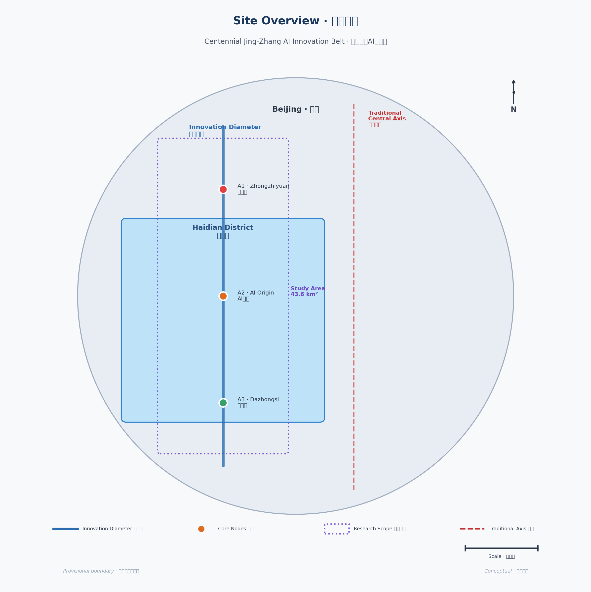
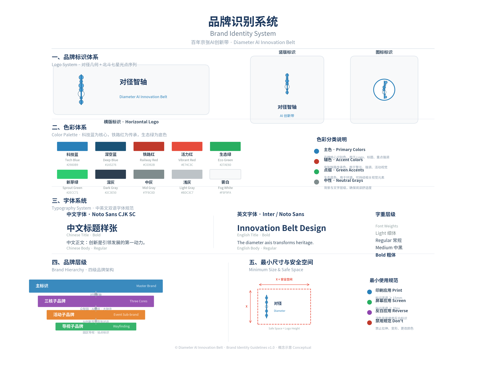
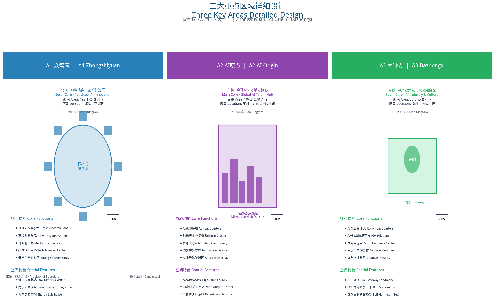
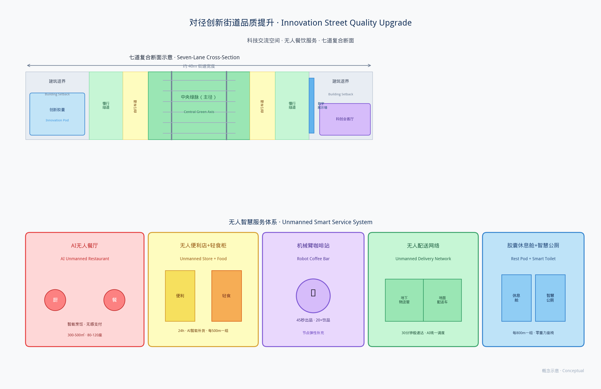
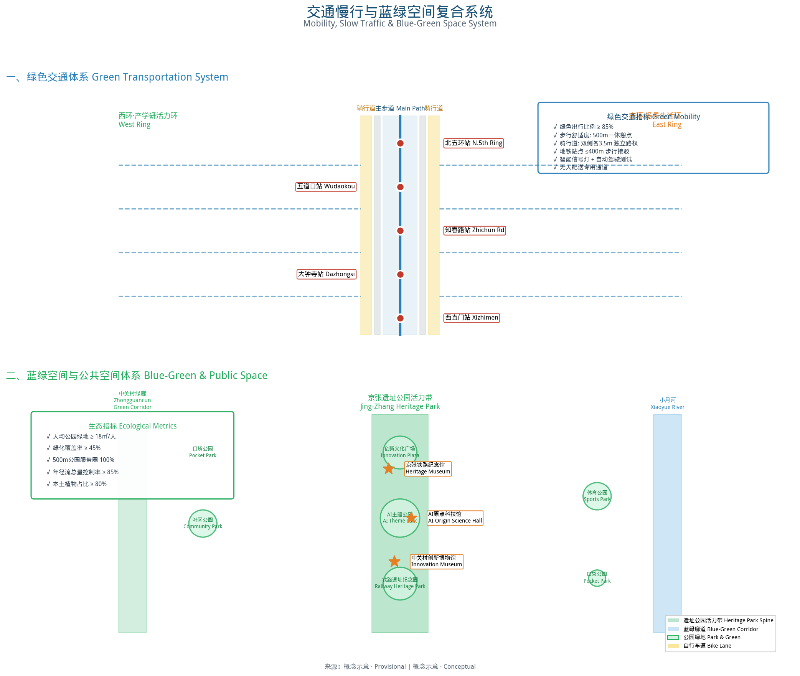
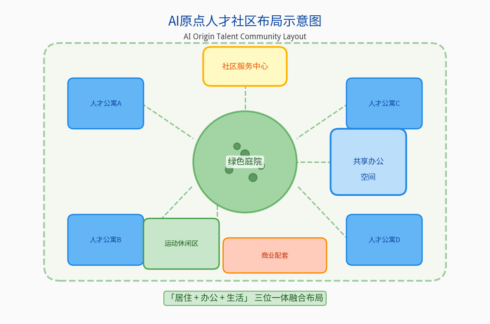

# Centennial Jingzhang · Diameter AI Innovation Belt
## — AI Innovation Belt Urban Design Proposal (v5.6)

> **Guiding Ideology**: General Secretary Xi Jinping's important concept of "people's city built by the people, people's city for the people"
> **Theoretical Mainline**: New Spatial Economics causal chain — "spatial quality enhancement → dynamic talent agglomeration → industrial innovation development"
> **Theoretical Foundation**: Central Urban Work Conference Six-Dimension Modern People's City Framework × Yang Kaizhong's New Spatial Economics
> **Policy Basis**: National / Beijing / Haidian three-tier "15th Five-Year Plan"
> **Design Scope**: Centennial Jing-Zhang AI Innovation Belt (Coordinated Research 43.6km² / Overall Design 11.4km² / Key Areas 368.4ha)
> **Spatial Paradigm**: Diameter AI Innovation Belt "One Diameter · Three Cores · Two Rings · Multiple Courts" (Spatial Economic Paradigm: quality gradient drives dynamic talent agglomeration)
> **Design Concept**: One Vein · Three Qualities · Six Dimensions · Seven Degrees · Tracing Origins to Inspire Innovation


> **Nature of Proposal**: Open co-creation concept recommendation; does not substitute for formal planning or constitute official government conclusions.

> 📐 **Visual System v5.0 Optimization Note**: A0-A3 color mapping unification, warning label placement next to charts, metrics-evidence text fix, A0 layout optimization, and map label enlargement are in progress. Current version relies on text and metrics data.

---

## Figure Index Table

| ID | Figure Name | Chapter | File Path | Evidence Status |
|----|------------|---------|-----------|-----------------|
| Fig.1 | Spatial Structure Diagram | 4.2 | assets/figures/01_spatial_structure_diagram.png | Conceptual |
| Fig.2 | Diameter Cross-Section | 4.3 | assets/figures/02_jingzhang_cross_section.png | Conceptual |
| Fig.3 | AI Scenario Distribution | 6.3 | assets/figures/03_ai_scenario_distribution.png | Conceptual |
| Fig.4 | Talent Community Layout | 6.2 | assets/figures/04_talent_community_layout.png | Conceptual |
| Fig.5 | Phasing Timeline | 10.2 | assets/figures/05_phasing_timeline.png | Scenario Target |
| Fig.6 | Brand Identity System | 3.6 | assets/figures/brand-identity-system.png | Concept Design |
| Fig.7 | Key Areas Masterplan | 5 | assets/figures/key-areas.png | Conceptual |
| Fig.8 | Land Use Structure | 7.1 | assets/figures/land-use-structure.png | Conceptual |
| Fig.9 | Metrics Evidence | 11.1 | assets/figures/metrics-evidence.png | Mixed |
| Fig.10 | Mobility & Blue-Green System | 8/9 | assets/figures/mobility-bluegreen.png | Conceptual |
| Fig.11-17 | Seven AI Scenario Nodes | 5.5 | assets/figures/node_node*.png | Conceptual |
| Fig.18 | Regional Synergy Map | 3.9 | assets/figures/regional-synergy-map.png | Concept Research |
| Fig.19 | Site Overview | 2 | assets/figures/site-overview.png | Observed |
| Fig.20 | Street Innovation Quality | 4.7 | assets/figures/street-innovation-quality.png | Conceptual |

> All figures are conceptual illustrations. Text and metrics data are authoritative.

## Chapter 1 Design Basis and Source List
> **📌 Overall Proposal Nature Statement**: This proposal is an open co-creation conceptual proposal. All spatial boundaries, area data, land use layout, FAR, building heights, demolition/rebuilding/retention ratios, investment estimates, benefit forecasts, and AI scenario settings are **conceptual scenario research parameters** (provisional), used only for design discussion and direction exploration. They do not represent official red lines, do not constitute statutory planning indicators, and are not approval or implementation basis. Final shall be subject to government statutory planning and special verification. Relevant positions in the full text have been marked one by one.


> ⚠️ **Conceptual Research Chapter**: Content in this chapter represents conceptual scenario research parameters. All boundaries/indicators/schemes are provisional and do not constitute statutory basis.
> **Important Notice**: All spatial boundaries, area calculations, and land use layouts are **provisional geometry at conceptual design stage**. They do not represent official red lines and do not constitute statutory planning or engineering basis.

### 1.1 Statutory Planning and Policy Basis

#### National Level
1. **"Outline of the 15th Five-Year Plan for National Economic and Social Development of the People's Republic of China"** [source:SRC-005]
   - "AI+" action deployment
   - Overall layout of Digital China construction
   - Building a globally influential sci-tech innovation center

2. **"New Generation Artificial Intelligence Development Plan"** (Guo Fa [2017] No. 35) [source:SRC-005]
   - By 2030, AI theory, technology, and applications will overall reach world-leading levels
   - Building AI innovation highlands and talent highlands

3. **"Outline of the 15th Five-Year Plan for National Economic and Social Development of Beijing"** [source:SRC-006]
   - 5 trillion-level industrial cluster cultivation plans (including AI)
   - International sci-tech innovation center construction
   - Urban renewal action implementation plan

4. **"Beijing's 15th Five-Year Plan Period AI Industry Development Plan"** [source:SRC-003]
   - AI core industry scale targets
   - AI innovation ecosystem construction
   - Scenario opening and application promotion

#### Central Urban Work Spirit
5. **General Secretary Xi Jinping's Important Expositions on Urban Work** [source:SRC-005]
   - The important concept of "people's city built by the people, people's city for the people"
   - People-centered urban development thought
   - Coordinating the three major links of urban planning, construction, and governance

6. **Spirit of the Central Urban Work Conference** [source:SRC-005]
   - Six-dimension goal of building a modern city that is "innovative, livable, beautiful, resilient, civilized, and smart"
   - Transforming urban development methods, improving urban governance systems, and enhancing urban governance capacity
   - Taking the path of urban development with Chinese characteristics

#### District Level
7. **"Outline of the 15th Five-Year Plan for National Economic and Social Development of Haidian District"** [source:SRC-007]
   - "Two Zones, Three Belts, Multiple Points" spatial pattern
   - AI industry highland construction
   - Urban renewal and quality improvement

8. **"Haidian District Plan (Territorial Spatial Plan) (2017–2035)"** [source:SRC-020]
   - Functional positioning of sci-tech innovation core area
   - Territorial spatial development and protection pattern

9. **"Centennial Jing-Zhang Railway Heritage Park Plan"** (to be verified by organizer·for background reference only·not for formal argumentation support) [source:SRC-021]
   - Overall layout of the 9-kilometer heritage park
   - Industrial heritage protection and activation

### 1.2 Centennial Jingzhang: From Railway Origin to Digital-Intelligence New Diameter

#### 1.2.1 Historical Heritage: A Railway and a Nation's Innovation

The Beijing-Zhangjiakou Railway is a spatial footnote to China's modernization. In 1909, Zhan Tianyou led its construction with the "herringbone" track solving Badaling — China's first independently designed trunk railway, marking the start of Chinese independent innovation. Over the century, Jingzhang evolved from engineering breakthrough to industrial growth to sci-edu accumulation.

Today, AI drives a new productivity revolution. From railway to AI, from industrial to digital civilization, Jingzhang stands again at history's intersection — from "opening railways, connecting the world" to "opening intelligence paths, creating the future." It is China's innovation spirit in space.
#### 1.2.2 Era Proposition: The Changing Spatial Logic of the Digital-Intelligence Economy

In the era of the digital-intelligence economy, the underlying logic of urban development is undergoing profound transformation. In the traditional industrial economy, industrial location depends on transportation costs, resource endowments, and scale effects. In the digital-intelligence economy, **innovation becomes the primary productive force, talent becomes the primary resource, and spatial quality becomes the primary determinant of talent location choice**.

Behind this transformation lies a deep-seated law revealed by New Spatial Economics: **spatial quality determines talent location; talent location determines innovation location; innovation location determines the industrial location of new quality productive forces**. In development stages dominated by knowledge-intensive industries, talents "vote with their feet" for high-quality spaces; enterprises cluster following talents; industries iterate and upgrade as talents agglomerate — forming a circular cumulative causation of "quality improvement → talent agglomeration → innovation growth → quality re-improvement."

Beijing, as the national science and technology innovation center, and Haidian District, as the core carrier of Beijing's AI industry, face the era proposition of how to transform advantages in science and education resources into AI innovation advantages. Along the Centennial Jingzhang corridor gathers a complete innovation chain from basic research to industrial application — ZhiYuan for original innovation, Zhongguancun for enterprise incubation, Dazhongsi for industrial transformation. Yet these innovation resources have long been separated by urban roads and functional zones, without forming a continuous spatial quality belt and innovation ecosystem chain.

#### 1.2.3 Design Approach: Diameter Intelligence Axis — Activating Innovation Potential Through Spatial Quality

Based on the above historical heritage and era proposition, this proposal presents the overall design concept of **"Centennial Jingzhang · Diameter Intelligence Axis"**: taking the Jingzhang Railway Heritage Park as the spatial main artery, transforming the century-old railway heritage into the innovation spatial skeleton of the AI era, and systematically improving spatial quality along the corridor through a Diameter AI Innovation Belt spatial structure, creating an AI innovation central axis spanning physical space to digital space, from industrial ecosystem to governance system.

**The core design logic** can be summarized as "three progressive steps":

**Step 1: Linking into a Diameter — The Diameter Paradigm in Spatial Structure.** Taking the Jingzhang Railway Heritage Park as the "diameter," connecting three core nodes — ZhiYuan AI Origin Community (North Core · Basic Research), ZhongZhiYuan AI Acceleration Zone (Mid Core · Startup Acceleration), and Dazhongsi AI Industry Cluster (South Core · Industrial Transformation) — forming a north-south quality gradient axis. The Diameter AI Innovation Belt spatial structure drives talent flow and agglomeration through quality gradients, enabling innovation resources to distribute orderly and link efficiently along the diameter.

**Step 2: Virtual-Physical Dual Diameter — Hyper-Dimensional Expansion in Spatial Dimension.** Superimposing a virtual spatial dimension on the physical diameter, constructing a "co-creation · co-construction · sharing" AI good governance system. The AI Conjecture Rankings gather collective wisdom to raise and solve problems (co-creation); the challenge-based system coordinates resources for joint breakthroughs (co-construction); innovation achievements benefit all people and improve the quality of production, life, and ecology (sharing). Virtual space and physical space mutually construct and reinforce each other — physical links are established and deepened online; new links emerge online and land and deepen offline.

**Step 3: Governance Safeguard — Good Governance Assurance in Spatial Operation.** Taking AI removability, non-smart equivalent paths, and manual review mechanisms as governance bottom lines, ensuring that AI always serves people and empowers cities. Taking public interest priority as the value anchor, so that innovation dividends benefit all citizens. The governance system and spatial system are designed integrally, ensuring the long-term, healthy, and sustainable operation of the innovation belt.

Thus, the Centennial Jingzhang is upgraded from "a railway" to "an intelligence diameter," from the transportation infrastructure of industrial civilization to the innovation spatial infrastructure of digital-intelligence civilization.


### 1.3 Theoretical Basis and Academic Literature

This proposal takes the New Spatial Economics founded by Professor Yang Kaizhong as the core theoretical foundation, and the important concept of the People's City as the value guidance, constructing a three-in-one design methodology of "theory - value - space". The core proposition of New Spatial Economics — "spatial quality drives talent agglomeration, knowledge exchange drives innovation growth" — provides solid theoretical support for the spatial design of the Jing-Zhang AI Innovation Belt.

#### 1.3.1 Core Theory: New Spatial Economics

New Spatial Economics breaks through the analytical paradigm of "transportation cost minimization" in traditional urban economics, shifting to a brand-new theoretical perspective of "spatial quality drives innovation growth", providing a systematic theoretical framework for the planning and design of urban innovation spaces in the AI era. Its core proposition holds that spatial economy is endogenously determined by the interwoven co-evolution of technological innovation, increasing returns, factor mobility, travel costs and transport costs, and spatial quality — spatial quality is no longer an exogenous residual "amenity" variable, but a core endogenous variable alongside transport costs and factor flows. [source:SRC-019]

New Spatial Economics reveals that in the DIKIT era, the relative importance of freight costs versus travel costs has undergone a fundamental shift: face-to-face exchange has become the foundational mechanism of innovation, travel costs have risen to become a key constraint of the spatial economy, and spatial quality together with travel costs determines the "quality proximity effect" in talent location choice — talents tend to flow to areas with high spatial quality and low travel costs, even if nominal wages are lower. [source:SRC-019] Its core logic can be summarized as "three propositions + two mechanisms":

**Three Core Propositions**

**Proposition 1: Spatial Quality is the Core Driver of Dynamic Talent Agglomeration** [source:SRC-008]

In the innovation-driven development stage, the core of urban competition has shifted from traditional production factors such as land, labor, and capital to the attractiveness of spatial quality to high-human-capital populations. As the ultimate form of knowledge-intensive industries, the core production factor of the AI industry is talent; and the location choice and mobility decisions of talents are increasingly influenced by urban spatial quality — including ecological environment, cultural atmosphere, life convenience, social richness and other multi-dimensional quality factors.

This reconstructs talent strategy: "static introduction" via subsidies has diminishing returns; "dynamic agglomeration" via quality supply is sustainable. **Talents are attracted, not introduced.**

**Learning-oriented spatial quality** [source:SRC-019]: High-quality learning environments guide talents to allocate time for knowledge exchange, realizing human capital appreciation at the micro level.


**Proposition 2: Minimizing Spatial Transaction Costs of Knowledge Exchange is the Key to Innovation Efficiency** [source:SRC-008]

The core mechanism of innovation is the flow, collision, and recombination of knowledge, especially face-to-face exchange of tacit knowledge. The efficiency of knowledge exchange largely depends on spatial organization — the closer the spatial distance, the richer the exchange scenarios, and the lower the mobility cost, the higher the frequency and quality of knowledge spillovers.

New Spatial Economics takes the "spatial transaction cost of knowledge exchange" as its core analytical variable: including the time cost of movement, the search cost of exchange, the adaptation cost of scenarios, etc. Compact spatial layout, mixed functional composition, and a hierarchical exchange venue system can systematically reduce the spatial transaction cost of knowledge exchange and improve the density and quality of innovation output.


**Proposition 3: Circular Cumulative Causation — Positive Feedback Between Talent Agglomeration and Spatial Quality Enhancement** [source:SRC-008]

The relationship between spatial quality and talent agglomeration is not one-way causation, but bidirectional circular cumulative causation: spatial quality enhancement attracts more high-human-capital talents to agglomerate, and the agglomeration of high-human-capital talents in turn promotes further improvement of spatial quality (such as upgrading demand for public services, consumption support for cultural facilities, participation and empowerment in community governance), forming a positive feedback cycle of "better quality → more talents → better quality".

This reveals the endogenous growth mechanism: beyond critical mass, innovation districts enter self-reinforcing growth. Planning's core task is helping the region cross this threshold.


**Two Spatial Economic Mechanisms**

**Mechanism 1: Contact Efficiency Advantage of Linear Space — Corridor Mode vs. Node Mode** [source:SRC-019]

Linear corridor mode offers efficiency advantages over point agglomeration:
- **Maximized contact interface** — longer interface benefits more building blocks
- **Maximized encounter probability** — people in different directions generate face-to-face exchange opportunities
- **Structured mobility cost reduction** — all nodes share one quality spine

> **Design hypothesis**: Diameter geometry (longest chord in circular scope) maximizes coverage and the midpoint has highest accessibility. Requires empirical verification.

**Mechanism 2: Dynamic Agglomeration Driven by Gradient Differences — Quality Gradient → Talent Flow → Innovation Diffusion** [source:SRC-019]

Dynamic talent agglomeration is not uniformly distributed, but flows along the quality gradient. Different types and developmental stages of innovative talents have systematic differences in their preferences for spatial quality: research talents prefer learning-oriented quality (academic atmosphere, quiet environment), entrepreneurial talents prefer innovation-oriented quality (exchange density, entrepreneurial services), and industrial talents prefer industry-oriented quality (business support, industrial chain completeness).

The quality gradient of "learning-oriented → innovation-oriented → industry-oriented" formed along the diameter axis not only corresponds to the spatial organization of the innovation chain, but also creates a "quality differential" for talent flow — talents flow between different nodes due to changes in quality preferences, and knowledge spillovers and innovation diffusion occur during the flow process. This dynamic talent flow based on quality gradients is the "blood circulatory system" of the innovation ecosystem.


**Green-Intelligent Productivity** [source:SRC-008]: Green + AI integration generates new productivity. The innovation belt serves as an experimental field — Jing-Zhang Heritage Park as green carrier, AI as intelligent core.


**Alternative Structure Comparison** (design hypothesis, not verified): Diameter, Cluster, and Ring mode comparisons are theoretical deductions requiring empirical verification.


#### 1.3.2 Value Guidance: Important Concept of the People's City

5. **Important Concept of the People's City** [source:SRC-005]
    - The important concept of "people's city built by the people, people's city for the people" proposed by General Secretary Xi Jinping
    - People-centered urban development thought, emphasizing that the fundamental purpose of urban development is to serve the people
    - Coordinating the three major links of planning, construction, and governance to promote high-quality urban development

6. **Modern City Six-Dimension Framework** [source:SRC-005]
    - The six-dimension goal of "innovative, livable, beautiful, resilient, civilized, and smart" proposed by the Central Urban Work Conference
    - Innovation is the primary driving force, livability is the fundamental goal, beauty is the ecological background
    - Resilience is the security guarantee, civilization is the spiritual core, and wisdom is the characteristic of the times

#### 1.3.3 Supporting Theories and Methods

7. **Urban Renewal Theory**
   - Progressive renewal and organic renewal methodology
   - Stock space quality improvement and functional mixing strategy
   - Historical heritage protection and activation utilization

8. **Industrial Cluster and Innovation Ecosystem Theory**
   - Porter Diamond Model and industrial competitiveness analysis
   - Triple Helix theory (government-industry-university collaborative innovation)
   - Entrepreneurship ecosystem theory

9. **TOD and Station-City Integration Theory**
   - Transit-Oriented Development (TOD) model
   - Rail micro-center and station-city integration design
   - Slow-traffic priority and job-housing balance strategy

10. **Resilient City Theory**
    - Urban disaster prevention and mitigation and emergency response system
    - Sponge city and stormwater management
    - Elastic supply of energy and water resources

### 1.4 Data Sources and Technical Materials

14. **Geospatial Data** [metric:haidian-gis^provisional]
    - Haidian District land use status data (2024)
    - Jing-Zhang Railway heritage site and surrounding building survey data
    - Road network and rail transit status data

15. **Industrial Economic Data** [metric:haidian-stats^provisional]
    - Haidian District AI industry statistical yearbook (2024)
    - Key AI enterprise directory and spatial distribution
    - Distribution of universities and research institutes and achievement transformation data

16. **Population and Talent Data** [metric:haidian-pop^provisional]
    - Haidian District population distribution and structure data
    - AI practitioner scale and profile
    - Talent housing demand estimation data

17. **Transportation Data** [metric:beijing-transport^provisional]
    - Rail transit passenger flow data (Line 13, Line 10, Line 15, etc.)
    - Road congestion index and travel OD analysis
    - Slow traffic system status assessment

### 1.5 Planned Research and Data Collection

> ⚠️ **Research Plan Statement**: The following are the **planned research work** of the proposal team. As of the submission date, all on-site surveys and interviews have not been completed.
> 
> ⚠️ **v5.0 Statement**: All field surveys, site visits, building censuses, and interviews are **planned** and have not been conducted as of v5.0. Current situation descriptions are based on conceptual compilation of public remote sensing imagery and planning materials, and do not constitute field verification conclusions. The listed content is for research direction and planning reference only.

18. **Planned Site Survey** (starting from the second half of 2026)
    - **Collecting Entity**: Proposal design team (planning to commission a professional research agency)
    - **Planned Methods**: Full-line walking survey, building appearance census, space usage observation
    - **Sample Scope**: Entire Jing-Zhang Railway heritage site, three key districts, surrounding major communities and parks
    - **Authorization and Limitations**: Access to specific areas requires permission from relevant parties; imagery data is for design research only
    - **De-identification Processing**: Content involving personal information will be de-identified

19. **Planned Stakeholder Interviews** (to be advanced based on coordination progress)
    - **Collecting Entity**: Proposal design team (planning to commission a professional research agency)
    - **Planned Methods**: Semi-structured interviews, symposiums, questionnaire surveys
    - **Sample Scope**: Planned to engage Haidian District government departments, universities and research institutions, AI enterprises, community residents, etc.
    - **Authorization and Limitations**: Informed consent required from interviewees; interview content is for design research only, no specific interviewee information will be disclosed
    - **De-identification Processing**: All interview records will be anonymized; public versions will not contain personally identifiable information

20. **Existing Public Data Compilation**
    - Background data compilation has been completed based on public reports and planning literature
    - All non-public sources are marked as "to be verified" and do not constitute formal supporting evidence

---


### 1.6 Task Book Requirements Response Matrix

Per the competition task book [source:AGENT-TASKBOOK], this proposal systematically responds to all core requirements:

| Task Book Requirement | Proposal Response | Key Points |
|----------------------|-------------------|------------|
| **Jingzhang Railway Heritage** | Sec 1.2 + 4.3 + 9.2 | 9km heritage park, seven-path section, three-culture narrative |
| **AI Innovation Belt Positioning** | Sec 3.1-3.4 + 6.1 | Diameter quality gradient, full-chain AI ecosystem, 13 scenarios |
| **Urban Renewal & Reg Plan Depth** | Sec 4.4-4.7 + Ch 7 + 11 | Ten flagship projects, 32 indicators, compliance matrix |
| **Key Area Detailed Design** | Ch 5 (5.1-5.3) | A1/A2/A3 detailed design, spatial structure, AI scenarios |
| **Implementation Policy & Phasing** | Sec 10.1-10.5 | Three-phase path, ten projects, policy + operations |
| **Indicator System** | Ch 11 + metrics.json | 6-dim 7-degree system, 32 core indicators |
| **Public Interest & Inclusiveness** | Sec 9.3 + 10.6 | Three-level public space, co-governance, benefit sharing |
| **Blue-Green Ecological Space** | Sec 9.1 + 8.5 | One-ridge three-corridors, sponge city |
| **Transportation Optimization** | Sec 8.1-8.3 | Narrow roads dense net, rail micro-centers |


### 1.7 Agent Six Mandatory Tasks Comparison Table

Per the task book [source:AGENT-TASKBOOK], responses to six tasks are as follows:

| ID | Task Name | Response Chapter | Completion |
|----|-----------|-----------------|------------|
| agent.1 | Overall Concept & Functional Coordination | Ch 1/3/4 + Spatial Structure | High |
| agent.2 | AI Full-Stack Innovation System & Ecosystem | Sec 3.2-3.4 + Ch 6 | High |
| agent.3 | AI+ Scenario Empowerment & Vibrant City | Ch 5/6 + Scenario Cards | High |
| agent.4 | AI Public Space & Pilgrimage Landmarks | Ch 9 + Landmarks + Library | High |
| agent.5 | Three-Culture Integrated Narrative | Sec 1.2 + 9.2/9.4 | Medium-High |
| agent.6 | Global AI Activity & Operations | Ch 10 + Vitality System | Medium-High |

### 1.8 Terminology and Abbreviations

| Chinese | English | Abbrev. |
|---------|---------|---------|
| 对径式空间结构 | Diameter-type Spatial Structure | DSS |
| 对径智轴 | Diameter AI Innovation Belt | DAIB |
| 新空间经济 | New Spatial Economics | NSE |
| 品质-人才-产业因果链 | Quality-Talent-Industry Causal Chain | QTI Chain |
| 一径·三核·双环·多庭 | One Diameter·Three Cores·Dual Rings·Courtyards | ODTC |
| 七星拱极 | Seven Stars Arching the Pole | Seven Stars |
| 数字空间密度 | Digital Spatial Density | DSD |
| 对径生成算法 | Diameter Generation Algorithm | DGA |
| AI空间运营商 | AI Space Operator | AISO |
| 共创·共建·共享 | Co-Creation·Co-Build·Co-Sharing | Three Co- |
| AI可移除性 | AI Removability | AIR |

> 11 core terms defined throughout the document. See terminology index for details.

### 1.9 Source and Evidence Grading

This proposal follows the organizer's source registry system, with 21 sources cited. Evidence status markers: `[source:SRC-XXX]` source citation, `[metric:xxx]` metric data, `provisional` pending verification, `scenario-target` scenario goal, `observed` current status data. See Section 12.3 and sources.json for detailed source audit.

## Chapter 2 Three-Level Scope Framework


> ⚠️ **Conceptual Research Chapter**: Content in this chapter represents conceptual scenario research parameters. All boundaries/indicators/schemes are provisional and do not constitute statutory basis.
### 2.1 Three-Tier Scope Definition

> **Figure Notice**: Uses provisional geometry. Areas and positions are conceptual only - not official red lines, not statutory or engineering basis.




This proposal adopts a **"Coordinated Research — Overall Design — Key Areas"** three-tier progressive work framework, achieving complete transmission from macro strategy to micro implementation.

#### 2.1.1 Tier 1: Coordinated Research Scope (43.6km²)

**Scope Definition**:
- North to North 5th Ring Road
- South to Xizhimen - North 2nd Ring Road
- West to Zhongguancun Street - Suzhou Street corridor
- East to Xueyuan Road - Xiaoyue River corridor
- **Total area approximately 43.6 square kilometers** [metric:total-research-area]

**Work Content**:
- AI industry development strategy and ecosystem construction research
- Regional coordination and spatial pattern optimization research
- Transportation and infrastructure system coordination research
- Talent community and public service system research
- Cultural inheritance and brand strategy research

**Core Task**: Clarify the strategic positioning, industrial direction, spatial pattern, and support system of the innovation belt from the regional level, providing strategic guidance for overall design.

#### 2.1.2 Tier 2: Overall Design Scope (11.4km²)

**Scope Definition**:
- Approximately 500–800 meters depth on each side of Jing-Zhang Railway Heritage Park
- North from Qinghua East Road, south to Xizhimen North Street
- Covering three core districts and surrounding linkage areas
- **Total area approximately 11.4 square kilometers** [metric:total-design-area]

**Work Content**:
- Urban renewal overall framework and strategies
- Functional layout and land use structure optimization
- Building scale and capacity control
- Road and transportation system optimization
- Public space and blue-green system design
- Urban character and building height control
- Key project layout and inventory

**Depth Positioning**: Overall conceptual urban design research, proposing regulatory suggestion directions and guidance ideas for professional teams to deepen through statutory procedures.

#### 2.1.3 Tier 3: Key Areas Detailed Design (368.4ha)

**Scope Definition**: Three Core Districts
- **A1 Collective Intelligence Park District**: 192.1 hectares (North Core)
- **A2 AI Origin Community**: 104.3 hectares (Main Core · Wudaokou + Zhichun Road)
- **A3 Dazhongsi District**: 72.0 hectares (South Core)
- **Total: 368.4 hectares** [metric:key-area-total]

**Work Content**:
- District positioning and functional refinement
- Spatial structure and layout deepening
- Building renewal and renovation plans
- Traffic organization and slow traffic system
- Public space landscape design
- AI scenario implantation and smart design
- Risk assessment and response strategies

**Depth Positioning**: Key area conceptual scheme deepening research, proposing spatial form intentions and design guidelines for reference in subsequent architectural schemes and engineering design.

### 2.2 Spatial Relationship of Three-Tier Scope


**Tier Transmission Relationship**:

| Tier | Area | Core Issues | Output Deliverables |
|------|------|-------------|-------------------|
| Coordinated Research Tier | 43.6km² | Strategic positioning, industrial ecosystem, regional coordination | Strategic research report, industrial plan |
| Overall Design Tier | 11.4km² | Renewal framework, functional layout, character control | Conceptual urban design, planning optimization research suggestions |
| Key Areas Tier | 368.4ha | Detailed design, scenario implementation, implementation path | Detailed urban design, project implementation plan |

### 2.3 Work Methodology and Technical Route

#### Theory-Led
With General Secretary Xi Jinping's People's City important concept as the fundamental guideline, the Central Urban Work Conference's six-dimension modern city framework (innovative, livable, beautiful, resilient, civilized, smart) as the goal orientation, and Yang Kaizhong's New Spatial Economics as the core methodology, build a theoretical integration system of "People's City Six-Dimension Goal × Spatial Quality Three-Dimension Framework × Diameter-type Spatial Paradigm", establishing a complete theory-policy-space closed loop.

**Theoretical Integration Logic**:
- **Value Anchor**: The People's City concept establishes the fundamental value orientation of "people-centered", answering the fundamental question of "design for whom"
- **Goal Framework**: The six-dimension modern city goals (innovative, livable, beautiful, resilient, civilized, smart) provide the national-level urban development standard coordinate system
- **Implementation Path**: New Spatial Economics' "spatial quality drives innovation growth" reveals the spatial economic mechanism for the implementation of six-dimension goals
- **Spatial Paradigm**: The Diameter AI Innovation Belt "One Diameter · Three Cores · Two Rings · Multiple Courts" transforms theory into operable spatial structure

**Correspondence Between Six-Dimension Goals and Three Dimensions of Spatial Quality**:
| People's City Six Dimensions | New Spatial Economics Quality Dimension | Diameter Spatial Bearing |
|-----------------------------|----------------------------------------|-------------------------|
| Innovation | Innovative Spatial Quality | Three Core Innovation Nodes + Two-Ring Innovation Ecosystem |
| Livable | Livable Spatial Quality | Multiple Courtyards + 15-minute Living Circle |
| Beautiful | Livable (Ecological Sub-dimension) | Blue-Green Skeleton + Heritage Park Vitality Belt |
| Resilient | Livable (Safety Sub-dimension) | Disaster Prevention Space System + Sponge City |
| Civilized | Learning (Cultural Sub-dimension) | Jing-Zhang Cultural Heritage Axis + Public Art |
| Smart | Innovative (Smart Governance Sub-dimension) | AI Urban Brain + Full Smart Scenario Coverage |

#### Three-Tier Connection
Precisely align with the national-Beijing-Haidian three-tier "15th Five-Year Plan", forming a planning system with layered strategy transmission and progressive spatial implementation.

#### Multi-Dimensional Integration
Integrate multiple professional fields including industrial planning, urban design, transportation planning, landscape design, and smart city to form an integrated solution.

#### Iterative Optimization
Establish a quantifiable, monitorable, and iterable spatial quality assessment system to ensure the dynamic adaptability and continuous optimization capability of the proposal.


---

## Chapter 3 Coordinated Research Area: Industry and Future City Research

> **📌 Task Book Response**: This chapter responds to "AI Innovation Belt Industry Positioning", proposing the development concept, strategic positioning, core functions, and spatial pattern from a New Spatial Economy perspective. All indicators are conceptual research parameters for reference only.


> ⚠️ **Conceptual Research Chapter**: Content in this chapter represents conceptual scenario research parameters. All boundaries/indicators/schemes are provisional and do not constitute statutory basis.
### 3.1 Development Vision: Six-Dimension Quality Supply System Based on New Spatial Economics

The methodological core of this proposal is: taking the causal chain of New Spatial Economics — "spatial quality enhancement → dynamic talent agglomeration → industrial innovation development" — as the mainline, systematically transforming the six-dimensional goals of the people's city into six types of spatial quality supply strategies, and driving talent agglomeration and innovation growth through spatial design means.

#### 3.1.1 Theoretical Mainline: Spatial Quality → Talent Agglomeration → Industrial Innovation

This proposal takes New Spatial Economics as its core methodology, establishing the three-stage causal logic of "spatial quality enhancement — dynamic talent agglomeration — industrial innovation development" as the theoretical mainline running through the entire proposal:

```
┌─────────────────────┐     ┌─────────────────────┐     ┌─────────────────────┐
│ Spatial Quality     │────→│ Dynamic Talent      │────→│ Industrial Innovation│
│    Enhancement      │     │    Agglomeration    │     │       Development   │
│  (Design Means)     │     │  (Intermediate Var.)│     │  (Ultimate Goal)    │
└─────────────────────┘     └─────────────────────┘     └─────────────────────┘
       ↑                            │                            │
       │                            ↓                            │
       └──── Circular Cumulative Causation ←──┘ ←─── Knowledge Spillover ────┘
```

**Stage 1: Spatial Quality Enhancement (Design Means)**

Urban design is not an end in itself, but a means of supplying spatial quality.

Yang Kaizhong's latest research systematically demonstrates the endogenous core status of spatial quality in the spatial economic system: it is no longer an exogenously given "amenity" residual variable in traditional theory, but a core endogenous variable alongside technological innovation, increasing returns, factor mobility, and travel/transport costs, with all six interweaving and co-evolving. [source:SRC-019] This theoretical positioning elevates spatial quality from "supporting facility" to "core driver", fundamentally establishing the strategic value of urban design in innovation-driven development.

Traditional planning regards space as a "container for industry", while this proposal regards space as a "magnet for talent". This shift in perspective is fundamental: the industrial planning logic is "build parks → attract enterprises → gather talents", while the New Spatial Economics logic is "improve quality → gather talents → prosper industry".

**Stage 2: Dynamic Talent Agglomeration (Intermediate Variable)**

Talent is the core mediating variable between spatial quality and industrial innovation. High-quality space attracts talent agglomeration, and talent agglomeration brings knowledge spillovers and innovation vitality, which in turn drives industrial development.

- **Flowing talents**: Talents are not "introduced" and then fixed in a certain space, but continuously flow between different quality nodes — from laboratories to incubators, from startup parks to industrial districts, from workspaces to living spaces. Flow itself generates knowledge spillovers.
- **Differentiated talent preferences**: Different types and developmental stages of AI talents have different preferences for spatial quality, requiring a differentiated quality supply system to attract and retain them.
- **Critical mass effect**: When talent density crosses a certain critical threshold, it will trigger the positive feedback of knowledge spillovers and enter a self-reinforcing agglomeration track.

**Stage 3: Industrial Innovation Development (Ultimate Goal)**

Dynamic talent agglomeration ultimately promotes industrial innovation development through mechanisms such as knowledge spillovers, startup incubation, and industrial chain self-organization. It is worth noting that industrial innovation development is not "built" by planning, but "emerges" on the basis of talent agglomeration.

The self-organized evolution of the innovation ecosystem follows the following logic: talents attracted by spatial quality reach critical mass → knowledge spillovers give birth to startup projects → startup projects attract capital and services → successful enterprises drive industrial chain agglomeration → industrial chain agglomeration further enhances spatial quality.

#### 3.1.2 Mapping Framework: Six-Dimension Goals → Six Types of Spatial Quality

The six-dimensional modern city goals of "innovative, livable, beautiful, resilient, civilized, and smart" proposed by the Central Urban Work Conference provide a value coordinate system for this proposal.

| People's City Six Dimensions | Mapped to Spatial Quality Type | Quality Connotation | Corresponding Mechanism in New Spatial Economics |
|------------------------------|--------------------------------|---------------------|--------------------------------------------------|
| **Innovation** | Innovation-oriented spatial quality | Entrepreneurial environment, industry-university-research collaboration, innovation community, exchange density | Minimization of knowledge exchange transaction costs → improvement of innovation efficiency |
| **Livable** | Livable spatial quality | Residential comfort, public services, life convenience, job-housing balance | Livable quality extends talent stay time → improves agglomeration efficiency |

The theoretical significance of this mapping lies in: it transforms the people's city concept from the level of value advocacy into an operable spatial economic analysis framework.

#### 3.1.3 Spatial Supply Pathways for Six Types of Quality

Based on the mapping framework above, this proposal systematically supplies six types of spatial quality through the diameter-type spatial structure. Each quality type has clear spatial carriers and design strategies:

**Six Quality Types and Spatial Supply Paths**:

| Quality Type | Spatial Carrier | Design Strategies |
|-------------|---------------|-------------------|
| Innovation | One diameter · three cores · multi-courtyards | 5-min exchange circle, IUR proximity, shared spaces |
| Livability | Multi-courtyards + 15-min life circles | Job-housing balance, walk-friendly, equal services |
| Beauty | Jingzhang Heritage Park + blue-green system | Blue-green interweave, heritage activation, year-round |
| Resilience | Disaster prevention + sponge city | Decentralized buffering, multi-source guarantee, smart warning |
| Civilization | Cultural heritage axis + public art | Heritage activation, art embedding, cultural empowerment |
| Smartness | AI urban brain + smart facilities | Public sensing (list pub), smart ops, data openness |

The six quality types are not isolated but form a composite overlay system along the diameter axis. Closer to core nodes means higher quality superposition and stronger comprehensive talent attraction. This composite quality strategy is the concrete practice of New Spatial Economy's "multi-dimensional quality synergistically driving talent agglomeration" theory in spatial design.
### 3.2 Three Strategic Positionings

Based on the core logic of New Spatial Economics — "spatial quality drives talent agglomeration, talent agglomeration drives industrial innovation" — combined with the six-dimensional goals of the people's city and the requirements of the three-tier "15th Five-Year Plan", starting from **the hierarchy and types of spatial quality supply**, three strategic positionings for the Centennial Jing-Zhang AI Innovation Belt are established.

#### Positioning 1: National-Level Learning-Oriented + Innovation-Oriented Spatial Quality Supply Highland

**(Economic restatement of the original "Haidian Pivot of the National AI Strategy")**

**Connotation Interpretation**:
The core of this positioning is not "building an AI highland", but **constructing a national-level learning-oriented and innovation-oriented spatial quality supply system** — through high-quality academic spaces, research environments, entrepreneurial atmospheres, and exchange scenarios, attracting and agglomerating top AI talents from across the country and even the world.

- **Quality supply type**: Based on learning-oriented spatial quality (university research resources, academic cultural atmosphere), with innovation-oriented spatial quality as the core (entrepreneurial incubation ecosystem, industry-university-research collaboration, knowledge exchange density)
- **Talent agglomeration goal**: AI scientists, top researchers, young academic talents, serial entrepreneurs
- **Innovation output direction**: Basic research original innovation, frontier technological breakthroughs, AI for Science interdisciplinary innovation, governance system innovation
- **Spatial bearing**: Collective Intelligence Park District (core of learning-oriented quality) + AI Origin Community (core of innovation-oriented quality)

**Core Support (New Spatial Economics Interpretation)**:
- Haidian District has the highest density of AI research talent supply sources in the country (Tsinghua, Peking University, Beihang, etc.), providing a natural foundation for learning-oriented quality — this is the "initial endowment" of dynamic talent agglomeration

#### Positioning 2: Beijing-Tianjin-Hebei Innovation-Oriented + Industry-Oriented Spatial Quality Coordination Hub

**(Economic restatement of the original "Core Engine of Beijing-Tianjin-Hebei AI Innovation Coordination")**

**Connotation Interpretation**:
The core of this positioning is not "becoming a growth pole", but **constructing a hub node for quality gradient coordination in the Beijing-Tianjin-Hebei region** — through the innovation-oriented and industry-oriented quality supply of the Diameter Intelligence Axis, attracting and transforming innovative talents and research achievements within the Beijing-Tianjin-Hebei range.

- **Quality supply type**: With innovation-oriented spatial quality as the hub (connecting the north-south quality gradient), with industry-oriented spatial quality as the export (achievement transformation and industrial landing)
- **Talent agglomeration goal**: Cross-regionally flowing AI R&D talents, technology transformation experts, industrial operation talents
- **Innovation output direction**: Technology transformation and pilot incubation, industrial chain collaborative innovation, two-way regional talent flow
- **Spatial bearing**: AI Origin Community (innovation transformation hub) + Dazhongsi District (industrial agglomeration export) + dual-ring collaboration network

**Core Support (New Spatial Economics Interpretation)**:
- Beijing's position as the core area of the international sci-tech innovation center means the highest level of innovation-oriented quality supply capacity, forming a "quality highland" with both siphon and radiation effects on surrounding areas

#### Positioning 3: Beijing's AI Industry-Oriented + Smart-Oriented Spatial Quality Main Supply Area

**(Economic restatement of the original "Main Bearing Area of Beijing's AI Trillion-Level Industrial Cluster")**

**Connotation Interpretation**:
The core of this positioning is not "introducing enterprises and forming clusters", but **constructing Beijing's highest-energy industry-oriented and smart-oriented spatial quality supply system** — through high-quality industrial supporting facilities, business services, application scenarios, and smart facilities, attracting AI industrial talent agglomeration.

- **Quality supply type**: With industry-oriented spatial quality as the leading factor (industrial chain completeness, business support level, application scenario richness), with smart-oriented spatial quality as the feature (AI scenario empowerment, digital infrastructure, smart governance level)
- **Talent agglomeration goal**: AI industrial engineering talents, product managers, industry solution experts, operation management talents
- **Innovation output direction**: AI industrialization scale growth, industry application innovation, AI + real economy integration
- **Spatial bearing**: Dazhongsi District (core of industry-oriented quality) + smart scenarios along the entire line (smart-oriented quality supply)

**Core Support (New Spatial Economics Interpretation)**:
- Beijing's AI industry foundation (enterprise count, talent scale, and financing volume all rank first in the country) provides the demand foundation and initial conditions for self-organized evolution of industry-oriented quality

### 3.3 Five Core Functions

Based on the full-chain development law of AI innovation ecosystem, five core functions are established:

| Function Category | Function Connotation | Spatial Bearing |
|-------------------|---------------------|-----------------|
| **AI Technology Source** | Basic research, frontier exploration, original innovation | Universities and institutes, key laboratories, joint R&D centers |
| **AI Industry Highland** | Full-chain industrial ecosystem, corporate headquarters, unicorn cultivation | Industrial parks, headquarters bases, incubators, accelerators |

### 3.4 "Three Zones, Two Wings" Spatial Pattern

For the overall AI innovation spatial layout within the coordinated research scope, following the spatial organization logic of "core agglomeration, axial connection, and collaborative empowerment", an overall spatial pattern of "Three Zones and Two Wings" is formed.

#### 3.4.1 Three Zones: Three Core Functional Zones

**(1) Northern Innovation Zone — AI Independent Innovation Leading Zone**

Its scope covers Tsinghua Science Park, Peking University Science Park, Zhongguancun West District and surrounding areas, with an area of approximately 15.2 square kilometers.

Core functions include: basic research and original innovation, high-end talent cultivation and agglomeration, startup incubation and acceleration, international academic exchange and cooperation.

**(2) Central Core Zone — AI Technology Source and Talent Core Zone**

Its scope covers Wudaokou, Zhichun Road, and areas along Zhongguancun Street, with an area of approximately 13.8 square kilometers.

Core functions include: AI technology R&D and transformation, innovation and entrepreneurship ecosystem cultivation, talent housing and living services, and AI scenario testing and verification.

**(3) Southern Industrial Zone — AI Industry Agglomeration and Application Demonstration Zone**

Its scope covers Dazhongsi, Xueyuan South Road, and Xizhimen surrounding areas, with an area of approximately 14.6 square kilometers.

Core functions include: AI industry headquarters agglomeration, industry application solution R&D, scientific and technological achievement transformation and industrialization, and accelerated growth of innovative enterprises.

#### 3.4.2 Two Wings: East-West Collaborative Empowerment

**(1) West Wing — Industry-University-Research Collaborative Empowerment Belt**

Along the Zhongguancun Street-Suzhou Street line, it connects scientific research resources such as universities and research institutes, national key laboratories, and engineering technology centers, constructing a complete innovation chain of "basic research - applied research - technology transformation".

**(2) East Wing — Scenario Application Demonstration Belt**

Along the Xueyuan Road-Huayuan Road line, various AI application scenarios and testing and verification bases are arranged, including city-level application scenarios such as smart transportation, smart communities, smart healthcare, and smart education.

The internal logic of the "Three Zones, Two Wings" spatial pattern is: taking the Three Zones as the core bearing bodies, respectively anchoring the upper, middle, and lower reaches of the innovation chain; taking the Two Wings as collaborative empowerment belts, respectively strengthening knowledge supply and scenario traction.

### 3.5 Benchmarking Study of Global AI Innovation Ecosystem Cases

Eight global cases were studied for reference: Silicon Valley (US), Kendall Square (Boston), Silicon Alley (NY), Toronto-Waterloo AI Corridor (Canada), King's Cross (London), Qianhai (Shenzhen), Zhangjiang (Shanghai), and Future Sci-Tech City (Hangzhou). Key lessons include talent-driven clustering, linear innovation corridors, university-industry linkage, and mixed-use spatial strategies.

### 3.6 Brand Identity System

> Conceptual design direction only, not final brand scheme.
> **Primary name (EN):** Centennial Jingzhang · Diameter AI Innovation Belt
> **Short name:** Diameter Intelligence Axis / DZA
> **Visual:** Big Dipper + railway track + AI nodes. See brand-identity-system.png.



### 3.7 Future City Vision

#### Vision Description
By 2030, the Centennial Jing-Zhang AI Innovation Belt will be built into:
- **World-class AI innovation ecosystem highland**: Gathering the world's top AI talents and enterprises, forming a globally influential AI industrial cluster
- **Modern people-oriented city demonstration belt**: Practicing the concept of "people's city built by the people, people's city for the people", creating high-quality living spaces
- **Model of urban renewal and innovation integration**: Benchmark for industrial heritage activation and utilization, model for existing spatial value reshaping
- **Green-intelligence integrated future city model**: Eco-Intelligent Agent City with deep integration of green low-carbon and smart technology

#### Core Development Indicators

| Dimension | 2030 Target | Current Baseline (2024) | Growth Rate |
|-----------|-------------|------------------------|-------------|
| AI Core Industry Scale | ≥300 billion yuan | ~200 billion yuan | +50% |
| Number of Unicorn Enterprises | ≥40 | ~25 | +60% |

[metric:target-indicators-2030]

---

### 3.8 Central Axis - Diameter Innovation Paradigm: Theoretical Refinement and Model Value

#### 3.8.1 Paradigm Definition and Core Features: Theoretical Originality of "Diameter-type" Spatial Structure

This proposal puts forward the **"Diameter-type Spatial Structure" (DSS) paradigm** — a new linear urban spatial organization theory distinct from traditional TOD axes and corridor-style development. Traditional linear cities are built around transportation corridors, driven by accessibility decay — essentially "transport-oriented" corridor extension. The diameter-type paradigm is driven by **quality gradients** and grounded in the spatial philosophy of **diametrical opposition**, constructing three pairs of dialectical relationships: virtual-real, past-present, and human-AI.

**The Philosophical Connotation of Threefold Diametrical Opposition**:

- **Virtual-Real Diameter**: The physical diameter (Jing-Zhang Railway Heritage Park) and the digital diameter (AI digital twin space) exist in parallel, mutually constructing and reinforcing each other. The physical diameter provides quality spaces for face-to-face exchange, while the digital diameter provides connectivity and computing power beyond physical boundaries. This is not simply "offline + online" superimposition, but a **dual-density superposition in spatial economic terms** — physical spatial density determines the baseline capacity of talent agglomeration, while **Digital Spatial Density (DSD)** determines the circulation efficiency of innovation factors and the multiplier effect of knowledge spillover. This "dual-density model" breaks through the limitation of traditional spatial economics which only focuses on physical density, extending the agglomeration effect of AI industry from physical space to digital twin space.

- **Past-Present Diameter**: The historical heritage of Centennial Jingzhang (past) and the future orientation of AI innovation (present) form a temporal-spatial opposition. The Jing-Zhang Railway represents the "past perfect" of China's independent innovation in the industrial civilization era; the AI innovation belt represents the "future continuous" of China's leading innovation in the digital-intelligence civilization era. The diameter-type spatial structure is not a simple splicing of historical symbols, but through **space-time folding spatial narrative**, historical heritage becomes the spiritual anchor of innovation, and innovation becomes the contemporary expression of historical heritage.

- **Human-AI Diameter**: Human creativity and AI productivity form a collaborative opposition in space. Spatial design provides scenes for human face-to-face communication and inspiration collision (human path), while also providing infrastructure for AI perception, computation, and execution (machine path). The two are not in a substitutional relationship, but a **complementary-enhancing diametrical collaboration** — humans provide value judgment, creative intuition, and ethical anchors, while AI provides data processing, pattern recognition, and efficiency multiplication.

**Essential Differences from Traditional Linear Models**:

| Dimension | Diameter-type Paradigm (This Proposal) | Traditional TOD Axis Mode | Traditional Corridor Development |
|-----------|----------------------------------------|---------------------------|----------------------------------|
| Core Driver | Quality gradient driven | Transport accessibility driven | Industrial agglomeration driven |
| Spatial Philosophy | Threefold diametrical opposition | Single-axis linear extension | Belt-like homogeneous expansion |
| Density Concept | Physical + digital dual density | Physical single density | Physical single density |
| Temporal Dimension | Past-present space-time folding | Present functional orientation | Gradual evolution |
| Governance Dimension | Human-AI collaborative governance | Government management dominant | Market spontaneous dominant |
| Economic Mechanism | Circular cumulative causation × dual-density multiplier | Rent gradient decay | Increasing returns to scale |

#### 3.8.2 Economic Principle: Spatial Economics Innovation of Virtual-Real Dual Diameter

**"Digital Spatial Density" (DSD) Theoretical Hypothesis**: Building on the "quality-talent-industry" causal chain of New Spatial Economics, this proposal further advances the **Digital Spatial Density Hypothesis** — in the digital-intelligence economy era, the capacity of space to carry innovation depends not only on physical spatial density (building density, population density) but more critically on **digital spatial density** (computing power supply, data circulation volume, AI model invocations, and digital connections per unit of physical space). Physical density provides the "hard foundation" for face-to-face exchange, while digital density provides the "soft multiplier" for knowledge spillover efficiency. The product of the two determines the actual output efficiency of innovation space.

**Mathematical Expression of the Dual-Density Model** (conceptual framework):

> Innovation Output ∝ f(Physical Density × Digital Density × Quality Coefficient × Exchange Coefficient)

The core insight of this model: when physical density is constrained by urban planning regulations (FAR, building height), **increasing digital spatial density can break through physical constraints and achieve nonlinear growth in innovation output**. The Jing-Zhang AI Innovation Belt realizes the "low physical density, high digital density" innovation space paradigm by deploying high-density AI perception networks, edge computing nodes, and digital twin systems within limited physical space. This has universal significance for the path of "stock potential tapping, quality improvement" in urban renewal.

#### 3.8.3 Spatial Translation Innovation of the Seven Stars Arching the Pole Imagery

The **"Seven Stars Arching the Pole" imagery** in this proposal is not a simple borrowing of cultural symbols, but establishes a complete **"Star-Space-Function" (SSF) mapping methodology** — a quantifiable stellar-spatial translation system:

| Big Dipper Star | Spatial Node | Magnitude Mapping (Development Intensity) | Distance Mapping (Walk Accessibility) | Functional Positioning |
|-----------------|-------------|------------------------------------------|---------------------------------------|----------------------|
| Dubhe (α) | AI Origin Tower | 1st mag (highest intensity·~150m landmark) | — | Innovation core · Global AI origin |
| Merak (β) | Zhiyuan Research Institute | 2nd mag (high intensity·R&D cluster) | ~8 min walk (~600m) | Basic research · Original innovation source |
| Phecda (γ) | Collective Intelligence Park | 3rd mag (mid-high intensity·mixed block) | ~6 min walk (~450m) | Startup incubation · Learning quality |
| Megrez (δ) | Jing-Zhang Railway Memorial Hall | 4th mag (mid-low intensity·cultural landmark) | ~5 min walk (~400m) | Cultural root · Heritage node |
| Alioth (ε) | Diameter Central Park | 3rd mag (mid-high intensity·public space) | ~7 min walk (~550m) | Public vitality · Quality anchor |
| Mizar (ζ) | Dazhongsi AI Gate | 2nd mag (high intensity·industry gateway) | ~10 min walk (~800m) | Industrial transformation · AI industry cluster |
| Alkaid (η) | Global AI Forum Venue | 3rd mag (mid-high intensity·convention) | ~9 min walk (~700m) | International exchange · Global link node |

**Quantifiability of Translation Rules**:
- **Magnitude → Development Intensity**: For each magnitude decrease, building height/FAR decreases by ~20-30%, forming a rhythmic skyline
- **Distance → Walk Accessibility**: Adjacent star points spaced 400-800m apart (5-10 min walk), ensuring spatial continuity of innovation exchange
- **Constellation → Spatial Morphology**: The "dipper" pattern of the Big Dipper corresponds to the core agglomeration cluster, with the handle pointing in the direction of innovation diffusion

This quantifiable stellar translation methodology makes cultural imagery no longer a subsidiary decorative concept, but **parametric rules that can guide spatial form generation**, achieving the trinity of "cultural meaning — spatial form — functional efficiency".

#### 3.8.4 Comparison with Traditional Models and Promotion Value

The promotion value of the diameter-type innovation paradigm lies in: it provides a **"low-impact, high-empowerment" spatial economic model** for linear space transformation in urban renewal — no need for large-scale demolition and reconstruction, but achieving value multiplication of stock space through quality improvement + digital empowerment. For Chinese cities with abundant railway heritage, canal corridors, and industrial heritage, this paradigm provides a replicable path for spatial innovation.
### 3.9 Regional Synergy Development Mechanism

> ⚠️ **Conceptual Research Chapter**: Content in this chapter represents conceptual scenario research parameters. All boundaries/indicators/schemes are provisional and do not constitute statutory basis.

The Diameter AI Innovation Belt is a key node in Beijing's International Science and Technology Innovation Center network, building a "North-Science, East-Future, South-Translation, West-Source, Radiating Jing-Jin-Ji" synergy framework.

#### 3.9.1 Synergy with "Three Cities, One Zone"

| Partner | Direction | Synergy Focus | Diameter Role |
|---------|-----------|---------------|---------------|
| Huairou Science City | NE | Basic research results, big science facilities | Application translation hub |
| Future Science City | N | Energy/new materials/advanced manufacturing | Scenario validation platform |
| Zhongguancun Science City | W-SW | University collaboration, startup incubation | Core linkage hinterland |
| Beijing E-Town | S | AI industrialization, smart manufacturing | Pilot scale-up node |

Jing-Jin-Ji synergy: North-Zhangjiakou/Chengde (computing infrastructure), South-Xiong'an (scenario deployment), East-Tianjin Binhai (manufacturing integration), forming "Beijing R&D - Tianjin/Hebei Translation - Regional Application" gradient pattern.

#### 3.9.2 Five Synergy Interfaces

| Interface | Function | Key Linkages | Concept Metrics |
|-----------|----------|-------------|----------------|
| Knowledge Spillover | Results flow | Huairou→Diameter→E-Town | Joint papers/patents/projects |
| Talent Mobility | Two-way flow | Universities↔Enterprises↔Think tanks | Mobility rate, co-trained talent |
| Computing Dispatch | Elastic allocation | Diameter+Zhangjiakou+E-Town | Utilization rate, cross-region ratio |
| Test & Validation | Full-chain validation | Block→Industry→City level | Validated count, conversion rate |
| Tech Transfer | Pilot incubation | Universities→Diameter→Tianjin/Hebei | Tech contract value, conversion rate |

#### 3.9.3 Synergy Mechanisms (Conceptual Proposal)

Joint meetings (quarterly + annual), joint R&amp;D (collaborative grants + special funds), data sharing (privacy computing + tiered classification), talent mutual recognition (standard interoperability + one-card), activity linkage (brand events + diameter calendar).

> The above mechanisms are conceptual proposals. Specific establishment requires further study per applicable regulations.

#### 3.9.4 Regional Spatial Pattern

The Diameter AI Innovation Belt has "one axis linking three cities, one core connecting east-west" geographic characteristics, serving five strategic pivot functions:

| Pivot Function | Meaning | Regional Value |
|---------------|---------|---------------|
| Spatial Connector | Linear form links multiple innovation nodes | Organizes dispersed resources into network |
| Innovation Pilot Field | Stock renewal space for tech piloting | Bridges basic research and industrialization |
| Talent Reservoir | Close to universities, high talent density | Provides talent support for surrounding science cities |
| International Showcase | Urban core, convenient transport | Beijing AI innovation city名片 (calling card) |
| Governance Test Bed | Moderate scope, diverse ownership | Pilots governance models for regional scaling |

Spatial structure: Diameter as north-south spine, west linking Zhongguancun, east connecting Xueyuan Road, forming a "丰" (Chinese character "feng") shaped structure; north-south innovation corridor (Future Science City to E-Town) forms "double longitudinal" pattern with the diameter.

> Note: Regional synergy mechanisms and spatial patterns are conceptual research proposals, not statutory planning or official commitments.

## Chapter 4 Overall Design Area: Urban Renewal and Regulatory-Plan-Level Urban Design

> **📌 Task Book Response**: This chapter responds to "Urban Renewal & Regulatory Plan Depth", aligning with Haidian District Plan, proposing renewal framework, land optimization, and character guidance at master urban design level. All indicators are conceptual research parameters for reference only.


> ⚠️ **Conceptual Research Chapter**: Content in this chapter represents conceptual scenario research parameters. All boundaries/indicators/schemes are provisional and do not constitute statutory basis.
### 4.1 Industry Development Goals

#### 4.1.1 Industry Scale Targets
By the end of the "15th Five-Year Plan" (2030), within the innovation belt scope:
- AI core industry operating revenue exceeds 300 billion yuan
[metric:industry-scale-target]

#### 4.1.2 Industrial Structure Targets
Build an industrial system of "one main, two wings, multiple supports":

**One Main: AI Core Industry**
- Foundation layer: Computing power infrastructure, AI chips, basic software

**Two Wings: Sci-Tech Services + Future Industries**
- West Wing Sci-Tech Services: Sci-tech finance, intellectual property, legal services, consulting and evaluation

**Multiple Supports: Supporting Industries**
- Digital creativity, smart education, smart healthcare, intelligent transportation, etc.

#### 4.1.3 Industrial Spatial Layout

| Industry Type | Main Bearing District | Proportion | Featured Directions |
|--------------|----------------------|------------|---------------------|
| AI Basic Research & Frontier Technology | Collective Intelligence Park District | 25% | Large models, general AI, AI for Science |
| AI Technology Incubation & Entrepreneurship | AI Origin Community | 35% | Applied AI, vertical AI, AIGC |




### 4.2 Functional Layout Structure


#### 4.2.1 Overall Layout: One Diameter · Three Cores · Two Rings · Multiple Courts

Based on new spatial economics' "spatial quality → dynamic talent agglomeration → industrial innovation" causal chain, the Jingzhang Innovation Diameter serves as the quality spine, three core districts as gradient quality nodes, east-west dual rings as circular flow support, and multiple innovation courtyards as mesoscopic exchange nodes, forming a well-proportioned and clearly layered spatial structure.

| Structural Element | Spatial Form | Economic Function | Design Principle |
|-------------------|-------------|-----------------|----------------|
| **One Diameter** | Jingzhang Heritage Park ~9km full route, ~6.2km key street section | Quality spine, talent flow corridor, knowledge spillover channel | Continuous interface, gradient quality, linear efficiency |
| **Three Cores** | Three clustered core districts (Zhongzhiyuan / AI Origin / Dazhongsi) | Gradient quality nodes, talent agglomeration poles | Learning → Innovation → Industry quality gradient, specialized division of labor |
| **Two Rings** | East-west circular supporting rings | Ecological circulation support, dual-end empowerment | Industry-university-research coordination ring (west) + scenario application ring (east) |
| **Multiple Courts** | Scattered micro-spaces along the diameter | Mesoscopic exchange nodes, mobility cost reducers | 300-500m spacing, themed diversity, step-by-step scenic variation |

The three cores form a **spatial quality gradient sequence**:
- **North Core · Zhongzhiyuan** (learning quality): Basic research source
- **Middle Core · AI Origin** (innovation quality): Transformation hub
- **South Core · Dazhongsi** (industry quality): Industrial terminal

Bidirectional talent flow along the gradient generates more knowledge collisions than unidirectional flow.

#### 4.2.2 Functional Mixing Strategy: Enhancing the Composite Supply Efficiency of Spatial Quality

Based on "industry-city-people integration", high-intensity functional mixing reduces mobility cost and increases chance encounters.

**Vertical Mixing**: Basement (parking/municipal/commerce), Podium (1-3F: commercial/shared), Mid floors (4-15F: office/R&D), High floors (16F+: residential/hotel).

**Horizontal Mixing**: Mixed office/residential/commercial/public services per block; 5-minute walk coverage; avoids tidal flow patterns.

**Mixing Ratio Control (Differentiated Configuration Based on Talent Structure)**:

| District | Industrial Office | Residential | Commercial Services | Public Space | Mixing Logic (Based on Talent Types) |
|----------|-------------------|-------------|---------------------|--------------|--------------------------------------|
| Collective Intelligence Park | 55% | 25% | 10% | 10% | Research talents are the mainstay, requiring a higher proportion of R&D office and residence, while focusing on the academic exchange function of public space |
| AI Origin Community | 45% | 30% | 15% | 10% | Entrepreneurial talents are the mainstay, requiring the highest proportion of residence and commercial services (social + life), with relatively flexible office space |

The differentiated configuration of mixing ratios embodies the New Spatial Economics principle of "quality supply matching talent preferences" — different types of talents have different preferences for the ratio of functional mixing, and the three-core districts carry out targeted functional mixing design according to their respective dominant talent types, maximizing the matching efficiency of quality supply.

#### 4.2.3 Summary of Spatial Economic Mechanisms

Rooted in New Spatial Economics, the spatial structure forms a "three mechanisms + one closed loop" framework:

**Mechanism 1 · Linear Quality Agglomeration**: 6.2km linear public space attracts innovation talents. With longer contact interface than point spaces, the 500m zone on both sides serves ~8M sqm R&D office and 150K employees.

**Mechanism 2 · Knowledge Exchange Cost Minimization**: "One diameter + three cores + two rings + multiple courts" arrangement brings innovation entities close along the corridor, reducing mobility/search/matching costs. "Walking while exchanging" informal mode fuels creativity.

**Mechanism 3 · Gradient Growth Dynamic Agglomeration**: "Learning → Innovation → Industry" quality gradient couples with knowledge production chain, forming "source-flow-sink" organization — specialized division + spillover linkage.

**Closed Loop · Circular Cumulative Causation**: Quality improvement → talent agglomeration → innovation vitality → industrial development → quality re-enhancement. Beyond critical threshold, the ecosystem enters self-organized evolution.


#### 4.2.4 AI Full-Process Workflow: Six-Agent Collaborative Design System

This proposal establishes a **full-process design workflow with 6 AI Agent collaboration**, covering the complete design chain from site analysis to public participation, each with clear AI technical pathways:

| Agent | Design Phase | AI Technical Path | Core Output |
|-------|-------------|-------------------|-------------|
| Agent-1 Site Analysis | Status Assessment | Multi-source remote sensing + street view recognition + POI big data analysis | Site diagnosis report, problem identification map |
| Agent-2 Concept Generation | Idea Formulation | LLM + knowledge graph + RAG case retrieval | Multi-concept generation, spatial structure comparison |
| Agent-3 Spatial Generation | Form Design | Diameter Generation Algorithm (DGA) + GAN | Spatial form schemes, auto-generated master plans |
| Agent-4 Performance Simulation | Scheme Validation | Multi-physics simulation + digital twin + performance optimization | Environmental simulation reports |
| Agent-5 Public Participation | Social Validation | NLP + sentiment analysis + multimodal interaction | Public opinion summary, demand preference map |
| Agent-6 Scheme Integration | Comprehensive Optimization | Multi-objective optimization + expert knowledge distillation | Optimal scheme integration, comprehensive evaluation report |

**Workflow Collaboration Mechanism**: The six agents are not linearly connected but form a **parallel iterative network collaboration** — site analysis feeds concept generation, concept generation triggers spatial generation, spatial generation submits to performance simulation, performance feedback iterates optimization, public participation runs through the whole process providing demand constraints, and the integration agent coordinates globally. This AI collaborative workflow compresses the traditional "serial design" cycle from months to weeks.

### 4.3 Spatial Implementation of the Central Axis - Diameter Innovation Paradigm: Beijing's Dual Central Axis Pattern

As a specific practice of the "Central Axis - Diameter" innovation paradigm in Beijing, the Jing-Zhang AI Innovation Belt takes Jing-Zhang Railway Heritage Park as the spatial carrier, constructing an innovation central axis that stands in east-west contrast with Beijing's traditional central axis, forming a dual central axis urban pattern of "ritual central axis — innovation diameter".

#### 4.3.1 Design Concept: Dual Central Axis Pattern

The planning and construction of the Jing-Zhang Railway Heritage Park should not be positioned merely as a linear green belt, but should be elevated to the **Jing-Zhang Innovation Diameter** — a sci-tech innovation central axis in western Beijing, echoing and standing alongside the traditional ritual central axis in the east, together forming Beijing's dual central axis urban pattern of "one ancient, one modern; one cultural, one technological".

```
 East (Traditional Axis)          West (Jing-Zhang Innovation Diameter)
      │                              │
  Yongdingmen                    Southern Gateway
      │                              │
  Zhengyangmen                   Dazhongsi
      │                              │
  Tian'anmen                    AI Origin
      │                              │
  Jingshan                       Wudaokou
      │                              │
  Gulou                          Collective Intelligence Park
      │                              │
  Olympic Park                   Northern Source
```

**Three Connotations of "Dui Jing" (Diameter)**:
- **Dui (Pair/Opposite)** — Diameter signifies the way of symmetry, echoing Beijing's urban gene of central axis symmetry, pairing east-west with the traditional axis
- **Jing (Path/Diameter)** — Possessing both the order and ritual sense of an axis and the liveliness and approachability of a path, emphasizing walkability
- **Dui Jing (Diameter)** — Distinguished from the "development axis" of traditional planning (dominated by transportation and industrial functions), emphasizing the unity of walkability, spatial symmetry, cultural ritual sense, and innovation interactivity

#### 4.3.2 Diameter Cross-Section Design: Seven-Lane Pattern

The Jing-Zhang Innovation Diameter adopts a "seven-lane" cross-section design, from west to east: West Bicycle Lane — West Walkway — Central Landscape Belt (Heritage Memorial Path) — East Walkway — East Bicycle Lane — Ecological Buffer Zone — Innovation Interaction Belt.

| Lane Order | Name | Width | Function | Design Key Points |
|-----------|------|-------|----------|-----------------|
| Lane 1 | West Bicycle Lane | 3.5m | North-south fast cycling | Independent right-of-way, colored pavement, night lighting |
| Lane 2 | West Walkway | 4-6m | Commuter walking, daily passage | Smooth paving, tree shade coverage, seating facilities |

**Scale Parameters**:
- Total length: ~9km (Qinghua East Road — North 3rd Ring Road)
- Full walking time: ~1.5-2 hours (including stops)
- Full cycling time: ~25-35 minutes
- Tree shade coverage: ≥70%, perceived temperature reduction of 5-8°C in summer

**Seven-Scenario Connecting Path Functional Upgrade**: The seven-lane cross-section also serves as the backbone of the **"Seven-Scenario Connecting Path"** system linking the seven featured AI scenario nodes — with the main walkway as the linear link, scenario courtyards as node hubs, and themed rest stations as intermediate anchors, forming a three-level continuous pedestrian experience system of "line — node — station". Walking from north to south along the path, visitors pass through the seven featured AI scenarios (AI4S, AI Education, AI4SS, AI Art, AI Governance, Intelligent Medicine, AI Manufacturing), experiencing the transition from the depth of basic research to the vibrancy of industrial application, carrying the spatial narrative of "quality gradient" (see Section 5.5.1).

#### 4.3.3 Four Seasons Landscape Design: Spring Flowers · Summer Shade · Autumn Colors · Winter Bones

Adapting to Beijing's continental monsoon climate (four distinct seasons), seasonal landscape themes create year-round vitality:

| Season | Theme | Key Plants | Activities |
|--------|-------|-----------|------------|
| Spring (Mar-May) | Flower Path · Innovation Germination | Mountain peach, cherry, forsythia, crabapple | Spring Innovation Week, AI Cherry Blossom Forum, Pitch Season |
| Summer (Jun-Aug) | Shade Path · Creative Growth | Scholar tree, plane tree, goldenrain + hydrangea, hosta | Mist cooling (perceived temp -5~8°C), Night Film Season, Innovation Night Market |
| Autumn (Oct-Nov) | Color Path · Golden Harvest | Ginkgo, maple, smoke tree, goldenrain | AI Golden Autumn Summit, Outdoor Exhibition Season, Harvest Festival |
| Winter (Dec-Feb) | Bone Path · Silent Conception | Evergreen pines, cypresses, bare branch silhouette + plum blossom | Winter AI Salon, Ice & Snow Tech Experience, New Year Innovation Conference |

Tree shade coverage ≥70%, with seasonal plant layers creating diverse spatial experiences and supporting the "quality gradient" spatial narrative.
#### 4.3.4 Daily Time Sequence Design: Commute · Vitality · Leisure · Mid-Night

Centered around the lifestyle patterns of innovative people, the diameter space adopts a time-sharing design strategy, presenting different spatial atmospheres and functional focuses throughout the day:

**Morning Peak · Commute Mode (7:00-9:30)**
- **Dominant Function**: Commuter passage, morning exercise
- **Space Focus**: East-west walkways and bicycle lanes operate efficiently, with pedestrian flow dominated by commuting between the three cores and connecting to rail stations
- **Supporting Services**: Breakfast carts, convenience kiosks, shared bicycle dispatch points, coffee outdoor seating opens early
- **Landscape Atmosphere**: Morning light through the shade, fresh and brisk, with runners and commuters moving side by side
- **Traffic Organization**: Bicycle lanes guaranteed for two-way peak hours, walkways with diversion guidance to ensure passage efficiency

**Noon · Vitality Mode (11:30-14:00)**
- **Dominant Function**: Lunch rest, outdoor socializing, short events
- **Space Focus**: The innovation interaction belt and central landscape belt become popular areas for outdoor lunch and walking exchanges
- **Supporting Services**: Mobile food trucks, fast food outdoor seating, noon pop-up shops, outdoor coffee seats
- **Event Arrangement**: Lunchtime concerts, midday talk shows, lunch pitch sessions, pop-up exhibitions
- **Landscape Atmosphere**: Under sunny shade, white-collar workers gather in groups, forming a vibrant midday innovation social scene

**Afternoon · Work Mode (14:00-18:00)**
- **Dominant Function**: Daily office, business exchange, leisure strolling
- **Space Focus**: Pedestrian flow relatively stable, innovation courtyards become extended spaces for business negotiations and outdoor office work
- **Supporting Services**: Coffee tea houses, shared office kiosks, business centers operating normally
- **Landscape Atmosphere**: Dappled tree shadows, quiet and orderly, with occasional walking exchanges and team discussions

**Evening · Leisure Mode (18:00-21:00)**
- **Dominant Function**: Leisure fitness, social gatherings, night consumption
- **Space Focus**: Fitness tracks begin to be used, commercial dining outdoor areas are bustling, night lighting in the central landscape belt turns on
- **Supporting Services**: Bars, restaurants, night market stalls, night retail gradually open
- **Event Arrangement**: Running events, outdoor movies, night markets, live music
- **Landscape Atmosphere**: Sunset glow, lights coming on, warm and romantic night atmosphere gradually unfolds

**Late Night · Mid-Night Mode (21:00-24:00)**
- **Dominant Function**: Night economy, 24-hour innovation, nighttime leisure
- **Space Focus**: Core nodes remain active, some areas transition to quiet leisure
- **Supporting Services**: 24-hour convenience stores, late-night diners, night bookstores, shared office all-night zones
- **Event Arrangement**: Hackathons, late-night reading clubs, stargazing, late-night live streaming
- **Landscape Atmosphere**: Low-illumination warm point light system creates a quiet and comfortable nighttime walking environment, core nodes brightly lit

**Time-Sharing Design Correspondence Table**:

| Time Period | Mode | Dominant Function | Core Space | Featured Events |
|------------|------|-------------------|-----------|-----------------|
| 7:00-9:30 | Commute Mode | Commute · Morning exercise | Walkway · Bicycle Lane | Morning run · Breakfast market |
| 9:30-11:30 | Work Mode | Work · Business | Innovation Courtyards · Shared Spaces | Seminars · Business negotiations |

---

### 4.4 Urban Renewal Overall Framework

#### 4.4.1 Renewal Goals
- Comprehensively improve spatial quality, create high-quality innovation districts

#### 4.4.2 Renewal Strategies

**Strategy 1: Infill Renewal**
- Using the Jing-Zhang Innovation Diameter as the skeleton, weaving eastward and westward into surrounding blocks

**Strategy 2: Tiered Renewal**
- Core Zone (Three Cores): High-intensity, comprehensive renewal, creating benchmark demonstrations

**Strategy 3: Differentiated Renewal**
- Industrial heritage type: Protection priority, activation and utilization, preserving historical memory

#### 4.4.3 Renewal Sequence and Rhythm

**Build the skeleton first, then fill in content**:
- Early stage: Full-line connection of Jing-Zhang Railway Heritage Park, infrastructure first

**Public construction first, then commercial office**:
- Prioritize construction of public service facilities and public spaces

### 4.5 Key Project List (Overall Level)

#### Top Ten Benchmark Projects

| No. | Project Name | Located District | Building Area (10,000㎡) | Functional Positioning | Implementation Phase |
|-----|-------------|-----------------|--------------------------|----------------------|---------------------|
| 1 | AI Origin Tower | AI Origin Community | 20 | Technology landmark, industrial flagship, innovation service hub | 2026-2028 |
| 2 | Jing-Zhang AI Computing Center | Collective Intelligence Park | 8 | 100K-card level intelligent computing infrastructure | 2026-2027 |

[metric:key-projects-list]

### 4.6 Urban Character Control

#### 4.6.1 Character Positioning
**"Centennial Jing-Zhang · Intelligence Creates the Future" — Innovative urban character blending tech sensation with historical sense**

- Inherit the industrial cultural genes of Jing-Zhang Railway, preserve historical memory

#### 4.6.2 Building Height Conceptual Guidance (TBD)

| Zone | Height Control | Description |
|------|---------------|-------------|
| 100m along Jing-Zhang Heritage Park | ≤24m | Ensure spatial openness and landscape permeability of the heritage park |
| Three Core Zones | 60-120m (local landmarks up to 150m) | High-intensity development, forming spatial focal points |

**Skyline Organization**:
- AI Origin Tower proposed as landmark (~150m target), with heights gradually decreasing northward and southward

#### 4.6.3 Architectural Character Guidelines

**Overall Style**: Modern Minimalist + Tech Texture + Industrial Elements
- Main tone: Glass curtain wall + metal panels, reflecting tech sensation and modernity

**District Character Guidance**:

| District | Character Feature | Design Guidance |
|----------|-------------------|-----------------|
| Collective Intelligence Park | Garden-style, low-density, academic style | Sloped roof elements, red brick combined with glass, courtyard layout |
| AI Origin Community | High-density, futuristic, vibrant urban | Glass curtain walls, three-dimensional traffic, sky corridors, lighting |

---

### 4.7 Diameter-type Innovation Street Quality Enhancement




#### 4.7.1 Layout of Sci-Tech Themed Street Exchange Spaces

The diameter innovation axis is not only a linear traffic corridor, but also an all-weather social and collaboration network for innovative people.

**(1) Street Innovation Pods**

Modular innovation pod units are set every 300-500 meters along the main diameter axis, with a single group building area of about 80-120 square meters, adopting full glass curtain wall + parametric metal perforated panel facade, and internally equipped with movable conference tables, digital whiteboards, video conference terminals and high-speed WiFi.

**Design Features**:
- The facade adopts variable light transmittance smart glass, transparent during the day to ensure natural lighting, atomized at night to protect meeting privacy

**(2) Roadside Project Showcase Walls**

On the continuous ground-floor interface of buildings on both sides of the diameter axis, an interactive digital showcase wall system is set up, adopting an alternating layout of transparent OLED screens and physical display spaces, forming a virtual-real combined project release corridor.

**Technical Features**:
- Integrated design of transparent OLED screens and building glass curtain walls, without affecting indoor natural lighting

**(3) Street-Corner Innovation Living Rooms**

In the street-corner spaces around the seven innovation courtyards and the three core nodes, semi-open sci-tech innovation living rooms are set up, each with an area of about 200-400 square meters, positioned as the dual function of "park living room + urban showcase window".

**Functional Configuration**:
- Project pitch area: Equipped with professional-grade audio-visual equipment, capable of hosting small-scale launches, pitches, and salons

#### 4.7.2 Unmanned Catering and Smart Service System

Along the diameter axis, build a smart catering system for the "15-minute innovation life circle" — unmanned, intelligent and low-carbon, adapting to tech workers' fast-paced lifestyle needs.

**(1) Unmanned Catering Matrix Layout**

According to the three-level configuration of "staple food + light food + beverages", three types of unmanned catering equipment are laid out along the diameter axis:

- **AI Unmanned Restaurants (Central Core + North Core)**: One per core area (AI Origin + Zhongzhiyuan North), ~300-500sqm, with cooking robots, auto-delivery and frictionless payment, capacity 80-120 diners, offering Chinese/Western/meal-kit options. Transparent kitchen design enhances tech experience.

- **Unmanned Convenience Stores + Light Food Cabinets (Evenly Distributed)**: Set up a combination of unmanned convenience stores and smart light food cabinets every 500 meters along the main diameter axis, providing instant consumption categories such as pre-made meals, salad sandwiches, fruits, coffee and tea. The equipment adopts intelligent temperature control and freshness management systems, and AI algorithms dynamically adjust the product structure and replenishment strategy based on the surrounding population profile.

- **Mobile Food Trucks + Coffee Robots (Node Supplement)**: In the seven innovation courtyards and public activity nodes, deploy movable smart food trucks and robotic arm coffee stations as elastic catering supplements during peak hours and large-scale events. The robotic arm coffee station can make 20+ types of specialty coffee drinks, with an average serving time of 45 seconds, adapting to the rapid replenishment needs of innovative people.

**(2) Smart Service Supporting Facilities**

- **Unmanned Delivery Network**: Lay dual channels of underground logistics delivery pipelines and ground unmanned delivery vehicles along the diameter axis, targeting 30-minute delivery of catering, documents, and materials within the park. Delivery tasks are uniformly managed by the AI scheduling system, dynamically allocating transport capacity resources according to real-time road conditions and priority levels.
- **Smart Public Toilets and Rest Pods**: Set up a combination of smart public toilets and capsule rest pods every 800 meters along the diameter axis, equipped with smart sensor sanitary ware, ambient air purification systems and free WiFi; the rest pods provide 15-30 minute short rest services, equipped with zero-gravity seats and white noise systems.
- **AI Guide and Information Screens**: Interactive AI information terminals are set up at key street nodes, supporting voice Q&A, route navigation, event query, service reservation and other functions, simultaneously accessing multi-language systems in Chinese, English, Japanese and Korean, serving international innovative people.

#### 4.7.3 Integrated Street Space Design

**(1) All-Element Street Cross-Section Optimization**

The diameter innovation axis adopts a composite street cross-section design of "one diameter, seven paths", from west to east in order: west building setback exchange belt → slow-traffic greenway → non-motor vehicle lane → central railway heritage green belt (main diameter) → non-motor vehicle lane → slow-traffic greenway → east building setback exchange belt.

**(2) Smart Street Infrastructure**

- **Smart Light Poles**: One pole integrates multiple functions such as lighting, 5G/6G base stations, environmental monitoring, traffic signal lights, public WiFi, and emergency calls, with reserved modular expansion interfaces on the pole body
- **Underground Comprehensive Utility Tunnel**: Pipelines for electricity, communications, water supply and drainage, and cold chain logistics are uniformly placed in the tunnel, avoiding repeated excavation and ensuring high-reliability operation of the innovation district
- **Frictionless Payment & Identity**: Park card/digital ID as primary method; facial verification optional (default-off, requires legal assessment+PIA before activation), non-biometric alternatives always available

**(3) All-Day Vitality Creation Strategy**

- **Daytime**: Mainly work commuting and business exchange, pod meeting rooms and showcase walls are frequently used, and unmanned catering operates at full capacity during the lunch peak
- **Evening**: Sci-tech innovation living rooms host salon pitches, street pods switch to leisure social mode, outdoor bars and coffee robots set up outdoor seating
- **Night**: Digital showcase walls switch to public art mode, low-illumination warm point light systems create a quiet innovation atmosphere, and 24-hour convenience stores and rest pods guarantee the needs of late-night entrepreneurs
- **Weekends**: Some sections of the street are temporarily pedestrianized, hosting innovation markets, sci-tech carnivals, outdoor pitches and other activities to activate weekend vitality of the district

---


### 4.8 From Overall Design to Key Areas: Implementation Logic of Spatial Structure

This chapter has established the overall spatial structure of "One Diameter · Three Cores · Two Rings · Multiple Courts" and the seven-lane diameter cross-section at the master plan level. The next chapter enters detailed design of key areas, following a clear logical progression: **seven featured AI scenario nodes (Seven-Scenario Connecting Path)** strung along the diameter axis, corresponding to the Big Dipper constellation and arranged by innovation gradient from north to south; **three districts (A1 Collective Intelligence Park · A2 Origin Community · A3 Dazhongsi)** respectively host three innovation stages — basic research acceleration, cross-disciplinary incubation, and industrial transformation — forming a dual-layer implementation system of "node stringing + district carrying" that translates the overall spatial quality gradient into perceptible, implementable detailed design.


## Chapter 5 Detailed Design of Key Areas

> **📌 Task Book Response**: This chapter responds to "Detailed Design of Key Areas", conducting in-depth design for three core districts, covering spatial structure, building renewal, transport, public space, and AI scenarios. All indicators are conceptual research parameters for reference only.


> ⚠️ **Conceptual Research Chapter**: Content in this chapter represents conceptual scenario research parameters. All boundaries/indicators/schemes are provisional and do not constitute statutory basis.
### 5.1 A1 District: Collective Intelligence Park AI Independent Innovation Acceleration Zone




#### 5.1.1 District Overview and Positioning

**Location**: North to North 5th Ring Road, south to Qinghua East Road, west to Zhongguancun North Street, east to Xueyuan Road
**Area**: 192.1 hectares [metric:a1-area]

**Positioning**: Core bearing area of AI full-stack independent innovation system, first station for university achievement transformation in North Campus area, main front for "from 0 to 1" original breakthroughs.

**Economic logic**: Zhongzhiyuan is the **highest-density learning-quality supply area** — adjacent to top universities (Tsinghua, PKU, Beihang, BUPT) with richest academic resources and densest research talent. This learning quality is talent agglomeration's "source endowment" and the belt's knowledge spillover origin.

- **Quality type**: learning-oriented dominant + initial innovation-oriented supply
- **Talent type**: AI scientists, researchers, young scholars, PhD candidates
- **Spillover direction**: university-to-park (basic research → tech transformation)
- **Gradient position**: northern start, talent flow "source point"

**Core value**:
- Top-university learning-quality endowment — natural talent "gravity source"; activate, don't build from scratch
- National labs nearby — research talent density near critical mass; breaking barriers rapidly releases spillovers
- Low-density garden-style park scale — matches research talent preference for quiet, beautiful environments
- Diameter axis northern endpoint — southward talent flow carries knowledge to incubation and transformation
#### 5.1.2 Spatial Structure

**"One Corridor · Two Belts · Three Parks · Multiple Courtyards" Spatial Structure**

- **One Corridor**: Jing-Zhang Innovation Diameter (Collective Intelligence Park Section) — innovation hub and interaction bond
- **Two Belts**:
- **Three Parks**:
- **Multiple Courtyards**: Multiple innovation courtyards scattered within the park, each focusing on an AI sub-field

#### 5.1.3 Building Renewal Strategy

**Status Assessment**:

**Renewal Classification**:

> Renewal type proportions are **conceptual scenario estimates**, pending verification.

| Renewal Type | Building Area Proportion | Strategy Description |
|-------------|--------------------------|---------------------|
| Preservation and Enhancement | 40% | Research buildings with good quality, functional optimization, facade improvement, smart renovation |

**Architectural Design Guidelines**:

#### 5.1.4 Transportation System Design

**External Transportation**:

**Internal Transportation**:

**Slow Traffic System**:

#### 5.1.5 Public Space System

**Three-Tier Public Space System**:

| Tier | Space Type | Quantity | Service Radius | Function |
|------|-----------|----------|----------------|----------|
| Tier 1 | City-level Park Squares | 2 | Entire district | Large-scale events, landscape core |

**Key Public Space Designs**:

1. **Collective Intelligence Park Central Plaza**

2. **Railway Memory Garden**

3. **Seven Featured AI Scenario Courtyards + One Garden**
   - 7 themed courtyards each corresponding to a featured AI scenario (see Section 5.5), distributed along the diameter in a quality gradient from north to south
   - Themes: AI4S Science Academy, AI Education Academy, AI Social Science (AI4SS) Academy, AI Art Academy, AI Governance Academy, Intelligent Medicine Academy, AI Manufacturing Academy
   - Railway Memory Garden serves as the "North Star" imagery node for cultural heritage and spiritual anchoring
   - Each courtyard equipped with coffee, pitch space, and shared meeting rooms

#### 5.1.6 AI Scenario Design

**Industrial Testing and Verification Scenarios**:

1. **Large Model Training and Inference Test Field**

2. **Embodied Intelligence Testing and Verification Park**

3. **AI for Science Joint Laboratory Cluster**

#### 5.1.7 Risk Assessment and Response

**Main Risks**:

| Risk Type | Risk Description | Impact Level | Response Strategy |
|-----------|-----------------|-------------|-------------------|
| University Collaboration Risk | Insufficient openness of university spaces, insufficient depth of industry-university-research integration | High | Establish university-local collaboration mechanism, set up joint management institutions, benefit sharing |


#### 5.1.7 Virtual Space Functional Positioning: Conjecture Plaza

The virtual space of the Collective Intelligence Park district is positioned as the **"Conjecture Plaza"**, the birthplace of AI basic research conjectures and an open discussion space. Corresponding to the learning-oriented quality characteristics of the physical district, it adheres to the principles of **low barrier, high openness, and strong academic rigor**, encouraging researchers worldwide to freely publish cutting-edge AI scientific conjectures and engage in interdisciplinary discussion, virtually strengthening its functional positioning as the "knowledge source."
### 5.2 A2 District: AI Origin Community (Wudaokou + Zhichun Road)

#### 5.2.1 District Overview and Positioning

**Location**: North to Qinghua East Road, south to North 4th Ring Road, west to Zhongguancun Street, east to Xueyuan Road
**Area**: 104.3 hectares [metric:a2-area]

**Positioning**: AI technology source and talent vitality core, energy hub of the innovation diameter, destination for global AI young talents, main front for "from 1 to 100" technology incubation.

**Economic logic**: AI Origin Community is the **highest-density innovation-quality supply area** — at the diameter midpoint, it's the intersection/converter of learning and industry quality. Northern university knowledge meets southern industrial market access, generating maximum collision and vitality.

- **Quality type**: innovation-oriented dominant, composite learning+industry zone
- **Talent type**: entrepreneurs, product managers, technical partners, investors
- **Spillover mechanism**: bidirectional — research results transform south, industry demand feeds north
- **Gradient position**: core transformation node, talent flow "hub"

**Core value**:
- Wudaokou's international atmosphere and youth convergence — core innovation-quality elements
- Zhichun Road's mature startup ecosystem — startup atmosphere itself is quality; circular cumulative causation
- Transport hub (Lines 13 & 10) — reduces flow time cost, core node of talent network
- Mature commerce, high convenience — livability supports innovation quality, 24hr innovation possible
- Diameter geometric midpoint — shortest distances to both ends, lowest exchange cost, highest efficiency
#### 5.2.2 Spatial Structure

**"One Core · Two Axes · Three Slices · Multiple Nodes" Spatial Structure**

- **One Core**: AI Origin Core Zone (around Wudaokou crossing) — Origin Tower + Origin Plaza
- **Two Axes**:
- **Three Slices**:
- **Multiple Nodes**: Scattered innovation micro-spaces, featured street corners, themed plazas

#### 5.2.3 Building Renewal Strategy

**Status Assessment**:

**Renewal Classification**:

| Renewal Type | Building Area Proportion | Strategy Description |
|-------------|--------------------------|---------------------|
| Preservation and Optimization | 50% | Buildings with good quality, functional optimization, facade renovation, smart renovation |

**Key Building Renewal Projects**:

1. **AI Origin Tower** (New Landmark)

2. **Wudaokou Shopping Center Upgrade**

3. **Zhichun Road Buildings AI-ready Renovation**

#### 5.2.4 Transportation System Design

**Rail Transit**:

**Road System**:

**Three-Dimensional Pedestrian System**:

**Slow Traffic System**:

#### 5.2.5 Public Space System

**Key Public Spaces**:

1. **Origin Plaza**

2. **Wudaokou Sci-Tech Innovation Market Plaza**

3. **Xueyuan Road Coffee Block**

4. **Zhichun Road Maker Gallery**

#### 5.2.6 AI Scenario Design

**Industrial Testing and Verification Scenarios**:

1. **Multimodal AI Application Test Field**

2. **AIGC Creative Content Factory**

**Urban Life Scenarios**:

3. **AI+Smart Business District**

4. **AI+Smart Transportation Demonstration Zone**

5. **AI+Future Community**

#### 5.2.7 Risk Assessment and Response

| Risk Type | Risk Description | Impact Level | Response Strategy |
|-----------|-----------------|-------------|-------------------|
| Traffic Congestion Risk | Wudaokou currently has severe traffic congestion, incremental development may worsen it | High | Rail priority, slow traffic priority, private car restriction, smart traffic optimization |


#### 5.2.7 Virtual Space Functional Positioning: Acceleration Lab

The virtual space of the AI Origin Community is positioned as the **"Acceleration Lab"**, a virtual-physical collaborative field for achievement verification and startup acceleration. Corresponding to the innovation-oriented quality characteristics of the physical district, it adheres to the principles of **rapid verification, resource docking, and growth acceleration**, providing full-factor acceleration services for high-quality projects emerging from the Conjecture Rankings, building a progressive acceleration mechanism of "online pre-verification → offline deep incubation."
### 5.3 A3 District: Dazhongsi AI Industry Agglomeration Zone

#### 5.3.1 District Overview and Positioning

**Location**: North to North 3rd Ring Road, south to Xizhimen North Street, west to Zhongguancun South Street, east to Xueyuan South Road
**Area**: 72.0 hectares [metric:a3-area]

**Positioning**: AI industry landing and application promotion gateway, southern gateway image display zone, main front for "from 100 to N" industry amplification.

**Economic Logic of Positioning**:
From the perspective of New Spatial Economics, the core value of Dazhongsi District lies in it being **the highest-density supply area of industry-oriented spatial quality** — located at the southern end of the diameter axis, it is the terminal link where innovation achievements are transformed into industrial value. Here, it undertakes startup projects and technological achievements incubated and matured at the central origin, and through the agglomeration and scaling of the industrial chain, innovation value is transformed into industrial value and economic output.

- **Quality type**: Industry-oriented spatial quality as the leading factor, superimposed with smart-oriented quality (scenario applications)
- **Talent agglomeration type**: Enterprise executives, industrial engineers, product operations, business services and other industrial talents
- **Knowledge spillover direction**: Industrial demand feedback northward (market demand → technology iteration → basic research), while radiating outside Beijing
- **Position in the diameter gradient**: The southern terminal of the quality gradient, the "sink point" of talent flow and the starting point of feedback

**Core Values**:

#### 5.3.2 Spatial Structure

**"One Core · Two Belts · Three Zones" Spatial Structure**

- **One Core**: Dazhongsi AI Gateway Core — around Dazhongsi subway station
- **Two Belts**:
- **Three Zones**:

#### 5.3.3 Building Renewal Strategy

**Status Assessment**:

**Renewal Classification**:

| Renewal Type | Building Area Proportion | Strategy Description |
|-------------|--------------------------|---------------------|
| Preservation and Optimization | 45% | Office buildings with good quality, functional enhancement, facade renovation |

**Key Building Projects**:

1. **Dazhongsi AI Tower (Twin Towers)**

2. **AI+Industry Application Solution Center**

3. **International AI Exchange and Exhibition Center**

#### 5.3.4 Transportation System Design

**External Transportation**:

**Internal Transportation**:

**TOD Development**:

#### 5.3.5 Public Space System

**Key Public Spaces**:

1. **Dazhongsi Gateway Plaza**

2. **AI Innovation Exhibition Garden**

3. **Industry Application Themed Blocks**

#### 5.3.6 AI Scenario Design

**Industrial Testing and Verification Scenarios**:

1. **AI+Finance Technology Innovation Test Field**

**Urban Operation Scenarios**:

2. **AI+Urban Governance Command Center**

3. **AI+Smart Exhibition**

#### 5.3.7 Risk Assessment and Response

#### 5.3.8 Virtual Space Functional Positioning: Challenge Hall

The virtual space of the Dazhongsi district is positioned as the **"Challenge Hall"**, the core platform for industrial demand release and technological breakthrough docking. Corresponding to the industry-oriented quality characteristics of the physical district, it adheres to the principles of **problem-oriented, result-oriented, and value-oriented**, aggregating real enterprise demands and technical challenges, promoting AI technology from lab to industrial application.

| Risk Type | Risk Description | Impact Level | Response Strategy |
|-----------|-----------------|-------------|-------------------|
| Industry Competition Risk | Fierce competition for AI headquarters project investment attraction, difficult to land | High | Differentiated positioning, precise investment attraction, policy enhancement |

---

### 5.4 Virtual-Physical Dual Diameter Spatial Structure

**Core Concept**: Building on the physical "One Diameter · Three Cores · Two Rings · Multiple Courts" structure, a **virtual spatial dimension** is superimposed, forming a new spatial paradigm of "physical diameter + virtual diameter" running in parallel, mutually constructing and reinforcing each other. The virtual space serves as the **"digital twin layer + collaboration enhancement layer"** of physical space — both a digital mapping of physical space and a hyper-dimensional accelerator for innovation collaboration.

**Dual Diameter Mutual Construction Mechanism**:
- **Physical links → Deepened online**: Encounters, exchanges, and collaborations in physical space are extended, deepened, and scaled in virtual space, transcending temporal and spatial constraints.
- **New links online → Landed offline**: Collaborative relationships, knowledge networks, and innovation consensus formed in virtual space precipitate into physical space, triggering resource allocation and spatial utilization.
- **AI Conjecture Rankings** serve as the core mechanism for virtual-physical integration and the engine of talent aggregation — global intelligence gathered online, implementation and transformation landed offline, forming circular cumulative causation of "online emergence → offline precipitation."

**Virtual Function Mapping of the Three Cores**: The three core districts along the diameter axis each carry differentiated functions in virtual space, forming a virtual gradient consistent with the physical gradient:
- **Collective Intelligence Park (North Core) — Conjecture Cradle**: Virtual "Conjecture Plaza," the source of basic research conjectures, encouraging open discussion and low-barrier publishing.
- **AI Origin Community (Mid Core) — Acceleration Field**: Virtual "Acceleration Lab," a virtual-physical collaborative field for achievement verification and startup acceleration.
- **Dazhongsi AI Industry Cluster (South Core) — Challenge Arena**: Virtual "Challenge Hall," a docking platform for industrial demand and technological breakthroughs.

**Governance Core: "Co-Creation · Co-Building · Co-Sharing" AI Good Governance System**. The deep integration of virtual-physical dual diameter relies on a throughout governance mechanism — **Co-Creation** gathers collective wisdom to pose and solve problems, with AI Conjecture Rankings as the core carrier; **Co-Building** pools collective efforts to coordinate resources, with three-core spatial dynamic allocation connecting supply and demand; **Co-Sharing** ensures all people benefit from innovation achievements, with public interest priority guarantee. Together they form the "space-network-governance" trinity development paradigm of the AI Innovation Belt. 


### 5.5 Seven Featured AI Scenario Spatial System

The seven featured AI scenario nodes are distributed along the Jing-Zhang Innovation Diameter, each corresponding to a different AI application domain and carrying specific spatial quality characteristics. Together, they form the spatial implementation of the "quality gradient" concept from learning-oriented (north) to industry-oriented (south).

#### 5.5.1 Seven-Scenario Connecting Path System

**Seven Stars Node Positioning Table** (along the diameter from north to south, corresponding to the Big Dipper constellation):

| No. | Star · Theme | Spatial Location (District/Station) | Core AI Scenario | Space Carrier Type |
|-----|-------------|-------------------------------------|------------------|--------------------|
| ① Dubhe | AI for Science | A1 District · North Core (Qinghua East Rd W. Exit) | Scientific large models, computing scheduling, interdisciplinary research | University joint lab · Conjecture Plaza |
| ② Merak | AI Education | Between A1-A2 · North Wudaokou | Smart education, talent training, lifelong learning | Education innovation center · Training base |
| ③ Phecda | AI4SS (Social Science) | A2 District · Middle Core (Wudaokou) | Social computing, policy simulation, economic simulation | Social science lab · Acceleration Lab |
| ④ Megrez | AI Art & AIGC | A2 District · South Wudaokou | AIGC creation, digital art, cultural heritage activation | Art workshop · Creative block |
| ⑤ Alioth | AI Governance | Between A2-A3 · Zhichun Road | Urban governance, smart transportation, public service AI | Governance command center · Urban brain |
| ⑥ Mizar | AI Healthcare | A3 District · East of South Core (East Dazhongsi) | Medical imaging, health management, telemedicine | Smart medical center · Health community |
| ⑦ Alkaid | AI Intelligent Manufacturing | A3 District · South of South Core (South Dazhongsi) | Industrial IoT, robotics, digital twin, AI quality inspection | Intelligent manufacturing pilot platform · Manufacturing innovation plant |


Between the seven featured AI scenario nodes, the main walkway of Jing-Zhang Railway Heritage Park serves as the backbone, forming a continuous **"Seven-Scenario Connecting Path"** — both a pedestrian corridor and a spatial carrier for the quality gradient narrative. Walking from north to south along the path, scenarios progress from basic research to industrial application, and spatial atmosphere transitions from quiet academic to vibrant urban.

**Three-Path Integrated Cross-Section Design** (functional upgrade of the seven-lane pattern, see Section 4.3.2):
1. **Pedestrian Paths** (2.5m×2, one on each side): Tree-shaded walking system with AI interactive luminous paving tiles (human-sensor glow at night, forming a flowing light point sequence)
2. **Cycling Paths** (3m×2, one on each side): Colored asphalt, supporting smart cycling navigation and unmanned delivery vehicles, green-buffered from walkways
3. **Central Landscape Belt** (6-8m): Preserved railway heritage, linear green space + railway-themed landscape installations, combining heritage commemoration and ecological leisure

**Themed Rest Stations**: Themed stations are set between every two scenario nodes, spaced approximately 800-1200m apart. Each station includes:
- Seating rest area (smart seats: wireless charging + WIFI + environmental monitoring display)
- Small public green space (pocket garden, ~500-1000 sqm each)
- AI interactive installation (scenario-themed guide screen + AR experience point + Big Dipper imagery projection)
- Convenience services (vending + restrooms + drinking water + emergency call)

The seven stations correspond to the seven AI scenario themes, each with unique theme identification, lighting design, and interactive experience content, forming a spatial narrative rhythm of "one station, one scene, step by step advancing". The connecting path system simultaneously carries the spatial narrative of quality gradient — from north to south, the landscape gradually transitions from tranquil academic gardens to vibrant urban interfaces, echoing the progressive logic of AI innovation from basic research to industrial application.

> **Note**: All spatial boundaries and scenario layouts above are **conceptual proposals (provisional)**. Specific locations need further deepening in combination with statutory planning and ownership research.

#### 5.5.2 Co-Creation Showcase: Digital Intelligence Economy Rent

Distributed along the Jingzhang Innovation Diameter, **Co-Creation Showcase Spaces** are an innovative spatial product proposed in this plan. Through large LED displays, holographic projections, and immersive installations, enterprises and universities can showcase research results with paid visualization services, creating a new business model of **"digital intelligence economic rent"**.

**Core Concept**: Traditional urban rent comes from location; the new rent in the AI era comes from **attention and knowledge visualization**. The innovation belt gathers foot traffic and attention through high-quality public space, transforming the linear interface into an operable "knowledge showcase window." Enterprises pay to display cutting-edge results, the public receives free science education, and the city gains vitality — a triple-win digital economy model.

**Spatial Forms**: Large interactive screen walls (8-15m wide) along the main promenade; projection showcase bands on building facades and under-bridge spaces; holographic display pavilions in three core squares; transparent OLED vitrines along commercial interfaces.

**Operating Model**: ① Enterprise/university paid subscription with tiered pricing (core > node > general); ② 2-3 hours daily public service hours for free science content; ③ Desensitized interaction data feeds back to product optimization; ④ Regular "Result Launch Days" and "Lab Open Days" brand events.

**Value**: Transforms purely consumptive public space into revenue-generating knowledge media, makes frontier AI research visible to public, attracts talent, and enhances Haidian's AI industry brand visibility.


---

## Chapter 6 AI Innovation Ecosystem, Personas, and AI+ Scenarios


> ⚠️ **Conceptual Research Chapter**: Content in this chapter represents conceptual scenario research parameters. All boundaries/indicators/schemes are provisional and do not constitute statutory basis.
### 6.0 AI-Driven Spatial Generation Methodology: Diameter Generation Algorithm (DGA)

This proposal proposes the **"Diameter Generation Algorithm" (DGA)** — an automatic spatial form generation framework based on gravity models + multi-agent simulation, distinct from traditional parametric design (fixed parameter input → deterministic form output).

**DGA Core Logic**:
1. **Gravity Model Layer**: Using the three cores (Zhiyuan/Origin/Dazhongsi) as gravity sources, calculate the spatial gravity field distribution based on quality gradients to determine the potential energy surface for spatial growth
2. **Multi-Agent Layer**: Simulate spatial behavior patterns of four types of agents — AI researchers, entrepreneurs, industrial talents, and residents — with spatial forms emerging from agent interactions
3. **Diameter Constraint Layer**: Using the linear diameter skeleton as constraint condition, ensuring generated results conform to the diameter-type spatial structure paradigm
4. **Performance Feedback Layer**: Real-time calculation of accessibility, exchange efficiency, quality balance and other indicators, iteratively optimizing generation results

**Difference from Traditional Parametric Design**: Traditional parametric design follows a top-down "designer defines rules → computer executes" model; DGA combines bottom-up self-organization with top-down guidance — "set initial conditions → system self-organizes → designer guides optimization", closer to the evolutionary logic of real urban space.

---

### 6.1 AI Innovation Ecosystem System

#### 6.1.1 Ecosystem Evolution Logic Based on Spatial Quality

AI innovation ecosystem evolution follows the New Spatial Economy "quality-talent-industry" causal chain: spatial quality enhancement attracts talent agglomeration, talent drives industrial innovation, and industry innovation feeds back into quality improvement, forming circular cumulative causation. [source:SRC-008][source:SRC-019]

The diameter-type spatial structure drives dynamic talent distribution through quality gradients — northern learning quality attracts research talent, middle innovation quality attracts entrepreneurial talent, southern industrial quality attracts industry talent. The linear corridor promotes talent flow between nodes, enabling knowledge spillover and innovation diffusion.

#### 6.1.2 Spatial Quality Foundation of Full-Chain Innovation Ecosystem

AI innovation ecosystems need concrete spatial quality carriers. The full chain from basic research to industry corresponds to a complete quality gradient from learning to industry. **Each innovation chain link needs specific quality support; gradient continuity determines ecosystem integrity and efficiency**.

- **Basic research**: needs learning quality — quiet environment, academic atmosphere, rich resources, convenient exchange. Universities supply this naturally; diameter structure extends spillover to parks
- **Tech incubation**: needs innovation quality — high-density exchange, startup services, investment atmosphere, diverse talent. Achieved via small blocks, mixed functions, shared spaces
- **Industrial transformation**: needs industry quality — large-scale offices, business support, supply chains, market access. Needs spatial linkage with upstream to avoid "innovation islands"

**Gradient continuity is critical**: quality faults block talent flow and spillovers, breaking the chain. Diameter structure linearly distributes learning-innovation-industry gradients along the axis, ensuring smooth transitions.

**Six-quality synergy logic**:
- **Core driver**: learning + innovation + industry gradient → drives full chain
- **Basic guarantee**: livability + beauty + resilience → extends stay, improves life, ensures safety
- **Efficiency amplifier**: smartness → reduces info cost, accelerates flow, improves governance

Ecosystem cultivation is gradual. Quality supply pace must match evolution: learning quality first to activate stock, then innovation to catalyze incubation, then industry for value amplification. This is phasing's economic basis.
#### 6.1.3 Talent Flow: "Circulatory System" of the Innovation Ecosystem

Talent frequency, direction, and quality of flow determine ecosystem vitality. The diameter design maximizes talent flow efficiency through high-quality corridors, gradient nodes, and exchange networks. The "source-flow-sink" gradient spatial organization ensures both specialized division of labor and efficient knowledge spillover.

#### 6.1.4 Multi-Level Startup Acceleration System: Growth Ladder for Entrepreneurial Talents

A multi-level acceleration system matches different startup stages: pre-incubation (shared workspace) → incubation (accelerator + co-working) → acceleration (customized office) → industrialization (industrial park). The system is distributed along the diameter's quality gradient, forming a "growth ladder" that allows startup teams to naturally progress from north to south as they grow.

### 6.2 AI Talent Profile and Demand Analysis

#### 6.2.1 Five Types of Core Talent Profiles

| Talent Type | Proportion | Core Quality Demand | Spatial Preference | Main Carrying District |
|-------------|-----------|-------------------|-------------------|----------------------|
| **Research Talent** | ~20% | Learning-type quality, academic atmosphere, quiet environment | Near universities, research buildings, small shared offices | Zhongzhiyuan North Core |
| **Technical Talent** | ~30% | Innovation-type quality, communication convenience, technical facilities | Open office, R&D building, tech exchange space | Zhongzhiyuan + AI Origin |
| **Startup Talent** | ~20% | Innovation-type quality, entrepreneurial atmosphere, financing convenience | Incubator, accelerator, co-working, pitch space | AI Origin Middle Core |
| **Industrial Talent** | ~20% | Industry-type quality, business support, transportation convenience | Office buildings, conference centers, near transport hubs | Dazhongsi South Core |



| **Scenario & Service Talent** | ~10% | Lifestyle-type + smart quality, scenario experience conditions | Scenario experience halls, commercial spaces, community spaces | Along diameter + dual rings |

#### 6.2.2 Talent Community Spatial Layout

Talent communities are configured according to the gradient quality principle, forming a spatial pattern of "appropriate people in appropriate places, gradient distribution, dynamic flow":
- **Research Community** (North): Near Zhongzhiyuan and universities, talent apartments + shared facilities
- **Startup Community** (Middle): Near AI Origin, youth apartments + maker spaces
- **Industry Community** (South): Near Dazhongsi, mid-to-high-end residential + business amenities
- **Shared Community Spaces**: Public facilities along the diameter serve all talent types, promoting cross-group exchange

### 6.3 AI+ Scenario Design (Scenario Card Set)

> **Scenario Data Governance Note**: All AI+ scenario data processing follows "necessity, minimization, revocability" principles. Each scenario includes: legal basis (concept), minimum data set, retention period (<= scenario period +1yr), access role classification, third-party sharing limits, user deletion/withdrawal, human alternatives, complaint & deactivation conditions. See compliance_matrix.json.

#### Scenario Card 1: Large Model Training and Inference Test Field (Industrial Testing and Verification Scenario)

| Item | Content |
|------|---------|
| **Scenario Name** | Large Model Training and Inference Test Field |
| **Scenario Type** | Industrial Testing & Verification |
| **Location** | Zhongzhiyuan District · Jingzhang AI Intelligent Computing Center |
| **Tech Domain** | Large language models, multimodal models, foundation models |
| **Core Functions** | Computing power support, model training environment, inference performance testing, model evaluation & certification |
| **Infrastructure** | 100K+ card intelligent computing cluster, high-performance storage, high-speed network, green power direct supply |
| **Service Targets** | LLM startups, university research teams, enterprise AI labs |
| **Innovation Value** | Lowering entry barriers for large model startups, accelerating model iteration, forming industrial agglomeration effect |
| **Space Requirement** | ~80,000 sqm computing center + ~150,000 sqm office and lab space |
| **Business Model** | Computing power leasing, model evaluation services, industrial fund investment |
| **Governance Constraints** | Governance: Computing center operator + cyberspace authority｜Data: Desensitized training data, no personal info｜Transparency: Gray box｜Public: Computing Power Open Day｜Exit: Stop on safety incident |


#### Scenario Card 2: Embodied Intelligence Testing and Verification Park (Industrial Testing and Verification Scenario)

| Item | Content |
|------|---------|
| **Scenario Name** | Embodied Intelligence Testing and Verification Park |
| **Scenario Type** | Industrial Testing & Verification |
| **Location** | Northeast of Zhongzhiyuan District |
| **Tech Domain** | Humanoid robots, service robots, industrial robots, autonomous driving |
| **Core Functions** | Indoor-outdoor integrated embodied intelligence product testing environment, covering home/office/industrial/outdoor scenarios |
| **Test Environments** | Simulated home, office building, factory floor, urban road, park & green space |
| **Services** | Performance testing, safety certification, scenario adaptation optimization, data collection |
| **Innovation Value** | Filling the gap in domestic embodied intelligence testing infrastructure, accelerating product iteration and commercialization |
| **Space Requirement** | ~50,000 sqm test area (indoor+outdoor) + ~100,000 sqm R&D space |
| **Operation Mode** | Testing service fees, enterprise residency, joint labs |
| **Governance Constraints** | Governance: Test park operator + Emergency Management Bureau｜Data: Test data for park use only｜Transparency: White box (safety testing)｜Public: Safety Experience Day｜Exit: Stop on safety incident |

#### Scenario Card 3: AI+FinTech Innovation Test Field (Industrial Testing and Verification Scenario)

| Item | Content |
|------|---------|
| **Scenario Name** | AI+FinTech Innovation Test Field |
| **Scenario Type** | Industrial Testing & Verification |
| **Location** | Dazhongsi District · AI+Industry Solution Center |
| **Tech Domain** | Intelligent risk control, intelligent investment advisory, intelligent customer service, anti-fraud, quantitative trading |
| **Core Functions** | Compliance testing environment for financial AI applications, financial data sandbox, regtech verification |
| **Partners** | Financial regulators, banks, insurance, securities, fintech companies |
| **Test Contents** | Algorithm fairness testing, data security testing, compliance verification, stress testing |
| **Innovation Value** | Promoting financial AI innovation under controllable risks, supporting Beijing FinTech Center construction |
| **Space Requirement** | ~30,000 sqm office and testing space |
| **Operation Mode** | Regulatory sandbox operations, enterprise services, training & certification |
| **Governance Constraints** | Governance: Financial regulator + sandbox committee｜Data: Sandbox data only, no cross-border｜Transparency: White box (regulatory req)｜Public: Consumer rep observers｜Exit: Stop on compliance redline trigger |

#### Scenario Card 4: AI+Smart Transportation Demonstration Zone

| Item | Content |
|------|---------|
| **Scenario Name** | AI+Smart Transportation Demonstration Zone |
| **Scenario Type** | Urban Operations Scenario |
| **Location** | AI Origin Community · Wudaokou Area |
| **Tech Domain** | Autonomous driving, vehicle-road coordination, intelligent signals, MaaS |
| **Core Functions** | Autonomous shuttle buses, unmanned delivery vehicles, intelligent signal optimization, integrated MaaS platform |
| **Demonstration** | L4 autonomous shuttle (along diameter), unmanned delivery (community & park), AI signal optimization (key intersections) |
| **Innovation Value** | 30%+ traffic efficiency improvement, fewer accidents, better travel experience |
| **Coverage** | ~5 sqkm demonstration area |
| **Implementation Path** | Phased opening of test roads, gradual expansion of demonstration scope |
| **Governance Constraints** | Governance: Traffic Police + Transport Bureau｜Data: No facial recognition, trajectory fully desensitized｜Transparency: Gray box｜Public: Transportation council｜Exit: Stop on rising accident rate |

#### Scenario Card 5: AI+Future Community Model

| Item | Content |
|------|---------|
| **Scenario Name** | AI+Future Community Model |
| **Scenario Type** | Lifestyle Service Scenario |
| **Location** | East Wing · Xiaoyue River Scenario Empowerment Wing |
| **Tech Domain** | Smart community, AI home, health management, unmanned delivery |
| **Core Functions** | Smart property management, AI health butler, intelligent waste sorting, community service robots, digital twin community |
| **Experience** | Residents can experience AI-empowered full-scenario smart living |
| **Innovation Value** | Building a replicable and promotable AI+future community standard paradigm |
| **Community Scale** | ~2,000 households demonstration community |
| **Participation** | Voluntary resident participation, feedback for iterative optimization |
| **Governance Constraints** | Governance: Sub-district office + Neighborhood Committee｜Data: Resident data voluntarily authorized, revocable｜Transparency: Gray box｜Public: Owners' assembly vote｜Exit: Stop on >50% resident vote |

#### Scenario Card 6: AI+Smart Education Innovation Zone (Seven Featured Scenarios)

| Item | Content |
|------|---------|
| **Scenario Name** | AI+Smart Education Innovation Zone |
| **Scenario Type** | Public Service Scenario |
| **Location** | Qinghua East Road Courtyard (AI Education Academy) |
| **Tech Domain** | Personalized learning, intelligent tutoring, AI teacher, education metaverse |
| **Core Functions** | AI-assisted teaching, personalized learning path planning, intelligent assessment, virtual experiments, AI literacy education |
| **Space Carrier** | Courtyard-style education innovation center + 3-5 AI pilot schools + online platform, ~30,000 sqm GFA |
| **Demonstration** | All-age AI education demonstration from K12 to higher education, covering smart classrooms, AI tutors, learning analytics, education equity |
| **Innovation Value** | Promoting both equity and quality in education, cultivating new talents for the AI era, forming a replicable smart education paradigm |
| **Extended Industry** | Smart education product R&D and enterprise agglomeration |
| **Governance Constraints** | Governance: Education authority + schools｜Data: Student data strictly protected, no commercial use｜Transparency: White box (teaching decisions)｜Public: PTA + student reps｜Exit: Pause on academic decline |

#### Scenario Card 7: AI+Smart Business District Experience Zone

| Item | Content |
|------|---------|
| **Scenario Name** | AI+Smart Business District Experience Zone |
| **Scenario Type** | Commercial Consumption Scenario |
| **Location** | AI Origin Community · Wudaokou Business District |
| **Tech Domain** | Computer vision, NLP, AIGC, digital humans |
| **Core Functions** | Smart shopping guide, virtual fitting, AI recommendation, unmanned retail, digital human clerk, AI restaurant |
| **Experience** | Consumers can experience full-process AI-empowered shopping and dining services |
| **Innovation Value** | Enhancing consumer experience, promoting consumption upgrading, building a smart commerce model |
| **Commercial Scale** | ~200,000 sqm commercial area |
| **Participating Merchants** | 100+ brands participating in AI upgrade |
| **Governance Constraints** | Governance: Commerce Bureau + Market Regulation Bureau｜Data: Desensitized consumer data, no mandatory face payment｜Transparency: Gray box｜Public: Consumer review｜Exit: Rectify on excessive complaints |

#### Scenario Card 8: AI+Urban Governance Command Center (Seven Featured Scenarios)

| Item | Content |
|------|---------|
| **Scenario Name** | AI+Urban Governance Command Center |
| **Scenario Type** | Urban Operations Scenario |
| **Location** | South Core · Dazhongsi District (AI Governance Academy) |
| **Tech Domain** | City brain, digital twin, computer vision, predictive analytics |
| **Core Functions** | City-wide situational awareness, AI-assisted decision-making, industrial governance monitoring, emergency command & dispatch, cross-departmental collaborative governance |
| **Governance Domains** | Transportation, environment, safety, municipal, public services + industrial operation monitoring + AI industry governance |
| **Space Carrier** | AI Governance Command Center building + city operations dashboard + emergency command hall, ~20,000 sqm GFA |
| **Innovation Value** | Building a new paradigm of urban governance in the AI era, achieving dual demonstration of industrial and urban governance, improving governance refinement |
| **Tech Foundation** | City Information Model (CIM) + public-area sensing network + AI algorithm platform |
| **Governance Constraints** | Governance: Urban Management + Government Services Bureau｜Data: Within public data open catalog｜Transparency: White box (public decisions)｜Public: Citizen hearings｜Exit: Stop on decision-making failure |

#### Scenario Card 9: AI+Cultural Heritage Activation

| Item | Content |
|------|---------|
| **Scenario Name** | AI+Cultural Heritage Activation Experience |
| **Scenario Type** | Cultural Tourism Scenario |
| **Location** | Jing-Zhang Railway Heritage Park · Full route |
| **Tech Domain** | AR/VR, digital humans, AIGC, intelligent guide |
| **Core Functions** | AI digital human guide, AR historical reconstruction, immersive experience exhibition, AI cultural & creative generation |
| **Experience** | Visitors can "travel through" different eras via AI technology, experiencing the historical changes of Jing-Zhang Railway |
| **Innovation Value** | Bringing cultural heritage to life, enhancing visitor experience, inheriting innovation spirit |
| **Coverage** | 9km heritage park full route, 3 key experience nodes |
| **Derived Value** | AI cultural product development, digital collections, cultural IP operation |
| **Governance Constraints** | Governance: Cultural Heritage Bureau + Culture & Tourism Bureau｜Data: Heritage data strictly controlled｜Transparency: Gray box｜Public: Visitor feedback channels｜Exit: Stop on heritage risk |

#### Scenario Card 10: AI+Scientific Research Open Platform (AI for Science) (Seven Featured Scenarios)

| Item | Content |
|------|---------|
| **Scenario Name** | AI+Scientific Research Open Platform (AI for Science) |
| **Scenario Type** | Research Service Scenario |
| **Location** | North Core · Zhongzhiyuan District · Frontier Science Park (AI4S Academy) |
| **Tech Domain** | AI+Life Science, AI+Materials Science, AI+Physics, AI+Chemistry, AI+Mathematics |
| **Core Functions** | Providing AI research computing power, datasets, algorithm tools, joint research space |
| **Research Directions** | Protein structure prediction, new material discovery, drug molecule design, climate simulation, AI-assisted basic mathematics |
| **Space Carrier** | Research buildings + shared labs + academic exchange courtyards, ~80,000 sqm GFA |
| **Partner Institutions** | Tsinghua, Peking University, CAS and other universities and research institutes |
| **Innovation Value** | Building a world-class AI for Science source, driving paradigm shift in scientific research, accelerating major original innovation |
| **Operation Mode** | Open platform + joint labs + research services |
| **Governance Constraints** | Governance: Science Commission + Universities｜Data: Research data with compliance authorization｜Transparency: White box (academic transparency)｜Public: Science Open Day｜Exit: Stop on ethics violation |

#### Scenario Card 11: AI Social Science (AI4SS) + AI Art & AIGC Creation (Seven Featured Scenarios · Dual Scenario Linkage)

| Item | Content |
|------|---------|
| **Scenario Name** | AI Social Science (AI4SS) + AI Art & AIGC Creation (Dual Scenario Linkage) |
| **Scenario Type** | Interdisciplinary + Cultural & Creative Scenario |
| **Location** | AI4SS: Middle Core · AI Origin Community (AI Social Science Academy)｜AI Art: Courtyard beside Railway Memory Garden (AI Art Academy) |
| **Tech Domain** | Computational social science, policy simulation, AIGC, digital art, digital humans, AR/VR |
| **Core Functions** | 【AI4SS】AI+social science interdisciplinary research, policy simulation lab, social computing test field, digital humanities｜【AI Art】AIGC creation workshop, digital art exhibition hall, Jingzhang heritage immersion, AI creative incubation, digital human performance |
| **Space Carrier** | AI4SS: Interdisciplinary research building + policy simulation center ~40,000 sqm｜AI Art: Railway heritage adaptive reuse art space + immersive exhibition hall ~25,000 sqm |
| **Innovation Value** | Filling the gap in deep integration of AI and social sciences, integrating railway heritage activation with AI art innovation, creating a new AI humanities landmark |
| **Linkage Mechanism** | Social science insights from AI4SS provide intellectual content for AI art creation; AI art expression provides dissemination载体 for social science research |
| **Governance Constraints** | Governance: Culture & Tourism + Cyberspace Admin + Copyright Bureau｜Data: Social survey data desensitized & authorized + user creation data copyright protected｜Transparency: White box (social science) / Gray box (art creation)｜Public: Public forums + creator community｜Exit: Stop on ethical controversy / copyright violation |

#### Scenario Card 12: AI+Health Management Community (Intelligent Medicine) (Seven Featured Scenarios)

| Item | Content |
|------|---------|
| **Scenario Name** | AI+Health Management Community (Intelligent Medicine) |
| **Scenario Type** | Healthcare Scenario |
| **Location** | East of South Core · Life & Health Courtyard (Intelligent Medicine Academy) |
| **Tech Domain** | AI imaging, health monitoring, intelligent diagnosis, drug R&D, AI mental health |
| **Core Functions** | AI medical imaging diagnosis, smart physical examination, chronic disease management, telemedicine, AI-assisted drug R&D, AI mental health assistance |
| **Services** | Full-cycle AI health management services for community residents, combined diagnosis by AI medical enterprises and tertiary hospitals |
| **Three-in-One Model** | Intelligent medical imaging (AI-assisted diagnosis + radiomics) + Health management community (full-cycle monitoring + chronic disease intervention) + Telemedicine (tertiary hospital linkage + AI triage), building a "screening-management-treatment" closed loop |
| **Talent Community Integration** | Embedded on the ground floor of talent apartments, providing exclusive health records, psychological counseling, and fitness guidance for innovation talents, improving retention through wellness support |
| **Space Carrier** | Smart medical center + health management community + AI pharma joint lab, ~30,000 sqm GFA |
| **Partner Institutions** | Tertiary hospitals, AI medical companies, health management institutions |
| **Innovation Value** | Shifting from "treatment-centered" to "health-centered", building a new model of full-cycle smart health management |
| **Coverage** | 50,000-100,000 residents in demonstration community |
| **Governance Constraints** | Governance: Health Commission + Hospitals｜Data: Health data strictly confidential, HIPAA-grade｜Transparency: White box (medical decisions)｜Public: Patient representative committee｜Exit: Stop on medical incident |

#### 场景卡13：AI Conjecture List (Virtual-Physical Fusion) + AI Smart Manufacturing

| Item | Content |
|------|---------|
| **Location** | Conjecture List: All three cores ｜ Smart Manufacturing: South core SE wing manufacturing courtyard |
| **Core Function** | Full-cycle innovation chain: Conjecture→Ranking→Tender→Review→Implementation ｜ Smart factory demo, industrial robots, digital twin production lines, AI QC, flexible manufacturing |
| **Industry Renewal** | Stock industrial/warehouse space renewal around Dazhongsi, driving traditional industry digital transformation |
| **Space Carrier** | Online: Virtual Conjecture Plaza/Acceleration Lab/Tender Hall ｜ Offline: Three-core roadshow centers + manufacturing innovation buildings ~50,000㎡ |
| **Governance** | Innovation belt management committee + academic committee + MIIT + work safety; AI initial screening + human review; plagiarism penalties; heat anti-manipulation (multi-dimensional weighting + anomaly detection) |
| **AI Removability** | 4 AI-dependent steps (semantic classification, heat ranking, intelligent matching, quality screening); 4 human steps (publish review, tender evaluation, expert final review, results implementation). Core function fully preserved without AI. |
| **Human Review** | Three mechanisms: conjecture quality final review, tender results expert evaluation, heat anomaly human review |

### 6.4 Scenario Implementation Mechanism

#### Scenario Opening Mechanism

#### First Trial and First Use Policy

#### Scenario Evaluation and Iteration

---


### 6.5 Diameter Governance Protocol

> **Concept Proposal**: The governance framework below is a conceptual proposal and does not constitute any official policy commitment.

AI scenario cross-node governance adopts a **"four-tier architecture · four-right separation"** model:

- **Four-Tier Architecture**: Access tier (qualification review + algorithm filing), Operation tier (status monitoring + anomaly warning), Pause tier (mandatory manual takeover + data preservation), Exit tier (termination & removal + non-intelligent equivalent path)
- **Four-Right Separation**: Data ownership belongs to the public, usage rights to enterprises, supervision rights to government + third parties, and benefit rights to multi-stakeholder sharing

**Three-Core Cross-Node Governance Protocols**: Data classification sharing (core data localized + derivative data cross-district flow), computing power collaborative scheduling (elastic computing pool on-demand allocation), model filing interconnection (filed at one core, recognized by all three), clear responsibility boundaries (operator / algorithm provider / regulator tripartite rights and responsibilities), emergency linkage (cross-node coordinated response).

**Algorithm Filing and Audit**: Public AI systems on the diameter axis implement "double filing + annual audit" — pre-launch filing, major change re-filing, annual third-party audit with public disclosure.

**Public Interest Stress Testing**: Five-dimension stress testing framework — data privacy, algorithm fairness, employment impact, spatial accessibility, public safety. Quarterly assessment with three-color warning; red warnings trigger public hearings.

---


### 6.8 AI Scenario Compliance Classification (Pending Legal Review)

> ⚠️ The following compliance classification is a preliminary conceptual framework proposed by the design team and requires review and confirmation by professional legal teams. It does not constitute formal legal advice.

AI scenarios are classified into four levels based on data sensitivity, public impact, and risk level, with corresponding review mechanisms:

- **Low-risk (L1)**: Public service scenarios, smart navigation, information inquiry, etc. — automatic approval after routine review
- **Medium-risk (L2)**: Traffic scheduling, environmental monitoring, public facility management — multi-department joint review
- **High-risk (L3)**: Personalized recommendation involving user data, smart governance with decision-making impact — expert evaluation + public consultation
- **Prohibited (L4)**: Scenarios involving facial recognition in public areas without explicit legal basis, autonomous decision-making affecting fundamental rights — prohibited until regulatory framework is established

A dynamic compliance review mechanism is established: regular reassessment as regulations evolve, with rollback and emergency response procedures.

## Chapter 7 Land Use, Building Scale, and Retain-Renovate-Demolish Strategy


> ⚠️ **Conceptual Research Chapter**: Content in this chapter represents conceptual scenario research parameters. All boundaries/indicators/schemes are provisional and do not constitute statutory basis.
### 7.1 Land Use Layout Planning

#### 7.1.1 Current Land Use Analysis


**Overall Characteristics**:
- Within the 11.4km² overall design scope, current land use is mainly urban construction land
- Industrial land, research land, residential land, and commercial service facility land are mixed and distributed
- Land use functions along the Jing-Zhang Railway heritage site are complex with severe spatial fragmentation
- Land use efficiency varies, with great existing urban renewal potential

**Current Land Use Structure** (Overall Design Scope):

| Land Use Type | Area (ha) | Proportion | Main Distribution |
|--------------|-----------|------------|-------------------|
| Residential Land | ~285 | 25% | Clustered distribution on east and west sides |
| Industrial/Warehouse Land | ~171 | 15% | Distributed along the railway line |
| Research/Education Land | ~228 | 20% | Around universities, science parks |
| Commercial & Service Land | ~114 | 10% | Core areas like Wudaokou, Dazhongsi |
| Road & Transportation Facilities Land | ~182 | 16% | Distributed throughout the domain |
| Green Space & Square Land | ~91 | 8% | Heritage parks, urban green spaces |
| Other | ~69 | 6% | Municipal facilities, special-use land, etc. |

[metric:land-use-status]

#### 7.1.2 Planned Land Use Structure

**Planning Goals**: Optimize land use structure, increase the proportion of industrial space, and improve public service and public space supply.

**Planned Land Use Structure** (Overall Design Scope):

> Land use plan is a **conceptual suggestion**, based on provisional boundary, not statutory layout.

| Land Use Type | Area (ha) | Proportion | Change |
|--------------|-----------|------------|--------|
| Industrial/Research Land | ~342 | 30% | +10pp (industrial transformation + new addition) |
| Residential Land | ~251 | 22% | -3pp (optimize stock) |
| Commercial & Service Land | ~137 | 12% | +2pp (quality improvement) |
| Public Service Facility Land | ~68 | 6% | +3pp (new supporting facilities) |
| Road & Transportation Facilities Land | ~182 | 16% | Unchanged |
| Green Space & Square Land | ~137 | 12% | +4pp (heritage park + pocket parks) |
| Municipal Facility Land | ~23 | 2% | Unchanged |
| Total | 1140 | 100% | - |

[metric:land-use-plan]

### 7.2 Building Scale and Capacity Control

#### 7.2.1 Total Building Scale

**Current Total Building Area**: ~13–15 million ㎡ (overall design scope, rough estimate range) [metric:existing-floor-area]

**Planned Total Building Area**: ~16–20 million ㎡ (overall design scope·conceptual scenario range, median ~18 million ㎡) [metric:planned-floor-area]
- Net increment: ~4 million ㎡
- Increment sources: Inefficient land redevelopment, FAR increase, underground space utilization

**Building Scale by District**:

| District | Current Building Area (10,000㎡) | Planned Building Area (10,000㎡) | Increment (10,000㎡) | Increment Ratio |
|----------|----------------------------------|----------------------------------|---------------------|-----------------|
| Collective Intelligence Park (192.1ha) | ~250 | ~380 | +130 | +52% |
| AI Origin Community (104.3ha) | ~320 | ~480 | +160 | +50% |
| Dazhongsi District (72.0ha) | ~180 | ~260 | +80 | +44% |
| Other Areas | ~650 | ~680 | +30 | +5% |
| Total | ~1400 | ~1800 | +400 | +29% |

[metric:floor-area-by-zone]

#### 7.2.2 Building Functional Structure

**Planned Building Functional Structure**:

| Function Type | Building Area (10,000㎡) | Proportion | Description |
|---------------|--------------------------|------------|-------------|
| Industrial Office | ~810 | 45% | AI enterprise offices, R&D, laboratories |
| Residential | ~450 | 25% | Talent apartments, regular housing |
| Commercial Services | ~270 | 15% | Commerce, dining, hotels, experiences |
| Public Services | ~126 | 7% | Education, healthcare, culture, sports |
| Municipal Supporting | ~54 | 3% | Substations, server rooms, etc. |
| Other | ~90 | 5% | Transportation, warehousing, etc. |
| Total | ~1800 | 100% | - |

[metric:floor-area-by-function]

**Affordable Space Allocation** (provisional):

| Space Type | Scale (10k m²) | % of Function | Beneficiaries |
|------------|----------------|---------------|---------------|
| Affordable rental housing | ~90 | ~20% res. | New citizens, youth, low-income |
| Talent apartments | ~63 | ~14% res. | Young S&T talent |
| Non-profit maker spaces | ~32 | ~4% office | Startups, students, social entreps |
| Non-profit cultural facilities | ~13 | ~10% pub. svc | All citizens free |
| **Total** | **~198** | **~11% total** | - |
#### 7.2.3 FAR Conceptual Suggestions (for Specialized Research Reference)

> The FAR and building scale in the table below are **conceptual suggestion parameters** for professional teams to further study, not statutory control indicators.

> FAR values are **conceptual suggestion parameters** for professional deepening, not statutory indicators.

| District | Average FAR | Core Area FAR | General Area FAR |
|----------|-------------|---------------|------------------|
| Collective Intelligence Park | 2.0 | 2.5-3.0 | 1.5-2.0 |
| AI Origin Community | 4.6 | 5.0-8.0 | 3.0-4.0 |
| Dazhongsi District | 3.6 | 4.0-6.0 | 2.5-3.5 |
| Overall Average | 1.6 | - | - |

[metric:floor-area-ratio]

### 7.3 Demolition/Renovation/Retention Conceptual Scenario (for Reference)

#### 7.3.1 Classification Standards

**Demolition Category**:
- Dilapidated buildings with poor quality and safety hazards
- Inefficient buildings with extremely low land use efficiency
- Buildings that seriously affect the overall urban layout and public space
- Buildings that do not conform to industrial development direction and have no renovation value

**Rehabilitation Category**:
- Buildings with good structural quality but functions not meeting current needs
- Buildings whose use efficiency and spatial quality can be greatly improved through renovation
- Buildings with historical value or character features that need protection and utilization
- Buildings that can meet AI industry usage needs through renovation

**Preservation Category**:
- Buildings with good quality, complete functions, and consistent with planning positioning
- Important public buildings and infrastructure
- Historical protection buildings and cultural relics
- Recently built buildings in good condition

#### 7.3.2 Demolition/Rehabilitation/Preservation Concept (TBD) for Three Districts

**Collective Intelligence Park (192.1ha)**:

> Demolition/renovation/retention figures are **conceptual scenario research**, pending site survey verification.

| Category | Building Area (10,000㎡) | Proportion | Main Objects |
|----------|--------------------------|------------|--------------|
| Demolition | ~50 | 20% | Old factories, inefficient buildings, urban villages |
| Rehabilitation | ~100 | 40% | Research building renovation, factory renovation into AI offices |
| Preservation | ~100 | 40% | Good-quality research buildings, university buildings |
| Current Total | ~250 | 100% | - |
| New Construction (demolition-rebuild + new) | ~130 | - | Demolition-rebuild ~500,000㎡, new addition ~800,000㎡ |
| Planned Total | ~380 | - | - |

**AI Origin Community (104.3ha)**:

| Category | Building Area (10,000㎡) | Proportion | Main Objects |
|----------|--------------------------|------------|--------------|
| Demolition | ~80 | 25% | Urban villages, dilapidated buildings, inefficient commerce |
| Rehabilitation | ~128 | 40% | Old office building renovation, commercial upgrade |
| Preservation | ~112 | 35% | Good-quality office buildings, commerce, residences |
| Current Total | ~320 | 100% | - |
| New Construction (demolition-rebuild + new) | ~160 | - | Demolition-rebuild ~800,000㎡, new addition ~800,000㎡ |
| Planned Total | ~480 | - | - |

**Dazhongsi District (72.0ha)**:

| Category | Building Area (10,000㎡) | Proportion | Main Objects |
|----------|--------------------------|------------|--------------|
| Demolition | ~54 | 30% | Building materials markets, inefficient commerce, old buildings |
| Rehabilitation | ~54 | 30% | Commercial buildings renovated into AI headquarters offices |
| Preservation | ~72 | 40% | Good-quality office buildings, residences |
| Current Total | ~180 | 100% | - |
| New Construction (demolition-rebuild + new) | ~80 | - | Demolition-rebuild ~540,000㎡, new addition ~260,000㎡ |
| Planned Total | ~260 | - | - |

[metric:demolition-modify-retain]

#### 7.3.3 Implementation Principles (Conceptual Suggestions)

1. **Build first, then demolish; resettle first, then move**: Prioritize construction of resettlement housing and new industrial space before advancing demolition work, ensuring smooth transition
2. **Targeted policies, precise renewal**: Formulate renewal strategies based on building quality, function, value and other factors, avoid one-size-fits-all
3. **Protection priority, heritage memory**: Buildings with historical value and industrial heritage receive priority protection, activation and utilization
4. **Benefit sharing, win-win for all**: Establish benefit sharing mechanism among government, enterprises, and residents, forming renewal synergy
5. **Phased advancement, rolling development**: Advance orderly in phases, using points to drive areas, gradually expanding renewal scope

### 7.4 Underground Space Utilization Research (Alternative Direction)

#### Utilization Strategies
- Comprehensive development of underground space in key districts (commerce, parking, municipal utilities, pedestrian passages)
- Integrated underground development around subway stations (TOD model)
- Underground space utilization of Jing-Zhang Heritage Park (municipal facilities, parking, storage)
- Underground connection system construction (station-building-public space underground connectivity)

#### Underground Space Scale
- New underground space ~1.5 million ㎡
- Among which: Underground commerce ~200,000㎡, underground parking ~1 million ㎡, underground municipal ~200,000㎡, other ~100,000㎡

---

## Chapter 8 Transport, Rail, Municipal Infrastructure, and Public Services


> ⚠️ **Conceptual Research Chapter**: Content in this chapter represents conceptual scenario research parameters. All boundaries/indicators/schemes are provisional and do not constitute statutory basis.
### 8.1 Road Transportation System

#### 8.1.1 Road Network Planning

**Planning Goal**: Build a green transportation system of "rail-led, slow-traffic priority, smart-empowered", with green travel ratio ≥85%.

**Road Network Structure**: Five-level road network system

| Road Grade | Functional Positioning | Red Line Width | Design Speed |
|-----------|------------------------|----------------|--------------|
| Expressway | Regional rapid access | 60-80m | 80km/h |
| Primary Road | Inter-district connection | 40-50m | 60km/h |
| Secondary Road | Intra-district connection | 30-40m | 40km/h |
| Branch Road | Block accessibility | 20-25m | 30km/h |
| Lane Street | Micro-circulation, life service | 12-15m | 20km/h |

**Road Network Density**:
- Expressway + Primary Road: ~2.5km/km²
- Secondary Road: ~2.0km/km²
- Branch Road and below: ~5.0km/km²
- Total road network density: ≥9.5km/km² [metric:road-density]

#### 8.1.2 Road Micro-Circulation Optimization

**Key Measures**:

1. **Connect Dead-End Roads**:
   - Identify and connect all T-junctions and dead-end roads
   - Increase north-south and east-west connection channels
   - Resolve spatial division caused by railways and rail transit

2. **Narrow Roads, Dense Network**:
   - Implement narrow roads dense network model in three key districts
   - Increase branch roads and lane streets, improve road network accessibility
   - Reduce block scale, enhance street vitality

3. **Intersection Optimization**:
   - Channelization design for major intersections to improve traffic efficiency
   - Set up pedestrian safety islands and secondary crossing facilities
   - Optimize signal timing, AI intelligent control

4. **Traffic Calming**:
   - Implement traffic calming in residential areas and pedestrian priority zones
   - Speed bumps, narrow point design, pavement changes
   - Speed limit 20-30km/h, ensuring pedestrian safety

#### 8.1.3 Static Traffic

**Parking Supply Strategy**:
- Differentiated parking supply: Moderately tight in core areas, moderately loose in peripheral areas
- Mainly underground parking, strict control of ground parking
- Shared parking mechanism: Office and residential parking shared during off-peak hours

**Parking Configuration Standards**:

| Land Use Type | Configuration Index | Description |
|--------------|-------------------|-------------|
| Industrial Office | 0.5-0.8 spaces/100㎡ | Lower than traditional standards, encourage green travel |
| Residential | 0.8-1.0 spaces/household | Talent apartments can be appropriately reduced |
| Commercial | 0.8-1.0 spaces/100㎡ | Moderately tight in core business districts |
| Public Service | 0.5-1.0 spaces/100㎡ | Differentiated configuration |

**Smart Parking Management**:
- Full-domain parking guidance system
- Reservation parking and shared parking platform
- Unattended and frictionless payment
- Integrated charging pile configuration

### 8.2 Rail Transit System

#### 8.2.1 Existing Rail Lines

| Line | Stations Along the Line | Functional Positioning |
|------|------------------------|------------------------|
| Line 13 | Wudaokou, Zhichun Road, Dazhongsi, Xizhimen | Main east-west rail line of the innovation belt |
| Line 10 | Zhichun Road, Xitucheng, Mudanyuan | Loop line, convenient transfer |
| Line 15 | Qinghua East Road West Exit | Northern connection channel |
| Changping Line | Xierqi, Qinghe Station | Northern new town connection |
| Line 4 | Xizhimen | Main north-south channel |
| Line 2 | Xizhimen | Loop line |

#### 8.2.2 Rail Micro-Center Construction


Following the principle of "one station, one strategy; one station, one character", build 6 rail micro-centers:

| Station | Grade | Core Functions | Development Model |
|---------|-------|---------------|-------------------|
| Wudaokou Station | Tier 1 | AI Origin core, comprehensive services | Station-city integration, high-intensity development |
| Dazhongsi Station | Tier 1 | Southern gateway, industrial headquarters | TOD comprehensive development |
| Zhichun Road Station | Tier 1 | Startup incubation, transfer hub | Existing station renovation and upgrading |
| Qinghua East Road West Exit Station | Tier 2 | Collective Intelligence Park gateway, research services | Surrounding station quality upgrading |
| Xuezhiyuan Station | Tier 2 | Central services, residential support | Community-level micro-center |
| Xizhimen Station | Tier 1 | Comprehensive transportation hub, gateway display | Existing hub function optimization |

#### 8.2.3 Integrated Design of Rail and Surroundings

**Integrated Design Key Points**:
- Station entrances directly connected to surrounding buildings underground/above-ground
- Commercial, office, and public service functions clustered within 500m of stations
- Pedestrian-friendly station access system
- Bicycle parking facilities integrated with station design
- Reasonable layout of bus connection stations

**Suggested New Rail Facilities**:
- Add Xueqing Road Station on Line 13 (central Collective Intelligence Park district)
- Plan new northern east-west connection line
- Improve slow traffic connection system around stations

### 8.3 Slow Traffic System

#### 8.3.1 Pedestrian System

**Three-Tier Pedestrian Network**:

| Tier | Spatial Carrier | Width | Function |
|------|----------------|-------|----------|
| Pedestrian Main Channel | Central walkway of Jing-Zhang Innovation Diameter | 6-8m | North-south pedestrian main axis, innovation interaction |
| Pedestrian Secondary Channel | Main street sidewalks | 3-5m | Daily commute, commercial walking |
| Pedestrian Branch Channel | Lane streets and community walkways | 2-3m | Community accessibility, neighborhood interaction |

**Pedestrian Comfort Guarantee**:
- Tree shade coverage ≥70% (reduces perceived temperature by 5-8°C in summer)
- One rest node every 500m (seats + drinking water + charging + WiFi)
- Weather corridors on key sections
- Full barrier-free design, slope ≤5%
- Crossing safety: Pedestrian signal priority, safety islands, secondary crossing

#### 8.3.2 Bicycle System

**"One Main, Multiple Branches" Bicycle Network**:

- **Main Cycling Lane**: 3.5m on each side of Jing-Zhang Innovation Diameter, north-south through traffic, independent right-of-way
- **Secondary Cycling Lanes**: Along main urban roads, mainly east-west
- **Branch Cycling Lanes**: Bicycle lanes within communities and parks
- **Total Mileage**: ~50km (overall design scope)

**Cycling Connection**:
- Full coverage of bicycle parking facilities at rail stations
- Shared bicycles/e-bikes at each station
- One bicycle station every 1km along the diameter
- Smart parking and electronic fence management

#### 8.3.3 "Three Paths + One Green" Pattern

Build a slow traffic and ecological system of "Three Paths + One Green" along Jing-Zhang Railway Heritage Park:


- **Running Path**: 2.5m west side promenade (can also serve as running path)
- **Bicycle Path**: 3.5m on each side, independent right-of-way
- **Promenade**: Central main walkway 6-8m + 2.5m promenade on each side
- **Green Landscape**: 8-10m green buffer on each side + central green landscape

### 8.4 New Infrastructure

#### 8.4.1 Computing Power Infrastructure

**Jing-Zhang AI Computing Center**:
- Scale: 100K-card level GPU cluster (built in two phases)
- Location: Collective Intelligence Park district
- Function: Provide inclusive computing power services for AI enterprises in the innovation belt
- Technical indicators: Total computing power ≥10EFLOPS (FP16)
- Green power direct supply: 100% renewable energy power supply
[metric:compute-center]

**Distributed Edge Computing Nodes**:
- Layout: 1-2 edge computing nodes per square kilometer
- Function: Low-latency AI inference, data preprocessing, local services
- Scale: 10-50 GPU cards per node

**Computing Power Scheduling Platform**:
- Unified computing power scheduling and management
- On-demand allocation, elastic supply
- Computing power trading and billing system

#### 8.4.2 Network Infrastructure

**5G/5G-A Full Coverage**:
- 5G signal coverage 100% within the innovation belt
- 5G-A (5.5G) coverage in core areas, 10Gbps into buildings
- Deep coverage of indoor distribution systems

**All-Optical Network Foundation**:
- Fiber to the building, fiber to the home
- 10G PON access in core areas
- Ultra-low latency transmission network

**Quantum Secure Communication Pilot**:
- Quantum encrypted communication for core institutions and important facilities
- Secure transmission of government and financial data

#### 8.4.3 Perception Infrastructure

**Full-Domain Perception Network**:
- Smart cameras (video analysis, behavior recognition)
- Environmental sensors (air quality, noise, temperature and humidity)
- Traffic sensors (traffic volume, vehicle speed, parking spaces)
- Municipal sensors (water level, manhole covers, pipelines)

**City-Level Digital Twin Foundation**:
- City Information Model (CIM) platform
- 3D urban modeling (high-precision terrain + buildings + facilities)
- Real-time data access and visualization

#### 8.4.4 Energy Infrastructure

**Smart Grid**:
- High-reliability power supply (99.99%+)
- Double-circuit power supply for important loads
- Microgrid and island operation capability

**Distributed Energy System**:
- Building-integrated photovoltaics (BIPV), available roof coverage ≥80%
- Distributed energy storage facilities (centralized + distributed)
- Ground source heat pumps, air source heat pumps

**Charging and Battery Swap Facilities**:
- Charging piles: Vehicle-pile ratio ≥2:1
- Battery swap stations: 2km coverage in core areas
- Smart charging scheduling, peak shaving and valley filling

### 8.5 Municipal Infrastructure

#### 8.5.1 Water Resources and Sponge City

**Sponge City Goal**: Annual runoff total control rate ≥85%

**Sponge System Layout**:
- Jing-Zhang Heritage Park as the core storage belt
- Road sponge transformation (permeable pavement, bioretention zones)
- Building community sponge facilities (rain gardens, sunken green spaces, cisterns)
- Ecological restoration of water systems such as Xiaoyue River
- Smart sponge monitoring system

**Reclaimed Water Utilization**:
- Full coverage of reclaimed water pipeline network
- Priority use of reclaimed water for municipal miscellaneous use, greening, and industrial water
- Reclaimed water utilization rate ≥50%

#### 8.5.2 Waste Treatment

**Smart Waste Sorting and Recycling System**:
- Full coverage of smart waste sorting equipment
- AI identification of sorting quality, point incentives
- Underground pneumatic waste conveying system pilot (core area)
- Construction waste resource utilization rate ≥90%

### 8.6 Public Service Facilities

#### 8.6.1 Configuration Standards and System

According to the "15-minute quality living circle" standard, build a three-tier public service system:

| Tier | Service Radius | Main Facilities | Configuration Method |
|------|---------------|-----------------|---------------------|
| District Level | 1500m | Large hospitals, secondary schools, cultural centers, sports centers | 1-2 per district |
| Community Level | 500-800m | Primary schools, community health centers, cultural stations, sports facilities | 1 per community |
| Neighborhood Level | 300m | Kindergartens, convenience stores, pocket parks, elderly service stations | Balanced layout as needed |

**Equalization measures** (provisional):
- Balanced distribution: unified standards across districts, per-capita facility deviation ≤10%
- Vulnerable priority: accessibility, senior/child facilities in early construction
- Welfare guarantee: ≥60% public education/medical/cultural facilities
- AI-enabled equity: smart services tilted to vulnerable groups

#### 8.6.2 Key Public Service Facilities List

**Educational Facilities**:

| Facility Type | Quantity | New/Upgraded | Description |
|--------------|----------|--------------|-------------|
| Nine-Year Consistent School | 2 | 1 new | AI characteristic demonstration school |
| Primary School | 5 | 2 new | Quality education resource introduction |
| Kindergarten | 12 | 5 new | Mainly inclusive kindergartens |
| International School/Department | 1 | New | Serving children of high-end talents |

**Medical Facilities**:

| Facility Type | Quantity | New/Upgraded | Description |
|--------------|----------|--------------|-------------|
| Grade A Tertiary Hospital Branch | 1 | New | AI+smart hospital pilot |
| Community Health Service Center | 5 | 3 new | Basic medical care + health management |
| Mental Health Service Center | 2 | New | AI talent characteristic supporting facilities |

**Cultural and Sports Facilities**:

| Facility Type | Quantity | New/Upgraded | Description |
|--------------|----------|--------------|-------------|
| Comprehensive Cultural Center | 3 | New | Including libraries, small theaters, etc. |
| Sports Center/Gymnasium | 2 | 1 new | Including heated swimming pool, gym, etc. |
| AI Science and Technology Museum | 1 | New | Technology experience + science education |
| Jing-Zhang Railway Memorial Hall | 1 | New | Cultural landmark + education base |

---

## Chapter 9 Blue-Green Network, Public Space, and Urban Character


> ⚠️ **Conceptual Research Chapter**: Content in this chapter represents conceptual scenario research parameters. All boundaries/indicators/schemes are provisional and do not constitute statutory basis.
### 9.1 Blue-Green Space Pattern

#### 9.1.1 "One Spine, Three Corridors, Multiple Points" Ecological Pattern

**One Spine**: Jing-Zhang Railway Heritage Park Green Spine
- 9km linear ecological corridor, width 35-40m
- Composite functions: Ecology + Leisure + Culture + Innovation Interaction
- Green space area: ~35ha

**Three Corridors**: Three North-South Ecological Corridors
- West Corridor: Zhongguancun Green Corridor (along Zhongguancun Street)
- Central Corridor: Jing-Zhang Heritage Park Green Spine
- East Corridor: Xiaoyue River Ecological Green Corridor

**Multiple Points**: Multiple urban parks and community green spaces
- City-level parks: 3
- Community parks: 8-10
- Pocket parks: 30-50

#### 9.1.2 Ecological Indicators

| Indicator | Target Value | Current Value |
|-----------|-------------|---------------|
| Per Capita Park Green Space Area | ≥18㎡/person | ~12㎡/person |
| Built-up Area Green Coverage Rate | ≥45% | ~38% |
| Park Green Space 500m Service Radius Coverage Rate | 100% | ~85% |
| Native Plant Proportion | ≥80% | - |
| Bird Species | +30% increase | - |
| Annual Runoff Total Control Rate | ≥85% | ~60% |

[metric:ecological-indicators]

### 9.2 Jing-Zhang Railway Heritage Park Vitality Belt

#### 9.2.1 Overall Positioning

**"China Innovation Timeline" — A composite urban public space integrating ecological green corridor, cultural corridor, innovation interaction, and leisure recreation**

With the 9km Jing-Zhang Railway heritage site as the carrier, integrating three veins of railway culture, Zhongguancun culture, and AI culture, create a linear public space showcasing China's independent innovation spirit.

The overall design of the park continues the spatial narrative of "born from the source", taking the northern Tsinghua Garden Station heritage site as the historical origin, and unfolding a time-space dialogue between a century of railway memory and the future of AI innovation southward along the main diameter.

#### 9.2.2 Sectional Themed Design

| Section | Corresponding District | Cultural Theme | Time Coordinate | Core Experience |
|---------|----------------------|----------------|-----------------|-----------------|
| North Section | Collective Intelligence Park | Starting point of independent innovation | 1909 · Jing-Zhang Railway Opening | Railway heritage display, Zhan Tianyou Memorial, engineering technology history |
| Middle Section | AI Origin Community | Wave of sci-tech innovation | 1980s-present · Zhongguancun Rise | Innovation memory exhibition, startup stories, tech enterprise development |
| South Section | Dazhongsi District | Future of the intelligent era | 2020s+ · AI New Era | AI future experience, smart city demonstration, frontier tech exhibition |

#### 9.2.3 Cross-Section Design (Seven Paths Pattern)

From west to east in sequence:
1. West side green buffer zone (8-10m)
2. West side bicycle lane (3.5m)
3. West side promenade (2.5m)
4. Central main walkway (6-8m)
5. East side promenade (2.5m)
6. East side bicycle lane (3.5m)
7. East side green buffer zone (8-10m)

Total width approximately 35-40m.


#### 9.2.4 Node Design

**Three Core Nodes**:

1. **Collective Intelligence Park Station · Railway Memory Node**
   - Preserve original station building and railway tracks
   - Jing-Zhang Railway Memorial Hall
   - Railway-themed landscape design
   - Engineering technology history exhibition

2. **Origin Station · Innovation Center Node**
   - Origin Plaza (urban living room)
   - Facing AI Origin Tower
   - Venue for sci-tech innovation markets
   - Large event lawn and outdoor amphitheater

3. **Dazhongsi Station · Future Gateway Node**
   - South gate image plaza
   - AI interactive experience installations
   - Future technology exhibition wall
   - Gateway landmark sculpture

**Ten Featured Pavilions** (one per kilometer):
- Each pavilion has one theme, connecting three cultural veins
- Integrating exhibition, rest, and services
- Design style: modern and minimalist, incorporating railway elements

### 9.3 Public Space System

#### 9.3.1 Three-Tier Public Space System

| Tier | Type | Quantity | Service Radius | Scale | Function |
|------|------|----------|---------------|-------|----------|
| Tier 1 | City-level Park Squares | 5 | Entire domain | 2-5ha | Large-scale events, landmark image |
| Tier 2 | District-level Open Spaces | 12 | 500m | 0.5-2ha | Themed activities, daily rest |
| Tier 3 | Community-level Micro Spaces | 50+ | 200m | 100-500㎡ | Neighborhood interaction, pocket parks |

#### 9.3.2 Innovation Courtyards (Seven Featured AI Scenario Courtyards)

The seven courtyards progress in a gradient from north to south, corresponding to the quality gradient of AI innovation from basic research to industrial application — forming a spatial sequence of "one courtyard, one theme, one scenario", echoing the Big Dipper imagery at the brand concept level.

**Seven Featured AI Scenario Courtyards**:

| Courtyard Theme | Location | Core Functions | Landscape Features |
|----------------|----------|---------------|-------------------|
| **AI4S Science Academy** | North · Zhongzhiyuan | AI for Science joint experiments, frontier academic forums | Water courtyard · Sky light reflection · Tree-lined enclosure |
| **AI Education Academy** | North · Qinghua East Road | AI education innovation, science-education integration, learning salons | Academy-style layout · Inscribed walls · Forest study seats |
| **AI Social Science Academy** | Middle · AI Origin | AI4SS interdisciplinary research, policy simulation, social experiments | Light & shadow atrium · Prism installations · Interactive media wall |
| **AI Art Academy** | Middle · Zhichun Road | AI art creation, digital immersion, cultural heritage activation | Art installations · Outdoor exhibition walls · Amphitheater forum |
| **AI Governance Academy** | Mid-south · North Dazhongsi | AI governance exhibition, urban brain science popularization | Pixel paving · LED data waterfall · Immersive projection |
| **Intelligent Medicine Academy** | South · South Dazhongsi | Smart health experience, AI medical display, health science popularization | Holographic display · Interactive installations · Experience space |
| **AI Manufacturing Academy** | South end · Southeast Wing | Smart manufacturing exhibition, robotics experience, industrial AI demo | Mirror installations · Dome projection · Gate of the Future structure |

Each courtyard is equipped with **star-track lamp posts**, which when lit at night form a sequence of luminous points connected along the diameter axis, creating a night scene image that echoes the Big Dipper spatial imagery.

#### 9.3.3 Polaris Spiritual Landmark

At the northernmost end of the diameter, set up **Polaris Plaza** as the spiritual origin and directional anchor of the entire innovation belt:
- **Core Sculpture**: Stainless steel luminous sculpture shaped like the North Star, 12 meters high, with a directional light source at the top, symbolizing "where the North Star points, there lies the direction"
- **Ground Paving**: Dark stone embedded with optical fibers simulating the northern star map, with the Big Dipper pattern extending southward toward the main diameter axis
- **Inscription**: Engraved with four characters "Zhi Qi Xin Cheng" (Wisdom Starts a New Journey), echoing the spiritual inheritance from railway independent innovation to AI independent innovation of the centennial Jing-Zhang
- **Functional Positioning**: City-level celebration space for New Year countdown, sci-tech innovation week opening ceremonies, and major achievement releases

---

#### 9.3.4 Diameter-type Innovation Street Public Space

Street public space is the most open and inclusive public interface of the innovation belt, and also the type of space that innovative people encounter most frequently in their daily lives. The diameter-type innovation street breaks through the traditional street logic of "traffic priority" and shifts to "social priority, innovation priority", reconstructing the linear traffic corridor into a composite innovation space corridor integrating exchange, exhibition, leisure, and service.

**Design Principles**:

- **Continuity Principle**: Construct a continuous street public interface with a total length of approximately 6.2 kilometers along both sides of the main path of Jing-Zhang Heritage Park, ensuring that innovative people can conveniently access various public services and social spaces within walking distance.
- **Layered Composition Principle**: Adopt a three-dimensional layered design of ground level (streets and setback spaces), building interface level (ground floor overhead and exhibition), and aerial level (corridors and roof gardens), maximizing the vertical supply efficiency of public space.
- **Elastic Adaptation Principle**: Street facilities adopt a modular, dismountable design strategy, capable of flexibly adjusting spatial configuration according to the pace of industrial settlement, changes in population scale, and needs of event hosting.
- **Sci-Tech Aesthetics Principle**: Street furniture, signage systems, and lighting facilities all adopt a unified sci-tech aesthetic language, highlighting the contemporary characteristics of the AI innovation belt with concise geometric forms, matte metal texture, and intelligent interactive features.

**Spatial Type System**:

Street public space is divided into three tiers according to service radius and functional positioning:
- **Core Node Type** (around the three core plazas and courtyards): Undertaking large-scale events, brand display, and core social functions, with spacious spatial scale and complete facility configuration
- **Community Neighborhood Type** (around rail transit stations): Serving daily commuting and community life, emphasizing convenience and comfort
- **Linear Corridor Type** (along the main diameter): Focusing on slow-traffic experience and landscape viewing, interspersed with small exchange nodes and service facilities

**Street Aesthetics and Genius Loci**:

The aesthetic expression of the diameter-type innovation street is built upon the tension and dialogue between the industrial memory of the Jing-Zhang Railway heritage and the sci-tech futurism of the AI era. Industrial heritage elements such as railway tracks, switches, and signal lights are preserved as spatial narrative clues, while contemporary languages such as parametrically designed metal components, intelligent interactive screens, and low-illumination point light systems respond to them, forming a unique place temperament of "historical roots and intelligent creation future intertwined and symbiotic".


### 9.4 Temporal Dimension Design: Four Seasons · Day/Night · Weekly Rhythm · Annual Cycle

Based on the characteristics of Beijing's warm temperate semi-humid continental monsoon climate and the behavioral patterns of innovation talents, a multi-scale temporal design is constructed:

**Four Seasons**: Spring flower appreciation, summer shade cooling, autumn foliage viewing, winter warm scene experience — each season has corresponding spatial themes and activity arrangements along the diameter axis

**Day/Night**: Daytime focuses on efficient innovation work scenarios, nighttime creates vibrant consumption and social spaces — 24-hour vitality街区 with staggered peak design

**Weekly Rhythm**: Weekday work-oriented + weekend leisure and social-oriented, with dynamic configuration of public space functions

**Annual Cycle**: Annual AI festival, knowledge exchange season, talent recruitment season — forming a stable urban activity rhythm

The temporal design is organically combined with the seven scenario courtyards, each courtyard has its own temporal characteristics and seasonal focus.

### 9.5 AI Pilgrimage Landmarks

####
#### 9.3.5 Inclusive and All-Age Friendly Design

**Inclusive Design Targets** (provisional):

| Group | Design Focus | Standard |
|-------|-------------|----------|
| Seniors | Ramps, rest seats, anti-slip, large-print | Rest every 200m, ≥20 seats/km |
| Children | Safe play, nature exploration, family WC | Activity point every 500m |
| Disabled | Full barrier-free, tactile paths, audio | 100% wheelchair access |
| Low-income | Non-profit makers, affordable dining | ≥15% public makers, 300m cover |
| Women | Safe lighting, nursing rooms, night escort | Nursing rooms in major spaces |

**Principles**: universal design, minimum intervention, mixed services, cultural inclusion.
 Landmark 1: AI Origin Tower (No.1 Innovation Origin)

**Location**: Core area of AI Origin Community, intersection of Jing-Zhang Innovation Diameter and Chengfu Road
**Height**: ~150 meters, 30 floors
**Building Area**: ~200,000㎡
**Functions**:
- AI enterprise headquarters and R&D center
- AI innovation service hub (sci-tech finance, intellectual property, policy services)
- AI technology exhibition and experience center
- Urban observation deck

**Design Features**:
- Architectural form: "Wisdom Eye" — elliptical glass atrium at the top, symbolizing AI's insight into the future
- Facade design: Parametric metal panels + glass curtain wall, pixelated texture mapping AI genes
- Railway elements: Railway imagery preserved at the base, elevated open space design echoing railway under-bridge spaces
- Night scene effect: Smart lighting system capable of presenting AI data flow visualization effects

**Cultural Significance**:
- The commanding height and spiritual landmark of the innovation belt
- Symbolizing the core position as AI technology source
- A new sci-tech innovation landmark in western Beijing

#### Landmark 2: Jing-Zhang Railway Memorial Hall (No.2 Innovation Root)

**Location**: Middle section of Jing-Zhang Railway Heritage Park (south of Collective Intelligence Park)
**Building Area**: ~30,000㎡
**Functions**:
- Jing-Zhang Railway historical exhibition
- History of China's railway industry development
- Zhan Tianyou Spirit Memorial Hall
- Innovation spirit education base
- Temporary exhibitions and cultural events

**Design Features**:
- Preserve and utilize original station building, renovated and expanded into memorial hall
- Dialogue between old and new buildings, fusion of industrial heritage and modern design
- Immersive exhibition: AI+AR technology restoring historical scenes
- Digital human Zhan Tianyou guided tour

**Cultural Significance**:
- Material carrier of centennial independent innovation spirit
- Benchmark for industrial heritage activation and utilization
- Patriotism and innovation spirit education base

#### Landmark 3: Dazhongsi AI Gate (No.3 Innovation Gateway)

**Location**: Dazhongsi district, intersection of North 3rd Ring Road and Jing-Zhang Diameter
**Height**: ~120 meters, twin tower design
**Building Area**: ~250,000㎡ (total for twin towers)
**Functions**:
- AI leading enterprise headquarters base
- International AI exchange and exhibition center
- AI+industry application solution center
- Southern gateway urban complex

**Design Features**:
- Architectural form: "Wisdom Gate" — twin towers connected at the top by a sky corridor, forming a gateway arch image
- Facade design: Crystal clear glass curtain wall, crystal-like tech sensation
- Entrance plaza: Large AI interactive installation wall, dynamically displaying AI technology and urban data
- Night scene: Flowing light bands along building contours, symbolizing the flow of data and information

**Cultural Significance**:
- Southern gateway image of the innovation belt
- Urban living room welcoming guests from all directions
- Symbolizing AI industry moving from Haidian to the nation and the world

### 9.6 Urban Character Control

#### 9.5.1 Character Zoning Guidance


> The building height in the table below is a **conceptual guidance suggestion** for special planning reference, not a statutory control indicator.

> Building heights are **conceptual guidance suggestions**, not statutory control indicators.

| Character Zone | Scope | Character Features | Building Height | Materials & Colors |
|---------------|-------|-------------------|-----------------|--------------------|
| Collective Intelligence Park Academic Character Zone | Collective Intelligence Park District | Garden-style, low-density, academic style | Mainly 3-6 floors, partial 12 floors | Red brick + glass + sloped roof elements |
| Origin Urban Vitality Zone | AI Origin Community | High-density, futuristic, vibrant urban | 12-30 floors, landmark 150m | Glass + metal + transparency |
| Dazhongsi Gateway Business Zone | Dazhongsi District | Gateway image, business temperament | 15-25 floors, landmark 120m | Stone + glass + exhibition interface |
| Heritage Park Integration Belt | Along Jing-Zhang Heritage Park | Eco + Industrial + Tech fusion | ≤24m | Preserved industrial elements + modern tech materials |
| Living Support Character Zone | East and West Wing Residential Areas | Livable, convenient, community sense | 6-18 floors | Warm tones, human-scale |

#### 9.5.2 Building Height Conceptual Guidance (Non-Statutory)

**Height Control Principles**:
- Building height ≤24m within 100m along Jing-Zhang Heritage Park, ensuring spatial openness
- High-intensity development in core areas, forming spatial focal points
- Gradually decreasing from core to periphery, forming a richly layered skyline

**Skyline Form**:
- AI Origin Tower as the highest point (~150m)
- Northward: Collective Intelligence Park gradually decreases to 24-40m
- Southward: Dazhongsi district transitions to 80-120m
- East and West sides: First rising then falling from the central diameter, forming a "valley" morphology

#### 9.5.3 Street Furniture and Signage System

**Design Principles**: Unified style, integrating three elements (railway + Zhongguancun + AI), tech empowerment

**Street Furniture**:
- Unified design of seats, trash cans, lamp posts, bus shelters
- Incorporating graphic elements such as track lines, circuit boards, and neural networks
- Smart empowerment: Solar lamp posts, smart seats (charging + WiFi), smart trash cans

**Wayfinding Signage System**:
- Unified visual identity system (Logo + colors + fonts)
- Tiered wayfinding: Regional level, district level, block level, node level
- Smart guide screens: One every 800m, providing navigation, event information, AI interaction

#### 9.5.4 Public Art

**Public Art Corridor**: Layout 20+ public art works along Jing-Zhang Heritage Park
- Memorial sculptures: Zhan Tianyou statue, innovation pioneer group portraits, etc.
- Contemporary art: Installation art, new media art, interactive art
- AI art: AI-generated art, data visualization art, participatory art

**Public Art Program**:
- Establish "Jing-Zhang Public Art Fund"
- Annual international public art invitation exhibition
- Young artist residency program
- AI art creation competition

---


### 9.6.5 Reusable Public Space AI Component Library (Conceptual Design)

This proposal constructs a **public space AI component library with 7 categories and 20+ sub-items**, each category supported by corresponding AI technology, enabling "plug-and-play" intelligent space empowerment:

| Component Category | Core Sub-items | AI Technology Support | Technical Originality |
|-------------------|---------------|----------------------|----------------------|
| ① Generative Landscape Design | AI flower border generation, seasonal vegetation configuration, interactive water feature control | Natural Language to Landscape (NL2Landscape) + plant knowledge graph | Users describe landscape effects in natural language, AI auto-generates planting schemes and construction parameters, responding to seasonal changes in real time |
| ② Multimodal Interactive Navigation | AR historical reconstruction, AI voice guide, gesture recognition interaction | Multimodal LLM + spatial computing + computer vision | Immersive navigation fusing voice/vision/gesture multimodal interaction, supporting free switching between Chinese and English |
| ③ Predictive Maintenance Digital Twin | Facility health monitoring, fault warning, energy optimization | Digital twin + time-series prediction model + edge computing | Predictive maintenance based on sensor data, shifting from reactive repair to proactive warning |
| ④ Adaptive Environmental Regulation | Smart shading, dynamic lighting, air quality regulation | Reinforcement learning control + environmental sensor network + human comfort model | AI auto-adjusts environmental parameters based on real-time flow, weather, user feedback |
| ⑤ AI Safety Governance | Crowd density warning, abnormal behavior detection, emergency evacuation guidance | Computer vision + multi-agent evacuation simulation + privacy-preserving computing | Edge computing + differential privacy, balancing safety monitoring with privacy protection |
| ⑥ Creativity-Stimulating Interaction | AI co-creation wall, inspiration generation device, creative collision matching | Generative AI + recommendation system + social network analysis | Creative partner recommendation algorithm based on user interest graph |
| ⑦ Digital Twin Operations | Space usage analysis, vitality heat prediction, intelligent activity recommendation | Spatiotemporal data mining + prediction models + operation optimization | Space vitality prediction and automatic operation strategy generation based on historical data and real-time perception |

**Component Library Technical Architecture**: Four-layer architecture of "perception layer — edge computing layer — platform layer — application layer", all components with unified API interfaces, data standards, and security protocols, supporting third-party developer access to form an open AI space component ecosystem.

> The above are conceptual technical suggestions; specific implementation requires special technical verification and security assessment.

### 9.6.6 Honor and Contribution Display System

**Four Honor Categories**: Jingzhang Innovation Award (annual · outstanding contribution), Young Pioneer (semi-annual · under 35), Innovation Milestone (real-time · enterprise milestones), Co-builder Registry (batch · citizen participation).

**Governance**: 25% each from academia/industry/government/public on review committee; nomination → verification → review → 30-day public comment → conferral; appeal channel available, revocation via vote for misconduct.

**Spatial Distribution**: North Core (basic research honor wall), Main Core (industrial innovation timeline), South Core (young talent exhibition), 7 Stars (node-specific themed honor corners).


### 9.6.7 agent.4 Delivery Checklist and Taskbook Mapping

> Per taskbook agent.4 requirements (AI Public Space, Smart-Native New Business & Pilgrimage Landmarks), the structured mapping of deliverables is as follows:

| Taskbook Requirement | Proposal Response | Chapter | Deliverable Type | Status |
|---------------------|-----------------|---------|-----------------|--------|
| Public space system | 3-tier public space system (city/district/community) + diameter innovation street | §9.3 Public Space System | Concept layout + spatial data | Complete |
| ≥3 AI pilgrimage landmarks | AI Origin Tower, Jing-Zhang Railway Memorial, Dazhongsi AI Gateway (3 core landmarks) | §9.5 AI Pilgrimage Landmarks | Concept design + diagrams | Complete |
| Contribution/honor display nodes | 4-tier honor system + 3-core-7-star spatial distribution | §9.6.6 Honor & Contribution Display | Mechanism design + spatial placement | Complete |
| Public space components | 7 categories, 20+ sub-items reusable AI component library | §9.6.5 Reusable Public Space AI Component Library | Concept spec table + iteration mechanism | Complete |
| Smart-native new business | AI conjecture tender system + co-creation governance + AI scenario courtyards | Ch.6 AI Scenarios + §10.6 Good Governance | Operation model + spatial mapping | Complete |
| Innovation courtyards/feature nodes | 7 AI scenario courtyards (AI4S/Edu/SS/Art/Gov/Med/Mfg) | §9.3.2 Innovation Courtyards | Concept design + spatial placement | Complete |

> **Audit Note**: All deliverables above are conceptual-stage results (provisional), auditable and traceable — spatial data in geometry/, figures in assets/figures/, metrics in metrics.json, sources in sources.json.


## Chapter 10 Renewal Projects, Implementation Policy, and Phasing

> **📌 Task Book Response**: This chapter responds to "Implementation Policy & Phasing", proposing renewal project list, phased implementation path, policy support system, and operations mechanism. All indicators are conceptual research parameters for reference only.


> ⚠️ **Conceptual Research Chapter**: Content in this chapter represents conceptual scenario research parameters. All boundaries/indicators/schemes are provisional and do not constitute statutory basis.
> **Concept Scenario Disclaimer**: All projects, investments, timelines, and policy tools in this chapter are **conceptual scenario assumptions** and do not constitute government commitments or approval conclusions. The initiation, progression, and exit of action packages depend on prerequisites such as superior planning approval, funding availability, and market participant willingness.
> Conceptual recommendations only. Projects/investments/policies are scenario assumptions, not statutory planning.


### 10.1 Renewal Project List

#### 10.1.1 Top Ten Benchmark Projects

> Investment figures are **scenario order-of-magnitude estimates** (research parameters only, not commitments).

| No. | Project Name | Located District | Investment Scale (100 million yuan) | Construction Period | Proposed Implementation Entity |
|-----|-------------|-----------------|--------------------------------------|---------------------|----------------------|
| 1 | AI Origin Tower | AI Origin Community | ~50 | 2026-2028 | Proposed: Municipal/district SOE + social capital |
| 2 | Jing-Zhang AI Computing Center | Collective Intelligence Park | ~80 | 2026-2027 | Proposed: SOE + leading enterprise joint |

**Total Investment for Top Ten Benchmark Projects: ~43.1 billion yuan** [metric:top10-project-investment]

#### 10.1.2 Key Implementation Projects Classification

> Investment figures are **scenario estimates** for reference only.

| Project Category | Number of Projects | Total Investment (100 million yuan) | Description |
|-----------------|-------------------|--------------------------------------|-------------|
| Industrial Space Category | 20+ | ~300 | AI industry carrier construction and renovation |
| Public Space Category | 15+ | ~50 | Parks, squares, street landscapes |

[metric:total-project-investment]

#### 10.1.3 Project Delivery Contract Framework

To ensure the implementability, acceptability, and risk controllability of each project package, establish a standardized project delivery contract framework, clarifying the delivery conditions, acceptance standards, failure disposal methods, and cost estimation methods for each project package.

**Delivery Condition System**:

The delivery of each project package is divided into five levels of deliverables, forming a complete delivery chain:

| Delivery Level | Deliverable Type | Delivery Content Highlights | Responsible Entity |
|---------------|-----------------|----------------------------|-------------------|
| **L1 Planning & Design Delivery** | Planning and design documents | Conceptual design schemes, drawings, specifications, technical and economic indicators for professional deepening | Design unit |
| **L2 Engineering Construction Delivery** | Conceptual engineering parameters | Conceptual engineering framework for reference, including civil/mechanical & electrical engineering acceptance, fire protection acceptance, planning verification, environmental protection acceptance, etc. | Construction unit |

**Conceptual Acceptance Reference Framework (Research Parameters · Not SLA)**:

Adopt a three-dimensional acceptance system of "hard standards + elastic indicators + satisfaction evaluation":

- **Hard Standards (Veto Items)**:

- **Elastic Indicators (Quantitative Assessment Items)**:

- **Satisfaction Evaluation (Qualitative Assessment Items)**:

**Failure Disposal Methods**:

Establish a three-level failure disposal mechanism to ensure project risks are controllable and losses are recoverable:

1. **Warning Level (Deviation Rate 10%-20%)**:
   - Trigger conditions: progress lagging by more than 10%, investment overspending by more than 10%, concentrated quality problems

2. **Serious Level (Deviation Rate 20%-40%)**:
   - Trigger conditions: progress lagging by more than 20%, investment overspending by more than 20%, major quality and safety hazards occurring

3. **Termination Level (Deviation Rate >40% or Fundamental Failure)**:
   - Trigger conditions: project completely infeasible, responsible party losing performance capacity, major violations of laws and regulations

**Cost Estimation Methodology**:

All investment data in this proposal are conceptual estimates. Specific costs need to be recalculated in the next stage based on detailed survey and design.

- **Estimation Method**: Adopt "unit area index method + analogous project calibration method + expert consultation method" for three-method mutual verification

- **Data Dependencies**:

- **Estimation Accuracy and Reserve**:

> **Note**: The project delivery framework described in this section is a conceptual contract model recommendation and does not constitute any legal offer or commitment.

### 10.2 Phased Scenario Planning (Research Parameters)

#### Economic Logic of Phasing: Gradual Agglomeration Along Quality Gradients

Phased implementation follows the New Spatial Economy chain of "quality supply → talent agglomeration → industrial innovation," advancing north-to-south along the gradient: **build quality sources first → initiate talent agglomeration → build transformation nodes → build industrial terminals for value amplification**. Each stage builds on prior talent density and vitality, pushing the system across critical mass into self-organizing circular cumulative causation.

**Three-Stage Path**:
- **North First** (Zhongzhiyuan): leverage university learning-quality endowment, activate talent stock at lowest cost, start positive feedback
- **Middle Undertaking** (AI Origin): when north reaches critical mass and demand emerges, use midpoint geometry (lowest exchange cost) for incubation — demand-driven, reducing vacancy risk
- **South Completion** (Dazhongsi): when middle incubates mature enterprises, build industrial terminals forming "source-flow-convergence" loop, system enters self-organization

Risk assessment based on multiple studies including [source:SRC-001].
#### Three-Phase Implementation Roadmap (Text Version · Concept Scenario)

Three-phase implementation follows the economic logic of "gradual agglomeration along the quality gradient", with each phase corresponding to different AI technology maturity nodes, ensuring technology supply and spatial construction advance in sync.

##### First Phase: Start-up Period (2026-2027 · Concept Scenario) — Foundation, Image, Demonstration

**Construction Volume**: Launch ~1.5km demonstration section, complete area around Jing-Zhang Railway Memorial Hall and first phase of AI Origin demonstration zone
- Public space: ~20ha demonstration section public space quality improvement
- Building renewal: ~150,000 sqm stock building renovation (conceptual estimate)
- Infrastructure: Complete first-phase deployment of full-line AI perception network

**Investment Estimate**: ~5-8 billion RMB (conceptual range, requires special feasibility study)
- Public space & infrastructure: ~30%
- Building renewal & industrial carriers: ~50%
- AI systems & digital platforms: ~15%
- Activity operations & talent services: ~5%

**AI Technology Maturity Corresponding Nodes**:
- Generative AI: GPT-4/Wenxin Yiyan level application maturity, supporting phase I AI component library
- Digital Twin: City-level CIM platform basic version deployment, supporting visual browsing
- Multi-Agent: Single-scenario multi-agent collaboration feasible, used for local governance pilots
- Overall TRL: 5-6 (laboratory validation → environment validation)

##### Second Phase: Acceleration Period (2028-2029 · Concept Scenario) — Scale, Popularity, Effectiveness

**Construction Volume**: Full 6.2km line basically connected, three core districts basically formed
- Public space: Full-line public space quality improvement completion ≥80%
- Building renewal: Cumulative ~600,000 sqm stock building renovation (conceptual estimate)
- Industrial carriers: Three core zone industrial spaces basically occupied and operating

**Investment Estimate**: Cumulative ~20-30 billion RMB (conceptual range)
- Full construction investment increases, industrial investment proportion rises
- AI systems enter iterative optimization phase

**AI Technology Maturity Corresponding Nodes**:
- Generative AI: Multimodal LLM popularization, realizing natural language-driven spatial interaction
- Digital Twin: Full-element full-process digital twin, supporting real-time simulation and prediction
- Multi-Agent: Cross-scenario multi-agent collaboration mature, supporting full-line AI governance
- Overall TRL: 7-8 (system prototype → actual system)

##### Third Phase: Maturity Period (2030+ · Concept Scenario) — Benchmark, Paradigm, Exportable

**Construction Volume**: Full line improved and enhanced, entering operation iteration phase
- Public space: Full-line quality continuously optimized, entering organic renewal cycle
- Industrial ecosystem: AI industry cluster effect evident, forming complete innovation ecosystem
- Brand influence: Becoming world-class AI innovation destination

**Investment Estimate**: Continuous operation investment, shifting from construction investment to operation investment
- Investment model shifts from government-led to market-led
- AI Space Operator mode enters virtuous cycle

**AI Technology Maturity Corresponding Nodes**:
- Generative AI: Embodied intelligence popularization, deep integration of physical and digital worlds
- Digital Twin: Self-evolving digital twin, AI autonomously discovers optimization opportunities
- Multi-Agent: Social-level multi-agent collaboration, participating in urban governance decisions
- Overall TRL: 9 (mature operation)

#### Three-Phase Implementation Core Milestone Indicators

| Indicator Dimension | Start-up Phase (2027) | Acceleration Phase (2029) | Maturity Phase (2030+) |
|--------------------|----------------------|--------------------------|----------------------|
| AI Enterprise Count | ≥50 | ≥300 | ≥1,000 |
| AI Talent Scale | ≥10,000 | ≥50,000 | ≥150,000 |
| Public Space Quality Compliance | ≥30% | ≥80% | ≥95% |
| Digital Twin Coverage | ≥20% | ≥80% | ≥100% |
| AI Scenario Deployments | ≥10 | ≥50 | ≥200 |
| Annual Visitors | ≥500,000 | ≥5,000,000 | ≥20,000,000 |

> All above are conceptual scenario targets (scenario-target), research hypotheses not commitment values.

### 10.3 Implementation Policy System (Concept Proposal)

| Policy Area | Core Tools (concept) | Responsibility Type | Dependencies |
|------------|---------------------|-------------------|--------------|
| Talent Policy | Graduated support, open points, affordable housing | Suggestion | Talent policy reform pilot approved |
| Industrial Policy | Enterprise incubation, scenario opening, VC fund | Guidance | Industrial support fund available |
| Renewal Policy | FAR bonus, mixed use, stock revitalization | Pilot | Urban renewal policy support |
| Institutional Innovation | Data factor circulation, AI governance sandbox | Exploration | Superior authorization pilot |

> All policies are **conceptual suggestions**, subject to statutory procedure decisions. Not government commitments.

### 10.4 Operation Mechanism Innovation (Concept Proposal)

The **"AI Space Operator" (AISO) model** proposed in this scheme is an operational innovation, with the core of deeply binding the continuous iteration of AI systems with spatial operation revenue, forming a positive cycle of "space value appreciation → AI iteration → space re-appreciation".

**Three-Layer Architecture of AISO Model**:

1. **Foundation Layer: Space Operation Revenue** (physical space rental, property management, event venues, commercial facilities)
   - Basic business of traditional space operators, but space quality continuously optimized and enhanced by AI systems
   
2. **Value-Added Layer: AI Empowerment Revenue** (smart space subscription, data services, AI component rental, scenario opening)
   - Enterprise users subscribe to AI office services, smart meeting rooms, AI R&D assistants
   - Government clients purchase AI governance services, urban management SaaS
   - Developers use AI component library APIs, digital twin platform computing power
   
3. **Ecosystem Layer: Ecosystem Flywheel Revenue** (innovation incubation investment, technology transformation revenue sharing, IP licensing, standard export)
   - Early-stage investment in resident innovation teams, sharing growth returns
   - Promoting technology transformation through AI conjecture ranking, earning transformation shares
   - Exporting Jing-Zhang AI innovation standards and spatial design methodology externally

**Revenue Distribution Mechanism**: 30% of AISO revenue feeds back to AI system iteration and upgrading, 20% invests in public space quality maintenance and improvement, 30% covers operation costs, 20% as reasonable returns. This mechanism ensures AI systems continuously evolve with spatial operations, avoiding the traditional smart project dilemma of "ending upon completion".

**Implementation Path**:
- Start-up Phase: Establish state-led AISO platform company, responsible for demonstration section operation
- Acceleration Phase: Introduce social capital, mixed ownership reform, expand operation scope
- Maturity Phase: AISO model standardization, export brand and management to other cities

### 10.5 Vitality Construction System


#### Three-Level Public Participation

**Full-process participation** (pre/during/post planning):

| Stage | Methods | Participants | Output |
|-------|---------|-------------|--------|
| Pre | Surveys, interviews, hearings | Residents, enterprises, experts | Needs report |
| During | Display, workshops, councils, vote | Citizens, stakeholders | Adoption statement |
| Post | Satisfaction, ops assessment, council | Residents, enterprises, 3rd party | Annual assessment |

**Guarantees**: multi-channel access, multilingual info, feedback, monitoring.


### 10.5.1 Seven-Star Diameter System AI Governance Innovation

The **full-section dynamic governance system** based on digital twin + multi-agent collaboration is the governance infrastructure of the Jing-Zhang AI Innovation Belt:

- **Digital Twin Foundation**: Building high-precision digital twin models for the full 6.2km line, real-time mapping of physical space status
- **Seven-Star Governance Nodes**: Corresponding to the seven spatial nodes of the Big Dipper, each with a governance agent responsible for perception, analysis, and decision-making within its jurisdiction
- **Multi-Agent Collaboration**: Seven-star governance agents achieve collaborative decision-making through federated learning, balancing local optimization with global optimality
- **Dynamic Governance Closed Loop**: Full closed-loop governance of perception → analysis → decision → execution → feedback, response delay ≤ 5 minutes (conceptual target)
- **Human-AI Co-governance**: All AI decisions include manual review steps; major governance decisions require human supervisor confirmation

---

### 10.6 "Co-Creation · Co-Building · Co-Sharing" AI Good Governance System

The operation of the virtual-physical dual diameter takes the **"Co-Creation · Co-Building · Co-Sharing" AI Good Governance System** as its governance core, with AI Conjecture Rankings as the core carrier. Co-creation gathers collective wisdom, co-building pools collective efforts to coordinate, co-sharing ensures universal benefit for all — the three progressively integrate, forming the "space-network-governance" trinity development paradigm.

#### 10.6.1 Co-Creation: AI Conjecture Rankings Operation

**Co-creation** means gathering collective wisdom to pose and solve problems. The AI Conjecture Rankings operate through a **five-stage full-cycle process of "Release → Popularity → Challenge → Review → Implementation"**, enabling low-threshold, open participation for all:

1. **Conjecture Release**: Researchers submit AI conjectures. System performs semantic classification and initial quality screening; upon passing, conjectures enter the conjecture pool and open for community discussion.
2. **Popularity Ranking**: Integrates online (likes, bookmarks, discussion depth, citation spread, expert endorsements) and offline (roadshow scores, academic event participation, industrial demand matching) two-dimensional data, with real-time ranking updates via weighted algorithm.
3. **Challenge Tackling**: Conjectures reaching a popularity threshold enter the "challengeable" status. Individuals or teams may accept challenges online; system provides intelligent matching recommending interdisciplinary teams.
4. **Review and Verification**: **Dual-layer mechanism of community review + expert audit**. Community review based on peer evaluation and reputation points; expert audit organized by academic committee with blind review.
5. **Achievement Implementation**: High-value achievements passing audit enter the "implementation channel," docking with three-core spatial resources — Collective Intelligence Park for basic research, Dazhongsi for industrial transformation, AI Origin for startup acceleration.

**AI Positioning**: AI is an auxiliary tool for co-creation (intelligent classification, semantic matching, knowledge association), but human judgment is always core. Basic rules: conjecture quality threshold (AI screening + manual review), academic integrity (plagiarism one-vote veto), IP dual-track system, popularity anti-fraud mechanism.

#### 10.6.2 Co-Building: Collaborative Innovation and Resource Allocation

**Co-building** means pooling collective efforts to coordinate resources and jointly innovate. Through challenge-based supply-demand docking and three-core spatial dynamic allocation, it realizes multi-party co-building of government guidance, market participation, academic support, and community supervision:

- **Challenge-based supply-demand docking**: Government/enterprise posing questions, researchers/teams accepting challenges, spatial resource matching.
- **Popularity threshold triggering resource allocation**: Low threshold → co-working and roadshow spaces; medium threshold → labs and computing resources; high threshold → customized industrial space and policy support.
- **Three-core spatial dynamic placement**: Achievements matched with three-core physical spaces by type (basic research / technical breakthrough / startup project).
- **Talent-space aggregation**: Top performers join talent pool via open application, accessing housing support, research funding and education resources through needs-based, transparent allocation.

#### 10.6.3 Co-Sharing: Public Interest Priority and Universal Guarantee

**Co-sharing** means all people sharing innovation achievements, improving production, life, and ecological quality. Adhering to public interest priority:

**Public Interest Priority Mechanism**:
- Community services, accessibility, elderly-friendliness, environmental health, education equity conjectures labeled "public benefit tags," enjoying popularity weighting and priority display.
- Public interest conjectures receive priority access to offline spatial resources, computing power quotas, and challenge support funding.
- Public interest challenge achievements must be released under open source/inclusive agreements, must not be commercially exclusive.

**Three Key Population Groups Guarantee**:

| Population | AI Enhancement Measures | Non-Intelligent Equivalent Path (AI Removal Fallback) |
|------------|------------------------|------------------------------------------------------|
| **Elderly** | Large text mode, voice interaction, one-click help | Offline manual windows, telephone hotlines, community volunteer assistance |
| **Persons with Disabilities** | Information accessibility standards, spatial accessibility support | Manual guided tours and assistance, one-on-one service |
| **Community Residents** | Simplified interface, multilingual support | Paper proposal boxes, community workstation submission, neighborhood mutual aid points |


**Public Benefit & Distribution Equity (Concept Scenario)**

| Group | Housing | Education | Green Space | Transport | Digital | Safeguard |
|-------|---------|-----------|-------------|-----------|---------|-----------|
| Residents (hukou) | Renovation / relocation disruption | Upgrade / unchanged | +parks / benefit | +rail / benefit | Smart svc / literacy needed | Build-first-then-demolish, priority return |
| Tenants (non-hukou) | Rent risk / cost up | Better access | +parks / benefit | Improvement / benefit | Smart svc / literacy needed | Affordable rental, rent stabilization |
| Ordinary workers | Apt opportunity / competition | Vocational training | Equal access | Commute better | Efficiency gain | Inclusive housing, skills programs |
| Young talent | Youth apt + startup | Continuing ed | Social green | Slow + rail | Universal AI tools | Graduated support, open selection |
| Elderly | Age-friendly / participation gap | Senior ed | Wellness parks | Accessible transit | Age-friendly svc | Special renovation, digital divide bridge |
| PWDs | Accessible housing | Inclusive ed | Accessible parks | Accessible transit | Accessible digital | Full-chain accessibility, complaint loop |
| Children | More seats + safety | Quality ed | Child-friendly | Safe routes | Age-appropriate | Child-friendly prog, 15-min childcare |
| AI high-end talent | Quality choices / high affordability | Quality resources | Premium spaces | Efficient commute | Premium AI svc | Open qualification, demand-oriented, no privilege |

> **Inclusivity Commitment (Concept)**: Public interest priority. All high-quality spaces and services open to all citizens. No talent-exclusive privilege zones. Talent support follows **open qualification, demand-oriented, budget-neutral** principles.

**Accessibility Verifiable Indicators**

| Indicator | Target | Responsible | Complaint Channel | Closed-loop |
|-----------|--------|-------------|------------------|-------------|
| Accessible entrance (public space) | 100% | Dev + DPF | 12345 + desk | 7 workdays |
| Accessible restroom rate | >=95% | Property | Same | 5 workdays |
| Tactile paving continuity | >=90% | Municipal | Same | 10 workdays |
| Digital service accessibility | 100% | Platform | Online feedback | 3 workdays |


#### 10.6.4 AI Removability and Governance Guarantee

Establish a **"access — operation — suspension — exit"** four-tier AI governance architecture, ensuring AI is controllable, stoppable, and removable:

| Tier | Mechanism | Core Measures |
|------|-----------|---------------|
| **Access Layer** | Pre-event gatekeeping | Conjecture publication threshold, challenge qualification review, mandatory AI tool usage declaration |
| **Operation Layer** | In-event supervision | AI-assisted annotation with human-machine dual review, popularity algorithm public weights, computing power fair allocation |
| **Suspension Layer** | Anomaly circuit breaker | AI anomaly circuit breaker mechanism, manual takeover process, data freeze and preservation, behavior traceability |
| **Exit Layer** | Removability guarantee | AI Removable Protocol — after removing all AI models, the Rankings can still operate normally as purely manual "question wall + challenge board" |

**Non-Intelligent Equivalent Service List**: Conjecture release (paper/oral → manual entry), popularity ranking (manual review panel), challenge registration (offline sign-up), review and verification (all expert manual), achievement announcement (offline bulletin + community notification). When AI is unavailable, all core functions can be completed through manual processes.

#### 10.6.5 90-Day Pilot and Expansion Path

Select the **Dazhongsi Startup Zone** as the first pilot area for the AI Good Governance System, advancing in three phases (Preparation Days 1-30, Operation Days 31-75, Evaluation Days 76-90). After successful pilot, expand along the "point-core-axis" path: Dazhongsi core → AI Origin core → Collective Intelligence Park core → full diameter axis.

#### 10.6.6 Talent Aggregation Effect

The "Co-Creation · Co-Building · Co-Sharing" system is the **core engine for global talent aggregation**, extending "spatial quality driving talent aggregation" from physical to digital space, forming a new path of **"online attention aggregation → offline talent landing"**:

- **Broad Attraction**: Virtual space breaks geographical boundaries; global AI researchers participate at zero cost.
- **Precise Identification**: Precisely identify high-level talents through continuous behavioral data and achievement performance.
- **Progressive Implementation**: Gradient path from "online participation" to "short-term visits" to "long-term residency."
- **Ecological Self-Reinforcement**: Online talent aggregation improves ranking quality and influence, attracting more talent, promoting offline quality improvement and industrial aggregation, forming positive feedback of "virtual-physical mutual promotion and circular accumulation."

---
## Chapter 11 Metrics, Area Recalculation, and Compliance Matrix

> **📌 Task Book Response**: This chapter responds to the task book requirement for "Indicator System," constructing a 6-dimension 7-degree integrated indicator system with 32 core indicators covering industry, space, ecology, transport, public services, and innovation ecosystem, with area recalculation and compliance matrix for quantifiable monitoring and evaluation.

> ⚠️ **Conceptual Research Chapter**: Content in this chapter represents conceptual scenario research parameters. All boundaries/indicators/schemes are provisional and do not constitute statutory basis.

### 11.0 Core Metrics Master Ledger (Unified Calibration Table) and Dynamic Monitoring Mechanism

**AI-Driven Indicator Dynamic Monitoring and Early Warning System**: This proposal establishes a digital twin-based indicator dynamic monitoring system, realizing closed-loop management of "real-time perception — intelligent analysis — automatic warning — collaborative disposal":

- **Monitoring Dimensions**: Covering 6 categories and 60+ indicators including industrial economy, spatial quality, talent agglomeration, ecological environment, transportation operation, and safety governance
- **Data Sources**: IoT sensors + government data + internet data + manual inspection, four types of data fusion
- **Update Frequency**: Core indicators daily, general indicators weekly, strategic indicators monthly
- **Warning Mechanism**: Four-level warning: green (normal), yellow (attention), orange (alert), red (emergency)
- **Disposal Closed Loop**: After warning triggers, automatically dispatch to corresponding governance agent, track disposal progress and review optimization

**Metrics Master Ledger**: Below are the core indicators of the full proposal with unified calibration口径. All indicators are conceptual scenario research parameters (provisional), not statutory planning indicators.

### 11.1 Core Indicator System


Based on Yang Kaizhong's New Spatial Economics theory, build a dual-dimensional core indicator system of "spatial quality - innovation performance":

#### 11.1.1 People's City Six Dimensions × Spatial Quality Seven Degrees Integrated Indicator System

| Spatial Quality Dimension | People's City Six Dimensions Correspondence | Indicator Name | Unit | 2030 Target | Data Source | Monitoring Frequency |
|--------------------------|--------------------------------------------|---------------|------|-------------|-------------|---------------------|
| **Ecological Quality** | Beautiful + Resilient | Per capita park green space area | ㎡/person | ≥18 | Statistical data | Annual |
| | | Green coverage rate | % | ≥45 | Remote sensing data | Annual |
| | | Annual runoff total control rate | % | ≥85 | Monitoring data | Annual |
| | | Carbon emission intensity | tons/10,000 yuan GDP | Decreasing year by year | Statistical data | Annual |
| **Livable Quality** | Livable + Resilient | Per capita housing area | ㎡/person | ≥35 | Statistical data | Annual |
| | | Housing affordability (housing price-to-income ratio) | times | ≤15 | Survey data | Annual |
| | | 15-minute living circle coverage rate | % | 100 | Spatial analysis | Annual |
| | | Good air quality days proportion | % | ≥85 | Monitoring data | Quarterly |
| **Learning Quality** | Civilized + Innovative | University resource openness | score | 80+ | Survey evaluation | Semi-annual |
| | | Daily knowledge exchange activity sessions | sessions/day | ≥100 | Platform data | Monthly |
| | | University-enterprise cooperation project count | projects/year | +20% year by year | Statistical data | Annual |
| | | Informal exchange space density | count/km² | ≥20 | Spatial analysis | Annual |
| **Innovation Quality** | Innovative + Smart | Talent density (proportion of bachelor's degree and above) | % | ≥80 | Statistical data | Annual |
| | | AI high-end talent count | 10,000 people | ≥15 | Statistical data | Annual |
| | | Invention patent ownership per 10,000 people | patents/10,000 people | Continuous improvement | Statistical data | Annual |
| | | Entrepreneurship activity (new enterprise count) | enterprises/year | Increasing year by year | Business registration data | Quarterly |
| | | Annual financing scale | 100 million yuan | Continuous growth | Investment and financing data | Annual |
| **Cultural Quality** | Civilized + Innovative | Cultural facility density | count/km² | ≥5 | Spatial analysis | Annual |
| | | Annual event participation person-times | 10,000 person-times | ≥500 | Statistical data | Annual |
| | | Brand awareness (national recognition) | % | ≥80 | Brand survey | Annual |
| **Transportation Quality** | Livable + Smart | Green travel ratio | % | ≥85 | Transportation survey | Annual |
| | | Average commute time | minutes | ≤45 | Transportation survey | Annual |
| | | Walkability score | score | 80+ | Survey evaluation | Annual |
| | | Rail station 500m coverage rate | % | ≥90 | Spatial analysis | Annual |
| **Governance Quality** | Smart + Livable | Enterprise satisfaction score | score | ≥85 | Questionnaire survey | Semi-annual |
| | | Talent satisfaction score | score | ≥85 | Questionnaire survey | Semi-annual |
| | | Community participation rate | % | ≥60 | Questionnaire survey | Annual |
| | | Government service efficiency (average approval time) | days | ≤3 | Government data | Quarterly |

[metric:core-indicator-system]

#### 11.1.2 Industrial Economic Indicators

| Indicator | Unit | 2030 Target | Average Annual Growth Rate |
|-----------|------|-------------|---------------------------|

| AI Core Industry Operating Revenue | 100 million yuan | ≥3000 | ~12% |
| Total AI Enterprises | enterprises | ≥5000 | ~15% |
| Number of Unicorn Enterprises | enterprises | ≥40 | ~15% |
| AI Practitioners | 10,000 people | ≥25 | ~10% |
| AI High-End Talents | 10,000 people | ≥15 | ~11% |
| Annual R&D Investment Intensity | % | ≥10 | Steady improvement |
| Invention Patent Ownership per 10,000 People | patents/10,000 people | ≥200 | ~8% |
| Technology Contract Turnover | 100 million yuan | Continuous growth | ~15% |

[metric:industry-economic-indicators]

### 11.2 Area Recalculation

#### 11.2.1 Land Use Area Recalculation

**Land Use Balance Table for Overall Design Scope**:

| Land Code | Land Name | Area (ha) | Proportion | Calculation Formula |
|-----------|-----------|-----------|------------|---------------------|
| R | Residential Land | 250.8 | 22.0% | Current 285ha - functional replacement 34.2ha |
| B | Commercial & Service Facility Land | 136.8 | 12.0% | Current 114ha + new 22.8ha |
| M | Industrial Land | 34.2 | 3.0% | Current 171ha - transformation 136.8ha |
| A | Public Administration & Public Service Land | 68.4 | 6.0% | Current 34.2ha + new 34.2ha |
| S | Road & Transportation Facility Land | 182.4 | 16.0% | Current 182.4ha (maintained) |
| G | Green Space & Square Land | 136.8 | 12.0% | Current 91.2ha + new 45.6ha |
| U | Utility Facility Land | 22.8 | 2.0% | Current 11.4ha + new 11.4ha |
| B/M | Industrial/Research Land (B29/A35, etc.) | 307.8 | 27.0% | Industrial transformation + new + research land |
| Total | - | 1140.0 | 100% | - |

**Recalculation Notes**:
- Industrial/research land includes research land (A35), other business facility land (B29), industrial R&D land (M0), etc.
- The 136.8ha reduction in industrial land is mainly transformed into industrial/research land and green space
- The 45.6ha increase in green space mainly comes from Jing-Zhang Heritage Park quality improvement and new pocket parks

[metric:land-use-reconciliation]

#### 11.2.2 Building Area Recalculation

**Building Scale Recalculation Table**:

| Function Type | Current | Demolition | New Build | Planned | Net Change | Formula |
|--------------|---------|------------|-----------|---------|------------|---------|
| Industrial Office | 420 | 90 | 480 | 810 | +390 | 420-90+480=810 |
| Residential | 490 | 184 | 144 | 450 | -40 | 490-184+144=450 |
| Commercial Services | 200 | 46 | 116 | 270 | +70 | 200-46+116=270 |
| Public Services | 70 | 0 | 56 | 126 | +56 | 70-0+56=126 |
| Municipal Supporting | 30 | 0 | 24 | 54 | +24 | 30-0+24=54 |
| Other | 190 | 50 | -50 | 90 | -100 | 190-50-50=90 |
| **Total** | **1400** | **370** | **770** | **1800** | **+400** | **1400-370+770=1800** |

**Recalculation Notes**:
- New construction 4 million ㎡ = demolition-reconstruction 3.7 million ㎡ + pure new addition 300,000 ㎡
- Renovated buildings 2.7 million ㎡ are existing building renovation and upgrading, not counted as increment
- Residential function net decrease of 400,000 ㎡, mainly achieved through old community renovation and functional replacement

[metric:floor-area-reconciliation]

#### 11.2.3 Three Districts Area Recalculation

| District | Land Area (ha) | Current Building (10,000㎡) | Planned Building (10,000㎡) | Increment (10,000㎡) | Average FAR | FAR Change |
|----------|---------------|------------------------------|------------------------------|---------------------|------------|------------|
| Collective Intelligence Park | 192.1 | 250 | 380 | +130 | 2.0 | 1.0→2.0 |
| AI Origin Community | 104.3 | 320 | 480 | +160 | 4.6 | 3.1→4.6 |
| Dazhongsi District | 72.0 | 180 | 260 | +80 | 3.6 | 2.5→3.6 |
| Other Areas | 771.6 | 650 | 680 | +30 | 0.9 | 0.84→0.9 |
| Total | 1140.0 | 1400 | 1800 | +400 | 1.6 | 1.23→1.6 |

[metric:zone-area-reconciliation]

### 11.3 Compliance Matrix

#### 11.3.1 Alignment with Statutory Planning (Conceptual Review)

| Planning Level | Plan Name | Compliance Judgment | Main Compliance Points | Content Requiring Adjustment |
|---------------|-----------|---------------------|----------------------|-------------------------------|
| National | New Generation AI Development Plan | Directionally aligned | Innovation highland, talent highland construction | None |
| Municipal | Beijing Urban Master Plan (2016-2035) | Pending review / broadly aligned | Sci-tech innovation center, urban renewal | Regulatory plan indicator adjustment |
| Municipal | Beijing's "15th Five-Year Plan" | Directionally aligned | AI trillion-level industrial cluster | None |
| District | Haidian District Plan (2017-2035) | Pending review / broadly aligned | Sci-tech innovation core area positioning | Land use layout optimization |
| District | Haidian District "15th Five-Year Plan" | Directionally aligned | AI industry highland, urban renewal | None |
| Special | Jing-Zhang Railway Heritage Park Plan | Pending coordination review | Heritage protection, park construction | Function expansion and quality improvement |

**Alignment Notes (Pending Review)**:
- Overall positioning and development direction are broadly aligned with upper-level plans
- Land use layout and building scale to be optimized at regulatory plan level
- Urban renewal related policies to be further studied

#### 11.3.2 Policy Compliance

| Policy Field | Related Policies | Compliance | Description |
|-------------|-----------------|------------|-------------|
| Land Policy | Urban renewal land policy | Pending pilot review | Some innovations require pilot support |
| Planning Policy | FAR management regulations | Pending policy review | FAR incentives require policy support |
| Industrial Policy | AI industry development policy | Directionally aligned | Consistent with national and Beijing direction |
| Talent Policy | Talent introduction and security policy | Pending pilot review | Some innovations require pilot implementation |
| Environmental Policy | Ecological environmental protection requirements | Directionally aligned | Sponge city, low-carbon development meet direction |
| Cultural Relics Protection | Cultural Relics Protection Law | Directionally aligned | Jing-Zhang Railway heritage protection priority |

#### 11.3.3 Technical Standard Compliance

| Technical Field | Related Standards | Compliance | Description |
|----------------|-------------------|------------|-------------|
| Architectural Design | Unified Standard for Civil Building Design | Pending compliance check | Strictly follow national standard direction |
| Green Building | Green Building Evaluation Standard | Target for review | Core area targeting 100% Green Building Three-Star |
| Sponge City | Sponge City Construction Technical Guide | Target for review | Annual runoff total control rate targeting ≥85% |
| Traffic Engineering | Urban Road Engineering Design Code | Pending compliance check | Implement national and local standard direction |
| Municipal Engineering | Various municipal engineering codes | Pending compliance check | Implement national and local standard direction |
| Fire Code | Code for Fire Protection Design of Buildings | Pending compliance check | Strictly follow fire protection requirements |

---

## Chapter 12 Risk, Copyright, and Compliance


> ⚠️ **Conceptual Research Chapter**: Content in this chapter represents conceptual scenario research parameters. All boundaries/indicators/schemes are provisional and do not constitute statutory basis.
### 12.1 Risk Identification and Mitigation

All risk mitigation measures are **conceptual frameworks** requiring professional verification before implementation. Each risk category follows a complete closed loop: **Risk Identification → Impact Assessment → Mitigation Measures → Responsible Entity → Monitoring Indicators**.

#### 12.1.1 Strategic and Implementation Risks

| Category | ID | Risk Description | Level | Mitigation Measures (Conceptual) | Responsible Entity | Monitoring KPIs |
|----------|----|-----------------|-------|----------------------------------|-------------------|----------------|
| Strategic | R-01 | AI tech iteration outpaces spatial layout | High | Tech monitoring, 30% office space flexible/adaptable | Mgmt Committee + Tech Advisory | Tech change frequency, spatial adaptation cycle |
| Strategic | R-02 | Major AI policy changes | High | Policy pilot research, institutional reserves, rapid response mechanism | Mgmt Committee + Dev/Industry Bureaus | Policy change frequency, response time |
| Strategic | R-03 | Regional homogenization competition | High | Differentiated positioning, ecosystem stickiness, brand identity | Mgmt Committee + Investment Promotion | Enterprise retention rate, net talent inflow |
| Implementation | R-04 | Demolition/resettlement delays | High | Resettle-first, benefit-sharing, multi-option (monetary+property+employment) | Implementation Entity + Subdistrict | Signing rate, resettlement completion rate, petitions |
| Implementation | R-05 | Infrastructure capacity shortfall | High | Pre-planning research, phased construction, multi-source supply, elastic expansion | Municipal Bureau + Planning Institute | Peak load rate, expansion response time |
| Implementation | R-06 | Cost/investment estimation deviation | Medium | ±15% scenario range, diversified financing, 10% contingency reserve | Implementation Entity + Finance Bureau | Cost deviation rate, capital availability rate |
| Implementation | R-07 | Multi-stakeholder coordination difficulty | High | Multi-party negotiation framework, full-process community participation, benefit-sharing | Mgmt Committee + Community Committee | Agreement rate, public satisfaction |
| Operations | R-08 | AI enterprise occupancy below expectation | High | Targeted investment, customized space, policy support, gradient rent subsidies | Operating Company + Investment Promotion | Occupancy rate, enterprise retention, industry density |

#### 12.1.2 AI-Specific Risk and Governance Framework

| Risk Category | Risk Point | Level | Governance Principle | Mitigation Measures | Responsible Entity | Monitoring KPIs |
|--------------|------------|-------|---------------------|-------------------|-------------------|----------------|
| Data Security | Data breach & misuse | High | **Minimization by default** | Tiered data governance, anonymization, privacy computing, security audit, MLPS Level 3+ | Data Protection Office | Security incidents, breach response time |
| Privacy | Personal info & biometrics | High | **Informed consent** | Purpose limitation, audit trail, deletion rights, PIA, minor protection | Data Protection Office | Complaints, PIA completion rate, deletion response time |
| Algorithm Ethics | Algorithmic bias & discrimination | Medium | **Explainable & auditable** | Fairness audit, bias detection & correction, feedback channels, algorithm filing | Ethics Committee | Bias detection rate, algorithm filing rate, appeal resolution rate |
| Content Safety | AIGC errors & misinformation | Medium | **Human final review** | AI content labeling, multi-model cross-validation, fact-checking, tiered error response | Scenario Operators | Error rate, human review coverage, response time |
| Tech Dependency | LLM hallucinations & unreliable output | Medium | **Redundant validation** | Dual-system verification for critical decisions, human review loop, fallback plan, multi-model redundancy | Tech Ops Team | Hallucination rate, fallback response time |
| Ethical Governance | AI impact on vulnerable groups | High | **Priority protection** | Ethics committee, public hearing, impact assessment first, vulnerable group representation | Ethics Committee + Community Reps | Affected group appeals, hearing participation rate |
| Security | System attacks & abuse | Medium | **Defense-in-depth** | MLPS compliance, vulnerability management, 24/7 response, disaster recovery RTO≤4h/RPO≤1h | Security Ops Team | Vulnerability fix time, security incidents, DR drill frequency |

#### 12.1.3 Ecological Risks

| Risk Point | Impact Assessment | Level | Mitigation Measures | Responsible Entity | Monitoring KPIs |
|-----------|-------------------|-------|-------------------|-------------------|----------------|
| Construction ecological damage | Dust, noise affecting residents and ecology | Medium | Strict construction management, enclosure spraying, night work limits, ecological restoration deposit | Contractor + Ecology Bureau | Dust concentration, noise exceedances, restoration rate |
| Biodiversity loss | Habitat destruction, native species decline | Medium | Ecological compensation, native species priority, wildlife corridors, Jing-Zhang green corridor connectivity | Landscape Bureau + Planning Institute | Native species ratio, corridor connectivity, bird species count |
| Hydrological impact | Increased impervious area altering runoff, flood risk | Medium | Sponge city design, annual runoff control ≥75%, permeable pavement, rain gardens, storage facilities | Water Bureau + Planning Institute | Annual runoff control rate, flood points, permeable pavement ratio |
| Heat island intensification | Higher density exacerbating UHI effect | Medium | High-albedo roofs, vertical greening, wind corridor planning, tree shade ≥40% | Landscape Bureau | UHI intensity, green coverage, tree shade rate |

**Ecological Compensation Mechanism** (conceptual): "Occupation-compensation balance + quality improvement" dual compensation — 1:1.5 ratio for occupied green space replacement; ecological impact assessment determines compensation level; dedicated fund at 1-2% of construction investment.

**Sponge City Design Key Points**: ① Infiltration-retention-storage-purification-use-discharge approach fully covered; ② Jing-Zhang Heritage Park as core sponge body; ③ Sunken green space ratio ≥50%; ④ Permeable pavement ≥40%; ⑤ Stormwater management model validation.

#### 12.1.4 Transportation Risks

| Risk Point | Impact Assessment | Level | Mitigation Measures | Responsible Entity | Monitoring KPIs |
|-----------|-------------------|-------|-------------------|-------------------|----------------|
| Development-induced congestion | New development volume exceeds traffic capacity | High | TIA system, phased dev with transport sync, smart traffic management | Transport Bureau + Planning Institute | Peak saturation, average speed, congestion index |
| Parking supply-demand imbalance | Under/over-supply of parking spaces | Medium | Parking demand management, shared parking, differentiated standards, parking guidance | Transport Bureau + Operator | Space utilization rate, illegal parking rate, shared parking ratio |
| Slow traffic system discontinuity | Broken pedestrian/bike network | Medium | Slow-traffic priority, physical separation, crossing facilities, Jing-Zhang greenway full connectivity | Planning Institute + Transport Bureau | Slow network density, crossing spacing, cycling mode share |
| Poor public transit connectivity | Poor walkability to metro stations | Medium | Last-mile optimization, micro-bus loops, bike parking, P+R integration | Transport Bureau + Transit Group | Metro 800m coverage, access time, transit mode share |

**Transport Impact Assessment (TIA)**: Mandatory before each development phase; projects exceeding thresholds must submit improvement plans; dynamic monitoring linked to development intensity adjustment.

**Slow System Priority**: Walk > bike > transit > motor vehicle space allocation priority. Jing-Zhang Heritage Park full-line barrier-free greenway. Metro stations 500m comfortable walking coverage.

#### 12.1.5 Social Risks

| Risk Point | Impact Assessment | Level | Mitigation Measures | Responsible Entity | Monitoring KPIs |
|-----------|-------------------|-------|-------------------|-------------------|----------------|
| Resettlement conflicts | Resident dissatisfaction with compensation, mass incidents | High | Resettle-first, transparent collection, multi-option resettlement, public hearings | Implementation Entity + Subdistrict | Petitions, signing rate, mass incident count |
| Insufficient community participation | Plan disconnected from resident needs, low community identity | Medium | Community planner system, full-process participation (draft/hearings/feedback), community council | Subdistrict + Community Planner | Participation count, opinion adoption rate, satisfaction |
| Original residents' interest loss | Post-renewal rent increase, displacement | High | Benefit-sharing (property dividends/employment priority/public service priority), rent subsidies, affordable housing ratio | Mgmt Committee + Housing Bureau | Original resident retention rate, rent growth, employment placement rate |
| Social stability risk | Multi-group conflicts, instability factors | Medium | Social stability risk assessment, tiered early warning, multi-mediation mechanism, emergency plan | Political-legal Committee + Subdistrict | Stability assessment grade, warning count, mediation success rate |

**Community Participation Mechanism**: Three-tier system — Community Council (daily affairs), District Congress (major matters), Resident Referendum (exceptionally significant). Professional community planners coordinate throughout.

**Benefit-Sharing Scheme**: ① Collective economic organization holds ≥30% property; ② Original residents get employment priority; ③ Post-renewal public services prioritize original residents; ④ Industry development revenue feeds community welfare proportionally.

#### 12.1.6 Compliance Risks

| Risk Point | Impact Assessment | Level | Mitigation Measures | Responsible Entity | Monitoring KPIs |
|-----------|-------------------|-------|-------------------|-------------------|----------------|
| Planning compliance deviation | Plan inconsistent with superior plans, requires regulatory plan adjustment | Medium | Compliance checklist, regulatory plan connection study, formal adjustment procedures | Planning & Natural Resources Bureau | Compliant items, adjustment cycle |
| Land use non-compliance | Land use change non-conforming, unclear ownership | Medium | Land use compliance analysis, ownership verification, formal land procedures | Planning & Natural Resources Bureau | Ownership clarity rate, land use compliance rate |
| Approval procedure gaps | Missing planning/construction permits | Low | Approval ledger, dedicated staff, parallel approval, periodic compliance checks | Implementation Entity + Approval Dept | Approval completion rate, compliance check pass rate |
| Environmental approval risk | EIA failure, environmental requirements not met | Medium | Early EIA, environmental measures front-loaded, green building ≥3-star | Ecology Bureau + Developer | EIA pass rate, green building compliance rate |

**Planning Compliance Checklist** (key items · conceptual verification):

| Planning Level | Plan Name | Core Connection Requirement | Proposal Response | Compliance Status |
|---------------|-----------|----------------------------|-------------------|-----------------|
| Municipal | Beijing Master Plan (2016-2035) | Sci-tech innovation center positioning, reduction development | Tech innovation-led, above-ground FSI reduction | Pending verification |
| District | Haidian District Plan (2017-2035) | Zhongguancun Science City structure, construction land control | Integrated into Science City, land scale aligned | Pending verification |
| Special | Jing-Zhang Railway Heritage Park Plan | Heritage park boundary, protection requirements | Heritage park as core green corridor, protection first | Pending verification [source:SRC-021] |
| Special | Beijing 15th Five-Year AI Industry Plan | AI industry spatial layout, development goals | AI functions aligned with municipal plan, indicators matched | Pending verification [source:SRC-003] |

> Above compliance check is conceptual self-verification by proposal team. Formal compliance is subject to Planning & Natural Resources Bureau approval.

#### 12.1.7 Implementation and Financial Risks

| Risk Point | Impact Assessment | Level | Mitigation Measures | Responsible Entity | Monitoring KPIs |
|-----------|-------------------|-------|-------------------|-------------------|----------------|
| Funding chain break | Financing shortfall, investment return below expectation | High | Diversified financing (govt+social capital+REITs), phased rolling investment, ≥6-month reserve | Finance + Urban Investment + Financial Inst. | Capital availability rate, financing cost, cash flow safety months |
| Operating losses | Insufficient revenue covering costs, subsidy-dependent | Medium | Diversified revenue (rent+services+investment), cost control, performance-linked ops team | Operating Company + Mgmt Committee | Operating revenue-cost ratio, subsidy dependency, ROI period |
| Schedule delay | Demolition/approval/construction delays | Medium | Critical path management, parallel推进, 10% time buffer, liquidated damages | Implementation Entity + Contractor | Schedule deviation rate, milestone completion rate |
| Quality & safety incidents | Construction quality defects, safety accidents | Medium | Full-process quality supervision, safe construction, third-party testing, emergency plan | Contractor + Supervisor + Safety Bureau | Quality pass rate, safety incidents, hazard rectification rate |

**Financial Risk Prevention**: ① Fund pool with ≥6-month operating reserve; ② Diversified financing, no single source >40%; ③ Dynamic ROI monitoring, cost-cutting plan triggered below threshold; ④ Engineering and property insurance for extreme risk transfer.

**Phased Implementation Risk Mitigation**: Pre-assessment (tech/finance/market feasibility) and post-assessment (effect verification/problem diagnosis/next-phase optimization) before each phase; if prior phase underperforms, adjust next phase scale and pace. 

### 12.2 High-Risk AI Governance

**Default-off principle**: High-risk AI capabilities (facial recognition, public video analytics, health/education data, minor data) are **not enabled by default**. Pilot deployment requires independent legal assessment, PIA, ethics review, and public hearing.

#### Facial Recognition & Public Video Analytics
- Not deployed by default; pilot only after independent legal & ethics review
- Minimum necessary data only; no facial feature database storage
- Auto-deletion after purpose fulfillment; full audit trail
- Human review for all consequential decisions; appeal channel available
- Immediate suspension on major errors, data breaches, or public opposition

#### Health & Education Data
- Data minimization: collect only what's necessary
- Explicit informed consent; guardian consent for minors
- No behavioral profiling for minors; no unrelated personal data collection
- Data localization; user rights to delete and correct
- Health data not used for insurance pricing or employment decisions

#### Autonomous Driving & Robotics
- Limited to closed campus or designated roads for pilot
- Safety officer + remote takeover; human liability retained
- Perception data only for safety, not facial recognition or profiling

#### Governance Structure (Conceptual)
Three-tier governance: AI Ethics & Governance Committee, Data Protection Office, and Scenario Operators.

> All governance frameworks are conceptual design proposals, not compliance conclusions. Real deployment requires compliance with PIPL, DSL, Cybersecurity Law and relevant regulations, plus administrative approval and public participation. This proposal does not constitute any compliance commitment or legal opinion.

### 12.3 Source Audit and Evidence Grading
#### 12.3.1 Source Grading System

This proposal manages source citations with self-assessed grading. Formal argumentation prioritizes organizer-published official sources. The following grading reflects the proposal team's self-assessment; final approval status is subject to the organizer's official source_registry_summary.

| Source Grade | Meaning | Usage Rule | Count |
|-------------|---------|-----------|-------|
| formal_approved | Self-assessed formal approval (official policy/regulation/standard/statistics) | Used for formal argumentation and indicator support; final approval subject to organizer | 15 |
| academic_background | Academic background (papers/monographs) | For theoretical framework and methodology support | 3 |
| background_only | Background reference (news/industry reports) | Background supplement only, not formal evidence | 1 |
| provisional | Temporary/pending verification | Conceptual illustration only, marked as pending verification | 1 |
| needs_review | Sources under review | Requires further verification, not formal citation | 1 |

Complete source list and grading see . The  tags in the proposal text are the proposal team's internal classification numbers, aligned with organizer-approved source IDs including DATA-SRC-AGENT-TASKBOOK-20260518, DATA-SRC-PROVISIONAL-BOUNDARIES-20260605, DATA-SRC-GENERATIVE-AI-INTERIM-MEASURES, and DATA-SRC-BARRIER-FREE-ENVIRONMENT-LAW. Unmapped sources are uniformly downgraded to background/pending verification in the text.


#### 12.3.2 Evidence Status Mapping

Evidence status is consistent with Section 1.7. See confidence_level fields in sources.json and metrics.json.

#### 12.3.3 Identified Pending-Verification Sources

The following sources are currently at provisional / needs_review level. All relevant citations in the text are marked as "background reference" or "pending verification" and do not serve as formal argumentation basis:
- **SRC-013** (OpenStreetMap spatial data): Only used for temporary geometric boundary conceptual illustration
- **SRC-021** (Centennial Jing-Zhang Railway Heritage Park Planning): Planning text pending official acquisition, related discussion for background reference only

### 12.4 Asset Rights Ledger

| Asset Type | Count | Method | AI Tool/Model | Date | 3rd-Party Input | Font/Mark/Portrait | License | Display & Redistribution | Human Edit | Responsible |
|-----------|-------|--------|--------------|------|-----------------|-------------------|---------|--------------------------|------------|-------------|
| Proposal text (zh/en) | 2 | AI-assisted + human | Coze (GPT-4o / Claude 3.5 Sonnet) | 2026-08 | Public policy/academic | No 3rd-party marks | COMMUNITY-DISPLAY-ONLY | Display, review, community discussion | Full human editorial review | PKU-FranklinWang |
| Spatial data (GeoJSON) | 9 | Derived from provisional boundary | Spatial tool | 2026-06 | Public maps + geographic knowledge | - | COMMUNITY-DISPLAY-ONLY + provisional | Concept discussion, non-official boundary | Human verified | PKU-FranklinWang |
| Concept diagrams (PNG) | 20 | AI-gen + human post-production | Midjourney v6 / SDXL 1.0 / DALL-E 3 + Illustrator | 2026-08 | No copyrighted material/portraits/marks | No registered marks | COMMUNITY-DISPLAY-ONLY | Display, review, discussion (concept) | Human layout & review | PKU-FranklinWang |
| Metrics (metrics.json) | 1 | AI-assisted + human reconciliation | Data analysis tool | 2026-08 | Public industry/planning data | - | COMMUNITY-DISPLAY-ONLY | Display, review, discussion | Human verified | PKU-FranklinWang |
| Interactive HTML | 1 (neutral, shared bilingual) | AI-assisted | HTML generation tool | 2026-08 | Internal assets | Noto Sans CJK (OFL 1.1) | COMMUNITY-DISPLAY-ONLY | Display, review, discussion | Human review | PKU-FranklinWang |
| A0/A3 panels (PDF) | 1 each (neutral, bilingual) | Human layout + AI | Visual design tool | 2026-08 | Internal assets | Noto Sans CJK (OFL 1.1) | COMMUNITY-DISPLAY-ONLY | Display, review, discussion | Human layout review | PKU-FranklinWang |

**Fonts**: Noto Sans CJK (SIL OFL 1.1, redistributable). No commercial fonts.

**Third-party materials**: No registered trademarks, logos, or portraits in any asset.

**AI image terms**: All AI images generated via subscribed commercial platforms (Midjourney v6/SDXL 1.0/DALL-E 3), used under their TOS for this submission. All outputs human-reviewed and edited.

**License scope**: All assets uniformly under COMMUNITY-DISPLAY-ONLY — organizer may display, review, discuss and distribute within this open call. Consistent across manifest, compliance_matrix and this section. No commercial use or redistribution beyond event scope.

### 12.5 Planning & Engineering Determinacy Statement

This proposal is conceptual urban design research. All planning, engineering, and approval-related content are conceptual proposals. By determinacy level: Data class (observed/pending verification), Analysis class (theoretical deduction/multi-source cross-validation), Forecast class (scenario hypothesis/requires continuous calibration), Spatial engineering class (conceptual guidance/pending special verification). See Chapter 11 metrics ledger and compliance_matrix.json for detailed determinacy matrix.

## Chapter 13 References


> ⚠️ **Conceptual Research Chapter**: Content in this chapter represents conceptual scenario research parameters. All boundaries/indicators/schemes are provisional and do not constitute statutory basis.

### 13.1 Reference Materials List

The complete list of references for this proposal can be found in `sources.json`, which contains 19 authoritative sources. National-level policy bases include the National 15th Five-Year Plan Outline [source:SRC-005] and the New Generation AI Development Plan [source:SRC-005].

Beijing municipal bases include the Beijing 15th Five-Year Plan Outline [source:SRC-006] and Beijing's 15th Five-Year AI Industry Development Plan [source:SRC-003]; district-level bases include the Haidian District 15th Five-Year Plan Outline [source:SRC-007], Haidian District Plan (2017-2035) [source:SRC-020], and the Centennial Jing-Zhang Railway Heritage Park Plan [source:SRC-021].

The theoretical foundation is centered on Prof. Yang Kaizhong's New Spatial Economics theory [source:SRC-008], covering three major propositions (spatial quality driving talent agglomeration, spatial transaction cost of knowledge exchange, circular cumulative causation) and two mechanisms (linear corridor contact efficiency, quality gradient dynamic agglomeration) [source:SRC-019].

Spatial data sources include Haidian GIS data [metric:haidian-gis^provisional], industry statistics [metric:haidian-stats^provisional], population talent data [metric:haidian-pop^provisional], and transportation data [metric:beijing-transport^provisional]. See sources.json for all [source:SRC-001]~[source:SRC-019].

### 13.2 Planned Research Activities Statement

All field research, building surveys, enterprise interviews, and resident questionnaires are in planned status as of v5.6. Planned activities: ① Full-line site reconnaissance (from H2 2026); ② Stakeholder interviews (progress depends on coordination); ③ Continuous review of existing public materials. Research plan is provisional; authorization and compliance must be confirmed before formal implementation.


## Chapter 14 Conclusion and Outlook

This proposal constructs the AI Innovation Belt urban design under the "Central Axis — Diameter" paradigm, with Jing-Zhang Railway Heritage Park as carrier. Key conclusions:
- The diameter-type structure (One Diameter · Three Cores · Two Rings · Multiple Courts), grounded in New Spatial Economics + circular cumulative causation, outperforms traditional point agglomeration in knowledge spillover efficiency and resilience. [source:SRC-008]
- Focusing on LLMs, embodied intelligence, and AI for Science, the "basic research—scenario validation—industrial transformation" chain targets 300B yuan AI industry and 150K AI talent by 2035. [source:SRC-003]
- "Demolition-Renovation-Retention" strategy + "Co-Creation · Co-Building · Co-Sharing" governance deliver spatial, industrial, and governance renewal.
- Six risk categories each have complete "identification—assessment—mitigation—responsibility—monitoring" closed loops.

**Five Innovations**: ① Theoretical — New Spatial Economics for AI innovation spaces; ② Spatial — "Central Axis-Diameter" paradigm & diameter-type structure; ③ Methodological — Six-Agent collaborative design workflow + DGA; ④ Governance — "Co-Creation·Co-Building·Co-Sharing" AI good governance; ⑤ Cultural — Centennial Jing-Zhang heritage meets AI spirit.

Future directions: deepen field research, strengthen empirical validation, advance compliance alignment, refine implementation plans, improve governance mechanisms.

> This proposal is a conceptual research deliverable. Spatial boundaries are provisional. Indicators are research parameters and do not constitute statutory planning. Implementation requires statutory approval and professional verification.
